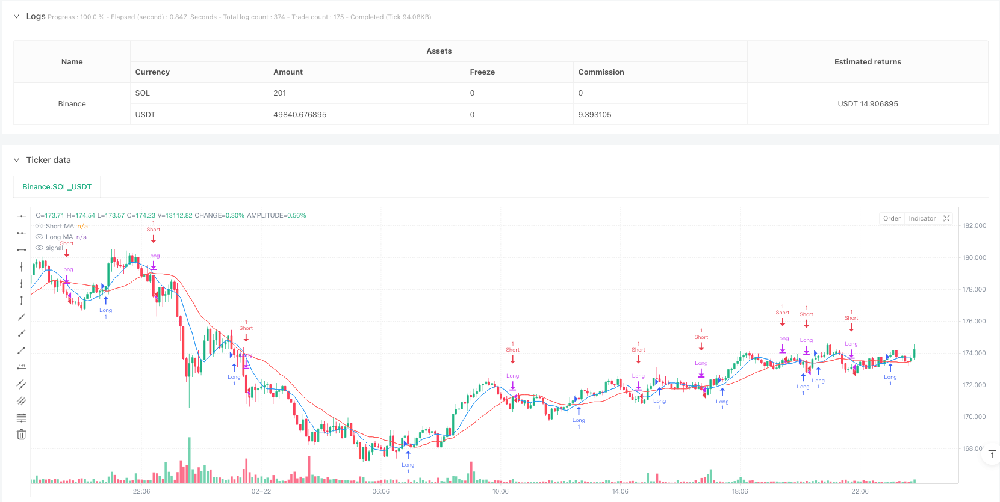
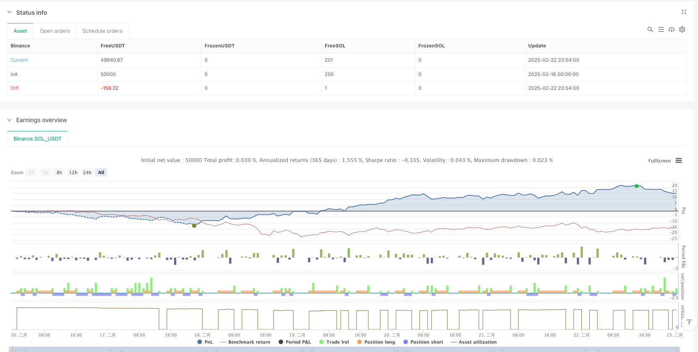

> Name

Trend following strategy based on Momentum-Enhanced-Simple-Moving-Average-and-RSI-Strategy-for-Trend-Following
> Author

ianzeng123

> Strategy Description





[trans]
#### Overview
This strategy is a trend following trading system that combines the Simple Moving Average (SMA) and the Relative Strength Index (RSI). It identifies trend direction through the intersection of short-term and long-term moving averages and uses RSI for momentum confirmation to find high-probability trading opportunities in the market. The strategy also includes a complete risk management module that can effectively control the risk of each transaction.
#### Strategy Principle
The core logic of the strategy is based on the combined use of two technical indicators:
1. Dual moving average system: Uses 8-period and 21-period simple moving averages to identify trend changes through moving average crossovers. When the short-term moving average crosses the long-term moving average upward, a long signal is generated, and when it crosses downward, a short signal is generated.
2. RSI Filter: Use the 14-period RSI indicator for momentum confirmation. Only execute longs when the RSI is below 70 and shorts when above 30 to avoid trading in overbought or sold areas.
3. Risk control: Each transaction is set with a 1% stop loss and 2% take profit level to protect the safety of funds and lock in profits.
#### Strategic Advantages
1. Advantages of indicator combination: It combines trend tracking and momentum indicators to more accurately identify market turning points.
2. Perfect risk management: Built-in stop-loss and stop-profit mechanisms can effectively control risks.
3. Flexible and adjustable parameters: All key parameters can be optimized according to different market environments.
4. Wide applicability: Can be applied to multiple markets and multiple time periods.
5. Clear and simple logic: The policy rules are clear and easy to understand and execute.
#### Strategy Risk
1. Volatile market risk: Frequent false signals may occur in a volatile market.
2. Lagging risk: The moving average itself is lagging and may miss some profit opportunities.
3. Parameter sensitivity: Parameters may need to be adjusted under different market environments to maintain strategy effectiveness.
4. Trend dependence: The strategy performs better in strong trending markets, but may not perform well in other market environments.
#### Strategy optimization direction
1. Introduce a market environment identification mechanism and use different parameter combinations under different market conditions.
2. Add trading volume indicators as auxiliary confirmation signals.
3. Optimize the stop-loss and stop-profit mechanism, and consider using a dynamic stop-loss plan.
4. Add trend strength filter to only trade in strong trending markets.
5. Develop an adaptive parameter adjustment mechanism to improve the adaptability of the strategy.
#### Summary
This is a trend following strategy with complete structure and clear logic. By combining SMA and RSI, you can capture trends while avoiding trading in oversold areas. Built-in risk management mechanisms ensure the stability of the strategy. Although there are some inherent limitations, the performance of the strategy can be further improved through the suggested optimization directions. This strategy is particularly suitable for traders seeking steady returns.
|| 

#### Overview
This strategy is a trend-following trading system that combines Simple Moving Averages (SMA) with the Relative Strength Index (RSI). It identifies trend directions through crossovers of short-term and long-term moving averages, uses RSI for momentum confirmation, and seeks high-probability trading opportunities in the market. The strategy includes a comprehensive risk management module for effective control of trading risks.

#### Strategy Principles
The core logic is based on the combination of two technical indicators:
1. Dual MA System: Uses 8-period and 21-period simple moving averages to identify trend changes. Buy signals are generated when the short-term MA crosses above the long-term MA, and sell signals when it crosses below.
2. RSI Filter: Employs a 14-period RSI for momentum confirmation. Long positions are only executed when RSI is below 70, and short positions when RSI is above 30, avoiding trades in overextended areas.
3. Risk Control: Each trade includes a 1% stop loss and 2% take profit level to protect capital and secure profits.

#### Strategy Advantages
1. Indicator Synergy: Combines trend-following and momentum indicators for more accurate identification of market turning points.
2. Robust Risk Management: Built-in stop loss and take profit mechanisms effectively control risk.
3. Flexible Parameters: All key parameters can be optimized for different market conditions.
4. Wide Applicability: Can be applied across multiple markets and timeframes.
5. Clear Logic: Strategy rules are explicit, easy to understand and execute.

#### Strategy Risks
1. Choppy Market Risk: May generate frequent false signals in sideways markets.
2. Lag Risk: Moving averages have inherent lag, potentially missing some profit opportunities.
3. Parameter Sensitivity: May require parameter adjustments in different market environments.
4. Trend Dependency: Strategy performs best in strong trending markets but may underperform in other conditions.

#### Optimization Directions
1. Introduce market environment recognition mechanism for different parameter combinations.
2. Add volume indicators as confirmatory signals.
3. Optimize stop loss and take profit mechanisms, consider implementing dynamic stop loss.
4. Add trend strength filters to trade only in strong trending markets.
5. Develop adaptive parameter adjustment mechanisms to improve strategy adaptability.

#### Summary
This is a comprehensively structured trend-following strategy with clear logic. By combining SMA and RSI, it captures trends while avoiding trades in overextended areas. The built-in risk management ensures strategy stability. While there are some inherent limitations, the suggested optimization directions can further enhance strategy performance. This strategy is particularly suitable for traders seeking stable returns.[/trans]


> Source (PineScript)

``` pinescript
/*backtest
start: 2025-02-16 00:00:00
end: 2025-02-23 00:00:00
period: 6m
basePeriod: 6m
exchanges: [{"eid":"Binance","currency":"SOL_USDT"}]
*/

//@version=6
strategy("WEN - SMA with RSI Strategy", overlay=true)

// Define input parameters
// SMA Inputs
shortLength = input(8, title="Short MA Length")
longLength = input(21, title="Long MA Length")

// RSI Inputs
rsiLength = input(14, title="RSI Length")
rsiOverbought = input(70, title="RSI Overbought")
rsiOversold = input(30, title="RSI Oversold")

// Calculate indicators
// Moving Averages
shortMA = ta.sma(close, shortLength)
longMA = ta.sma(close, longLength)

// RSI
rsi = ta.rsi(close, rsiLength)

// Plot indicators
plot(shortMA, title="Short MA", color=color.blue)
plot(longMA, title="Long MA", color=color.red)
// RSI is typically plotted in a separate panel in trading platforms

// Entry conditions with RSI confirmation
smaLongCondition = ta.crossover(shortMA, longMA)
smaShortCondition = ta.crossunder(shortMA, longMA)

rsiLongCondition = rsi < rsiOverbought  // Not overbought for long entry
rsiShortCondition = rsi > rsiOversold   // Not oversold for short entry

// Combined entry conditions
longCondition = smaLongCondition and rsiLongCondition
shortCondition = smaShortCondition and rsiShortCondition

// Execute trades
if (longCondition)
    strategy.entry("Long", strategy.long)
if (shortCondition)
    strategy.close("Long")
    strategy.entry("Short", strategy.short)

// Set stop loss and take profit
stopLoss = input(1, title="Stop Loss (%)") / 100
takeProfit = input(2, title="Take Profit (%)") / 100

longStopLossPrice = strategy.position_avg_price * (1 - stopLoss)
longTakeProfitPrice = strategy.position_avg_price * (1 + takeProfit)
shortStopLossPrice = strategy.position_avg_price * (1 + stopLoss)
shortTakeProfitPrice = strategy.position_avg_price * (1 - takeProfit)

strategy.exit("Take Profit / Stop Loss", from_entry="Long", stop=longStopLossPrice, limit=longTakeProfitPrice)
strategy.exit("Take Profit / Stop Loss", from_entry="Short", stop=shortStopLossPrice, limit=shortTakeProfitPrice)
```

> Detail

https://www.fmz.com/strategy/483525

> Last Modified

2025-02-24 10:19:03
