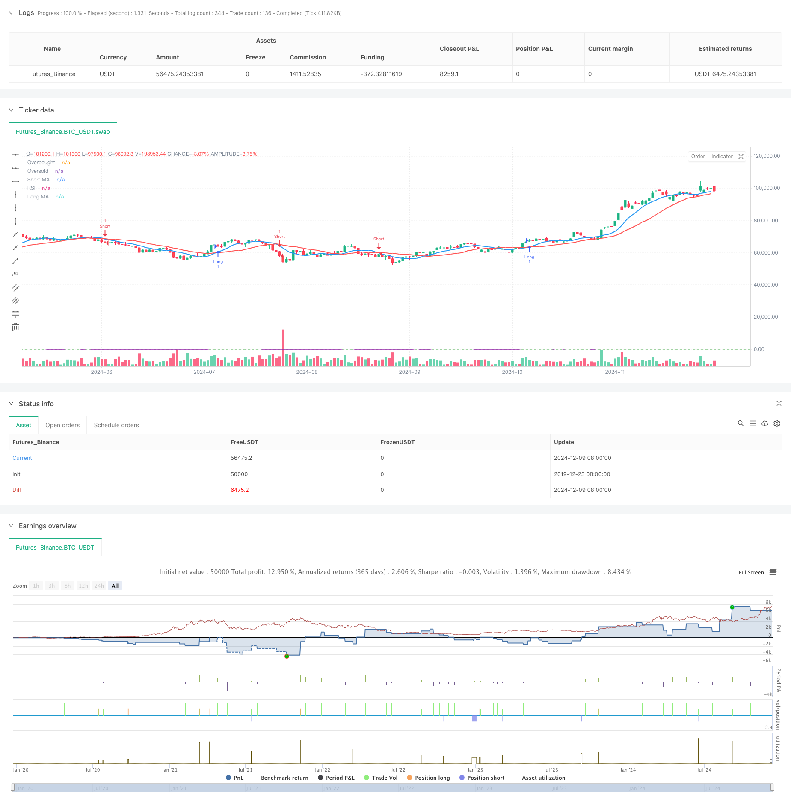

> Name

Moving-Average-Crossover-with-RSI-Trend-Momentum-Tracking-Strategy
> Author

ChaoZhang

> Strategy Description



[trans]
#### Overview
This is a trend following strategy that combines moving average crossovers and the Relative Strength Index (RSI). This strategy determines the market trend direction through the intersection of short-term and long-term moving averages, while using RSI as a momentum filter to confirm the strength of the trend, thereby increasing the reliability of trading signals. The strategy also incorporates percentage stop loss and take profit for risk management.
#### Strategy Principle
The strategy uses 9-period and 21-period simple moving averages (SMA) as the primary trend indicator. When the short-term moving average crosses the long-term moving average upward and the RSI is greater than 50, the system generates a long signal; when the short-term moving average crosses the long-term moving average downward and the RSI is less than 50, the system generates a short signal. This design ensures that trading directions are aligned with market trend and momentum. The system controls the risk-reward ratio of each transaction by setting a 1% stop loss and a 2% take profit.
#### Strategic Advantages
1. The double confirmation mechanism combining moving average and RSI improves the reliability of signals.
2. Using percentage stop loss and stop profit, risk management is more flexible and adaptable.
3. The parameters are highly adjustable and can adapt to different market environments and trading varieties.
4. The strategy logic is simple and clear, easy to understand and maintain.
5. Reduce the losses caused by false breakthroughs through RSI filtering.
#### Strategy Risk
1. Frequent false signals may occur in volatile markets.
2. Fixed percentage stops may not be flexible enough in volatile markets.
3. The moving average system has hysteresis and may miss the best entry point.
4. The RSI indicator may fail under extreme market conditions.
5. Parameters need to be carefully optimized to adapt to different market environments.
#### Strategy optimization direction
1. Introduce an adaptive stop-loss and stop-profit mechanism and dynamically adjust according to market volatility.
2. Add volume indicator as an auxiliary confirmation signal.
3. To optimize the selection of the moving average period, consider using the exponential moving average (EMA) to improve sensitivity.
4. Introduce a trend strength filter to automatically reduce positions or suspend trading in sideways markets.
5. Add time filter to avoid trading during market opening and closing periods.
#### Summary
This is a trend following strategy with complete structure and clear logic. The moving average crossover provides basic trend direction, RSI provides momentum confirmation, and combined with the risk management mechanism, a complete trading system is formed. Although there are some inherent limitations, through continuous optimization and adjustment, this strategy is expected to maintain stable performance in different market environments. The key to the success of the strategy lies in parameter optimization and the execution of risk control.
|| 

#### Overview
This is a trend-following strategy that combines moving average crossovers with the Relative Strength Index (RSI). The strategy determines market trend direction through short-term and long-term moving average crossovers, while using RSI as a momentum filter to confirm trend strength, thereby improving the reliability of trading signals. The strategy also incorporates percentage-based stop-loss and take-profit for risk management.

#### Strategy Principles
The strategy employs 9-period and 21-period Simple Moving Averages (SMA) as primary trend indicators. Long signals are generated when the short-term MA crosses above the long-term MA and RSI is above 50, while short signals occur when the short-term MA crosses below the long-term MA and RSI is below 50. This design ensures trade direction aligns with both market trend and momentum. The system controls risk-reward ratio through 1% stop-loss and 2% take-profit levels.

#### Strategy Advantages
1. Dual confirmation mechanism combining MA and RSI improves signal reliability.
2. Percentage-based stop-loss and take-profit provides flexible and adaptive risk management.
3. High parameter adaptability suitable for different market environments and instruments.
4. Simple and clear strategy logic, easy to understand and maintain.
5. RSI filtering reduces losses from false breakouts.

#### Strategy Risks
1. May generate frequent false signals in ranging markets.
2. Fixed percentage stops may not be flexible enough in highly volatile markets.
3. Moving average systems have inherent lag, potentially missing optimal entry points.
4. RSI indicator may become ineffective in extreme market conditions.
5. Requires careful parameter optimization for different market environments.

#### Strategy Optimization Directions
1. Introduce adaptive stop-loss and take-profit mechanisms that adjust dynamically with market volatility.
2. Add volume indicators as additional confirmation signals.
3. Optimize moving average periods, consider using Exponential Moving Averages (EMA) for increased sensitivity.
4. Implement trend strength filters to reduce position size or pause trading during sideways markets.
5. Add time filters to avoid trading during market opening and closing periods.

#### Summary
This is a well-structured trend-following strategy with clear logic. It provides basic trend direction through MA crossovers, momentum confirmation through RSI, combined with risk management mechanisms to form a complete trading system. While it has some inherent limitations, through continuous optimization and adjustment, the strategy has the potential to maintain stable performance across different market environments. The key to success lies in parameter optimization and risk control execution.[/trans]


> Source (PineScript)

``` pinescript
/*backtest
start: 2019-12-23 08:00:00
end: 2024-12-10 08:00:00
period: 1d
basePeriod: 1d
exchanges: [{"eid":"Futures_Binance","currency":"BTC_USDT"}]
*/

//@version=5
strategy("Moving Average Crossover + RSI Strategy", overlay=true, shorttitle="MA RSI Strategy")

// --- Input Parameters ---
shortMA = input.int(9, title="Short MA Period", minval=1)
longMA = input.int(21, title="Long MA Period", minval=1)
rsiLength = input.int(14, title="RSI Length", minval=1)
rsiOverbought = input.int(70, title="RSI Overbought Level", minval=50, maxval=100)
rsiOversold = input.int(30, title="RSI Oversold Level", minval=0, maxval=50)
stopLossPercent = input.float(1, title="Stop Loss Percentage", minval=0.1, maxval=10.0) / 100
takeProfitPercent = input.float(2, title="Take Profit Percentage", minval=0.1, maxval=10.0) / 100

// --- Calculate Moving Averages ---
shortMA_value = ta.sma(close, shortMA)
longMA_value = ta.sma(close, longMA)

// --- Calculate RSI ---
rsi_value = ta.rsi(close, rsiLength)

// --- Buy and Sell Conditions ---
longCondition = ta.crossover(shortMA_value, longMA_value) and rsi_value > 50
shortCondition = ta.crossunder(shortMA_value, longMA_value) and rsi_value < 50

// --- Plot Moving Averages ---
plot(shortMA_value, color=color.blue, linewidth=2, title="Short MA")
plot(longMA_value, color=color.red, linewidth=2, title="Long MA")

// --- Plot RSI (Optional) ---
hline(rsiOverbought, "Overbought", color=color.red)
hline(rsiOversold, "Oversold", color=color.green)
plot(rsi_value, color=color.purple, title="RSI")

// --- Strategy Execution ---
if (longCondition)
    strategy.entry("Long", strategy.long)
    
if (shortCondition)
    strategy.entry("Short", strategy.short)

// --- Risk Management (Stop Loss and Take Profit) ---
longStopLoss = close * (1 - stopLossPercent)
longTakeProfit = close * (1 + takeProfitPercent)

shortStopLoss = close * (1 + stopLossPercent)
shortTakeProfit = close * (1 - takeProfitPercent)

// Set the stop loss and take profit for long and short positions
strategy.exit("Long Exit", from_entry="Long", stop=longStopLoss, limit=longTakeProfit)
strategy.exit("Short Exit", from_entry="Short", stop=shortStopLoss, limit=shortTakeProfit)


```

> Detail

https://www.fmz.com/strategy/474874

> Last Modified

2024-12-12 16:22:25
