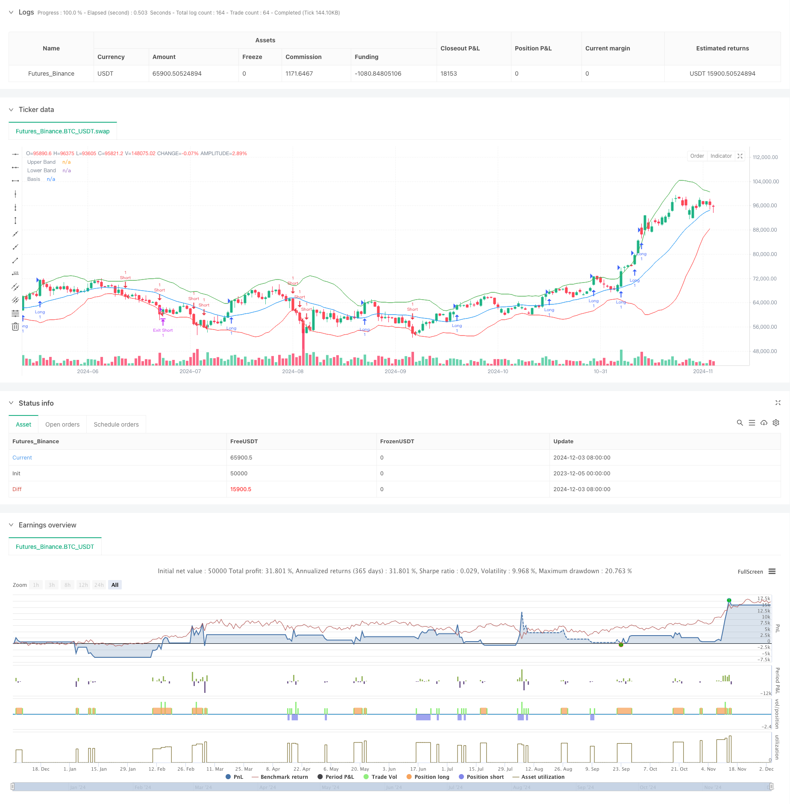

> Name

Multi-Dimensional-Dynamic-Breakout-Trading-System-Based-on-Bollinger-Bands-and-RSI
> Author

ChaoZhang

> Strategy Description



[trans]
#### Overview
This strategy is a dynamic breakout trading system based on the Bollinger Bands and RSI indicators. It builds a comprehensive trading decision-making framework by combining the volatility analysis of Bollinger Bands with the momentum confirmation of RSI. The strategy supports multi-directional trading control, and you can flexibly choose long, short or two-way trading according to market conditions. The system uses the risk-return ratio to accurately control the stop loss and profit targets of each transaction, achieving systematic transaction management.
#### Strategy Principle
The core principle of the strategy is to identify high-probability breakout trading opportunities through multiple signal confirmations. Specifically:
1. Use Bollinger Bands as the main breakout signal indicator, triggering trading signals when the price breaks through the upper or lower band
2. Introduce RSI as a momentum confirmation indicator, requiring the RSI value to support the breakthrough direction (RSI>50 when breaking through upward, RSI<50 when breaking through downward)
3. Control the trading direction through the trade_direction parameter, and you can choose one-way or two-way trading according to the market trend.
4. Use a fixed proportion of stop loss (2%) and a dynamic risk-to-return ratio (default 2:1) to manage the risk and return of each transaction.
5. Set up a complete position management mechanism, including precise control of entry, stop loss and profit taking
#### Strategic Advantages
1. High signal reliability: Through the double confirmation of Bollinger Bands and RSI, the reliability of trading signals is greatly improved.
2. Flexible direction control: you can freely choose the trading direction according to the market environment and have strong adaptability.
3. Improved risk management: using fixed stop loss ratio and adjustable risk-return ratio to achieve systematic risk control
4. Parameter optimizability: Key parameters such as Bollinger Band length, multiplier, RSI settings, etc. can be optimized according to market characteristics
5. The strategy logic is clear: the breakthrough conditions are clear, and the trading rules are simple and intuitive, easy to understand and execute.
#### Strategy Risk
1. False breakthrough risk: False breakthrough signals may appear in a volatile market, leading to continuous stop losses.
2. Fixed stop loss risk: 2% fixed stop loss level may not be suitable for all market environments
3. Parameter dependence: The strategy effect strongly depends on parameter settings, and different markets may require different parameters.
4. Trend dependence: In a market with no obvious trend, the strategy may perform poorly
5. Slippage risk: In times of severe fluctuations, the actual transaction price may deviate greatly from the signal price.
#### Strategy optimization direction
1. Introducing volume confirmation: adding volume filters to breakthrough signals to improve signal reliability
2. Add trend filtering: add trend indicators such as ADX to avoid frequent trading in volatile markets
3. Dynamic stop loss setting: dynamically adjust the stop loss distance according to fluctuation indicators such as ATR
4. Improve the exit mechanism: In addition to the fixed risk-return ratio, flexible exit methods such as moving stop loss can be added
5. Market environment classification: Add a market environment judgment module and use different parameter settings under different market conditions.
#### Summary
This is a well-designed and logically designed breakout trading strategy. Through multiple signal confirmations and a complete risk management mechanism, the strategy has good practicality. At the same time, the strategy provides a wealth of optimization space and can be improved according to specific trading varieties and market environments. It is recommended to conduct sufficient parameter optimization and backtest verification before using it in real market. ||
#### Overview
This strategy is a dynamic breakout trading system based on Bollinger Bands and RSI indicators. It combines Bollinger Bands' volatility analysis with RSI momentum confirmation to build a comprehensive trading decision framework. The strategy supports multi-directional trade control and can flexibly choose long, short, or bi-directional trading based on market conditions. The system uses a risk-reward ratio to precisely control the stop-loss and profit targets for each trade, achieving systematic trade management.

#### Strategy Principles
The core principle of the strategy is to identify high-probability breakout trading opportunities through multiple signal confirmations. Specifically:
1. Uses Bollinger Bands as the primary breakout signal indicator, triggering trading signals when price breaks above or below the bands
2. Incorporates RSI as a momentum confirmation indicator, requiring RSI values to support the breakout direction (RSI>50 for upward breakouts, RSI<50 for downward breakouts)
3. Controls trading direction through the trade_direction parameter, allowing selection of unidirectional or bidirectional trading based on market trends
4. Adopts fixed ratio stop-loss (2%) and dynamic risk-reward ratio (default 2:1) to manage risk and reward for each trade
5. Sets up complete position management mechanism, including precise control of entry, stop-loss, and profit-taking

#### Strategy Advantages
1. High Signal Reliability: Dual confirmation through Bollinger Bands and RSI greatly improves trading signal reliability
2. Flexible Direction Control: Can freely choose trading direction based on market environment, showing strong adaptability
3. Comprehensive Risk Management: Uses fixed stop-loss ratio and adjustable risk-reward ratio, achieving systematic risk control
4. Parameter Optimization Potential: Key parameters such as Bollinger Band length, multiplier, RSI settings can be optimized based on market characteristics
5. Clear Strategy Logic: Clear breakout conditions, simple and intuitive trading rules, easy to understand and execute

#### Strategy Risks
1. False Breakout Risk: May generate false breakout signals in ranging markets, leading to consecutive losses
2. Fixed Stop-Loss Risk: 2% fixed stop-loss may not suit all market environments
3. Parameter Dependency: Strategy effectiveness heavily depends on parameter settings, different markets may need different parameters
4. Trend Dependency: Strategy may underperform in markets without clear trends
5. Slippage Risk: Actual execution prices may significantly deviate from signal prices during high volatility

#### Strategy Optimization Directions
1. Incorporate Volume Confirmation: Add volume filters to breakout signals to improve signal reliability
2. Add Trend Filters: Include trend indicators like ADX to avoid frequent trading in ranging markets
3. Dynamic Stop-Loss Setting: Adjust stop-loss distances dynamically based on volatility indicators like ATR
4. Improve Exit Mechanism: Add flexible exit methods like trailing stops in addition to fixed risk-reward ratio
5. Market Environment Classification: Add market state assessment module to use different parameters in different market conditions

#### Conclusion
This is a well-designed breakout trading strategy with clear logic. Through multiple signal confirmations and comprehensive risk management mechanisms, the strategy shows good practicality. Meanwhile, the strategy provides rich optimization potential and can be specifically improved based on trading instruments and market environments. It's recommended to conduct thorough parameter optimization and backtesting before live trading.[/trans]


> Source (PineScript)

``` pinescript
/*backtest
start: 2023-12-05 00:00:00
end: 2024-12-04 00:00:00
period: 1d
basePeriod: 1d
exchanges: [{"eid":"Futures_Binance","currency":"BTC_USDT"}]
*/

//@version=5
strategy("Bollinger Breakout Strategy with Direction Control", overlay=true)

// === Input Parameters ===
length = input(20, title="Bollinger Bands Length")
src = close
mult = input(2.0, title="Bollinger Bands Multiplier")
rsi_length = input(14, title="RSI Length")
rsi_midline = input(50, title="RSI Midline")
risk_reward_ratio = input(2.0, title="Risk/Reward Ratio")

// === Trade Direction Option ===
trade_direction = input.string("Both", title="Trade Direction", options=["Long", "Short", "Both"])

// === Bollinger Bands Calculation ===
basis = ta.sma(src, length)
dev = mult * ta.stdev(src, length)
upper_band = basis + dev
lower_band = basis - dev

// === RSI Calculation ===
rsi_val = ta.rsi(src, rsi_length)

// === Breakout Conditions ===
// Long: Prijs sluit boven de bovenste Bollinger Band en RSI > RSI Midline
long_condition = close > upper_band and rsi_val > rsi_midline and (trade_direction == "Long" or trade_direction == "Both")

// Short: Prijs sluit onder de onderste Bollinger Band en RSI < RSI Midline
short_condition = close < lower_band and rsi_val < rsi_midline and (trade_direction == "Short" or trade_direction == "Both")

// === Entry Prices ===
var float entry_price_long = na
var float entry_price_short = na

if (long_condition)
    entry_price_long := close
    strategy.entry("Long", strategy.long, when=long_condition)

if (short_condition)
    entry_price_short := close
    strategy.entry("Short", strategy.short, when=short_condition)

// === Stop-Loss and Take-Profit ===
long_stop_loss = entry_price_long * 0.98  // 2% onder instapprijs
long_take_profit = entry_price_long * (1 + (0.02 * risk_reward_ratio))

short_stop_loss = entry_price_short * 1.02  // 2% boven instapprijs
short_take_profit = entry_price_short * (1 - (0.02 * risk_reward_ratio))

if (strategy.position_size > 0)  // Long Positie
    strategy.exit("Exit Long", "Long", stop=long_stop_loss, limit=long_take_profit)

if (strategy.position_size < 0)  // Short Positie
    strategy.exit("Exit Short", "Short", stop=short_stop_loss, limit=short_take_profit)

// === Plotting ===
plot(upper_band, color=color.green, title="Upper Band")
plot(lower_band, color=color.red, title="Lower Band")
plot(basis, color=color.blue, title="Basis")

```

> Detail

https://www.fmz.com/strategy/474075

> Last Modified

2024-12-05 17:32:23
