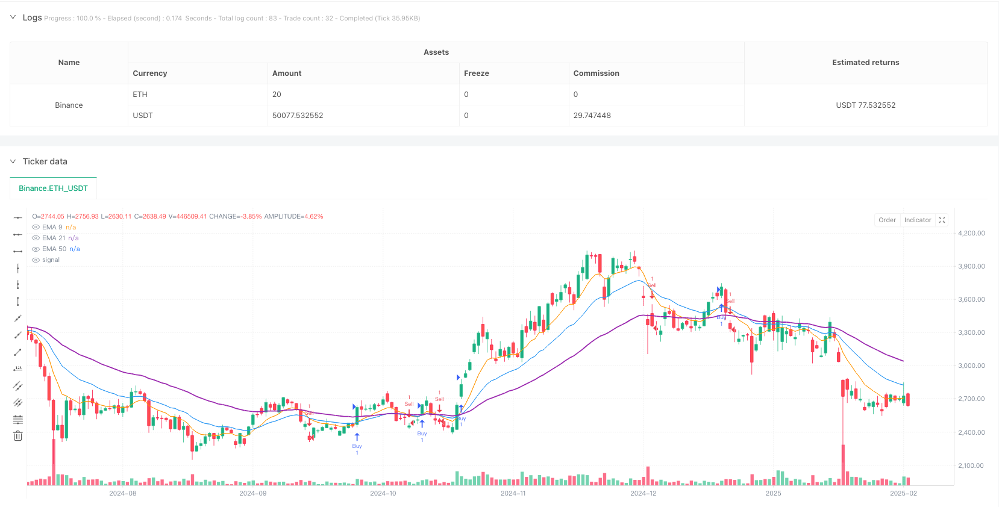
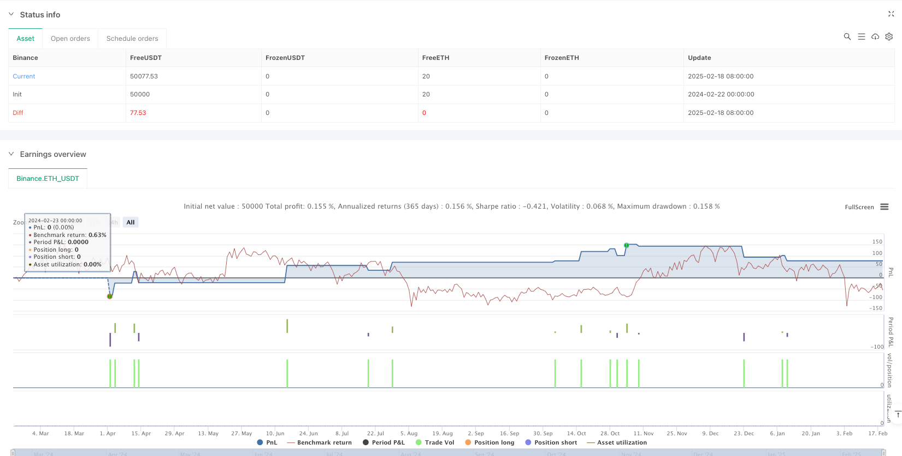

> Name

Multi-EMA-Crossover-with-RSI-Momentum-Adaptive-Scalping-Strategy
> Author

ianzeng123

> Strategy Description





[trans]
#### Overview
This strategy is a short-term trading system that combines the Moving Average (EMA) and the Relative Strength Index (RSI). It identifies potential trading opportunities by observing crossover signals from multiple moving averages and momentum confirmation from the RSI indicator. The strategy is designed with adaptive stop loss and profit targets, suitable for trading on a 15-minute time period.
#### Strategy Principle
The strategy uses three exponential moving averages with different periods (9, 21, 50) and the 14-period RSI indicator. In terms of bull signals, when the 9-period EMA crosses the 21-period EMA upwards, the price is above the 50-period EMA, and the RSI is in the 40-70 range, a long signal is triggered. In terms of short signals, when the 9-period EMA crosses the 21-period EMA downwards, the price is below the 50-period EMA, and the RSI is in the 30-60 range, a short signal is triggered. Percentage-based stop-loss and take-profit targets are set for each trade.
#### Strategic Advantages
1. The combination of multiple technical indicators improves the reliability of signals
2. Use RSI to filter out trading signals in excessive overbought and oversold areas.
3. Use percentage stop loss and profit targets to facilitate risk management
4. The 50-period EMA serves as a trend filter, improving the accuracy of trading direction.
5. The strategy logic is clear and easy to understand and implement.
6. Suitable for volatile market environments
#### Strategy Risk
1. Frequent false breakthrough signals may occur in sideways markets
2. The use of multiple indicators may cause signal lag
3. Fixed percentage stop-loss and take-profit settings may not be suitable for all market environments
4. Important price movements may be missed in fast market conditions
5. Market conditions need to be continuously monitored to ensure strategy effectiveness
#### Strategy optimization direction
1. Introduce trading volume indicators to enhance signal reliability
2. Develop adaptive stop loss and profit target mechanisms
3. Add market volatility filter
4. Optimize the dynamic adjustment mechanism of RSI range
5. Add time filtering function to avoid transactions during specific periods
#### Summary
This strategy builds a relatively complete trading system by combining multiple technical indicators. It not only contains clear signals for entry and exit, but also designs a risk control mechanism. The core advantage of the strategy is to improve the reliability of transactions through multiple confirmations, but it also requires traders to pay close attention to changes in the market environment and adjust parameter settings in a timely manner. This strategy is particularly suitable for traders with a certain technical analysis foundation. ||
#### Overview
This strategy is a scalping trading system that combines Exponential Moving Averages (EMA) and Relative Strength Index (RSI). It identifies potential trading opportunities through multiple EMA crossover signals confirmed by RSI momentum. The strategy incorporates adaptive stop-loss and take-profit targets, optimized for 15-minute timeframe trading.

#### Strategy Principles
The strategy utilizes three EMAs (9, 21, 50 periods) and a 14-period RSI indicator. For long positions, signals are generated when the 9-period EMA crosses above the 21-period EMA, price is above the 50-period EMA, and RSI is between 40-70. For short positions, signals occur when the 9-period EMA crosses below the 21-period EMA, price is below the 50-period EMA, and RSI is between 30-60. Each trade incorporates percentage-based stop-loss and take-profit levels.

#### Strategy Advantages
1. Integration of multiple technical indicators enhances signal reliability
2. RSI filters out trades in extreme overbought/oversold areas
3. Percentage-based stop-loss and take-profit levels facilitate risk management
4. 50-period EMA serves as a trend filter, improving directional accuracy
5. Clear strategy logic, easy to understand and implement
6. Well-suited for volatile market conditions

#### Strategy Risks
1. May generate frequent false breakout signals in ranging markets
2. Multiple indicators might lead to delayed signals
3. Fixed percentage stops and targets may not suit all market conditions
4. Potential to miss significant price movements in fast markets
5. Requires continuous monitoring of market conditions for strategy effectiveness

#### Optimization Directions
1. Incorporate volume indicators to enhance signal reliability
2. Develop adaptive stop-loss and take-profit mechanisms
3. Add market volatility filters
4. Optimize dynamic adjustment of RSI ranges
5. Implement time-based filters to avoid specific trading periods

#### Summary
The strategy builds a comprehensive trading system by combining multiple technical indicators. It includes clear entry/exit signals and risk management mechanisms. The core advantage lies in improving trade reliability through multiple confirmations, but traders need to closely monitor market conditions and adjust parameters accordingly. This strategy is particularly suitable for traders with a solid technical analysis foundation.[/trans]


> Source (PineScript)

``` pinescript
/*backtest
start: 2024-02-22 00:00:00
end: 2025-02-19 08:00:00
period: 1d
basePeriod: 1d
exchanges: [{"eid":"Binance","currency":"ETH_USDT"}]
*/

//@version=5
strategy("RSI + EMA Scalping Strategy", overlay=true)

// Input for EMAs
ema9 = ta.ema(close, 9)
ema21 = ta.ema(close, 21)
ema50 = ta.ema(close, 50)

// RSI Input
rsi = ta.rsi(close, 14)

// User-defined input for Stop Loss & Target percentages
stop_loss_percent = input.float(0.5, "Stop Loss (%)", step=0.1)
target_percent = input.float(1.0, "Target (%)", step=0.1)

// Long condition
longCondition = ta.crossover(ema9, ema21) and close > ema50 and rsi > 40 and rsi < 70
if (longCondition)
    strategy.entry("Buy", strategy.long)
    stopLossPrice = close * (1 - stop_loss_percent / 100)
    takeProfitPrice = close * (1 + target_percent / 100)
    strategy.exit("Exit Buy", "Buy", stop=stopLossPrice, limit=takeProfitPrice)


// Short condition
shortCondition = ta.crossunder(ema9, ema21) and close < ema50 and rsi < 60 and rsi > 30
if (shortCondition)
    strategy.entry("Sell", strategy.short)
    stopLossPrice = close * (1 + stop_loss_percent / 100)
    takeProfitPrice = close * (1 - target_percent / 100)
    strategy.exit("Exit Sell", "Sell", stop=stopLossPrice, limit=takeProfitPrice)


// Plot EMAs
plot(ema9, color=color.orange, linewidth=1, title="EMA 9")
plot(ema21, color=color.blue, linewidth=1, title="EMA 21")
plot(ema50, color=color.purple, linewidth=2, title="EMA 50")

```

> Detail

https://www.fmz.com/strategy/483120

> Last Modified

2025-02-21 14:27:45
