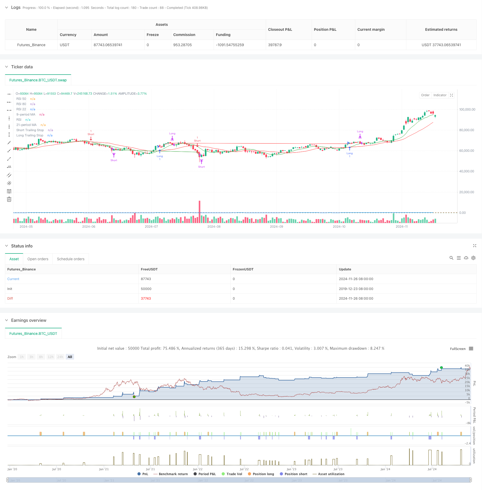

> Name

Multi-MA-Crossover-with-RSI-Dynamic-Trailing-Stop-Loss-Quantitative-Trading-Strategy
> Author

ChaoZhang

> Strategy Description



[trans]
#### Overview
This strategy is a quantitative trading system that combines moving average crossover and relative strength index (RSI), and also integrates a trailing stop function. This strategy uses two moving averages of 9 periods and 21 periods as the main trend judgment indicators, cooperates with the RSI indicator to confirm trading signals, and protects profits and controls risks through dynamic tracking of stop losses. The strategy design fully considers the three dimensions of market trend, momentum and risk management, forming a complete trading system.
#### Strategy Principle
The core logic of the strategy is based on the following key elements:
1. Trend identification: Identify changes in market trends through the intersection of fast (9-period) and slow (21-period) moving averages. When the fast line crosses the slow line and the RSI is greater than 55, a long signal is generated; when the fast line crosses the slow line and the RSI is less than 45, a short signal is generated.
2. Signal confirmation: Use RSI as a signal filter and set the RSI threshold to improve the reliability of trading signals.
3. Risk control: Use a 1% trailing stop loss and dynamically adjust the stop loss position to protect profits. At the same time, set profit-taking conditions based on RSI, and close long and short positions respectively when RSI exceeds 80 or falls below 22.
4. Stop loss mechanism: Combining fixed stop loss and trailing stop loss, when the price breaks through the preset percentage of the entry point or touches the trailing stop loss line, the position will be automatically closed and exited.
#### Strategic Advantages
1. Multi-dimensional signal verification: Improve the accuracy of trading signals through double confirmation of moving average crossover and RSI.
2. Perfect risk management: The use of dynamic trailing stop loss can not only protect profits but also control risks.
3. Flexible entry mechanism: Combined with trend and momentum indicators, it can effectively capture market turning points.
4. High degree of automation: The strategy logic is clear and it is easy to implement automated transactions.
5. Strong adaptability: It can adapt to different market environments through parameter adjustment.
#### Strategy Risk
1. Risk of volatile market: Frequent false breakthrough signals may occur in a volatile market.
2. Slippage risk: You may face slippage losses during the execution of trailing stop loss.
3. Parameter sensitivity: The setting of the moving average period and RSI threshold has a great impact on the performance of the strategy.
4. Systemic risk: In extreme market conditions, stop loss may not be executed in time.
#### Strategy optimization direction
1. Signal optimization: Trading volume indicators can be introduced as supplementary conditions for signal confirmation.
2. Stop loss optimization: Consider a dynamic stop loss ratio adjustment mechanism based on volatility.
3. Position management: Add a dynamic position management system based on risk assessment.
4. Market adaptability: Add a market environment identification mechanism and use different parameter settings under different market conditions.
5. Signal filtering: Time filters can be added to avoid trading during volatile periods before the market opens and closes.
#### Summary
This strategy combines classic indicators in technical analysis to build a trading system with both trend tracking and momentum characteristics. Its core advantage lies in its multi-dimensional signal confirmation mechanism and complete risk management system. Through continuous optimization and improvement, this strategy is expected to maintain stable performance in different market environments. It is recommended that traders conduct sufficient backtest verification before using it in real trading, and adjust parameter settings according to the characteristics of specific trading varieties.
|| 

#### Overview
This strategy is a quantitative trading system that combines Moving Average crossover with the Relative Strength Index (RSI), integrated with a trailing stop loss function. The strategy utilizes two moving averages - 9-period and 21-period - as primary trend indicators, coupled with RSI for trade signal confirmation, and implements dynamic trailing stops for profit protection and risk control. The strategy design comprehensively considers market trends, momentum, and risk management dimensions to form a complete trading system.

#### Strategy Principles
The core logic of the strategy is based on the following key elements:
1. Trend Identification: Recognizes market trend changes through crossovers of fast (9-period) and slow (21-period) moving averages. Long signals are generated when the fast MA crosses above the slow MA with RSI above 55, while short signals occur when the fast MA crosses below with RSI below 45.
2. Signal Confirmation: Uses RSI as a signal filter, enhancing trade signal reliability through RSI threshold settings.
3. Risk Control: Employs a 1% trailing stop loss, dynamically adjusting stop positions to protect profits. Also includes RSI-based profit-taking conditions, closing long positions when RSI exceeds 80 and short positions when RSI falls below 22.
4. Stop Loss Mechanism: Combines fixed and trailing stops, automatically closing positions when price breaches preset percentage levels from entry points or hits trailing stop levels.

#### Strategy Advantages
1. Multi-dimensional Signal Verification: Improves trading signal accuracy through dual confirmation of MA crossover and RSI.
2. Comprehensive Risk Management: Implements dynamic trailing stops for both profit protection and risk control.
3. Flexible Entry Mechanism: Effectively captures market turning points by combining trend and momentum indicators.
4. High Automation Level: Clear strategy logic facilitates automated trading implementation.
5. Strong Adaptability: Can be adapted to different market environments through parameter adjustment.

#### Strategy Risks
1. Sideways Market Risk: May generate frequent false breakout signals in range-bound markets.
2. Slippage Risk: Potential slippage losses during trailing stop execution.
3. Parameter Sensitivity: Strategy performance significantly affected by MA period and RSI threshold settings.
4. Systemic Risk: Stop losses may not execute timely in extreme market conditions.

#### Strategy Optimization Directions
1. Signal Enhancement: Consider incorporating volume indicators as additional confirmation conditions.
2. Stop Loss Refinement: Implement volatility-based dynamic stop loss adjustment mechanisms.
3. Position Management: Add dynamic position sizing system based on risk assessment.
4. Market Adaptability: Include market environment recognition mechanism for different parameter settings in various market states.
5. Signal Filtering: Add time filters to avoid trading during volatile market opening and closing periods.

#### Summary
This strategy constructs a trading system combining trend-following and momentum characteristics through classic technical analysis indicators. Its core strengths lie in multi-dimensional signal confirmation mechanisms and comprehensive risk management systems. Through continuous optimization and improvement, the strategy shows promise for maintaining stable performance across different market environments. Traders are advised to conduct thorough backtesting before live implementation and adjust parameters according to specific trading instrument characteristics.[/trans]


> Source (PineScript)

``` pinescript
/*backtest
start: 2019-12-23 08:00:00
end: 2024-11-27 08:00:00
period: 1d
basePeriod: 1d
exchanges: [{"eid":"Futures_Binance","currency":"BTC_USDT"}]
*/

//@version=5
strategy("ojha's Intraday MA Crossover + RSI Strategy with Trailing Stop", overlay=true)

// Define Moving Averages
fastLength = 9
slowLength = 21
fastMA = ta.sma(close, fastLength)
slowMA = ta.sma(close, slowLength)

// Define RSI
rsiPeriod = 14
rsiValue = ta.rsi(close, rsiPeriod)

// Define Conditions for Long and Short
longCondition = ta.crossover(fastMA, slowMA) and rsiValue > 55
shortCondition = ta.crossunder(fastMA, slowMA) and rsiValue < 45

// Define the trailing stop distance (e.g., 1% trailing stop)
trailingStopPercent = 1.0

// Variables to store the entry candle high and low
var float longEntryLow = na
var float shortEntryHigh = na

// Variables for trailing stop levels
var float longTrailingStop = na
var float shortTrailingStop = na

// Exit conditions
exitLongCondition = rsiValue > 80
exitShortCondition = rsiValue < 22

// Stop-loss conditions (price drops below long entry candle low * 1% or exceeds short entry candle high * 1%)
longStopLoss = longEntryLow > 0 and close < longEntryLow * 0.99
shortStopLoss = shortEntryHigh > 0 and close > shortEntryHigh * 1.01

// Execute Buy Order and store the entry candle low for long stop-loss
if (longCondition)
    strategy.entry("Long", strategy.long)
    longEntryLow := low  // Store the low of the candle where long entry happened
    longTrailingStop := close * (1 - trailingStopPercent / 100)  // Initialize trailing stop at entry

// Execute Sell Order and store the entry candle high for short stop-loss
if (shortCondition)
    strategy.entry("Short", strategy.short)
    shortEntryHigh := high  // Store the high of the candle where short entry happened
    shortTrailingStop := close * (1 + trailingStopPercent / 100)  // Initialize trailing stop at entry

// Update trailing stop for long position
if (strategy.opentrades > 0 and strategy.position_size > 0)
    longTrailingStop := math.max(longTrailingStop, close * (1 - trailingStopPercent / 100))  // Update trailing stop as price moves up

// Update trailing stop for short position
if (strategy.opentrades > 0 and strategy.position_size < 0)
    shortTrailingStop := math.min(shortTrailingStop, close * (1 + trailingStopPercent / 100))  // Update trailing stop as price moves down

// Exit Buy Position when RSI is above 80, Stop-Loss triggers, or trailing stop is hit
if (exitLongCondition or longStopLoss or close < longTrailingStop)
    strategy.close("Long")
    longEntryLow := na  // Reset the entry low after the long position is closed
    longTrailingStop := na  // Reset the trailing stop

// Exit Sell Position when RSI is below 22, Stop-Loss triggers, or trailing stop is hit
if (exitShortCondition or shortStopLoss or close > shortTrailingStop)
    strategy.close("Short")
    shortEntryHigh := na  // Reset the entry high after the short position is closed
    shortTrailingStop := na  // Reset the trailing stop

// Plot Moving Averages on the Chart
plot(fastMA, color=color.green, title="9-period MA")
plot(slowMA, color=color.red, title="21-period MA")

// Plot RSI on a separate panel
rsiPlot = plot(rsiValue, color=color.blue, title="RSI")
hline(50, "RSI 50", color=color.gray)
hline(80, "RSI 80", color=color.red)
hline(22, "RSI 22", color=color.green)

// Plot Trailing Stop for Visualization
plot(longTrailingStop, title="Long Trailing Stop", color=color.red, linewidth=1, style=plot.style_line)
plot(shortTrailingStop, title="Short Trailing Stop", color=color.green, linewidth=1, style=plot.style_line)

```

> Detail

https://www.fmz.com/strategy/473385

> Last Modified

2024-11-29 16:10:35
