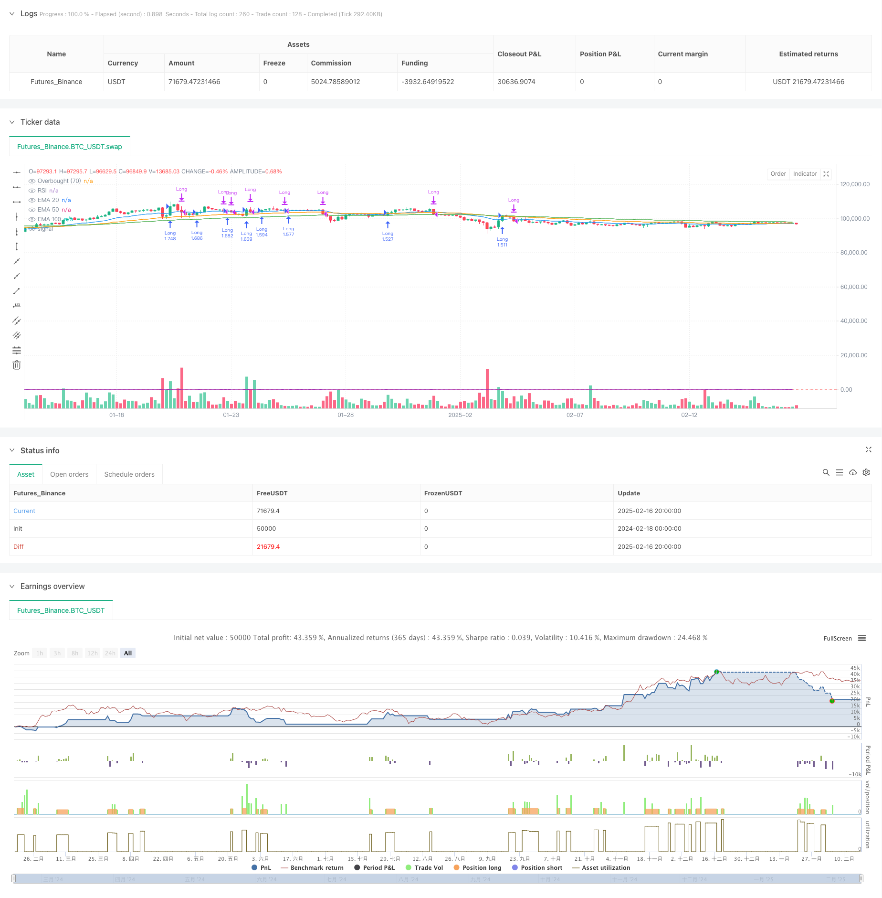

> Name

Multi-Period-EMA-Trend-Detection-with-RSI-Overbought-Strategy
> Author

ChaoZhang

> Strategy Description



[trans]
#### Overview
This strategy is a trend following trading system based on the multi-period exponential moving average (EMA) and the relative strength indicator (RSI). The strategy makes trading decisions by judging the EMA trend of three periods of 20, 50, and 100, combined with price breakthroughs and RSI overbought signals. This strategy is mainly suitable for trending markets and improves the accuracy of transactions through the verification of multiple technical indicators.
#### Strategy Principle
The core logic of the strategy includes the following key parts:
1. Trend judgment: By comparing the EMA values of the current period and the previous period, determine whether the moving averages of the three periods (20/50/100) are all in an upward trend.
2. Entry conditions: A buy signal is issued when the price breaks through the 20-period EMA from below and all three moving averages are in an upward trend.
3. Exit conditions: Close the position when RSI exceeds 70 (overbought) or the price falls below the 20-period EMA
4. Position management: Use a percentage (10%) of the total account value to hold positions
#### Strategic Advantages
1. Multiple confirmation mechanism: Reduce the risk of false breakthroughs through mutual verification of EMA and RSI indicators in three different periods
2. Trend tracking: Ability to effectively capture mid- to long-term trends and improve profitability
3. Risk control: Use RSI overbought signals and the moving average below as stop loss conditions to effectively control retracements.
4. Fund management: Using percentage position management, the trading volume can be automatically adjusted according to the account size
5. Systematic operation: The strategy rules are clear, which can reduce the interference caused by subjective judgment.
#### Strategy Risk
1. Lagging: EMA, as a lagging indicator, may cause a slight delay in entry and exit timings
2. Volatile market risk: Frequent false signals may occur in a volatile market.
3. Gap risk: A large gap in the market may cause the stop loss point to become invalid.
4. Parameter sensitivity: The EMA cycle and RSI threshold may need to be adjusted under different market environments
5. Transaction costs: Frequent transactions may bring higher transaction costs
#### Strategy optimization direction
1. Market environment identification: Add a market status judgment mechanism to automatically reduce positions or suspend transactions in volatile markets.
2. Dynamic parameter optimization: automatically adjust EMA period and RSI threshold according to market volatility
3. Stop loss optimization: Introduce a trailing stop loss mechanism to better protect profits
4. Entry optimization: increase the trading volume confirmation mechanism and improve the reliability of breakthrough signals
5. Position management optimization: dynamically adjust the position ratio based on trend strength and market volatility
#### Summary
This is a compound strategy system that combines trend following and momentum reversal. Through the combined use of multiple technical indicators, better risk-return characteristics are achieved while keeping the strategy simple and easy to understand. The core advantage of the strategy lies in its strict trend confirmation mechanism and complete risk control system, but in practical application, attention needs to be paid to parameter optimization and adaptability to the market environment. There is room for further improvement of the strategy through the suggested optimization directions. ||
#### Overview
This strategy is a trend-following trading system based on multiple-period Exponential Moving Averages (EMA) and the Relative Strength Index (RSI). It makes trading decisions by analyzing the trends of 20, 50, and 100-period EMAs, combined with price breakouts and RSI overbought signals. The strategy is primarily designed for trending markets, using multiple technical indicators to enhance trading accuracy.

#### Strategy Principles
The core logic includes the following key components:
1. Trend Detection: Comparing current and previous EMA values to determine if all three periods (20/50/100) are in upward trends
2. Entry Conditions: Generates a buy signal when price crosses above the 20-period EMA and all EMAs are trending upward
3. Exit Conditions: Closes positions when RSI exceeds 70 (overbought) or price falls below the 20-period EMA
4. Position Management: Uses a percentage (10%) of account equity for position sizing

#### Strategy Advantages
1. Multiple Confirmation Mechanism: Reduces false breakout risks through validation of three different EMA periods and RSI
2. Trend Following: Effectively captures medium to long-term trends, enhancing profit potential
3. Risk Control: Uses RSI overbought signals and EMA crossunders as stop-loss conditions
4. Money Management: Implements percentage-based position sizing that scales with account size
5. Systematic Operation: Clear rules minimize subjective judgment interference

#### Strategy Risks
1. Lag Effect: EMAs as lagging indicators may cause delayed entries and exits
2. Sideways Market Risk: May generate frequent false signals in ranging markets
3. Gap Risk: Large market gaps may render stop-loss levels ineffective
4. Parameter Sensitivity: EMA periods and RSI thresholds may need adjustment in different market conditions
5. Transaction Costs: Frequent trading may incur significant costs

#### Strategy Optimization Directions
1. Market Environment Recognition: Add market state identification to reduce position size or pause trading in ranging markets
2. Dynamic Parameter Optimization: Automatically adjust EMA periods and RSI thresholds based on market volatility
3. Stop-Loss Enhancement: Implement trailing stop-loss mechanisms to better protect profits
4. Entry Refinement: Add volume confirmation to improve breakout signal reliability
5. Position Sizing Enhancement: Dynamically adjust position size based on trend strength and market volatility

#### Summary
This is a composite strategy system combining trend following and momentum reversal. Through the coordinated use of multiple technical indicators, it achieves a favorable risk-reward profile while maintaining simplicity. The strategy's core strengths lie in its strict trend confirmation mechanism and comprehensive risk control system, though practical application requires attention to parameter optimization and market environment adaptability. Through the suggested optimization directions, there is room for further strategy enhancement.[/trans]


> Source (PineScript)

``` pinescript
/*backtest
start: 2024-02-18 00:00:00
end: 2025-02-17 00:00:00
period: 4h
basePeriod: 4h
exchanges: [{"eid":"Futures_Binance","currency":"BTC_USDT"}]
*/

//@version=5
strategy("EMA Crossover + RSI Strategy", overlay=true, initial_capital=10000, default_qty_type=strategy.percent_of_equity, default_qty_value=200)

// Calculate EMAs
ema20  = ta.ema(close, 20)
ema50  = ta.ema(close, 50)
ema100 = ta.ema(close, 100)

// Calculate RSI
rsiPeriod = 14
rsiValue  = ta.rsi(close, rsiPeriod)

// Determine if each EMA is trending up (current value greater than the previous value)
ema20_trending_up  = ema20  > ema20[1]
ema50_trending_up  = ema50  > ema50[1]
ema100_trending_up = ema100 > ema100[1]
all_emas_trending_up = ema20_trending_up and ema50_trending_up and ema100_trending_up

// Buy condition:
// 1. Price crosses above the EMA20 from below (using ta.crossover)
// 2. All three EMAs are trending upward
buySignal = ta.crossover(close, ema20) and all_emas_trending_up

// Sell conditions:
// Sell if RSI is above 70 OR price crosses below the EMA20 from above (using ta.crossunder)
sellSignal = (rsiValue > 70) or ta.crossunder(close, ema20)

// Enter a long position if the buy condition is met
if (buySignal)
    strategy.entry("Long", strategy.long)

// Exit the long position if either sell condition is met
if (sellSignal)
    strategy.close("Long")

// Plot the EMAs on the chart for visualization
plot(ema20, color=color.blue, title="EMA 20")
plot(ema50, color=color.orange, title="EMA 50")
plot(ema100, color=color.green, title="EMA 100")

// (Optional) Plot the RSI and a horizontal line at 70 for reference
plot(rsiValue, title="RSI", color=color.purple)
hline(70, title="Overbought (70)", color=color.red)
```

> Detail

https://www.fmz.com/strategy/482502

> Last Modified

2025-02-18 17:50:40
