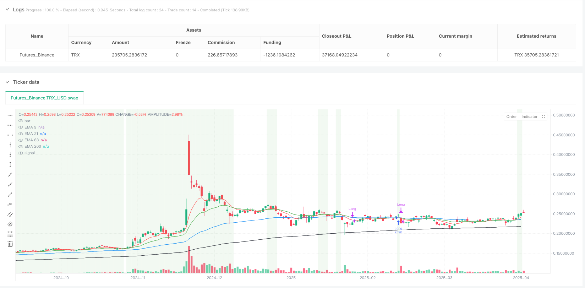
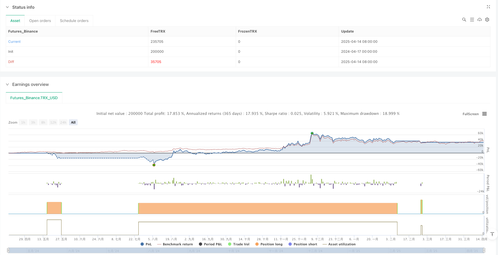

> Name

Multiple-EMA-Trend-Confirmation-with-RSI-Entry-Filter-Strategy
> Author

ianzeng123

> Strategy Description





[trans]

#### Overview
The Multiple Exponential Moving Average Trend Confirmation and RSI Filtered Entry Strategy is a quantitative trading system designed specifically for identifying bullish trends. This strategy cleverly combines four exponential moving averages (EMA) with different periods and the relative strength index (RSI) to confirm the trend direction and optimize entry timing. By ensuring the correct arrangement of EMA and reasonable control of RSI values, this strategy aims to capture a strong upward trend while avoiding entry into over-bought areas, thereby improving transaction success rate and capital efficiency.
#### Strategy Principle
The core principle of this strategy is based on multiple time frame analysis, confirming trend strength and direction through the arrangement of short-term, medium-term and long-term moving averages. Specifically, the strategy uses four EMAs: 9-day (ultra-short-term), 21-day (short-term), 63-day (medium-term), and 200-day (long-term).
The entry logic is clear and strict:
1. Trend confirmation conditions: EMA is required to form a ladder-like arrangement, that is, 9-day EMA > 21-day EMA > 63-day EMA > 200-day EMA, which indicates that all time frames from short-term to long-term are in an upward trend
2. Price confirmation: The closing price must be higher than the 9-day EMA to ensure that the current price is above the short-term average line
3. RSI filter condition: 14-period RSI must be ≤ 60. This condition is designed to avoid entering the market when you are already over-bought.
The exit logic is mainly based on trend reversal signals:
- When the 21-day EMA crosses below the 63-day EMA, it indicates that the short-term trend is beginning to be weaker than the mid-term trend, and the strategy will close the position and exit.
The strategy also takes into account two annotated exit conditions:
- RSI > 80 (overbought)
- Closing price > 1.4 × 126-day EMA (price is well above average)
Through the combination of these conditions, the strategy forms a complete trend tracking system that focuses on trend confirmation and risk control.
#### Strategic Advantages
1. **Multi-level trend confirmation**: Using four EMAs with different periods can provide more reliable trend confirmation and reduce false signals. The requirement of a staircase arrangement ensures that entries are only entered when an uptrend is confirmed on each time frame, significantly improving signal quality.
2. **Optimization of entry timing**: Combined with the condition of RSI ≤ 60, avoid entering in the over-buying area, which will help avoid the risk of chasing highs and possible callbacks.
3. **Clear trend visualization**: The strategy uses different colors to mark each EMA line on the chart, and visually displays the market status through background color changes (light green for bull markets, light red for bear markets), allowing traders to easily identify the current trend environment.
4. **Fund Management Integration**: The strategy has built-in fund management rules, and only uses 10% of the funds for each transaction, which helps control risks and extend the account lifetime.
5. **Strong adaptability**: The code structure is clear and easy to expand and modify. For example, the annotated 126-day EMA and additional exit conditions can be easily activated as needed, allowing the strategy to adapt to different market environments.
6. **Cost Awareness**: The strategy takes into account a round-trip trading commission of 0.75%, which makes the backtest results closer to the actual trading environment.
#### Strategy Risk
1. **Lagging Trend Identification**: Since EMA is essentially a lagging indicator, the strategy may only identify and enter the trend after it has developed for a period of time, missing part of the initial trend. To address this risk, you can consider adjusting the EMA cycle or adding more sensitive trigger conditions.
2. **Early exit risk**: Exiting when the 21-day EMA crosses below the 63-day EMA may lead to premature exit from the long-term trend amid short-term fluctuations. Solutions could include adding confirmation conditions or using trailing stops instead of fixed exit signals.
3. **Filter conditions are too strict**: The requirement of RSI ≤ 60 may lead to missing some strong rises, especially in rapidly rising markets. You can consider dynamically adjusting the RSI threshold according to different market conditions.
4. **Single direction trading restrictions**: The strategy only focuses on long opportunities and ignores possible short opportunities, which may lead to long-term idleness in a bear market or volatile market. Extending the strategy to include shorting rules can address this limitation.
5. **Parameter fixed risk**: All indicator parameters (EMA period, RSI period) are fixed and may not apply to all market conditions. Implementing parameter optimization or adaptive parameters can improve the performance of the strategy in different market environments.
6. **Single Fund Allocation**: Fixed use of 10% of funds may not be the optimal choice. Dynamically adjusting position sizes based on market volatility and signal strength allows for better control of risk and optimized returns.
#### Strategy optimization direction
1. **Enhance the quality of entry signals**: Consider integrating additional confirmation indicators, such as volume confirmation or momentum indicators (MACD, Stochastic, etc.). The reason for this is that relying solely on price and EMA may produce false signals in volatile markets, while multi-indicator confirmation can improve signal reliability.
2. **Optimize the exit mechanism**: The existing exit mechanism is relatively simple, and the following improvements can be considered:
   - Activate the annotated RSI overbuy (>80) exit condition
   - Add trailing stop (Trailing Stop)
   - Added partial profit locking mechanism
   These improvements can help better protect earned profits while staying involved in trends.
3. **Dynamic Parameter Adjustment**: Consider dynamically adjusting the EMA period and RSI threshold based on market volatility. Use longer EMA periods and higher RSI thresholds in high volatility environments, and the opposite in low volatility environments. This allows the strategy to better adapt to different market environments.
4. **Add short-selling logic**: By mirroring the current long-selling logic and adding short-selling conditions (EMA reverse arrangement + RSI high), the strategy can make profits in a bear market and improve capital utilization.
5. **Refined Fund Management**: Dynamically adjust position size based on signal strength, market volatility and current performance instead of a fixed 10%. For example, increase the proportion of positions when multiple time frames are more consistent and the RSI is in the ideal range.
6. **Add retracement control mechanism**: Set the maximum acceptable retracement limit, reduce positions or suspend trading when a specific retracement level is reached. This prevents continuous losses during adverse market conditions.
#### Summary
The Multiple Exponential Moving Average Trend Confirmation and RSI Filter Entry Strategy is a trend tracking system with reasonable design and clear logic. By combining multi-period EMA arrangements to confirm the trend direction, and using RSI to filter overbought areas, this strategy effectively controls risk exposure while maintaining high entry quality.
The advantage of the strategy lies in its multi-level trend confirmation mechanism and entry timing optimization, while the main risk comes from the lag of indicators and the adaptability problems that may be caused by fixed parameters. By implementing the recommended optimization directions, especially enhancing the exit mechanism, dynamic parameter adjustment and refined fund management, the strategy is expected to achieve more stable performance in different market environments.
For traders seeking steady growth who prefer trend-following strategies, this is a basic strategy framework worth considering that can be further customized and optimized based on personal risk appetite and market views. ||
#### Overview
The Multiple EMA Trend Confirmation with RSI Entry Filter Strategy is a quantitative trading system designed specifically to identify bullish trends. This strategy cleverly combines four Exponential Moving Averages (EMAs) of different periods with the Relative Strength Index (RSI) to confirm trend direction and optimize entry timing. By ensuring proper EMA alignment and maintaining reasonable RSI value control, the strategy aims to capture upward strong trends while avoiding entries in overbought areas, thereby improving trading success rates and capital efficiency.
#### Strategy Principles
The core principle of this strategy is based on multi-timeframe analysis, using short-term, medium-term, and long-term moving averages to confirm trend strength and direction. Specifically, the strategy uses four EMAs: 9-day (ultra-short term), 21-day (short term), 63-day (medium term), and 200-day (long term).

The entry logic is clear and strict:
1. Trend confirmation condition: Requires EMAs to form a stair-step arrangement, i.e., 9-day EMA > 21-day EMA > 63-day EMA > 200-day EMA, indicating that all timeframes from short to long-term are in an uptrend
2. Price confirmation: Closing price must be above the 9-day EMA, ensuring the current price is above the shortest-term average
3. RSI filter condition: 14-period RSI must be ≤ 60, a condition designed to avoid entering in already overbought situations

The exit logic is primarily based on trend reversal signals:
- When the 21-day EMA crosses below the 63-day EMA, indicating that the short-term trend begins to weaken relative to the medium-term trend, the strategy will close positions

The strategy also considers two commented-out exit conditions:
- RSI > 80 (overbought)
- Closing price > 1.4 × 126-day EMA (price far above average level)

Through the combination of these conditions, the strategy forms a complete trend following system with emphasis on trend confirmation and risk control.

#### Strategy Advantages
1. **Multi-level Trend Confirmation**: Using four EMAs of different periods provides more reliable trend confirmation and reduces false signals. The stair-step arrangement requirement ensures entry only when uptrends are confirmed across all timeframes, significantly improving signal quality.

2. **Entry Timing Optimization**: Incorporating the RSI ≤ 60 condition avoids entries in overbought areas, which helps prevent chasing high prices and potential retracement risks.

3. **Clear Trend Visualization**: The strategy marks each EMA line with different colors on the chart and uses background color changes (light green for bullish markets, light red for bearish markets) to intuitively display market conditions, allowing traders to easily identify the current trend environment.

4. **Integrated Money Management**: The strategy incorporates money management rules, using only 10% of capital for each trade, which helps control risk and extend account longevity.

5. **High Adaptability**: The code structure is clear, easy to extend and modify. For example, the commented-out 126-day EMA and additional exit conditions can be easily activated as needed, allowing the strategy to adapt to different market environments.

6. **Cost Awareness**: The strategy accounts for a 0.75% round-trip trading commission, making backtesting results closer to actual trading environments.

#### Strategy Risks
1. **Lagging Trend Identification**: Since EMAs are inherently lagging indicators, the strategy may identify and enter trends only after they have already developed for some time, missing part of the initial movement. To address this risk, consider adjusting EMA periods or adding more sensitive trigger conditions.

2. **Premature Exit Risk**: Exiting when the 21-day EMA crosses below the 63-day EMA may lead to prematurely exiting long-term trends during short-term fluctuations. Solutions may include adding confirmation conditions or using trailing stops instead of fixed exit signals.

3. **Overly Strict Filtering**: The RSI ≤ 60 requirement may cause missed opportunities in strong uptrends, especially in rapidly rising markets. Consider dynamically adjusting the RSI threshold based on different market states.

4. **Single Direction Trading Limitation**: The strategy only focuses on long opportunities, ignoring potential short opportunities, which may lead to prolonged inactivity in bear markets or ranging markets. Extending the strategy to include short rules can address this limitation.

5. **Fixed Parameter Risk**: All indicator parameters (EMA periods, RSI period) are fixed and may not be suitable for all market conditions. Implementing parameter optimization or adaptive parameters can improve strategy performance across different market environments.

6. **Uniform Capital Allocation**: Using a fixed 10% of capital may not be optimal. Dynamically adjusting position size based on market volatility and signal strength can better control risk and optimize returns.

#### Strategy Optimization Directions
1. **Enhance Entry Signal Quality**: Consider integrating additional confirmation indicators, such as volume confirmation or momentum indicators (MACD, Stochastic, etc.). This is because relying solely on price and EMAs may generate false signals in ranging markets, while multi-indicator confirmation can increase signal reliability.

2. **Optimize Exit Mechanisms**: The existing exit mechanism is relatively simple; consider implementing the following improvements:
   - Activate the commented-out RSI overbought (>80) exit condition
   - Add trailing stops
   - Incorporate partial profit-locking mechanisms
   These improvements can help better protect realized profits while maintaining trend participation.

3. **Dynamic Parameter Adjustment**: Consider dynamically adjusting EMA periods and RSI thresholds based on market volatility. Use longer EMA periods and higher RSI thresholds in high-volatility environments, and the opposite in low-volatility environments. This allows the strategy to better adapt to different market conditions.

4. **Add Short Logic**: By mirroring the current long logic, add short conditions (reverse EMA arrangement + high RSI), allowing the strategy to profit in bear markets as well, improving capital utilization.

5. **Refine Money Management**: Dynamically adjust position size based on signal strength, market volatility, and current performance, instead of a fixed 10%. For example, increase position percentage when multi-timeframe consistency is stronger and RSI is in an ideal range.

6. **Add Drawdown Control Mechanisms**: Set maximum acceptable drawdown limits, reducing position size or pausing trading when specific drawdown levels are reached. This can prevent consecutive losses in unfavorable market conditions.

#### Summary
The Multiple EMA Trend Confirmation with RSI Entry Filter Strategy is a well-designed, logically clear trend following system. By combining multi-period EMA arrangement to confirm trend direction and using RSI to filter overbought areas, this strategy effectively controls risk exposure while maintaining high entry quality.

The strategy's strengths lie in its multi-level trend confirmation mechanism and entry timing optimization, while the main risks come from indicator lag and potential adaptability issues due to fixed parameters. By implementing the suggested optimization directions, especially enhancing exit mechanisms, dynamic parameter adjustment, and refined money management, the strategy has the potential to achieve more stable performance across different market environments.

For traders pursuing steady growth and preferring trend-following strategies, this is a worthwhile basic strategy framework that can be further customized and optimized according to individual risk preferences and market views.[/trans]


> Source (PineScript)

``` pinescript
/*backtest
start: 2024-04-17 00:00:00
end: 2025-04-15 08:00:00
period: 1d
basePeriod: 1d
exchanges: [{"eid":"Futures_Binance","currency":"TRX_USD"}]
*/

//@version=5
strategy("4 EMAs with Entry and Exit Strategy", overlay=true, initial_capital=1000000, default_qty_value=10, default_qty_type=strategy.percent_of_equity,commission_type=strategy.commission.percent, commission_value=0.75)

// Calculate EMAs
ema9 = ta.ema(close, 9)
ema21 = ta.ema(close, 21)
ema63 = ta.ema(close, 63)
//ema126 = ta.ema(close, 126)  // New EMA for 126 periods
ema200 = ta.ema(close, 200)

// Calculate RSI
rsiValue = ta.rsi(close, 14)

// Determine trend conditions
bullish = (ema9 > ema21) and (ema21 > ema63) and (ema63 > ema200)
bearish = (ema9 < ema21) and (ema21 < ema63) and (ema63 < ema200)

// Set background color based on trend
bgcolor(bullish ? color.new(color.green, 90) : na, title="Bullish Background")
bgcolor(bearish ? color.new(color.red, 90) : na, title="Bearish Background")

// Plot EMAs for visualization
plot(ema9, color=color.red, title="EMA 9")
plot(ema21, color=color.green, title="EMA 21")
plot(ema63, color=color.blue, title="EMA 63")
//plot(ema126, color=color.orange, title="EMA 126")  // Plot for EMA 126
plot(ema200, color=color.black, title="EMA 200")

// Long Entry Conditions
longEntry = bullish and (close > ema9) and (rsiValue <=60)

// Exit Long Conditions
exitLong = ta.crossunder(ema21, ema63) 
           //(rsiValue > 80) or 
           //(close > ema126 * 1.4)  // New condition: stock price is 40% above EMA 126

// Strategy Logic
if (longEntry)
    strategy.entry("Long", strategy.long)

if (exitLong)
    strategy.close("Long")

```

> Detail

https://www.fmz.com/strategy/490914

> Last Modified

2025-04-17 14:33:40
