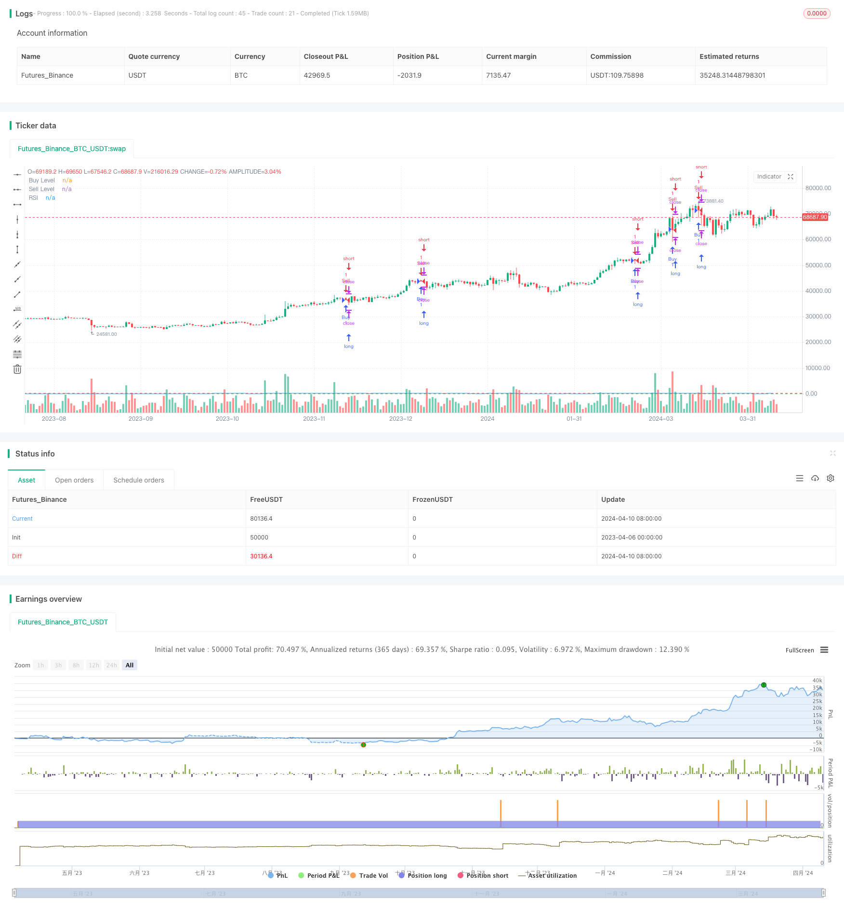

> Name

RSI Dual-Side Trading Strategy-RSI-Dual-Side-Trading-Strategy
> Author

ChaoZhang

> Strategy Description


[trans]
#### Overview
This strategy is based on the Relative Strength Index (RSI) indicator. By observing the overbought and oversold status of the RSI indicator, it performs buying and selling operations respectively when the RSI reaches the set overbought and oversold thresholds. At the same time, this strategy also adopts a pyramid-style position building method, gradually increasing positions when certain conditions are met, in order to obtain higher returns.
#### Strategy Principle
The core of this strategy is the RSI indicator. The RSI indicator measures the rise and fall of prices within a period of time. It reflects the strength of the price trend by calculating the average rise and fall of price increases and decreases over a period of time. When the RSI indicator reaches the set overbought threshold (such as 75), it is usually considered that the price has risen excessively, and a correction is more likely, and the strategy will perform a selling operation; when the RSI indicator reaches the set oversold threshold (such as 35), it is generally considered that the price has fallen excessively, and a rebound is more likely, and the strategy will perform a buying operation at this time. At the same time, this strategy also sets the conditions for building a pyramid position, that is, when the buying/selling conditions are met and the number of positions does not reach the set maximum, the position will continue to be increased in order to obtain higher returns.
#### Strategic Advantages
1. Simple and easy to understand: This strategy is based on the classic RSI indicator. The indicator has clear meaning and is easy to understand and implement.
2. Wide scope of application: RSI indicator is suitable for various financial markets and trading varieties, and has strong universal applicability.
3. Accurate grasp of the trend: Through the overbought and oversold judgment of the RSI indicator, you can more accurately grasp the turning point of the price trend and realize low-level buying and high-level selling.
4. Pyramid position building: Gradually increasing positions during the trend formation process can better track the trend and improve strategic returns.
#### Strategy Risk
1. Parameter setting risk: The parameter setting of the RSI indicator (such as overbought and oversold thresholds, RSI cycle, etc.) has a great impact on the strategy effect. Different parameters may bring completely different results, and need to be optimized according to different markets and varieties.
2. Volatile market risk: In a volatile market, prices frequently show overbought and oversold signals, which may lead to frequent trading of strategies, resulting in greater slippage and handling fee losses.
3. Trend continuation risk: When the trend continues strongly, the RSI indicator may remain in the overbought or oversold area for a long time. At this time, the strategy may miss the big trend.
4. Pyramid position building risk: At the end of a trend or at the beginning of a reversal, pyramid position building may continue to increase positions in the losing direction, amplifying strategic losses.
#### Strategy optimization direction
1. Parameter optimization: Optimize various parameters of the RSI indicator, such as overbought and oversold thresholds, RSI cycle, etc., in order to find the best parameter combination.
2. Combine with other indicators: Combine the RSI indicator with other indicators (such as moving averages, MACD, etc.) to improve the accuracy of trend judgment and reduce frequent transactions.
3. Dynamic stop loss: Dynamically adjust the stop loss position according to market volatility and price trends, in order to reduce the loss of a single transaction.
4. Pyramid position building optimization: Based on factors such as trend intensity and duration, optimize the conditions for pyramid position building and the increase or decrease in positions to improve the robustness of the strategy.
#### Summary
This strategy is based on the classic RSI indicator and uses overbought and oversold signals to make trading decisions. It also uses the pyramid position building method to track trends. It has the advantages of being simple and easy to understand and having a wide range of applications. However, in practical applications, it is necessary to pay attention to risks such as parameter settings, market shocks, and trend continuation, and make appropriate optimizations and improvements based on market characteristics, such as parameter optimization, combination with other indicators, dynamic stop loss, pyramid position optimization, etc., in order to obtain more robust strategic performance.
|| 

#### Overview
This strategy is based on the Relative Strength Index (RSI) indicator. It observes the overbought and oversold states of the RSI indicator and performs buy and sell operations when the RSI reaches the set overbought and oversold thresholds, respectively. At the same time, the strategy also adopts a pyramiding approach to position sizing, gradually increasing positions when certain conditions are met, in order to obtain higher returns.

#### Strategy Principle
The core of this strategy is the RSI indicator. The RSI indicator measures the magnitude of price increases and decreases over a period of time by calculating the average magnitude of price increases and decreases on up days and down days over a period of time to reflect the strength of the price trend. When the RSI indicator reaches the set overbought threshold (e.g., 75), it is usually considered that the price has risen excessively and there is a greater possibility of a pullback, at which point the strategy will perform a sell operation. When the RSI indicator reaches the set oversold threshold (e.g., 35), it is usually considered that the price has fallen excessively and there is a greater possibility of a rebound, at which point the strategy will perform a buy operation. At the same time, the strategy also sets conditions for pyramiding, i.e., when the buy/sell conditions are met and the number of open positions has not reached the set maximum, it will continue to increase positions in order to obtain higher returns.

#### Strategy Advantages
1. Simple and easy to understand: The strategy is based on the classic RSI indicator, which has clear meaning and is easy to understand and implement.
2. Wide applicability: The RSI indicator is applicable to various financial markets and trading products, and has strong universality.
3. Accurate trend capture: By judging overbought and oversold conditions through the RSI indicator, it can relatively accurately grasp the turning points of price trends and achieve low buying and high selling.
4. Pyramiding: Gradually increasing positions during trend formation can better track trends and improve strategy returns.

#### Strategy Risks
1. Parameter setting risk: The parameter settings of the RSI indicator (such as overbought and oversold thresholds, RSI period, etc.) have a significant impact on the strategy effect, and different parameters may bring completely different results, which need to be optimized according to different markets and products.
2. Oscillating market risk: In an oscillating market, prices frequently show overbought and oversold signals, which may lead to frequent trading of the strategy, resulting in large slippage and transaction fee losses.
3. Trend continuation risk: When the trend continues strongly, the RSI indicator may remain in the overbought or oversold area for a long time, and the strategy may miss large trend movements.
4. Pyramiding risk: At the end of a trend or the beginning of a reversal, pyramiding may continue to increase positions in the losing direction, amplifying strategy losses.

#### Strategy Optimization Directions
1. Parameter optimization: Optimize various parameters of the RSI indicator, such as overbought and oversold thresholds, RSI period, etc., in order to find the best parameter combination.
2. Combination with other indicators: Use the RSI indicator in combination with other indicators (such as moving averages, MACD, etc.) to improve the accuracy of trend judgment and reduce frequent trading.
3. Dynamic stop-loss: Dynamically adjust stop-loss positions according to market volatility and price trends to reduce losses in a single trade.
4. Pyramiding optimization: Optimize the conditions and position adjustment magnitude of pyramiding based on factors such as trend strength and duration to improve strategy robustness.

#### Summary
This strategy is based on the classic RSI indicator and makes trading decisions through overbought and oversold signals, while adopting a pyramiding approach to track trends. It has advantages such as simplicity, ease of understanding, and wide applicability. However, in actual application, attention needs to be paid to risks such as parameter setting, oscillating markets, and trend continuation, and appropriate optimizations and improvements should be made according to market characteristics, such as parameter optimization, combination with other indicators, dynamic stop-loss, pyramiding optimization, etc., in order to obtain more robust strategy performance.
[/trans]

> Strategy Arguments


|Argument|Default|Description|
|----|----|----|
|v_input_1|14|RSI Length|
|v_input_2|35|Buy Level|
|v_input_3|75|Sell Level|
|v_input_4|5|Pyramiding|


> Source (PineScript)

``` pinescript
/*backtest
start: 2023-04-06 00:00:00
end: 2024-04-11 00:00:00
period: 1d
basePeriod: 1h
exchanges: [{"eid":"Futures_Binance","currency":"BTC_USDT"}]
*/

//@version=5
strategy("RSI Strategy", overlay=true)

// Définition des paramètres
rsi_length = input(14, title="RSI Length")
buy_level = input(35, title="Buy Level")
sell_level = input(75, title="Sell Level")
pyramiding = input(5, title="Pyramiding")

// Calcul du RSI
rsi = ta.rsi(close, rsi_length)

// Règles d'entrée
buy_signal = ta.crossover(rsi, buy_level)
sell_signal = ta.crossunder(rsi, sell_level)

// Gestion des positions
if (buy_signal)
    strategy.entry("Buy", strategy.long)
if (sell_signal)
    strategy.entry("Sell", strategy.short)

// Pyramiding
if (strategy.opentrades < pyramiding)
    strategy.entry("Buy", strategy.long)
else if (strategy.opentrades > pyramiding)
    strategy.entry("Sell", strategy.short)

// Tracé du RSI
plot(rsi, title="RSI", color=color.blue)
hline(buy_level, "Buy Level", color=color.green)
hline(sell_level, "Sell Level", color=color.red)


```

> Detail

https://www.fmz.com/strategy/448060

> Last Modified

2024-04-12 16:29:34
