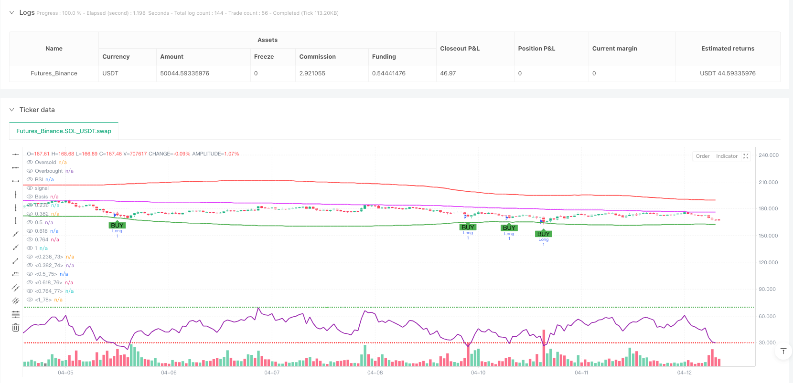
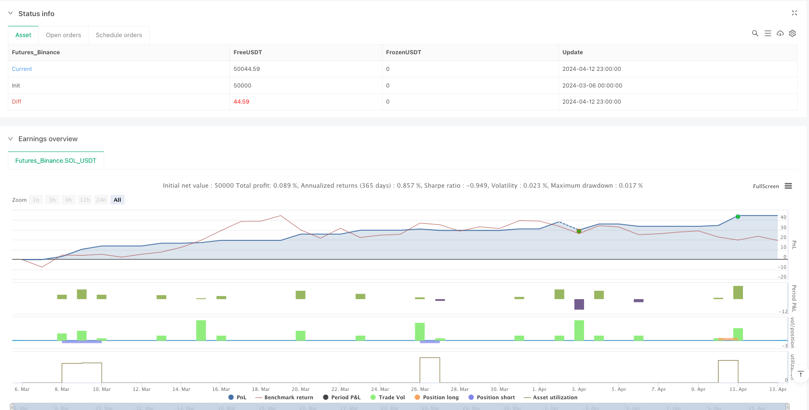

> Name

RSI Reversal Fibonacci Bollinger Bands Quantitative Strategy-RSI-Reversal-Fibonacci-Bollinger-Bands-Quantitative-Strategy
> Author

ianzeng123

> Strategy Description





[trans]## Overview
The RSI Reversal Fibonacci Bollinger Bands Quantitative Strategy is a technical analysis trading system that combines the Relative Strength Index (RSI) and custom Fibonacci Bollinger Bands. This strategy primarily identifies potential reversal points in overbought and oversold market conditions and uses Fibonacci Bollinger Bands as additional support and resistance references. The strategy sends a buy signal when the RSI indicator is below 30 and a sell signal when the RSI indicator is above 70. At the same time, a fixed proportion of stop loss and profit points are set to achieve risk control and profit locking.
## Strategy Principle
The core principle of this strategy is to use the RSI indicator to identify possible market reversal points. The specific implementation principle is as follows:
1. Use the standard 14-period RSI indicator to calculate overbought and oversold conditions in the market.
2. When the RSI falls from above 30 to below 30, a buy signal (long) is triggered.
3. When the RSI rises from below 70 to above 70, a sell signal (short) is triggered.
4. Set a fixed proportion of stop loss (default is 1% of the entry price) and profit point (default is 2% of the entry price) for each transaction.
5. Combined with Bollinger Bands based on Fibonacci levels (using VWMA as the middle rail), it provides additional market structure reference.
The Fibonacci Bollinger Bands in the strategy is an innovation that uses the Volume Weighted Moving Average (VWMA) as the middle track and applies Fibonacci levels of 0.236, 0.382, 0.5, 0.618, 0.764, and 1.0 multiplied by the standard deviation to calculate the upper and lower tracks. The upper rail serves as a potential resistance level, and the lower rail serves as a potential support level, helping to optimize entry and exit points.
## Strategic Advantages
An in-depth analysis of the code implementation of this strategy reveals that it has the following significant advantages:
1. **Easy to understand**: The strategy logic is intuitive and mainly relies on the overbought and oversold conditions of the RSI indicator. It is easy to understand and apply, and is suitable for novice traders.
2. **Clear Risk Management**: Each transaction has predefined stop loss and profit points, set in percentage form, making risk control more clear and consistent.
3. **Strong adaptability**: It can be adapted to different market environments through parameter adjustment, including RSI overbought and oversold levels, stop loss and profit point percentages, etc.
4. **Fibonacci Bollinger Bands Enhancement**: The innovative combination of traditional Bollinger Bands and Fibonacci levels provides a more detailed view of market structure and helps identify key support and resistance areas.
5. **Multi-period applicability**: The strategy is suitable for both short-term (intraday) and mid-term (swing) trading styles, increasing its practicality.
6. **Visual and intuitive**: The strategy clearly marks the buying and selling signals on the chart, and displays the RSI indicator and Fibonacci Bollinger Bands, allowing traders to intuitively understand the market conditions.
## Strategy Risk
While this strategy offers several advantages, there are also some potential risks:
1. **False Breakout Risk**: In sideways or low-volatility markets, RSI may generate false signals, leading to unnecessary trades. The solution is to add additional filters such as volume confirmation or trend filters.
2. **Fixed Stop Loss Risk**: Using a fixed percentage stop loss may not be suitable for all market conditions, especially in markets with higher volatility. Consider using dynamic stops based on ATR (Average True Range) to accommodate market volatility.
3. **Overtrading Risk**: In a rapidly changing market, RSI may frequently cross overbought and oversold lines, leading to overtrading. It is recommended to add a signal confirmation mechanism or delay entry to reduce false signals.
4. **Trend Retrograde Risk**: This strategy is essentially a reversal strategy, which may lead to frequent losing trades in strong trending markets. The market trend environment should be assessed before applying strategies.
5. **Parameter sensitivity**: Strategy performance is more sensitive to RSI threshold and Bollinger Band parameter settings. Different parameters may lead to significantly different results. Backtesting and optimization are recommended to find parameters suitable for a specific market.
## Strategy optimization direction
Based on the analysis of the code, the following are several possible optimization directions:
1. **Add trend filter**: Add trend identification components, such as moving average crossover or ADX indicator, and only execute transactions in the direction of the main trend to avoid counter-trend transactions in strong trending markets.
2. **Dynamic Stop Loss and Take Profit Points**: Replace fixed percentage stop loss and take profit points with dynamic values ​​based on ATR to better adapt to market volatility.
3. **Signal Confirmation Mechanism**: Requires the RSI signal to last for a specific period of time or be confirmed with other indicators (such as increased trading volume or price pattern) before executing a transaction, reducing false signals.
4. **Add time filter**: Avoid trading during high-volatility periods before and after the market opens or closes, or avoid important economic data release periods to reduce the impact of unnecessary market noise.
5. **Optimize Fibonacci Bollinger Bands parameters**: Analyze different VWMA periods and standard deviation multipliers through backtesting to find the parameter combination that best suits the target market.
6. **Add partial profit locking mechanism**: When the price reaches a specific profit level, the stop loss will be moved to the break-even point or the position will be partially closed to protect the realized profits.
The implementation of these optimization directions can improve the robustness and adaptability of the strategy, reduce unnecessary losses, and improve overall performance while maintaining the core advantages of the strategy.
## Summarize
RSI reversal Fibonacci Bollinger Bands quantitative strategy is an innovative trading system that combines RSI reversal signals and Fibonacci Bollinger Bands. The core idea of ​​this strategy is to capture potential reversal opportunities when the market is overbought and oversold, and to use customized Fibonacci Bollinger Bands to provide additional market structure reference.
The main advantage of the strategy is its straightforward logic and clear risk management setup, making it easy to understand and apply. The innovative application of Fibonacci Bollinger Bands provides more detailed support and resistance references for trading decisions, helping to optimize entry and exit points.
However, as a reversal strategy, it can face challenges in strongly trending markets and is sensitive to parameter settings. By adding optimization measures such as trend filters, dynamic stop loss mechanisms and signal confirmations, the robustness and adaptability of the strategy can be significantly improved.
Whether you are a short-term trader or a mid-term investor, this strategy provides an excellent framework that can be customized and optimized based on personal trading style and market conditions. In practical applications, it is recommended to conduct sufficient backtesting and forward verification to ensure the stability and effectiveness of the strategy in different market environments. ||
## Overview

The RSI Reversal Fibonacci Bollinger Bands Quantitative Strategy is a technical analysis trading system that combines the Relative Strength Index (RSI) with custom Fibonacci Bollinger Bands. This strategy primarily identifies potential reversal points during market overbought and oversold conditions, using Fibonacci Bollinger Bands as additional support and resistance references. The strategy generates buy signals when the RSI indicator falls below 30 and sell signals when the RSI indicator rises above 70, while implementing fixed-ratio stop-loss and take-profit points to achieve risk control and profit locking.

## Strategy Principles

The core principle of this strategy is to use the RSI indicator to identify potential market reversal points. The specific implementation principles are as follows:

1. Use the standard 14-period RSI indicator to calculate market overbought and oversold conditions.
2. When RSI drops from above 30 to below 30, a buy signal (long position) is triggered.
3. When RSI rises from below 70 to above 70, a sell signal (short position) is triggered.
4. Set fixed-ratio stop-loss (default at 1% of entry price) and take-profit points (default at 2% of entry price) for each trade.
5. Incorporate Bollinger Bands based on Fibonacci levels (using VWMA as the middle band) to provide additional market structure reference.

The Fibonacci Bollinger Bands in the strategy represent an innovation, using the Volume Weighted Moving Average (VWMA) as the middle band, and applying Fibonacci levels of 0.236, 0.382, 0.5, 0.618, 0.764, and 1.0 multiplied by the standard deviation to calculate the upper and lower bands. The upper bands serve as potential resistance levels, while the lower bands act as potential support levels, helping to optimize entry and exit points.

## Strategy Advantages

A deep analysis of the strategy's code implementation reveals the following significant advantages:

1. **Simple and Easy to Understand**: The strategy logic is intuitive, mainly relying on RSI indicator's overbought and oversold conditions, easy to understand and apply, suitable for trading beginners.

2. **Clear Risk Management**: Each trade has predefined stop-loss and take-profit points, set as percentages, making risk control more explicit and consistent.

3. **Strong Adaptability**: Can be adapted to different market environments through parameter adjustments, including RSI overbought/oversold levels, stop-loss and take-profit percentages, etc.

4. **Fibonacci Bollinger Bands Enhancement**: An innovative combination of traditional Bollinger Bands with Fibonacci levels provides a more detailed perspective of market structure, helping to identify key support and resistance areas.

5. **Multi-timeframe Applicability**: The strategy is suitable for both short-term (intraday) and medium-term (swing) trading styles, increasing its practicality.

6. **Visual Intuitiveness**: The strategy clearly marks buy and sell signals on the chart and displays the RSI indicator and Fibonacci Bollinger Bands, allowing traders to visually understand market conditions.

## Strategy Risks

Despite its many advantages, the strategy also has some potential risks:

1. **False Breakout Risk**: In sideways or low-volatility markets, RSI may generate false signals, leading to unnecessary trades. The solution is to add additional filtering conditions, such as volume confirmation or trend filters.

2. **Fixed Stop-Loss Risk**: Using fixed percentage stop-losses may not be suitable for all market conditions, especially in highly volatile markets. Consider using dynamic stop-losses based on ATR (Average True Range) to adapt to market volatility.

3. **Overtrading Risk**: In rapidly changing markets, RSI may frequently cross overbought and oversold lines, leading to overtrading. It is recommended to add signal confirmation mechanisms or delayed entry to reduce false signals.

4. **Counter-Trend Risk**: This strategy is essentially a reversal strategy, which may lead to frequent losing trades in strong trending markets. It is advisable to assess the market trend environment before applying the strategy.

5. **Parameter Sensitivity**: Strategy performance is relatively sensitive to RSI threshold and Bollinger Bands parameter settings, with different parameters potentially leading to significantly different results. Backtesting and optimization are recommended to find parameters suitable for specific markets.

## Strategy Optimization Directions

Based on the analysis of the code, here are several possible optimization directions:

1. **Add Trend Filters**: Incorporate trend identification components, such as moving average crossovers or the ADX indicator, executing trades only when aligned with the main trend direction to avoid counter-trend trading in strong trending markets.

2. **Dynamic Stop-Loss and Take-Profit Points**: Replace fixed percentage stop-loss and take-profit points with dynamic values based on ATR, better adapting to market volatility.

3. **Signal Confirmation Mechanism**: Require RSI signals to persist for a specific time or be confirmed by other indicators (such as increased volume or price patterns) before executing trades, reducing false signals.

4. **Add Time Filters**: Avoid trading during high-volatility periods at market open or close, or avoid important economic data release periods, reducing unnecessary market noise influence.

5. **Optimize Fibonacci Bollinger Bands Parameters**: Through backtesting analysis of different VWMA periods and standard deviation multipliers, find the parameter combination most suitable for the target market.

6. **Add Partial Profit-Locking Mechanism**: When price reaches a specific profit level, move stop-loss to breakeven or partially close positions, protecting realized profits.

The implementation of these optimization directions can improve the strategy's robustness and adaptability, reduce unnecessary losses, and enhance overall performance while maintaining the strategy's core advantages.

## Summary

The RSI Reversal Fibonacci Bollinger Bands Quantitative Strategy is an innovative trading system that combines RSI reversal signals with Fibonacci Bollinger Bands. The core idea of the strategy is to capture potential reversal opportunities during market overbought and oversold conditions, using custom Fibonacci Bollinger Bands to provide additional market structure references.

The main advantages of the strategy lie in its straightforward logic and clear risk management settings, making it easy to understand and apply. The innovative application of Fibonacci Bollinger Bands provides more detailed support and resistance references for trading decisions, helping to optimize entry and exit points.

However, as a reversal strategy, it may face challenges in strong trending markets and is relatively sensitive to parameter settings. By adding trend filters, dynamic stop-loss mechanisms, and signal confirmation, the strategy's robustness and adaptability can be significantly improved.

Whether for short-term traders or medium-term investors, this strategy provides a sound framework that can be customized and optimized according to individual trading styles and market conditions. In practical application, it is recommended to conduct thorough backtesting and forward validation to ensure the stability and effectiveness of the strategy in different market environments.[/trans]


> Source (PineScript)

``` pinescript
/*backtest
start: 2024-03-06 00:00:00
end: 2024-04-13 00:00:00
period: 1h
basePeriod: 1h
exchanges: [{"eid":"Futures_Binance","currency":"SOL_USDT"}]
*/

//@version=6
strategy("BRAHIM KHATTARA ", overlay=true)

// Input parameters
rsiOS = input.int(30, title="RSI Oversold Level", minval=0, maxval=100)
rsiOB = input.int(70, title="RSI Overbought Level", minval=0, maxval=100)
stopLossDistance = input.float(1.0, title="Stop Loss (%)", minval=0.1, maxval=10, step=0.1) // Stop loss as a percentage
takeProfitDistance = input.float(2.0, title="Take Profit (%)", minval=0.1, maxval=10, step=0.1) // Take profit as a percentage

// RSI Calculation
rsi = ta.rsi(close, 14)

// Custom Strategy Conditions
oversold = rsi <= rsiOS and rsi[1] > rsiOS
overbought = rsi >= rsiOB and rsi[1] < rsiOB

// Entry Conditions
longCondition = oversold
shortCondition = overbought

// Place Buy and Sell Orders
if (longCondition)
    strategy.entry("Long", strategy.long)

if (shortCondition)
    strategy.entry("Short", strategy.short)

// Exit Conditions with Take Profit and Stop Loss
if (strategy.position_size > 0)
    strategy.exit("Take Profit/Stop Loss", from_entry="Long", limit=close * (1 + takeProfitDistance / 100), stop=close * (1 - stopLossDistance / 100))

if (strategy.position_size < 0)
    strategy.exit("Take Profit/Stop Loss", from_entry="Short", limit=close * (1 - takeProfitDistance / 100), stop=close * (1 + stopLossDistance / 100))

// Plot Buy and Sell Signals
plotshape(longCondition, title="Buy Signal", location=location.belowbar, color=color.green, style=shape.labelup, text="BUY", size=size.small)
plotshape(shortCondition, title="Sell Signal", location=location.abovebar, color=color.red, style=shape.labeldown, text="SELL", size=size.small)

// Display RSI on Chart
hline(rsiOS, "Oversold", color=color.red, linestyle=hline.style_dotted)
hline(rsiOB, "Overbought", color=color.green, linestyle=hline.style_dotted)
plot(rsi, title="RSI", color=color.purple, linewidth=2)

// Fibonacci Bollinger Bands
length = input.int(200, title="Length", minval=1)
src = input(hlc3, title="Source")
mult = input.float(3.0, title="Multiplier", minval=0.001, maxval=50.0, step=0.1)
basis = ta.vwma(src, length)
dev = mult * ta.stdev(src, length)

upper_1 = basis + (0.236 * dev)
upper_2 = basis + (0.382 * dev)
upper_3 = basis + (0.5 * dev)
upper_4 = basis + (0.618 * dev)
upper_5 = basis + (0.764 * dev)
upper_6 = basis + dev

lower_1 = basis - (0.236 * dev)
lower_2 = basis - (0.382 * dev)
lower_3 = basis - (0.5 * dev)
lower_4 = basis - (0.618 * dev)
lower_5 = basis - (0.764 * dev)
lower_6 = basis - dev

// Plot Fibonacci Bollinger Bands
plot(basis, color=color.fuchsia, linewidth=2, title="Basis")
p1 = plot(upper_1, color=color.white, linewidth=1, title="0.236")
p2 = plot(upper_2, color=color.white, linewidth=1, title="0.382")
p3 = plot(upper_3, color=color.white, linewidth=1, title="0.5")
p4 = plot(upper_4, color=color.white, linewidth=1, title="0.618")
p5 = plot(upper_5, color=color.white, linewidth=1, title="0.764")
p6 = plot(upper_6, color=color.red, linewidth=2, title="1")
p13 = plot(lower_1, color=color.white, linewidth=1, title="0.236")
p14 = plot(lower_2, color=color.white, linewidth=1, title="0.382")
p15 = plot(lower_3, color=color.white, linewidth=1, title="0.5")
p16 = plot(lower_4, color=color.white, linewidth=1, title="0.618")
p17 = plot(lower_5, color=color.white, linewidth=1, title="0.764")
p18 = plot(lower_6, color=color.green, linewidth=2, title="1") 
```

> Detail

https://www.fmz.com/strategy/485283

> Last Modified

2025-03-20 11:42:06
