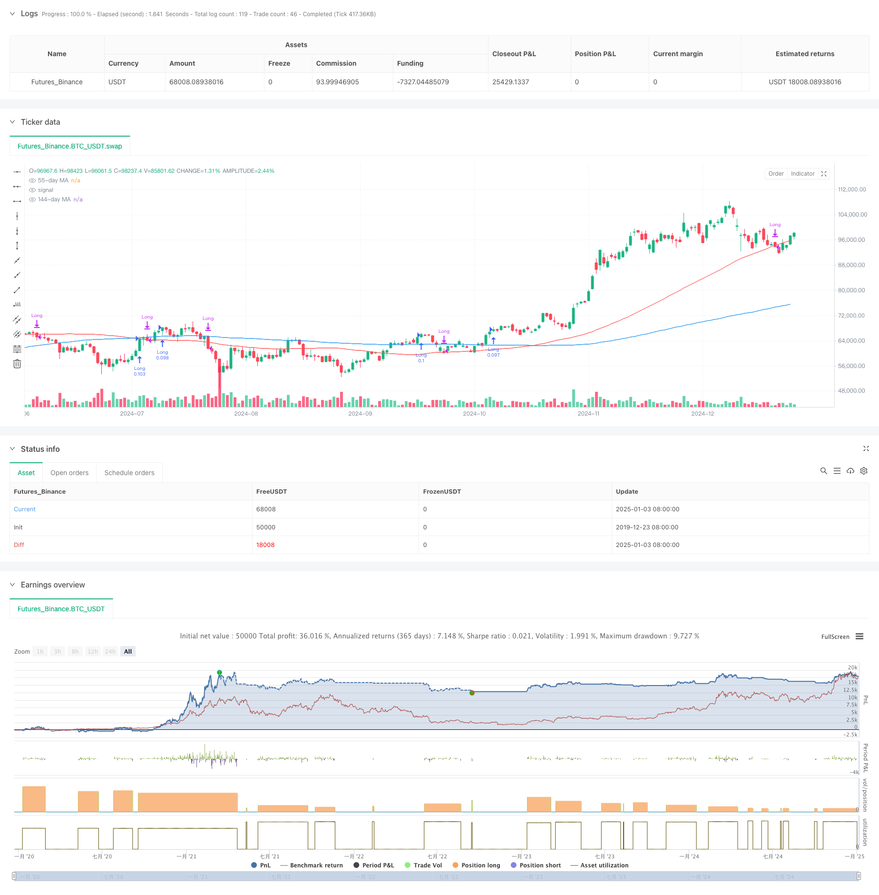

> Name

RSI Trend Breakthrough and Momentum Enhancement Trading Strategy-RSI-Trend-Breakthrough-and-Momentum-Enhancement-Trading-Strategy
> Author

ChaoZhang

> Strategy Description



[trans]
#### Overview
This strategy is a comprehensive trading system based on the relative strength index (RSI), moving averages (MA), and price momentum. The strategy primarily identifies potential trading opportunities by monitoring RSI trend changes, moving average crossovers across multiple time periods, and changes in price momentum. This strategy pays special attention to the rising trend of RSI and the continuous rising trend of price, and improves the accuracy of trading through multiple confirmations.
#### Strategy Principle
The core logic of the strategy is based on the following key components:
1. RSI Trend Analysis: Use the 13-period RSI indicator and its moving average to confirm price strength
2. Price momentum confirmation: Requires the formation of 3 consecutive higher highs to verify the continuity of the upward trend
3. Multiple Moving Average System: Uses 21-day, 55-day and 144-day moving averages as trend filters
4. Fund management: Each transaction uses 10% of the account equity for position control.
The conditions for buying must be met: RSI is greater than its average value, the price forms consecutive higher highs, and RSI maintains an upward trend.
Sell conditions include: price falls below the 55-day moving average or RSI falls below the average and price falls below the 55-day moving average
#### Strategic Advantages
1. Multiple confirmation mechanism: Improve the reliability of trading signals through multiple verifications of RSI, price momentum and moving average systems
2. Trend following ability: The strategy can effectively capture mid- to long-term trends and avoid false breakthroughs
3. Improved risk control: Control risks through position management and clear stop-loss conditions
4. Strong adaptability: can be applied to different time periods and market environments
5. Reasonable fund management: use the account equity percentage to control positions to avoid the risk of fixed positions
#### Strategy Risk
1. Lagging risk: The moving average and RSI indicators themselves have a certain lag, which may lead to a slight delay in entry and exit timings.
2. Volatile market risk: Frequent false signals may occur in a volatile market.
3. Risk of continuous losses: You may face continuous stop losses during periods of sudden market changes
Solution:
- Added market environment filter
- Optimize indicator parameters
-Introducing volatility adaptive mechanism
#### Strategy optimization direction
1. Optimization of indicator parameters:
- Consider using adaptive RSI cycles
- Adjust moving average parameters according to different market cycles
2. Increase market environment identification:
- Introducing volatility indicator
- Added trend strength filter
3. Improve risk control:
- Implement dynamic stop loss mechanism
- Add profit target management
4. Optimize warehouse management:
- Adjust position size based on signal strength
- Implement the mechanism of opening and reducing positions in batches
#### Summary
This strategy builds a relatively complete trading system by comprehensively using technical analysis indicators and momentum analysis methods. The advantage of the strategy lies in its multiple confirmation mechanism and complete risk control, but it is still necessary to pay attention to the adaptability of the market environment and parameter optimization issues. With continued optimization and improvement, this strategy has the potential to become a robust trading system. ||
#### Overview
This strategy is a comprehensive trading system based on the Relative Strength Index (RSI), Moving Averages (MA), and price momentum. It identifies potential trading opportunities by monitoring RSI trend changes, multiple timeframe moving average crossovers, and price momentum changes. The strategy particularly focuses on RSI uptrends and consecutive price increases, using multiple confirmations to enhance trading accuracy.

#### Strategy Principles
The core logic of the strategy is based on the following key components:
1. RSI Trend Analysis: Uses 13-period RSI and its moving average to confirm price strength
2. Price Momentum Confirmation: Requires three consecutive higher highs to validate trend continuation
3. Multiple Moving Average System: Employs 21-day, 55-day, and 144-day moving averages as trend filters
4. Money Management: Uses 10% of account equity for position sizing
Buy conditions require: RSI above its average, consecutive higher highs formation, and maintaining RSI uptrend
Sell conditions include: Price breaking below 55-day MA or RSI crossing below average with price below 55-day MA

#### Strategy Advantages
1. Multiple Confirmation Mechanism: Enhances signal reliability through RSI, price momentum, and MA system verification
2. Trend Following Capability: Effectively captures medium to long-term trends while avoiding false breakouts
3. Comprehensive Risk Control: Controls risk through position management and clear stop-loss conditions
4. High Adaptability: Applicable to different timeframes and market conditions
5. Rational Money Management: Uses account equity percentage for position sizing, avoiding fixed position risks

#### Strategy Risks
1. Lag Risk: Moving averages and RSI indicators have inherent lag, potentially causing delayed entries and exits
2. Sideways Market Risk: May generate frequent false signals in ranging markets
3. Consecutive Loss Risk: May face consecutive stops during market regime changes
Solutions:
- Add market environment filters
- Optimize indicator parameters
- Introduce volatility adaptive mechanisms

#### Strategy Optimization Directions
1. Indicator Parameter Optimization:
- Consider adaptive RSI periods
- Adjust moving average parameters based on market cycles
2. Enhanced Market Environment Recognition:
- Introduce volatility indicators
- Add trend strength filters
3. Improved Risk Control:
- Implement dynamic stop-loss mechanisms
- Add profit target management
4. Position Management Optimization:
- Adjust position size based on signal strength
- Implement scaled entry and exit mechanisms

#### Summary
This strategy constructs a relatively complete trading system through the comprehensive use of technical analysis indicators and momentum analysis methods. Its strengths lie in its multiple confirmation mechanisms and comprehensive risk control, though market environment adaptability and parameter optimization remain important considerations. Through continuous optimization and improvement, this strategy has the potential to become a robust trading system.[/trans]


> Source (PineScript)

``` pinescript
/*backtest
start: 2019-12-23 08:00:00
end: 2025-01-04 08:00:00
period: 1d
basePeriod: 1d
exchanges: [{"eid":"Futures_Binance","currency":"BTC_USDT"}]
*/

//@version=5
strategy("Improved Strategy with RSI Trending Upwards", overlay=true)

// Inputs for moving averages
ma21_length = input.int(21, title="21-day MA Length")
ma55_length = input.int(55, title="55-day MA Length")
ma144_length = input.int(144, title="144-day MA Length")

// Moving averages
ma21 = ta.sma(close, ma21_length)
ma55 = ta.sma(close, ma55_length)
ma144 = ta.sma(close, ma144_length)

// RSI settings
rsi_length = input.int(13, title="RSI Length")
rsi_avg_length = input.int(13, title="RSI Average Length")
rsi = ta.rsi(close, rsi_length)
rsi_avg = ta.sma(rsi, rsi_avg_length)

// RSI breakout condition
rsi_breakout = ta.crossover(rsi, rsi_avg)

// RSI trending upwards
rsi_trending_up = rsi > rsi[1] and rsi[1] > rsi[2]

// Higher high condition
hh1 = high[2] > high[3]  // 1st higher high
hh2 = high[1] > high[2]  // 2nd higher high
hh3 = high > high[1]     // 3rd higher high
higher_high_condition = hh1 and hh2 and hh3

// Filter for trades starting after 1st January 2007
date_filter = (year >= 2007 and month >= 1 and dayofmonth >= 1)

// Combine conditions for buying
buy_condition = rsi > rsi_avg and higher_high_condition and rsi_trending_up //and close > ma21 and ma21 > ma55
// buy_condition = rsi > rsi_avg and rsi_trending_up

// Sell condition
// Sell condition: Close below 21-day MA for 3 consecutive days
downtrend_condition = close < close[1] and close[1] < close[2] and close[2] < close[3] and close[3] < close[4] and close[4] < close[5]
// downtrend_condition = close < close[1] and close[1] < close[2] and close[2] < close[3]

sell_condition_ma21 = close < ma55 and close[1] < ma55 and close[2] < ma55 and close[3] < ma55 and close[4] < ma55 and downtrend_condition

// Final sell condition
sell_condition = ta.crossunder(close, ma55) or (ta.crossunder(rsi, rsi_avg) and ta.crossunder(close, ma55))

// Execute trades
if (buy_condition and date_filter)
    // strategy.entry("Long", strategy.long, comment="Buy")
    strategy.entry("Long", strategy.long, qty=strategy.equity * 0.1 / close)
if (sell_condition and date_filter)
    strategy.close("Long", comment="Sell")

// Plot moving averages
plot(ma55, color=color.red, title="55-day MA")
plot(ma144, color=color.blue, title="144-day MA")
```

> Detail

https://www.fmz.com/strategy/477550

> Last Modified

2025-01-06 13:43:48
