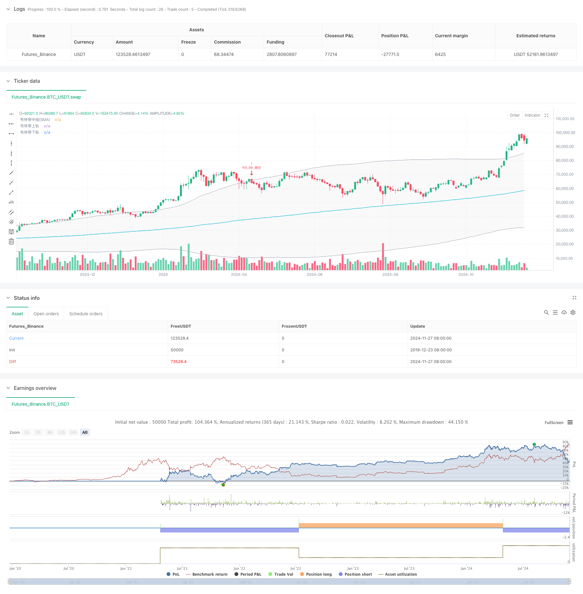

> Name

RSI-and-Bollinger-Bands-Cross-Regression-Dual-Strategy
> Author

ChaoZhang

> Strategy Description



[trans]
#### Overview
This strategy is a dual technical analysis trading system based on the Relative Strength Index (RSI) and Bollinger Bands. The strategy builds a complete trading decision-making framework by combining the overbought and oversold signals of RSI with the price channel breakout signals of Bollinger Bands. This strategy is particularly suitable for operating in volatile market environments, and achieves risk-controllable transactions through strict entry and exit conditions.
#### Strategy Principle
The core logic of the strategy is based on the synergy of two main technical indicators:
1. The RSI indicator uses 6 periods as the calculation period, and sets 50 as the critical value of overbought and oversold, which is used to capture the overbought and oversold state of the price.
2. Bollinger Bands uses the 200-period moving average as the middle track, and the standard deviation multiple is 2.0 to form an upper and lower track.
3. Long condition: Triggered when RSI breaks through the oversold level (50) from below and the price also breaks through the lower Bollinger Band.
4. Short selling conditions: Triggered when RSI falls below the overbought level (50) from above and the price also falls below the upper Bollinger Band.
5. The strategy adopts the OCA (One-Cancels-All) order management mechanism to ensure that there is only one valid transaction at any time.
#### Strategic Advantages
1. Double confirmation mechanism: Reduce false signals through the joint confirmation of RSI and Bollinger Bands.
2. Perfect risk control: Using Bollinger Bands as the stop loss position provides clear risk control standards.
3. Strong adaptability: Bollinger Bands can automatically adjust the trading range according to market volatility.
4. Order management optimization: Use the OCA mechanism to avoid repeated transactions and improve the efficiency of fund use.
5. Strong parameter adjustability: key parameters can be optimized and adjusted according to different market characteristics.
#### Strategy Risk
1. Risk of volatile market: Frequent false breakthrough signals may occur in a volatile market.
2. Lagging risk: Due to the use of moving averages, the strategy has a certain lag.
3. Parameter sensitivity: The parameter settings of RSI and Bollinger Bands have a greater impact on strategy performance.
4. Market environment dependence: Strategies perform better in markets with obvious trends, but may perform poorly in volatile markets.
#### Strategy optimization direction
1. Dynamic parameter adjustment: The overbought and oversold thresholds of RSI can be dynamically adjusted according to market volatility.
2. Add market environment filtering: add trend judgment indicators and use different trading parameters in different market environments.
3. Optimization of the profit-taking mechanism: A dynamic profit-taking mechanism based on ATR can be added.
4. Position management optimization: Dynamically adjust the position size based on signal strength and market volatility.
5. Time filtering: Increase the trading time window limit to avoid trading in inappropriate time periods.
#### Summary
This strategy builds a relatively complete trading system through the synergy of RSI and Bollinger Bands. The main advantage of the strategy lies in the double confirmation mechanism and complete risk control, but it is also necessary to pay attention to the impact of the market environment on the performance of the strategy. Through the proposed optimization direction, the stability and profitability of the strategy can be further improved. ||
#### Overview
This strategy is a dual technical analysis trading system based on the Relative Strength Index (RSI) and Bollinger Bands. The strategy combines RSI's overbought/oversold signals with Bollinger Bands' price channel breakout signals to construct a complete trading decision framework. It is particularly suitable for markets with high volatility, achieving risk-controlled trading through strict entry and exit conditions.

#### Strategy Principle
The core logic is built on the synergy of two main technical indicators:
1. RSI uses a 6-period calculation cycle with 50 as the overbought/oversold threshold.
2. Bollinger Bands use a 200-period moving average as the middle band with a 2.0 standard deviation multiplier.
3. Long condition: Triggered when RSI breaks above the oversold level (50) while price breaks above the lower Bollinger Band.
4. Short condition: Triggered when RSI breaks below the overbought level (50) while price breaks below the upper Bollinger Band.
5. Strategy employs OCA (One-Cancels-All) order management to ensure only one active trade at a time.

#### Strategy Advantages
1. Dual confirmation mechanism reduces false signals through RSI and Bollinger Bands confirmation.
2. Robust risk control using Bollinger Bands as stop-loss levels.
3. Strong adaptability with Bollinger Bands automatically adjusting to market volatility.
4. Optimized order management through OCA mechanism improves capital efficiency.
5. High parameter adaptability allows optimization for different market characteristics.

#### Strategy Risks
1. Sideways market risk: Frequent false breakouts in range-bound markets.
2. Lag risk: Some inherent delay due to moving average calculations.
3. Parameter sensitivity: Strategy performance heavily depends on RSI and Bollinger Bands parameters.
4. Market environment dependence: Better performance in trending markets, potential underperformance in ranging markets.

#### Optimization Directions
1. Dynamic parameter adjustment: Adapt RSI thresholds based on market volatility.
2. Market environment filtering: Add trend indicators for different parameter sets in various market conditions.
3. Take-profit optimization: Implement dynamic ATR-based take-profit mechanisms.
4. Position management optimization: Adjust position size based on signal strength and market volatility.
5. Time filtering: Add trading time window restrictions to avoid unfavorable periods.

#### Summary
This strategy builds a relatively complete trading system through the synergy of RSI and Bollinger Bands. Its main advantages lie in the dual confirmation mechanism and comprehensive risk control, while attention must be paid to market environment impacts. The proposed optimization directions can further enhance strategy stability and profitability.[/trans]


> Source (PineScript)

``` pinescript
/*backtest
start: 2019-12-23 08:00:00
end: 2024-11-28 00:00:00
period: 2d
basePeriod: 2d
exchanges: [{"eid":"Futures_Binance","currency":"BTC_USDT"}]
*/

//@version=5
strategy("RSI与布林带双重策略 (by ChartArt) v2.2", shorttitle="CA_RSI_布林带策略_2.2", overlay=true)

// ChartArt的RSI + 布林带双重策略 - 精简版
//
// 中文版本 3, BY Henry
// 原创意来自ChartArt，2015年1月18日
// 更新至Pine Script v5版本，删除了背景色、K线颜色和策略收益绘制功能
//
// 策略说明:
// 该策略结合使用RSI指标和布林带。
// 当价格高于上轨且RSI超买时卖出，
// 当价格低于下轨且RSI超卖时买入。
//
// 本策略仅在RSI和布林带同时
// 处于超买或超卖状态时触发。

// === 输入参数 ===

// RSI参数
RSIlength = input.int(6, title="RSI周期长度", minval=1) 
RSIoverSold = input.int(50, title="RSI超卖阈值", minval=0, maxval=100)
RSIoverBought = input.int(50, title="RSI超买阈值", minval=0, maxval=100)

// 布林带参数
BBlength = input.int(200, title="布林带周期长度", minval=1)
BBmult = input.float(2.0, title="布林带标准差倍数", minval=0.001, maxval=50)

// === 计算 ===

price = close
vrsi = ta.rsi(price, RSIlength)

// 布林带计算
BBbasis = ta.sma(price, BBlength)
BBdev = BBmult * ta.stdev(price, BBlength)
BBupper = BBbasis + BBdev
BBlower = BBbasis - BBdev

// === 绘图 ===

plot(BBbasis, color=color.new(color.aqua, 0), title="布林带中线(SMA)")
p1 = plot(BBupper, color=color.new(color.silver, 0), title="布林带上轨")
p2 = plot(BBlower, color=color.new(color.silver, 0), title="布林带下轨")
fill(p1, p2, color=color.new(color.silver, 90))

// === 策略逻辑 ===

if (not na(vrsi))
    longCondition = ta.crossover(vrsi, RSIoverSold) and ta.crossover(price, BBlower)
    if (longCondition)
        strategy.entry("RSI_BB_做多", strategy.long, stop=BBlower, oca_name="RSI_BB",  comment="RSI_BB_做多")
    else
        strategy.cancel("RSI_BB_做多")
        
    shortCondition = ta.crossunder(vrsi, RSIoverBought) and ta.crossunder(price, BBupper)
    if (shortCondition)
        strategy.entry("RSI_BB_做空", strategy.short, stop=BBupper, oca_name="RSI_BB", comment="RSI_BB_做空")
    else
        strategy.cancel("RSI_BB_做空")
```

> Detail

https://www.fmz.com/strategy/473400

> Last Modified

2024-11-29 16:42:35
