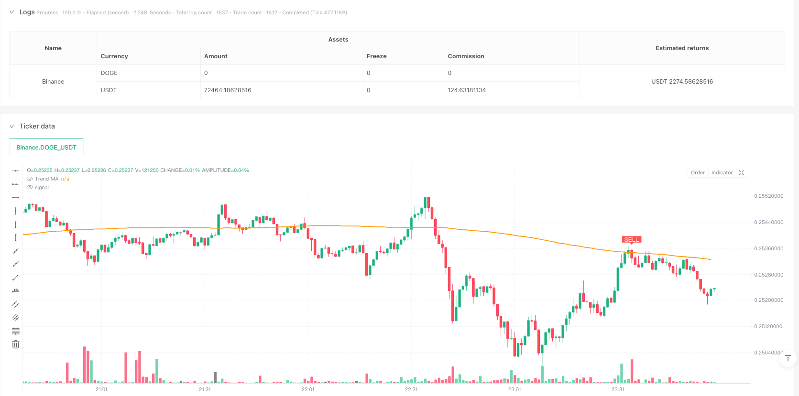
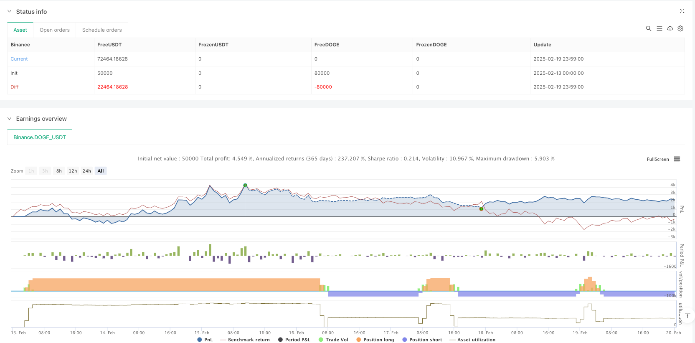

> Name

Dual-Filter Trading Strategy Based on RSI and Trend Average-RSI-and-Trend-MA-Dual-Filter-Trading-Strategy
> Author

ianzeng123

> Strategy Description





[trans]
#### Overview
This strategy is a dual-filter trading system that combines RSI (relative strength indicator) and trend moving averages. This strategy trades on the daily level by combining RSI's overbought and oversold signals with long-term trend moving averages. The core of the strategy is to add a trend filter on the basis of traditional RSI trading signals to improve the accuracy and reliability of trading.
#### Strategy Principle
The strategy is mainly based on the following core components:
1. The RSI indicator is used to identify overbought and oversold areas. The default parameter is 14 periods.
2. The overbought level is set to 70 and the oversold level is set to 30
3. 200-period simple moving average as trend filter
4. Buying conditions: RSI breaks upward from the oversold area and the price is above the moving average
5. Sell condition: RSI breaks down from the overbought area and the price is below the moving average
The strategy automatically executes trades on each signal and can be configured with alerts.
#### Strategic Advantages
1. The double confirmation mechanism significantly improves the reliability of transactions
2. Combine trend and momentum indicators to reduce the risk of false signals
3. Fully automated trade execution system
4. Flexible parameter settings allow strategy optimization
5. Integrated real-time reminder function to facilitate actual operation
6. Visual interface clearly displays trading signals
7. Support backtesting function to facilitate strategy verification
#### Strategy Risk
1. Volatile markets may generate frequent trading signals
2. Trend turning points may lag
3. Improper parameter settings may affect strategy performance
4. Extreme market fluctuations may cause large retracements
It is recommended to manage risk by:
- Set stop loss position appropriately
- Adjust position size appropriately
- Regularly optimize strategy parameters
- Combined with other technical indicators to assist judgment
#### Strategy optimization direction
1. Add volatility filter to adjust trading standards during periods of high volatility
2. Introduce an adaptive parameter mechanism to dynamically adjust parameters according to market conditions
3. Add a trading volume confirmation mechanism to improve signal reliability
4. Develop more complex exit mechanisms and optimize profit-taking opportunities
5. Integrate multi-time period analysis to provide a more comprehensive market perspective
#### Summary
This strategy builds a robust trading system by combining RSI and trend moving averages. The strategy design is reasonable, the operating rules are clear, and it has good practicality. Through reasonable risk management and continuous optimization, this strategy is expected to achieve stable returns in actual transactions. ||
#### Overview
This strategy is a dual-filter trading system combining RSI (Relative Strength Index) and trend moving average. It operates on daily timeframes by integrating RSI overbought/oversold signals with long-term trend moving averages. The core innovation lies in adding a trend filter to traditional RSI trading signals to enhance accuracy and reliability.

#### Strategy Principles
The strategy is based on the following core components:
1. RSI indicator for identifying overbought/oversold areas, default period 14
2. Overbought level set at 70, oversold level at 30
3. 200-period simple moving average as trend filter
4. Buy condition: RSI crosses above oversold level with price above MA
5. Sell condition: RSI crosses below overbought level with price below MA
The strategy automatically executes trades at each signal and can be configured with alerts.

#### Strategy Advantages
1. Dual confirmation mechanism significantly improves trading reliability
2. Combines trend and momentum indicators to reduce false signals
3. Fully automated trading execution system
4. Flexible parameter settings allow strategy optimization
5. Integrated real-time alerts for practical operation
6. Clear visualization of trading signals
7. Supports backtesting for strategy validation

#### Strategy Risks
1. May generate frequent signals in choppy markets
2. Potential lag at trend reversal points
3. Performance may be affected by improper parameter settings
4. Large drawdowns possible during extreme market volatility
Risk management recommendations:
- Set appropriate stop-loss levels
- Adjust position sizing properly
- Regularly optimize strategy parameters
- Incorporate additional technical indicators for confirmation

#### Strategy Optimization Directions
1. Add volatility filter to adjust trading criteria during high volatility periods
2. Implement adaptive parameters based on market conditions
3. Incorporate volume confirmation to improve signal reliability
4. Develop more sophisticated exit mechanisms
5. Integrate multiple timeframe analysis for broader market perspective

#### Summary
This strategy builds a robust trading system by combining RSI and trend moving averages. The design is rational, with clear operational rules and good practicality. Through proper risk management and continuous optimization, this strategy has the potential to achieve stable returns in actual trading.[/trans]


> Source (PineScript)

``` pinescript
/*backtest
start: 2025-02-13 00:00:00
end: 2025-02-20 00:00:00
period: 1m
basePeriod: 1m
exchanges: [{"eid":"Binance","currency":"DOGE_USDT"}]
*/

//@version=5
strategy("Leading Indicator Strategy – Daily Signals", overlay=true, 
     pyramiding=1, initial_capital=100000, 
     default_qty_type=strategy.percent_of_equity, default_qty_value=100)

/// **Inputs for Customization**
rsiLength   = input.int(14,  minval=1, title="RSI Period")
oversold    = input.float(30.0, minval=1, maxval=50, title="Oversold Level")
overbought  = input.float(70.0, minval=50, maxval=100, title="Overbought Level")
maLength    = input.int(200, minval=1, title="Trend MA Period")
useTrendFilter = input.bool(true, title="Use Trend Filter (MA)",
     tooltip="Require price above MA for buys and below MA for sells")

/// **Indicator Calculations**
rsiValue = ta.rsi(close, rsiLength)                      // RSI calculation
trendMA  = ta.sma(close, maLength)                       // Long-term moving average

/// **Signal Conditions** (RSI crosses with optional trend filter)
buySignal  = ta.crossover(rsiValue, oversold)            // RSI crosses above oversold level
sellSignal = ta.crossunder(rsiValue, overbought)         // RSI crosses below overbought level

bullCond = buySignal and (not useTrendFilter or close > trendMA)   // final Buy condition
bearCond = sellSignal and (not useTrendFilter or close < trendMA)  // final Sell condition

/// **Trade Execution** (entries and exits with alerts)
if bullCond
    strategy.close("Short",  alert_message="Buy Signal – Closing Short")   // close short position if open
    strategy.entry("Long",  strategy.long,  alert_message="Buy Signal – Enter Long")  // go long
if bearCond
    strategy.close("Long",   alert_message="Sell Signal – Closing Long")   // close long position if open
    strategy.entry("Short", strategy.short, alert_message="Sell Signal – Enter Short") // go short

/// **Plotting** (MA and signal markers for clarity)
plot(trendMA, color=color.orange, linewidth=2, title="Trend MA")
plotshape(bullCond, title="Buy Signal", style=shape.labelup, location=location.belowbar,
     color=color.green, text="BUY", textcolor=color.white)
plotshape(bearCond, title="Sell Signal", style=shape.labeldown, location=location.abovebar,
     color=color.red, text="SELL", textcolor=color.white)

// (Optional) Plot RSI in a separate pane for reference:
// plot(rsiValue,  title="RSI", color=color.blue)
// hline(oversold, title="Oversold",  color=color.gray, linestyle=hline.style_dotted)
// hline(overbought, title="Overbought", color=color.gray, linestyle=hline.style_dotted)

```

> Detail

https://www.fmz.com/strategy/483112

> Last Modified

2025-02-21 14:05:21
