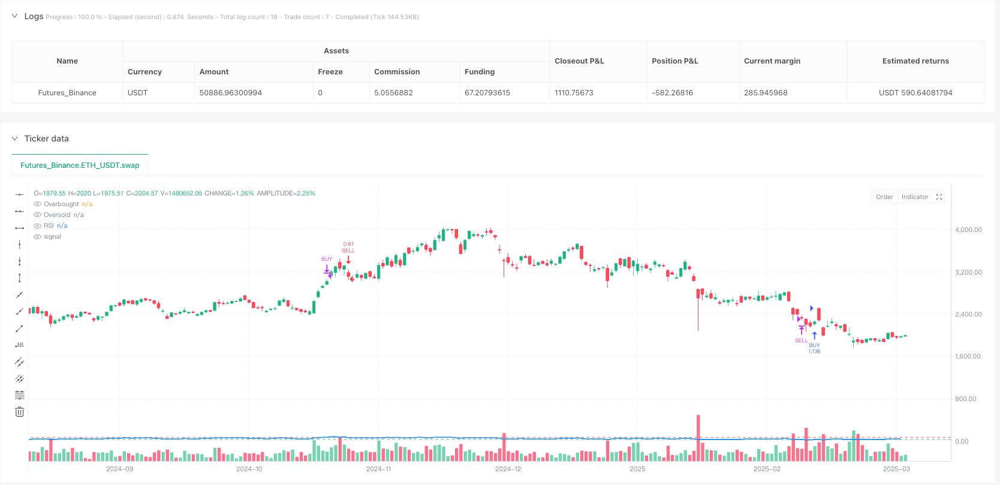
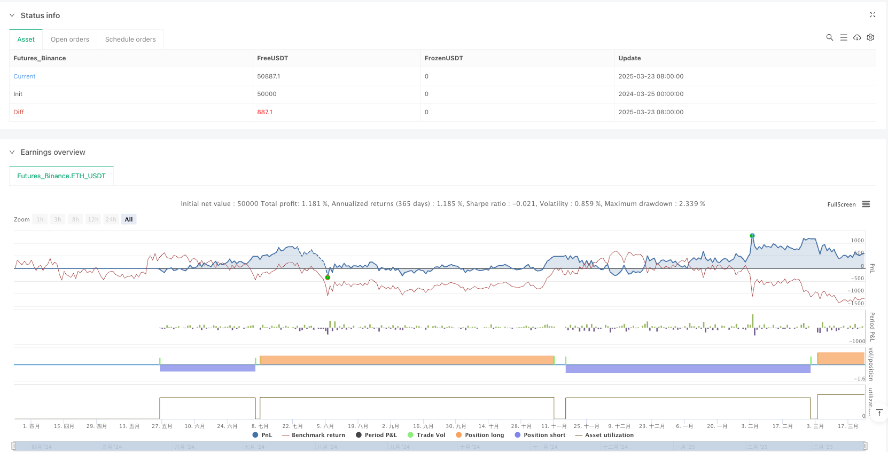

> Name

Relative Strength Index RSI Overbought Oversold Quantitative Trading Strategy-Relative-Strength-Index-RSI-Overbought-Oversold-Quantitative-Trading-Strategy
> Author

ianzeng123

> Strategy Description





[trans]

#### Overview
The Relative Strength Index (RSI) overbought and oversold quantitative trading strategy is an automated trading system based on the RSI indicator in technical analysis. The core idea of ​​this strategy is to identify overbought and oversold conditions in the market and execute trades when the RSI indicator crosses specific thresholds. Buy when the RSI crosses 30 (oversold area) from below, and sell when RSI crosses 70 (overbought area) from above. This strategy is designed for use on the MetaTrader platform and implements automatic trading functions through the Pine Connector. It is especially suitable for volatile cryptocurrency markets such as Bitcoin.
#### Strategy Principle
This strategy works based on the classic technical indicator RSI (Relative Strength Index). RSI is a momentum oscillator that measures the speed and magnitude of price changes. The value range of RSI is between 0 and 100, which is generally considered to be:
1. An RSI value below 30 indicates that the market is oversold and may be about to rebound.
2. An RSI value above 70 indicates that the market is overbought and may be about to fall back.
The trading logic of the strategy is as follows:
- Buy signal: when RSI crosses 30 from below 30 (ta.crossover(rsi, 30))
- Sell signal: when RSI crosses from above 70 to below 70 (ta.crossunder(rsi, 70))
- Long signal: when RSI crosses 70 (ta.crossover(rsi, 70))
- Flat signal: when RSI crosses below 30 (ta.crossunder(rsi, 30))
This strategy uses the standard 14-period RSI, calculated based on closing prices. The strategy is implemented on the TradingView platform and configured with a connection to MetaTrader, allowing users to implement automated trading by entering their license ID. Trading risk is controlled through fixed lot parameters.
#### Strategic Advantages
1. **Easy to understand**: The strategy is based on the widely used RSI indicator, with clear logic and easy to understand and implement.
2. **Counter-trend trading characteristics**: This strategy is essentially a counter-trend trading strategy. It looks for reversal opportunities when the market is overbought and oversold, helping to seize reversal points in volatile markets.
3. **Automated Execution**: Integrate with MetaTrader through Pine Connector to support fully automated trading, reducing human intervention and emotional factors.
4. **Visual support**: The strategy includes RSI chart drawing and visual markers of overbought and oversold lines, allowing traders to intuitively monitor market status.
5. **Flexible risk control**: Through adjustable lot parameters, users are allowed to adjust the position size according to their own risk tolerance.
6. **Alert function is improved**: Alert conditions are set for all trading signals (opening and closing positions) to ensure that traders will not miss important signals.
7. **Applicable to a variety of markets**: Although the code comments mention that it performed well in the BTC 1M cycle, in theory, this strategy can be applied to any liquid market.
#### Strategy Risk
1. **Shocking Market Risk**: In a sideways and volatile market, RSI may frequently cross overbought and oversold areas, leading to excessive trading and commission erosion.
2. **Trend market risk**: In a strong trending market, RSI may remain in the overbought or oversold area for a long time, resulting in premature closing of positions or missing a major trend.
3. **False breakthrough risk**: RSI may have a false breakthrough, that is, it briefly crosses the threshold and then immediately retraces, triggering unnecessary transactions.
4. **Parameter Sensitivity**: The default RSI parameters (14 periods, 30/70 threshold) may not be suitable for all markets and time periods and need to be optimized for specific situations.
5. **Lack of stop-loss mechanism**: The current strategy does not have a built-in stop-loss mechanism and may face large losses in extreme market conditions.
6. **Single indicator dependence**: Relying only on RSI as an indicator to make decisions, lacking multi-dimensional analysis, increases the possibility of false signals.
Solution:
- Introducing additional filters such as trend indicators or volume confirmations
- Add a stop-loss and stop-profit mechanism to control single transaction risk
- Optimize RSI parameters according to different markets and time periods
- Reduce the fund management ratio, it is recommended not to exceed 5% of the account funds
#### Strategy optimization direction
1. **Multi-indicator fusion**: Combine with other technical indicators such as moving averages, MACD or Bollinger Bands to build more comprehensive entry conditions and reduce false signals. For example, consider a long signal only when the price is above the long-term moving average.
2. **Dynamic Threshold Adjustment**: Change the fixed 30/70 threshold to a dynamic threshold and automatically adjust according to market volatility. A narrower threshold range (such as 40/60) can be used in low volatility markets and a wider range (such as 20/80) in high volatility markets.
3. **Time filter**: Add time filter conditions to avoid periods of low volatility or known major news release times to improve signal quality.
4. **Fund Management Optimization**: Replace the fixed lot size with a dynamic position size based on the account capital ratio, or a position calculation method based on ATR to better manage risks.
5. **Stop-loss and stop-profit mechanism**: Add a stop-loss and stop-profit mechanism based on price or percentage to avoid excessive losses in a single transaction or missing profit realization opportunities.
6. **Trend Filter**: Add trend identification function, receive RSI signals in the direction of the trend, and ignore or increase the signal threshold in the direction of the trend.
7. **Optimize RSI cycle**: Test different RSI calculation cycles for different trading varieties and time frames to find the best parameter combination.
The main purpose of these optimization directions is to improve signal quality, reduce false signals, and strengthen fund management and risk control so that the strategy can maintain stability in different market environments.
#### Summary
The Relative Strength Index (RSI) overbought and oversold quantitative trading strategy is an automated trading system based on classic technical analysis principles. The strategy uses the RSI indicator to identify possible reversal points in the market, looking for long opportunities in oversold areas and short opportunities in overbought areas. Although the strategy logic is simple and clear, its effectiveness depends largely on the market environment and parameter optimization.
This strategy is best used in markets that are more volatile but have a certain range, such as the cryptocurrency market. Investors should pay attention to the suitability of the market environment when using this strategy, and consider introducing additional filtering conditions and risk management mechanisms. Through reasonable optimization and expansion, this basic strategy can be developed into a more robust trading system.
As an entry-level technical analysis strategy, the RSI overbought and oversold strategy provides a good starting point for understanding and applying the basic principles of quantitative trading. However, investors should not rely too much on a single indicator or any automated strategy, but should incorporate broader market analysis and sound risk management principles to build a comprehensive trading approach. ||
#### Overview
The Relative Strength Index (RSI) Overbought Oversold Quantitative Trading Strategy is an automated trading system based on the RSI technical indicator. The core concept of this strategy is to identify overbought and oversold market conditions and execute trades when the RSI crosses specific threshold values. It generates buy signals when RSI crosses above 30 (oversold zone) and sell signals when RSI crosses below 70 (overbought zone). The strategy is designed for the MetaTrader platform with automatic execution through Pine Connector, particularly suitable for volatile markets like Bitcoin.

#### Strategy Principles
This strategy operates based on the RSI (Relative Strength Index), a classic technical indicator. RSI is a momentum oscillator that measures the speed and magnitude of price changes. RSI values range between 0 and 100, with conventional interpretations being:

1. RSI below 30 indicates an oversold market condition, suggesting a potential rebound
2. RSI above 70 indicates an overbought market condition, suggesting a potential decline

The trading logic is as follows:
- Buy signal: When RSI crosses above 30 (ta.crossover(rsi, 30))
- Sell signal: When RSI crosses below 70 (ta.crossunder(rsi, 70))
- Close long position: When RSI crosses above 70 (ta.crossover(rsi, 70))
- Close short position: When RSI crosses below 30 (ta.crossunder(rsi, 30))

The strategy uses the standard 14-period RSI calculated on closing prices. It is implemented on the TradingView platform with MetaTrader integration functionality, allowing users to enable automated trading by entering a license ID. Trade risk is controlled through a fixed lot size parameter.

#### Strategy Advantages
1. **Simplicity**: The strategy is based on the widely-used RSI indicator with clear logic that is easy to understand and implement.
2. **Mean Reversion Characteristics**: This is essentially a counter-trend strategy that seeks reversal opportunities during market extremes, helping capture turning points in volatile markets.
3. **Automated Execution**: Integration with MetaTrader through Pine Connector supports fully automated trading, reducing manual intervention and emotional factors.
4. **Visual Support**: The strategy includes RSI chart plotting and visual marking of overbought/oversold lines for intuitive market monitoring.
5. **Flexible Risk Control**: Through adjustable lot size parameters, users can modify position sizes according to their risk tolerance.
6. **Comprehensive Alert System**: Alert conditions are set for all trading signals (entries and exits), ensuring traders don't miss important signals.
7. **Multi-Market Application**: While the code comments mention good performance on BTC 1M timeframe, theoretically, the strategy can be applied to any liquid market.

#### Strategy Risks
1. **Ranging Market Risk**: In sideways, choppy markets, RSI may frequently cross overbought and oversold zones, leading to overtrading and commission erosion.
2. **Trending Market Risk**: In strong trend markets, RSI may remain in overbought or oversold territories for extended periods, causing premature exits or missed significant trends.
3. **False Breakout Risk**: RSI may exhibit false breakouts, briefly crossing thresholds before immediately reversing, triggering unnecessary trades.
4. **Parameter Sensitivity**: The default RSI parameters (14 periods, 30/70 thresholds) may not be suitable for all markets and timeframes, requiring optimization for specific situations.
5. **Lack of Stop-Loss Mechanism**: The current strategy has no built-in stop-loss mechanism, potentially facing significant losses in extreme market conditions.
6. **Single Indicator Dependency**: Relying solely on the RSI indicator for decision-making lacks multi-dimensional analysis, increasing the possibility of false signals.

Solutions:
- Introduce additional filtering conditions like trend indicators or volume confirmation
- Add stop-loss and take-profit mechanisms to control single trade risk
- Optimize RSI parameters for different markets and timeframes
- Reduce position sizing, recommended not to exceed 5% of account capital

#### Strategy Optimization Directions
1. **Multi-Indicator Integration**: Combine with other technical indicators such as moving averages, MACD, or Bollinger Bands to build more comprehensive entry conditions and reduce false signals. For example, only consider long signals when price is above a long-term moving average.

2. **Dynamic Threshold Adjustment**: Replace fixed 30/70 thresholds with dynamic thresholds that automatically adjust based on market volatility. Use narrower threshold ranges (like 40/60) in low-volatility markets and wider ranges (like 20/80) in high-volatility markets.

3. **Time Filters**: Add time filtering conditions to avoid low-volatility periods or known major news release times, improving signal quality.

4. **Money Management Optimization**: Replace fixed lot sizes with dynamic position sizing based on account equity percentage or ATR-based position calculation methods for better risk management.

5. **Stop-Loss and Take-Profit Mechanisms**: Add price-based or percentage-based stop-loss and take-profit mechanisms to avoid excessive losses on individual trades or missing profit-taking opportunities.

6. **Trend Filtering**: Add trend identification functionality to accept RSI signals in trend direction while ignoring or raising thresholds for counter-trend signals.

7. **RSI Period Optimization**: Test different RSI calculation periods for various trading instruments and timeframes to find optimal parameter combinations.

These optimization directions primarily aim to improve signal quality, reduce false signals, and strengthen money management and risk control, enabling the strategy to maintain stability across different market environments.

#### Summary
The Relative Strength Index (RSI) Overbought Oversold Quantitative Trading Strategy is an automated trading system based on classic technical analysis principles. The strategy uses the RSI indicator to identify potential market reversal points, seeking long opportunities in oversold areas and short opportunities in overbought areas. While the strategy logic is simple and clear, its effectiveness largely depends on market environment and parameter optimization.

This strategy is best suited for markets with significant volatility but within certain ranges, such as cryptocurrency markets. Investors using this strategy should pay attention to market environment compatibility and consider introducing additional filtering conditions and risk management mechanisms. Through reasonable optimization and extension, this basic strategy can be developed into a more robust trading system.

As an entry-level technical analysis strategy, the RSI Overbought Oversold Strategy provides a good starting point for understanding and applying the basic principles of quantitative trading. However, investors should not overly rely on a single indicator or any automated strategy, but rather combine it with broader market analysis and sound risk management principles to build a comprehensive trading approach.[/trans]


> Source (PineScript)

``` pinescript
/*backtest
start: 2024-03-25 00:00:00
end: 2025-03-24 00:00:00
period: 1d
basePeriod: 1d
exchanges: [{"eid":"Futures_Binance","currency":"ETH_USDT"}]
*/

// Risk Settings
pc_id = input.string(title='License ID', defval='', group='MT4/5 Settings', tooltip='This is your license ID')
pc_risk = input.float(title='Lots', defval=0.1, step=0.1, minval=0, group='MT4/5 Settings', tooltip='Lot Size')
pc_prefix = input.string(title='MetaTrader Symbol', defval='', group='MT4/5 Settings', tooltip='This is your broker\'s MetaTrader symbol')

// Symbol Information
var symbol = pc_prefix

// Alerts for MetaTrader Integration
longa = pc_id + ',buy,' + symbol + ',risk=' + str.tostring(pc_risk, '#.##')
shorta = pc_id + ',sell,' + symbol + ',risk=' + str.tostring(pc_risk, '#.##')
longa_close = pc_id + ',closelong,' + symbol + ''
shorta_close = pc_id + ',closeshort,' + symbol + ''
//@version=6
strategy("RSI Overbought/Oversold Strategy", overlay=true, default_qty_type=strategy.percent_of_equity, default_qty_value=5)

// ? RSI Settings
rsiLength = 14
rsiSource = close
rsi = ta.rsi(rsiSource, rsiLength)

// ? Entry Conditions
longEntry = ta.crossover(rsi, 30)   // Buy when RSI crosses above 30
shortEntry = ta.crossunder(rsi, 70) // Sell when RSI crosses below 70

// ? Exit Conditions
longExit = ta.crossover(rsi, 70)  // Close long when RSI hits 70
shortExit = ta.crossunder(rsi, 30) // Close short when RSI hits 30

// ✅ Execute Trades
if (longEntry)
    strategy.entry("BUY", strategy.long)
if (longExit)
    strategy.close("BUY")

if (shortEntry)
    strategy.entry("SELL", strategy.short)
if (shortExit)
    strategy.close("SELL")

// ? Visuals for Better Clarity
plot(rsi, title="RSI", color=color.blue, linewidth=2)
hline(70, "Overbought", color=color.red)
hline(30, "Oversold", color=color.green)

// ? Alerts for Entry/Exit
alertcondition(longEntry, title="BUY Signal", message="RSI crossed above 30 - Buy!")
alertcondition(longExit, title="SELL Exit", message="RSI reached 70 - Close Buy!")
alertcondition(shortEntry, title="SELL Signal", message="RSI crossed below 70 - Sell!")
alertcondition(shortExit, title="BUY Exit", message="RSI reached 30 - Close Sell!")
```

> Detail

https://www.fmz.com/strategy/488143

> Last Modified

2025-03-25 14:22:06
