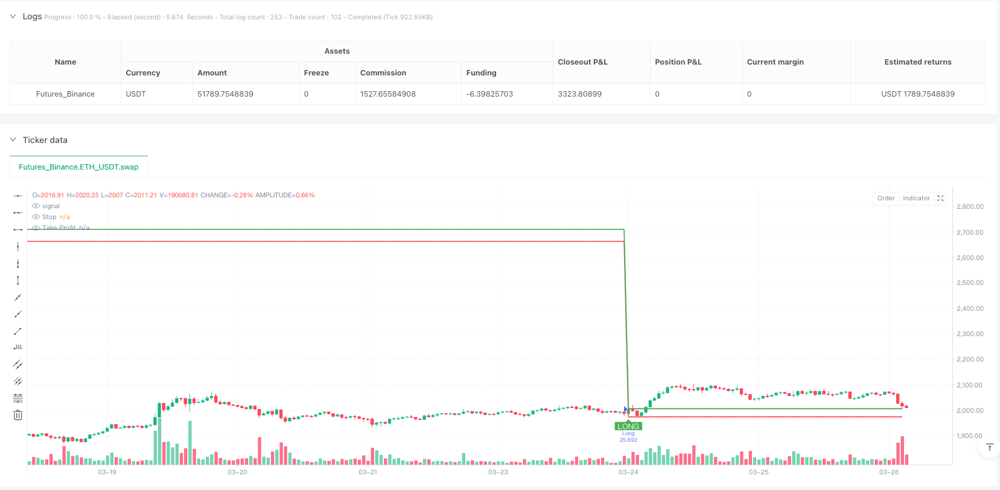
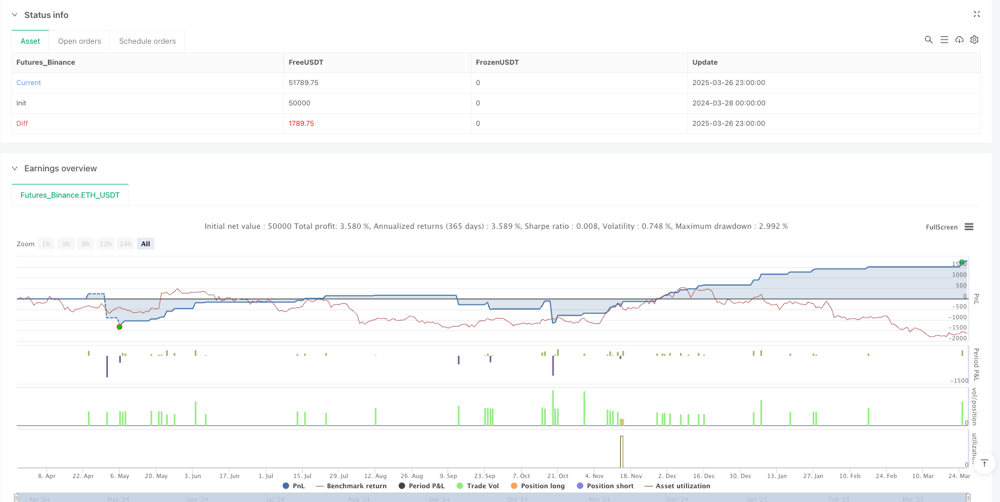

> Name

Multi-Timeframe-RSI-SMA-Dynamic-Crossover-Adaptive-Trading-System
> Author

ianzeng123

> Strategy Description





[trans]

## Overview
The multi-time period RSI-SMA dynamic cross adaptive trading system is an advanced quantitative trading strategy that combines the relative strength index (RSI) and simple moving average (SMA) cross signals. The unique feature of this strategy is that it can automatically adjust indicator parameters, risk levels and filtering conditions according to different time periods (from 1 minute to monthly line) to achieve full time period trading adaptability. Through an in-depth analysis of the Pine Script code, it can be seen that the strategy uses an intelligent parameter adjustment mechanism to automatically optimize the RSI cycle, SMA cycle, ATR multiple, take-profit percentage and trading volume requirements under different time frames, thereby maintaining consistent performance in short-term, mid-term and long-term transactions.
## Strategy Principle
The core principle of this strategy is based on the cross signal of the RSI and its SMA moving average, combined with multiple confirmation filters and a dynamic risk management system. The specific operating principle is as follows:
1. **Intelligent parameter adaptation**: The strategy detects the current chart time period through the `timeframe.period` function, and then uses the switch structure to allocate optimal parameters to each indicator. For example, the RSI period extends from 10 periods on the 1-minute chart to 28 periods on the monthly chart; the SMA period ranges from 20 to 200 periods; the ATR multiplier increases from 1.5 times to 4.5 times; the take-profit target increases from 3% to 10%.
2. **Dynamic indicator calculation**:
   - Adaptive RSI-SMA: Use the optimized period to calculate the RSI value and the SMA moving average of RSI
   - Intelligent trading volume filtering: adjust the trading volume requirements according to the time period. The 1-minute chart requires the trading volume to be 2 times the 20-period average, while the monthly chart only requires 0.5 times
   - Trend confirmation: Use the intersection of fast EMA and slow EMA to confirm the upward trend and ensure that you follow the trend
3. **Admission Conditions**:
   - RSI crosses above its SMA
   - Volume is greater than dynamic threshold
   - Confirmation of uptrend (fast EMA > slow EMA)
   - The closing price is greater than the opening price (bullish candle)
   - The closing price broke through the 5-period high
4. **Exit conditions**:
   - RSI crosses below its SMA
   - Price falls below 5-period low
5. **Risk Management**:
   - Dynamic stop loss: multiple setting based on ATR (from 1.5 times to 4.5 times), adapting to the fluctuation characteristics of different time periods
   - Dynamic take profit: Set a percentage target of 3% to 10% based on the entry point, and expand with the time period
## Strategic Advantages
Through in-depth analysis of the code structure, this strategy shows the following significant advantages:
1. **Full time cycle adaptability**: The most prominent advantage is that the strategy can work adaptively in all time frames from 1 minute to the monthly line, without manual intervention to adjust parameters. This solves the common problem of traditional strategies performing inconsistently on different time frames.
2. **Multiple filtering mechanism**: The strategy not only relies on RSI-SMA cross signals, but also combines multiple filtering conditions such as price breakthrough, trend confirmation, and trading volume verification, significantly reducing false signals.
3. **Dynamic Risk Management**: Stop loss and take profit levels will automatically adjust with the time period and market volatility. Higher time periods set looser stop losses and larger profit targets, which is in line with the law of volatility.
4. **Automatic visualization**: The code contains clear visual elements, including buy marks, stop loss lines and take profit lines, to help traders intuitively understand the trading logic.
5. **Low code complexity**: Although it is powerful, the code structure is clear, the partitions are clear, and the logic is concise, making it easy to maintain and further optimize.
## Strategy Risk
Although this strategy is well designed, it still has the following potential risks:
1. **Parameter optimization over-fitting risk**: Although the strategy sets optimization parameters for different time periods, these parameters may be optimized based on historical data, and there is a risk of over-fitting. The solution is to conduct backtest verification on multiple market cycles (bull market, bear market, shock market) and different varieties.
2. **Rapid trend reversal risk**: In highly volatile markets, prices may reverse quickly after triggering an entry signal, causing stop loss to be triggered. It is recommended to pause the strategy or add additional filtering conditions during periods of extreme market volatility (such as before and after the announcement of major financial events).
3. **Abnormal trading volume risk**: The strategy relies on trading volume as a filter condition, but under certain market conditions (such as liquidity drying up) abnormal trading volume fluctuations may occur, affecting signal quality. Consider adding relative volume indicators or volume convergence/divergence analysis to enhance the filtering effect.
4. **Fixed percentage take profit limit**: Using a fixed percentage take profit may exit a strong trend prematurely and miss out on greater profits. Consider implementing batch profits or dynamically adjusting the take-profit level based on trend strength.
5. **Time period switching confusion**: Switching the time period while the strategy is running may cause parameter mutations, affecting the risk management settings of the current position. It is recommended to close all positions before switching time periods.
## Strategy optimization direction
Based on code analysis, the strategy can be optimized from the following aspects:
1. **Add adaptive momentum indicators**: Introducing momentum indicators such as MACD or OBV in combination with the RSI-SMA system as additional confirmation, especially in long-term trading, can improve signal quality. The reason for optimization is that the momentum indicator can better capture the persistence and intensity of the trend.
2. **Market status classification mechanism**: Introducing an automatic classification mechanism for market status (range oscillation/trend) to automatically adjust strategy preferences based on volatility and directional parameters. This can reduce the trading frequency in range markets and increase the holding time in trending markets.
3. **Dynamic stop loss optimization**: The current stop loss is based on a fixed ATR multiple. You can consider dynamically adjusting the stop loss in combination with support levels, resistance levels or key price levels to improve the market relevance of the stop loss setting.
4. **Intraday time filter**: For short-period (1 minute to 1 hour) trading, add intraday time filtering to avoid the high volatility period 30 minutes before the opening and closing, or focus on specific efficient trading periods.
5. **Machine Learning Parameter Optimization**: Introducing a simple machine learning algorithm to dynamically optimize RSI and SMA cycles, automatically adjusting parameters based on recent market conditions instead of using preset fixed parameter mappings.
6. **Multi-indicator resonance system**: Expanded into a multi-indicator resonance system, combining price behavior, trading volume distribution and market structure analysis to improve signal reliability and anti-interference ability.
## Summarize
The multi-time period RSI-SMA dynamic cross adaptive trading system is an exquisitely designed quantitative trading strategy. Its biggest feature is that it can automatically adapt to any time period from 1 minute to the monthly line without manual adjustment of parameters. The strategy uses the intersection of RSI and its SMA moving average as the core signal, combined with multiple filtering conditions and dynamic risk management, to achieve full-time trading adaptability.
This strategy is particularly suitable for traders who need to flexibly switch between multiple time periods, as well as quantitative analysts who want to build a consistent trading system from short-term to long-term. Through intelligent parameter adjustment, dynamic indicator calculation and strict entry conditions, the strategy can maintain stable performance in different market environments.
Although there are risks such as parameter optimization overfitting and rapid trend reversal, the robustness and profitability of the strategy can be further improved through the optimization directions proposed in this article, such as adding adaptive momentum indicators, market state classification mechanisms, and machine learning parameter optimization. In practical applications, it is recommended to conduct sufficient backtesting on multiple market cycles and different varieties, combined with 0.1% transaction cost simulation, to verify the performance of the strategy in a real market environment. ||
## Overview

The Multi-Timeframe RSI-SMA Dynamic Crossover Adaptive Trading System is an advanced quantitative trading strategy that combines Relative Strength Index (RSI) and Simple Moving Average (SMA) crossover signals. What makes this strategy unique is its ability to automatically adjust indicator parameters, risk levels, and filtering conditions according to different timeframes (from 1-minute to monthly charts), achieving cross-timeframe trading adaptability. Through in-depth analysis of the Pine Script code, it's evident that the strategy employs an intelligent parameter adjustment mechanism that automatically optimizes RSI periods, SMA periods, ATR multipliers, take-profit percentages, and volume requirements across different timeframes, thereby maintaining consistent performance in short-term, medium-term, and long-term trading.

## Strategy Principle

The core principle of this strategy is based on the crossover signals between RSI and its SMA line, combined with multiple confirmation filters and a dynamic risk management system. The specific operating principles are as follows:

1. **Intelligent Parameter Adaptation**: The strategy detects the current chart timeframe using the `timeframe.period` function, then assigns optimal parameters for various indicators using a switch structure. For example, the RSI period expands from 10 periods on 1-minute charts to 28 periods on monthly charts; SMA periods range from 20 to 200; ATR multipliers increase from 1.5x to 4.5x; take-profit targets range from 3% to 10%.

2. **Dynamic Indicator Calculation**: 
   - Adaptive RSI-SMA: Calculates RSI values and RSI SMA lines using optimized periods
   - Smart Volume Filtering: Adjusts volume requirements based on timeframe, requiring 2x the 20-period average volume for 1-minute charts, but only 0.5x for monthly charts
   - Trend Confirmation: Uses crossovers between fast and slow EMAs to confirm uptrends, ensuring trades follow the trend

3. **Entry Conditions**: 
   - RSI crosses above its SMA line
   - Volume exceeds the dynamic threshold
   - Confirmed uptrend (Fast EMA > Slow EMA)
   - Closing price greater than opening price (bullish candle)
   - Closing price breaks above the 5-period high

4. **Exit Conditions**: 
   - RSI crosses below its SMA line
   - Price drops below the 5-period low

5. **Risk Management**: 
   - Dynamic Stop-Loss: Based on ATR multipliers (from 1.5x to 4.5x), adapting to the volatility characteristics of different timeframes
   - Dynamic Take-Profit: Sets percentage targets from 3% to 10% based on entry point, expanding with the timeframe

## Strategy Advantages

Through in-depth analysis of the code structure, this strategy demonstrates the following significant advantages:

1. **Full Timeframe Adaptability**: The most prominent advantage is the strategy's ability to work adaptively across all timeframes from 1-minute to monthly charts without manual intervention to adjust parameters. This solves the common problem of traditional strategies performing inconsistently across different timeframes.

2. **Multiple Filtering Mechanisms**: The strategy relies not only on RSI-SMA crossover signals but also combines price breakouts, trend confirmation, volume verification, and other multiple filtering conditions, significantly reducing false signals.

3. **Dynamic Risk Management**: Stop-loss and take-profit levels automatically adjust with timeframe and market volatility. Higher timeframes set wider stop-losses and larger profit targets, which aligns with volatility patterns.

4. **Automatic Visualization**: The code includes clear visualization elements, including buy markers, stop-loss lines, and take-profit lines, helping traders intuitively understand the trading logic.

5. **Low Code Complexity**: Despite being powerful, the code structure is clear, well-organized, and logically concise, making it easy to maintain and further optimize.

## Strategy Risks

Despite its sophisticated design, the strategy still has the following potential risks:

1. **Parameter Optimization Overfitting Risk**: Although the strategy sets optimized parameters for different timeframes, these parameters may be derived from historical data optimization, presenting an overfitting risk. The solution is to backtest and validate across multiple market cycles (bull, bear, ranging markets) and different instruments.

2. **Rapid Trend Reversal Risk**: In highly volatile markets, prices may quickly reverse after triggering an entry signal, causing stop-losses to be hit. It's advisable to pause the strategy during extreme market volatility periods (such as before and after major economic announcements) or add additional filtering conditions.

3. **Volume Anomaly Risk**: The strategy relies on volume as a filtering condition, but under certain market conditions (such as liquidity droughts), abnormal volume fluctuations may occur, affecting signal quality. Consider adding relative volume indicators or volume accumulation/distribution analysis to enhance filtering effectiveness.

4. **Fixed Percentage Take-Profit Limitations**: Using fixed percentage take-profits may exit strong trends too early, missing out on larger profits. Consider implementing scaled profit-taking or dynamically adjusting take-profit levels based on trend strength.

5. **Timeframe Switching Confusion**: Switching timeframes during strategy operation may cause parameter mutations, affecting risk management settings for current positions. It's recommended to close all positions before switching timeframes.

## Strategy Optimization Directions

Based on code analysis, the strategy can be optimized in the following aspects:

1. **Add Adaptive Momentum Indicators**: Incorporate momentum indicators like MACD or OBV as additional confirmation alongside the RSI-SMA system, especially in long-term trading, to improve signal quality. The rationale for this optimization is that momentum indicators better capture trend continuity and strength.

2. **Market State Classification Mechanism**: Introduce an automatic classification mechanism for market states (range-bound/trending), automatically adjusting strategy preferences based on volatility and directional parameters. This can reduce trading frequency in range-bound markets and increase holding time in trending markets.

3. **Dynamic Stop-Loss Optimization**: Current stop-losses are based on fixed ATR multipliers. Consider dynamically adjusting stop-losses by incorporating support levels, resistance levels, or key price levels to increase the market relevance of stop-loss settings.

4. **Intraday Time Filtering**: For short timeframes (1-minute to 1-hour), add intraday time filtering to avoid high volatility periods 30 minutes before market open and close, or focus on specific high-efficiency trading sessions.

5. **Machine Learning Parameter Optimization**: Introduce simple machine learning algorithms to dynamically optimize RSI and SMA periods, automatically adjusting parameters based on recent market conditions, rather than using preset fixed parameter mappings.

6. **Multi-Indicator Resonance System**: Expand to a multi-indicator resonance system, combining price action, volume distribution, and market structure analysis to improve signal reliability and anti-interference capabilities.

## Summary

The Multi-Timeframe RSI-SMA Dynamic Crossover Adaptive Trading System is an intricately designed quantitative trading strategy. Its most significant feature is the ability to automatically adapt to any timeframe from 1-minute to monthly charts without manual parameter adjustments. The strategy uses RSI crossing above its SMA line as the core signal, combined with multiple filtering conditions and dynamic risk management, achieving cross-timeframe trading adaptability.

This strategy is particularly suitable for traders who need to flexibly switch between multiple timeframes, as well as quantitative analysts who want to build consistent trading systems from short-term to long-term. Through intelligent parameter adjustment, dynamic indicator calculation, and strict entry conditions, the strategy can maintain stable performance across different market environments.

Although risks such as parameter optimization overfitting and rapid trend reversals exist, through the optimization directions proposed in this article, such as adding adaptive momentum indicators, market state classification mechanisms, and machine learning parameter optimization, the strategy's robustness and profitability can be further enhanced. In practical application, it is recommended to conduct thorough backtesting across multiple market cycles and different instruments, combined with 0.1% transaction cost simulation, to verify the strategy's performance in real market environments.[/trans]


> Source (PineScript)

``` pinescript
/*backtest
start: 2024-03-28 00:00:00
end: 2025-03-27 00:00:00
period: 1h
basePeriod: 1h
exchanges: [{"eid":"Futures_Binance","currency":"ETH_USDT"}]
*/

//@version=5
strategy("Multi-Timeframe RSI-SMA Strategy [EB]", overlay=true, precision=2, initial_capital=10000, default_qty_type=strategy.percent_of_equity, default_qty_value=100)

//▄▄▄▄▄▄▄▄▄▄▄▄▄▄▄▄▄▄▄▄▄▄▄▄▄▄▄▄▄▄▄▄▄▄▄▄▄▄▄▄▄
//             SMART PARAMETER ADJUSTMENT
//▀▀▀▀▀▀▀▀▀▀▀▀▀▀▀▀▀▀▀▀▀▀▀▀▀▀▀▀▀▀▀▀▀▀▀▀▀▀▀▀▀

// Zaman Dilimi Tespiti
currentTF = timeframe.period

// Parametreler için ayrı switch yapıları
rsiPeriod = switch currentTF
    "1"  => 10
    "5"  => 12
    "15" => 14
    "30" => 16
    "60" => 18
    "240" => 20
    "D"  => 22
    "W"  => 24
    "M"  => 28
    => 14

smaPeriod = switch currentTF
    "1"  => 20
    "5"  => 25
    "15" => 30
    "30" => 40
    "60" => 50
    "240" => 60
    "D"  => 100
    "W"  => 150
    "M"  => 200
    => 50

atrMult = switch currentTF
    "1"  => 1.5
    "5"  => 1.8
    "15" => 2.0
    "30" => 2.2
    "60" => 2.5
    "240" => 3.0
    "D"  => 3.5
    "W"  => 4.0
    "M"  => 4.5
    => 2.0

tpPerc = switch currentTF
    "1"  => 3.0
    "5"  => 3.5
    "15" => 4.0
    "30" => 4.5
    "60" => 5.0
    "240" => 6.0
    "D"  => 7.0
    "W"  => 8.0
    "M"  => 10.0
    => 4.0

volMultiplier = switch currentTF
    "1"  => 2.0
    "5"  => 1.8
    "15" => 1.5
    "30" => 1.3
    "60" => 1.2
    "240" => 1.0
    "D"  => 0.8
    "W"  => 0.6
    "M"  => 0.5
    => 1.0

//▄▄▄▄▄▄▄▄▄▄▄▄▄▄▄▄▄▄▄▄▄▄▄▄▄▄▄▄▄▄▄▄▄▄▄▄▄▄▄▄▄
//             DYNAMIC INDICATORS
//▀▀▀▀▀▀▀▀▀▀▀▀▀▀▀▀▀▀▀▀▀▀▀▀▀▀▀▀▀▀▀▀▀▀▀▀▀▀▀▀▀

// Akıllı Hacim Filtresi
avgVol = ta.sma(volume, 20)
minVol = avgVol * volMultiplier

// Adaptif RSI-SMA
rsi = ta.rsi(close, rsiPeriod)
rsiSMA = ta.sma(rsi, smaPeriod)

// Volatilite Analizi
atr = ta.atr(14)
dynamicATR = atr * atrMult

// Trend Filtresi
emaFast = ta.ema(close, int(smaPeriod * 0.7))
emaSlow = ta.ema(close, smaPeriod * 2)
trendUp = emaFast > emaSlow

//▄▄▄▄▄▄▄▄▄▄▄▄▄▄▄▄▄▄▄▄▄▄▄▄▄▄▄▄▄▄▄▄▄▄▄▄▄▄▄▄▄
//             TRADE LOGIC
//▀▀▀▀▀▀▀▀▀▀▀▀▀▀▀▀▀▀▀▀▀▀▀▀▀▀▀▀▀▀▀▀▀▀▀▀▀▀▀▀▀

entryCondition = 
  ta.crossover(rsi, rsiSMA) and
  volume > minVol and
  trendUp and
  close > open and
  close > ta.highest(high, 5)[1]

exitCondition = 
  ta.crossunder(rsi, rsiSMA) or 
  close < ta.lowest(low, 5)[1]

//▄▄▄▄▄▄▄▄▄▄▄▄▄▄▄▄▄▄▄▄▄▄▄▄▄▄▄▄▄▄▄▄▄▄▄▄▄▄▄▄▄
//             RISK MANAGEMENT
//▀▀▀▀▀▀▀▀▀▀▀▀▀▀▀▀▀▀▀▀▀▀▀▀▀▀▀▀▀▀▀▀▀▀▀▀▀▀▀▀▀

var float entryPrice = na
var float stopLoss = na
var float takeProfit = na

if entryCondition
    entryPrice := close
    stopLoss := close - dynamicATR
    takeProfit := close + (dynamicATR * (tpPerc / 100))
    strategy.entry("Long", strategy.long)
    strategy.exit("Exit", "Long", stop=stopLoss, limit=takeProfit)

if exitCondition
    strategy.close("Long")

//▄▄▄▄▄▄▄▄▄▄▄▄▄▄▄▄▄▄▄▄▄▄▄▄▄▄▄▄▄▄▄▄▄▄▄▄▄▄▄▄▄
//             VISUALIZATION
//▀▀▀▀▀▀▀▀▀▀▀▀▀▀▀▀▀▀▀▀▀▀▀▀▀▀▀▀▀▀▀▀▀▀▀▀▀▀▀▀▀

plotshape(entryCondition, "Buy", shape.labelup, location.belowbar, color.green, 0, "LONG", textcolor=color.white)
plot(stopLoss, "Stop", color.red, 2, plot.style_linebr)
plot(takeProfit, "Take Profit", color.green, 2, plot.style_linebr)
```

> Detail

https://www.fmz.com/strategy/488502

> Last Modified

2025-03-28 11:36:12
