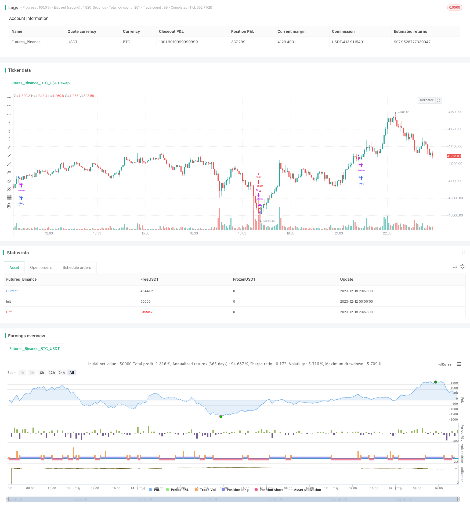

> Name

Sudden buying and selling strategy SMA-RSI-Sudden-Buy-Sell-Strategy based on RSI-SMA
> Author

ChaoZhang

> Strategy Description



 [trans]

## Overview
This strategy mainly uses the average value of RSI and sudden price changes to identify market trends and reversal points. The core idea is to consider opening a position when RSI is overbought and oversold, and to look for reversal opportunities when sudden price changes occur. At the same time, EMA is used to filter signals.
## Strategy Principle
1. Calculate the average SMA of the RSI. When the RSI SMA line crosses 60 or falls below 40, it is considered overbought and oversold, and you should consider opening a position in the opposite direction.
2. When the change of RSI exceeds a certain value, it is considered that a sudden change has occurred. After verification with the actual closing price, it is used as a signal to establish a reverse position.
3. Use EMA multi-level filtering. Only when the price crosses the shorter period EMA, the establishment of a long position will be considered; only when the price falls below the shorter period EMA, the establishment of a short position will be considered.
4. Find a better position to open a position by combining the average value of RSI, sudden changes and EMA filtering.
## Advantage Analysis
1. Using the average value of RSI can more accurately determine overbought and oversold phenomena, which is helpful to seize reversal opportunities.
2. Sudden changes often herald changes in price trends and directions. Using this signal can improve the timeliness of entry.
3. EMA's multi-level filtering can further avoid false signals, thereby reducing unnecessary losses.
4. Combining multiple parameters as judgment criteria can improve the stability and reliability of the strategy.
## Risks and Countermeasures
1. RSI performance is unstable and SMA value hit rate is not high. The parameters of RSI can be optimized appropriately or replaced with other indicators.
2. Sudden changes may be short-term shocks, not real reversals. The length of the sensing cycle can be increased to improve the accuracy of judgment.
3. There is hysteresis in EMA direction filtering. Shorter period EMAs can be tested to improve sensitivity.
4. Overall, this strategy is sensitive to parameter adjustment and requires careful testing to find the optimal parameter combination. At the same time, cooperate with stop loss to control risks.
## Optimization suggestions
1. Test ADX, MACD and other indicators in combination with RSI to find better entry points.
2. Add machine learning algorithms to determine the authenticity and stability of sudden buying and selling signals through model training.
3. Further enhance the effect of EMA direction filtering, such as improving the comprehensive judgment of EMA of different periods.
4. Add an adaptive stop loss strategy, which can dynamically adjust the stop loss range according to the degree of market fluctuations.
5. Continue to optimize parameters and find the best parameter combination. Optimizing evaluation criteria can consider Sharpe ratio, etc.

## Summarize
This strategy first uses the average of the RSI to determine overbought and oversold conditions. Then take a reverse position on a sudden move. Also use EMA for secondary filtering. Through reasonable parameter settings, the turning point of the market trend can be effectively judged. Overall, this strategy has good stability and has certain practical value. There is still room for further improvement in the future, which requires continuous testing and optimization.
||


## Overview

This strategy mainly uses the average value of RSI and sudden price changes to identify market trend and reversal points. The core idea is to consider establishing positions when RSI is overbought or oversold, and look for reversal opportunities when sudden price changes occur. EMA is also used as a filter.

## Principles 

1. Calculate the SMA of RSI. When RSI SMA crosses above 60 or falls below 40, it is considered overbought or oversold, and reverse positions will be considered.

2. When the change of RSI exceeds a certain value, it is regarded as a sudden change. Combined with the actual close price verification, it serves as a signal to establish reverse position.

3. Use multiple EMAs for filtering. Only when price crosses above shorter period EMA, long position will be considered. Only when price falls below shorter period EMA, short position will be considered. 

4. By combining the use of RSI average, sudden changes and EMA filtering, better entry points can be identified.

## Advantage Analysis  

1. Using RSI average can accurately judge overbought and oversold conditions, which is conducive to capturing reversal opportunities.

2. Sudden changes often signify shifts in price trend and direction, using this signal can improve the timeliness of entries.

3. Multi-level EMA filtering can further avoid false signals and reduce unnecessary losses.

4. The combination of multiple parameters as decision criteria can enhance the stability and reliability of the strategy. 

## Risks and Mitigations

1. RSI performance may be unstable and SMA hit rate may be low. RSI parameters can be optimized or other indicators can replace it.

2. Sudden changes could just be short-term fluctuations rather than true reversals. Increase sensing cycle length to improve judgment accuracy.

3. There is lag in EMA direction filtering. Test shorter period EMAs to improve sensitivity.

4. In general, this strategy is quite sensitive to parameter tuning. Careful tests are needed to find optimum parameter combinations. Use stop loss to control risks.

## Optimization Suggestions  

1. Test other indicators like ADX, MACD combined with RSI to find better entry points.  

2. Increase machine learning algorithms to judge the authenticity and stability of sudden buy/sell signals.

3. Further enhance EMA direction filtering such as using composite judgment of different period EMAs.  

4. Add adaptive stop loss strategy to dynamically adjust stop loss range based on market volatility.

5. Continue parameter optimization to find optimum parameter combinations. Evaluation criteria could be Sharpe Ratio etc.


## Conclusion  

This strategy firstly uses RSI average to determine overbought/oversold conditions. Reverse positions are then established when sudden changes occur. EMA is also used as an auxiliary filter. With proper parameter settings, this strategy can effectively determine market trend shifts. Overall speaking, it has good stability and practical value. There is still room for further improvement, requiring persistent testing and optimization.

[/trans]

> Strategy Arguments


|Argument|Default|Description|
|----|----|----|
|v_input_1|14|length|
|v_input_2|10|inst_length|
|v_input_3|10|bars|
|v_input_int_1|20|lookbackno2|
|v_input_int_2|20|input_ema20|
|v_input_int_3|50|input_ema50|
|v_input_int_4|100|input_ema100|
|v_input_int_5|200|input_ema200|
|v_input_int_6|400|input_ema400|
|v_input_int_7|800|input_ema800|
|v_input_4|40|over40|
|v_input_5|60|over60|


> Source (PineScript)

``` pinescript
/*backtest
start: 2023-12-12 00:00:00
end: 2023-12-19 00:00:00
period: 3m
basePeriod: 1m
exchanges: [{"eid":"Futures_Binance","currency":"BTC_USDT"}]
*/

// This source code is subject to the terms of the Mozilla Public License 2.0 at https://mozilla.org/MPL/2.0/
// © samwillington

//@version=5


strategy("sma RSI & sudden buy and sell Strategy v1", overlay=true)
price = close
length = input( 14 )
inst_length = input( 10 )
var rbc = 0
var float rsiBP = 0.0
var rsc = 0
var float rsiSP = 0.0
bars = input(10)

lookbackno2 = input.int(20)
rsi_buy = 0
rsi_sell = 0


//EMA inputs

input_ema20 = input.int(20)
ema20 = ta.ema(price, input_ema20)
input_ema50 = input.int(50)
ema50 = ta.ema(price, input_ema50)
input_ema100 = input.int(100)
ema100 = ta.ema(price, input_ema100)
input_ema200 = input.int(200)
ema200 = ta.ema(price, input_ema200)
input_ema400 = input.int(400)
ema400 = ta.ema(price, input_ema400)
input_ema800 = input.int(800)
ema800 = ta.ema(price, input_ema800)


vrsi = ta.rsi(price, length)


hi2 = ta.highest(price, lookbackno2)
lo2 = ta.lowest(price, lookbackno2)

buy_diff_rsi = vrsi - ta.rsi(close[1], length)
sell_diff_rsi = ta.rsi(close[1],length) - vrsi


//RSI high low

var int sudS = 0
var int sudB = 0
var float sudSO = 0.0
var float sudSC = 0.0
var float sudBO = 0.0
var float sudBC = 0.0
var sudBuy = 0
var sudSell = 0 
var countB = 0
var countS = 0


var co_800 = false
var co_400 = false
var co_200 = false
var co_100 = false
var co_50 = false
var co_20 = false

co_800 := ta.crossover(price , ema800)
co_400 := ta.crossover(price , ema400)
co_200 := ta.crossover(price , ema200)
co_100 := ta.crossover(price , ema100)
co_50 := ta.crossover(price , ema50)
co_20 := ta.crossover(price , ema20)

if(ta.crossunder(price , ema20))
    co_20 := false
if(ta.crossunder(price , ema50))
    co_50 := false
if(ta.crossunder(price , ema100))
    co_100 := false
if(ta.crossunder(price , ema200))
    co_200 := false
if(ta.crossunder(price , ema400))
    co_400 := false
if(ta.crossunder(price , ema800))
    co_800 := false
    
if((price> ema800) and (price > ema400))
    if(co_20)
        if(co_50)
            if(co_100)
                if(co_200)
                    strategy.close("Sell")
                    strategy.entry("Buy", strategy.long, comment="spl Buy")
                    co_20 := false
                    co_50 := false
                    co_100 := false
                    co_200 := false


// too much rsi

if(vrsi > 90)
    strategy.close("Buy")
    strategy.entry("Sell", strategy.short, comment="RSI too overbuy")
if(vrsi < 10)
    strategy.close("Sell")
    strategy.entry("Buy", strategy.long, comment="RSI too oversold")


var sudbcount = 0  // counting no. of bars till sudden rise
var sudscount = 0  // counting no. of bars till sudden decrease


if(sudB == 1)
    sudbcount := sudbcount + 1
if(sudS == 1)
    sudscount := sudscount + 1


if((buy_diff_rsi > inst_length) and (hi2 > price))
    sudB := 1
    sudBO := open
    sudBC := close
if((sell_diff_rsi > inst_length) )
    sudS := 1
    sudSO := open
    sudSC := close   

if(sudbcount == bars)
    if(sudBC < price)
        strategy.close("Sell")
        strategy.entry("Buy", strategy.long, comment="sudd buy")
        sudbcount := 0
        sudB := 0
    sudbcount := 0
    sudB := 0
if(sudscount == bars) 
    if(sudSC > price)
        strategy.close("Buy")
        strategy.entry("Sell", strategy.short, comment="sudd sell")
        sudscount := 0
        sudS := 0
    sudscount := 0
    sudS := 0


over40 = input( 40 )
over60 = input( 60 )
sma =ta.sma(vrsi, length)
coo = ta.crossover(sma, over60)
cuu = ta.crossunder(sma, over40)

if (coo)
    strategy.close("Sell")
	strategy.entry("Buy", strategy.long, comment="modified buy")
if (cuu)
    strategy.close("Buy")
	strategy.entry("Sell", strategy.short, comment="modefied sell")
//plot(strategy.equity, title="equity", color=color.red, linewidth=2, style=plot.style_areabr)
```

> Detail

https://www.fmz.com/strategy/436008

> Last Modified

2023-12-20 17:33:04
