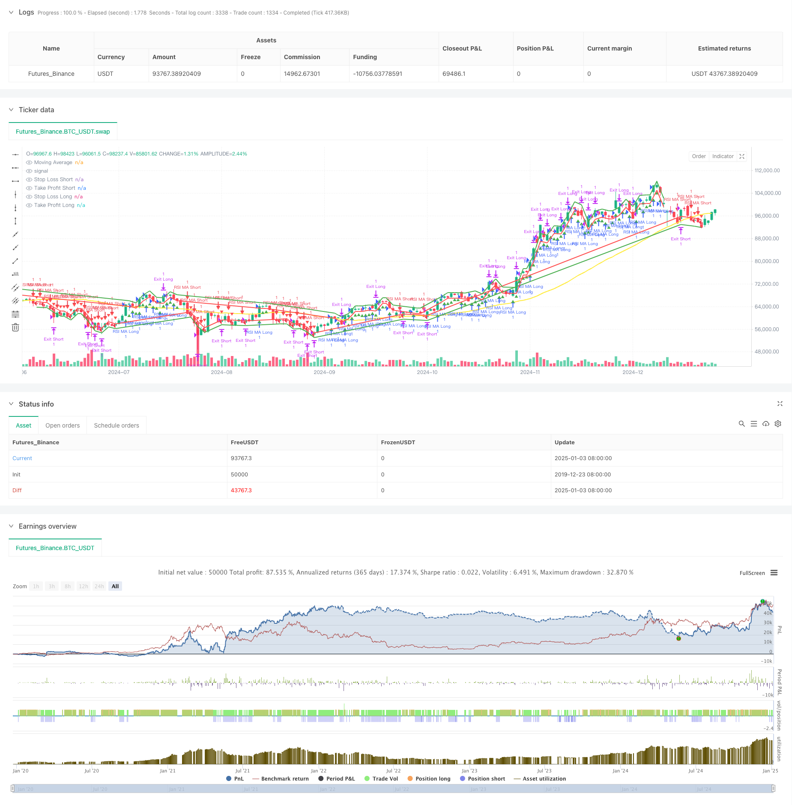

> Name

Trend-Following-RSI-and-Moving-Average-Combined-Quantitative-Trading-Strategy
> Author

ChaoZhang

> Strategy Description



[trans]
#### Overview
This strategy is a trend following trading system that combines the Relative Strength Index (RSI) and the Simple Moving Average (SMA). This strategy uses the moving average to determine the direction of the market trend, while using the RSI indicator to confirm momentum, so as to trade when the trend and momentum resonate. The strategy is designed with a complete stop-profit and stop-loss mechanism, which can effectively control risks.
#### Strategy Principle
The core logic of the strategy is based on the combined use of two technical indicators:
1. Moving average (MA): used to determine the overall trend. When the price is above the MA, it is determined to be an upward trend, and vice versa.
2. Relative Strength Index (RSI): Used to confirm price momentum. Upward momentum is confirmed when the RSI is above a set threshold (such as 55), and downward momentum is confirmed when it is below the threshold (such as 45).
Trading signal generation logic:
- Long conditions: the price is above the MA and the RSI is greater than the buying threshold
- Short selling conditions: the price is below the MA and the RSI is less than the sell threshold
Risk control adopts percentage stop loss and take profit methods, which are respectively set as a fixed percentage of the entry price.
#### Strategic Advantages
1. Signal stability: By combining the dual confirmation of trend and momentum, false signals are effectively reduced.
2. Perfect risk management: A fixed percentage of stop loss and take profit is set to effectively control the risk of each transaction.
3. Parameter flexibility: Key parameters such as MA cycle, RSI threshold, etc. can be optimized according to different market characteristics.
4. The strategy logic is clear: the trading rules are simple and intuitive, easy to understand and execute.
5. Strong adaptability: can be applied to transactions in various time periods.
#### Strategy Risk
1. Trend turning risk: Continuous stop losses may occur at trend turning points.
2. Volatile market risk: Frequent trading may result in losses under range-bound market fluctuations.
3. Parameter dependence: There may be large differences in optimal parameters under different market environments.
4. Slippage risk: You may face greater slippage when the market fluctuates violently.
5. Hysteresis of technical indicators: Both MA and RSI have a certain degree of lag, which may lead to delayed entry opportunities.
#### Strategy optimization direction
1. Dynamic parameter optimization: Introduce an adaptive parameter mechanism to dynamically adjust the MA cycle and RSI threshold according to market volatility.
2. Market environment filtering: Add a volatility filtering mechanism to adjust positions or suspend trading in high volatility environments.
3. Multi-time period analysis: Introducing longer-period trend confirmation to improve the accuracy of trading directions.
4. Stop loss optimization: Introduce a trailing stop loss mechanism to better protect profits.
5. Signal filtering: Add auxiliary indicators such as trading volume to improve signal reliability.
#### Summary
This strategy combines trend and momentum indicators to build a trading system with clear logic and controllable risk. Although there are some inherent risks, through reasonable parameter settings and risk control, the strategy shows good practicality. The subsequent optimization direction mainly focuses on dynamic parameter adjustment, market environment identification and signal quality improvement, which is expected to further improve the stability and profitability of the strategy. ||
#### Overview
This strategy is a trend following trading system that combines the Relative Strength Index (RSI) and Simple Moving Average (SMA). It identifies market trend direction using moving averages while confirming momentum with RSI, executing trades when trend and momentum align. The strategy includes comprehensive stop-loss and take-profit mechanisms for effective risk control.

#### Strategy Principle
The core logic is based on the combination of two technical indicators:
1. Moving Average (MA): Used to determine overall trend. A bullish trend is identified when price is above MA, bearish when below.
2. Relative Strength Index (RSI): Used to confirm price momentum. Upward momentum is confirmed when RSI exceeds a threshold (e.g., 55), downward momentum when below threshold (e.g., 45).

Trading signal generation logic:
- Long conditions: Price above MA and RSI above buy threshold
- Short conditions: Price below MA and RSI below sell threshold

Risk control employs percentage-based stop-loss and take-profit levels, set as fixed percentages of entry price.

#### Strategy Advantages
1. Signal stability: Reduces false signals through dual confirmation of trend and momentum
2. Comprehensive risk management: Fixed percentage stop-loss and take-profit effectively control risk per trade
3. Parameter flexibility: Key parameters like MA period and RSI thresholds can be optimized for different market characteristics
4. Clear strategy logic: Trading rules are simple and intuitive to understand and execute
5. High adaptability: Applicable to various trading timeframes

#### Strategy Risks
1. Trend reversal risk: Consecutive stops may occur at trend turning points
2. Range-bound market risk: Frequent trading losses possible in sideways markets
3. Parameter dependency: Optimal parameters may vary significantly across market environments
4. Slippage risk: Significant slippage possible during high volatility
5. Technical indicator lag: MA and RSI have inherent lag, potentially delaying entry timing

#### Strategy Optimization Directions
1. Dynamic parameter optimization: Introduce adaptive parameter mechanisms adjusting MA period and RSI thresholds based on market volatility
2. Market environment filtering: Add volatility filtering mechanism to adjust position sizing or pause trading in high volatility
3. Multiple timeframe analysis: Incorporate longer timeframe trend confirmation to improve directional accuracy
4. Stop-loss optimization: Implement trailing stops for better profit protection
5. Signal filtering: Add volume and other auxiliary indicators to improve signal reliability

#### Summary
This strategy constructs a logically clear and risk-controlled trading system by combining trend and momentum indicators. While inherent risks exist, the strategy demonstrates good practicality through appropriate parameter settings and risk control. Future optimization focuses on dynamic parameter adjustment, market environment recognition, and signal quality improvement, potentially enhancing strategy stability and profitability.[/trans]


> Source (PineScript)

``` pinescript
/*backtest
start: 2019-12-23 08:00:00
end: 2025-01-04 08:00:00
period: 1d
basePeriod: 1d
exchanges: [{"eid":"Futures_Binance","currency":"BTC_USDT"}]
*/

// This Pine Script™ code is subject to the terms of the Mozilla Public License 2.0 at https://mozilla.org/MPL/2.0/
// © raiford87

//@version=6
strategy("RSI + MA Trend Strategy (v6)",
     shorttitle="RSI_MA_Trend_v6",
     overlay=true,
     initial_capital=50000,
     default_qty_type=strategy.fixed,
     default_qty_value=1)

// ─────────────────────────────────────────────────────────────────────────────────────
// 1. USER INPUTS
// ─────────────────────────────────────────────────────────────────────────────────────
maLength       = input.int(50,   "Moving Average Length")
rsiLength      = input.int(14,   "RSI Length")
rsiBuyLevel    = input.int(55,   "RSI > X for Buy",  minval=1, maxval=99)
rsiSellLevel   = input.int(45,   "RSI < X for Sell", minval=1, maxval=99)

stopLossPerc   = input.float(1.0,  "Stop Loss %",    minval=0.1)
takeProfitPerc = input.float(2.0,  "Take Profit %",  minval=0.1)

// ─────────────────────────────────────────────────────────────────────────────────────
// 2. INDICATOR CALCULATIONS
// ─────────────────────────────────────────────────────────────────────────────────────
maValue = ta.sma(close, maLength)
rsiVal  = ta.rsi(close, rsiLength)

// Trend conditions
bullTrend = close > maValue
bearTrend = close < maValue

// RSI conditions
rsiBull   = rsiVal > rsiBuyLevel
rsiBear   = rsiVal < rsiSellLevel

// ─────────────────────────────────────────────────────────────────────────────────────
// 3. ENTRY CONDITIONS
// ─────────────────────────────────────────────────────────────────────────────────────
longCondition  = bullTrend and rsiBull
shortCondition = bearTrend and rsiBear

if longCondition
    strategy.entry("RSI MA Long", strategy.long)
if shortCondition
    strategy.entry("RSI MA Short", strategy.short)

// ─────────────────────────────────────────────────────────────────────────────────────
// 4. STOP LOSS & TAKE PROFIT
// ─────────────────────────────────────────────────────────────────────────────────────
stopLossLevel   = stopLossPerc   * 0.01
takeProfitLevel = takeProfitPerc * 0.01

if strategy.position_size > 0
    stopPriceLong = strategy.position_avg_price * (1 - stopLossLevel)
    tpPriceLong   = strategy.position_avg_price * (1 + takeProfitLevel)
    strategy.exit("Exit Long", from_entry="RSI MA Long", stop=stopPriceLong, limit=tpPriceLong)

if strategy.position_size < 0
    stopPriceShort = strategy.position_avg_price * (1 + stopLossLevel)
    tpPriceShort   = strategy.position_avg_price * (1 - takeProfitLevel)
    strategy.exit("Exit Short", from_entry="RSI MA Short", stop=stopPriceShort, limit=tpPriceShort)

// ─────────────────────────────────────────────────────────────────────────────────────
// 5. PLOT SIGNALS & LEVELS
// ─────────────────────────────────────────────────────────────────────────────────────
plot(maValue, color=color.yellow, linewidth=2, title="Moving Average")

plotchar(longCondition,  title="Long Signal",  char='▲', location=location.belowbar, color=color.green, size=size.tiny)
plotchar(shortCondition, title="Short Signal", char='▼', location=location.abovebar, color=color.red,   size=size.tiny)

// Plot Stop & TP lines
posIsLong  = strategy.position_size > 0
posIsShort = strategy.position_size < 0

plotStopLong = posIsLong ? strategy.position_avg_price * (1 - stopLossLevel) : na
plotTpLong   = posIsLong ? strategy.position_avg_price * (1 + takeProfitLevel): na
plotStopShort= posIsShort? strategy.position_avg_price * (1 + stopLossLevel) : na
plotTpShort  = posIsShort? strategy.position_avg_price * (1 - takeProfitLevel): na

plot(plotStopLong,  color=color.red,   linewidth=2, style=plot.style_line, title="Stop Loss Long")
plot(plotTpLong,    color=color.green, linewidth=2, style=plot.style_line, title="Take Profit Long")
plot(plotStopShort, color=color.red,   linewidth=2, style=plot.style_line, title="Stop Loss Short")
plot(plotTpShort,   color=color.green, linewidth=2, style=plot.style_line, title="Take Profit Short")

```

> Detail

https://www.fmz.com/strategy/477516

> Last Modified

2025-01-06 10:58:42
