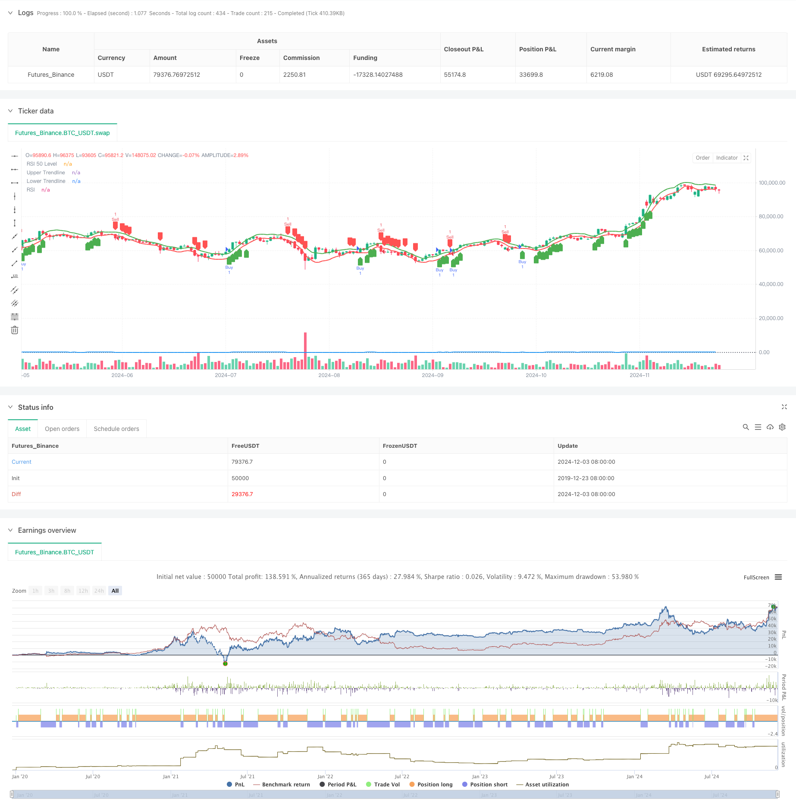

> Name

Triangle-Breakout-with-RSI-Momentum-Strategy
> Author

ChaoZhang

> Strategy Description



[trans]
#### Overview
This strategy is a quantitative trading system based on a combination of price patterns and technical indicators. It trades primarily by identifying breakouts of triangle patterns, combined with momentum confirmation from the RSI indicator. The strategy uses the linear regression method to construct upper and lower trend lines, determines trading signals through price breakthroughs and RSI positions, and achieves an organic combination of morphological analysis and momentum analysis.
#### Strategy Principle
The core logic of the strategy consists of two main parts: triangle pattern recognition and RSI momentum confirmation. First, use the linear regression method to calculate the high points and low points of the last N periods, and construct upper and lower trend lines to form a triangle. When the price breaks through the upper trend line and the RSI is greater than 50, a long signal is triggered; when the price breaks through the lower trend line and the RSI is less than 50, a short signal is triggered. The strategy optimizes the triangle length and RSI period by setting adjustable parameters, making it highly adaptable.
#### Strategic Advantages
1. Clear structure: The strategy organically combines morphological analysis and momentum analysis to improve the reliability of transactions through double confirmation.
2. Flexible parameters: Adjustable triangle length and RSI cycle parameters are provided to facilitate optimization for different market characteristics.
3. Strong visualization: Trend lines and trading signals are clearly displayed on the chart to facilitate strategy monitoring and backtest analysis.
4. Controllable risks: Using RSI as a filter can effectively reduce the risks caused by false breakthroughs.
#### Strategy Risk
1. Under volatile market conditions, frequent transactions may occur, increasing transaction costs.
2. The calculation of the trend line is based on historical data, and there may be a lag in a rapidly fluctuating market.
3. The RSI indicator may produce false signals under certain market conditions.
4. The strategy does not have a stop-loss mechanism and may suffer large losses when the market fluctuates violently.
#### Strategy optimization direction
1. Introduce a stop loss mechanism: It is recommended to add a fixed stop loss or trailing stop loss to control risks.
2. Optimize entry timing: You can consider increasing trading volume confirmation to improve the reliability of breakthrough signals.
3. Improve signal filtering: Trend filters can be added to avoid frequent trading in sideways markets.
4. Dynamic parameter optimization: It is recommended to dynamically adjust the triangle length and RSI threshold according to market volatility.
#### Summary
Triangular breakthrough combined with RSI momentum strategy is a quantitative trading system with complete structure and clear logic. Through the double confirmation mechanism of form and momentum, the reliability of trading signals is effectively improved. Although there are certain risks, this strategy has good practical value through reasonable parameter optimization and risk control measures. It is recommended that traders conduct sufficient parameter optimization and backtest verification based on specific market characteristics when using it in real markets. ||
#### Overview
This strategy is a quantitative trading system that combines price pattern and technical indicators. It primarily identifies triangle pattern breakouts and confirms trades using RSI momentum. The strategy uses linear regression to construct upper and lower trendlines, determining trading signals through price breakouts and RSI positions, achieving an organic combination of pattern and momentum analysis.

#### Strategy Principle
The core logic consists of two main components: triangle pattern recognition and RSI momentum confirmation. First, it uses linear regression to calculate recent N-period highs and lows, constructing upper and lower trendlines to form a triangle. When price breaks above the upper trendline and RSI is above 50, it triggers a buy signal; when price breaks below the lower trendline and RSI is below 50, it triggers a sell signal. The strategy features adjustable parameters for triangle length and RSI period, providing strong adaptability.

#### Strategy Advantages
1. Clear Structure: The strategy organically combines pattern analysis and momentum analysis, improving trading reliability through double confirmation.
2. Flexible Parameters: Provides adjustable triangle length and RSI period parameters, facilitating optimization for different market characteristics.
3. Strong Visualization: Clearly displays trendlines and trading signals on charts, facilitating strategy monitoring and backtesting analysis.
4. Controlled Risk: Uses RSI as a filter to effectively reduce risks from false breakouts.

#### Strategy Risks
1. May generate frequent trades in choppy markets, increasing transaction costs.
2. Trendline calculations based on historical data may lag in rapidly volatile markets.
3. RSI indicator may generate false signals under certain market conditions.
4. Strategy lacks stop-loss mechanism, potentially bearing significant losses during extreme market volatility.

#### Strategy Optimization Directions
1. Introduce Stop-Loss Mechanism: Recommend adding fixed or trailing stop-loss for risk control.
2. Optimize Entry Timing: Consider adding volume confirmation to improve breakout signal reliability.
3. Enhance Signal Filtering: Can add trend filters to avoid frequent trading in ranging markets.
4. Dynamic Parameter Optimization: Suggest dynamically adjusting triangle length and RSI thresholds based on market volatility.

#### Conclusion
The Triangle Breakout with RSI Momentum Strategy is a complete and logically clear quantitative trading system. Through the dual confirmation mechanism of pattern and momentum, it effectively improves trading signal reliability. While certain risks exist, the strategy has good practical value through reasonable parameter optimization and risk control measures. Traders are advised to conduct thorough parameter optimization and backtesting verification based on specific market characteristics before live trading.[/trans]


> Source (PineScript)

``` pinescript
/*backtest
start: 2019-12-23 08:00:00
end: 2024-12-04 00:00:00
period: 1d
basePeriod: 1d
exchanges: [{"eid":"Futures_Binance","currency":"BTC_USDT"}]
*/

//@version=5
strategy("Triangle Breakout with RSI", overlay=true)

// Input parameters
len = input.int(15, title="Triangle Length")
rsiPeriod = input.int(14, title="RSI Period")
rsiThresholdBuy = input.int(50, title="RSI Threshold for Buy")
rsiThresholdSell = input.int(50, title="RSI Threshold for Sell")

// Calculate the RSI
rsi = ta.rsi(close, rsiPeriod)

// Calculate highest high and lowest low for triangle pattern
highLevel = ta.highest(high, len)
lowLevel = ta.lowest(low, len)

// Create trendlines for the triangle
upperTrend = ta.linreg(high, len, 0)
lowerTrend = ta.linreg(low, len, 0)

// Plot the trendlines on the chart
plot(upperTrend, color=color.green, linewidth=2, title="Upper Trendline")
plot(lowerTrend, color=color.red, linewidth=2, title="Lower Trendline")

// Detect breakout conditions
breakoutUp = close > upperTrend
breakoutDown = close < lowerTrend

// Confirm breakout with RSI
buyCondition = breakoutUp and rsi > rsiThresholdBuy
sellCondition = breakoutDown and rsi < rsiThresholdSell

// Plot breakout signals with confirmation from RSI
plotshape(series=buyCondition, title="Buy Signal", location=location.belowbar, color=color.green, style=shape.labelup, size=size.small)
plotshape(series=sellCondition, title="Sell Signal", location=location.abovebar, color=color.red, style=shape.labeldown, size=size.small)

// Strategy: Buy when triangle breaks upwards and RSI is above 50; Sell when triangle breaks downwards and RSI is below 50
if (buyCondition)
    strategy.entry("Buy", strategy.long)

if (sellCondition)
    strategy.entry("Sell", strategy.short)

// Plot RSI on the bottom pane
hline(50, "RSI 50 Level", color=color.gray, linestyle=hline.style_dotted)
plot(rsi, color=color.blue, linewidth=2, title="RSI")
```

> Detail

https://www.fmz.com/strategy/474049

> Last Modified

2024-12-05 16:19:31
