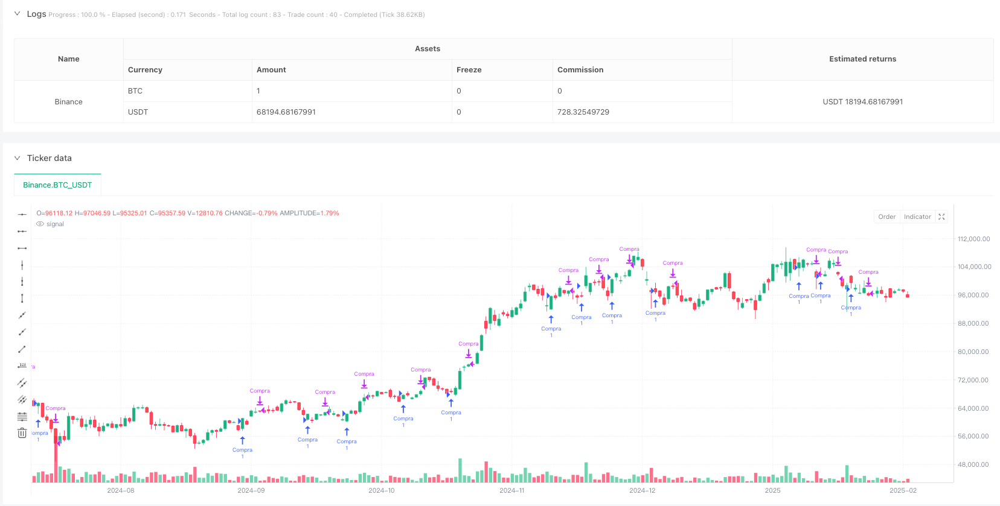
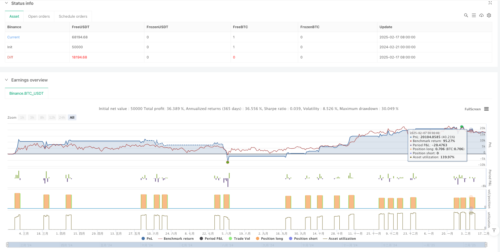

> Name

RSI2-Based-Dynamic-Breakout-Trading-Strategy-with-Moving-Average-Filter-System
> Author

ianzeng123

> Strategy Description





[trans]
#### Overview
This strategy is a trading system based on a combination of the RSI2 indicator and moving averages. It mainly captures potential long opportunities by monitoring the reversal signal of the RSI indicator in the oversold area, and combines the moving average as a trend filter to improve the accuracy of trading. The strategy adopts a fixed exit mechanism and automatically closes the position after the position reaches the preset period.
#### Strategy Principle
The core logic of the strategy includes the following key elements:
1. Use the RSI indicator with a period of 2 to identify the oversold state. When the RSI is lower than the set buying threshold (default 25), enter the observation state.
2. Confirm the entry signal when the RSI indicator breaks through from bottom to top.
3. You can optionally add moving average filter conditions, requiring the price to be above the moving average before entry is allowed.
4. Adopt an exit mechanism with a fixed position period (default 5 K lines)
5. After entering the market, draw a trading line on the chart to connect the buying and selling points, and use different colors to mark the profit and loss.
#### Strategic Advantages
1. Flexible and adjustable parameters: supports customization of key parameters such as RSI period, buying threshold, position period and moving average period.
2. The mechanism is simple and reliable: using the classic RSI oversold reversal signal, combined with trend filtering, the logic is clear and easy to understand.
3. Proper risk control: adopt a fixed period exit mechanism to avoid excessive positions
4. Good visualization effect: visually display the profit and loss of each transaction through the drawing of trading lines
5. Backtesting time is controllable: supports setting specific start and end times of backtesting
#### Strategy Risk
1. False breakthrough risk: RSI indicator may produce false reversal signals, leading to wrong transactions
2. Fixed cycle risk: The preset holding period may be too short, leading to early exit, or too long, leading to profit taking.
3. Trend dependence: In volatile markets, moving average filtering may unduly restrict trading opportunities
4. Parameter sensitivity: Strategy performance is more sensitive to parameter settings, and different market environments may require frequent adjustments.
#### Strategy optimization direction
1. Dynamic holding period: the holding time can be adaptively adjusted according to market volatility
2. Multiple confirmation mechanism: Increase trading volume, volatility and other auxiliary indicators to improve signal reliability
3. Intelligent stop loss setting: Introducing indicators such as ATR to dynamically set stop loss positions
4. Batch position building plan: Use progressive position building to diversify risks when the signal is triggered
5. Market environment identification: increase trend strength judgment and use different parameter combinations under different market conditions
#### Summary
This is a trading strategy with a complete structure and clear logic, which uses RSI oversold reversal signals combined with moving average trend filtering to capture market opportunities. The advantages of the strategy are flexible parameters and reasonable risk control, but it is still necessary to pay attention to the risk of false breakthroughs and parameter sensitivity. Through the suggested optimization direction, the strategy still has a large room for improvement, which can further improve its adaptability in different market environments. ||
#### Overview
This strategy is a trading system that combines the RSI2 indicator with a moving average. It primarily captures potential long opportunities by monitoring RSI reversal signals in oversold territories while using moving averages as trend filters to improve trading accuracy. The strategy employs a fixed exit mechanism that automatically closes positions after reaching a preset period.

#### Strategy Principle
The core logic includes several key elements:
1. Uses RSI with period 2 to identify oversold conditions, entering observation mode when RSI falls below the set buy threshold (default 25)
2. Confirms entry signals when the RSI indicator breaks upward
3. Optionally incorporates moving average filtering, requiring price to be above the moving average for entry
4. Adopts a fixed holding period exit mechanism (default 5 candles)
5. Draws trade lines on the chart connecting buy and sell points, with different colors indicating profit/loss status

#### Strategy Advantages
1. Flexible Parameters: Supports customization of RSI period, buy threshold, holding period, and moving average period
2. Simple and Reliable Mechanism: Uses classic RSI oversold reversal signals combined with trend filtering
3. Proper Risk Control: Employs fixed-period exit mechanism to avoid over-holding
4. Good Visualization: Directly displays trade profit/loss through trade lines
5. Controllable Backtesting: Supports setting specific backtest start and end times

#### Strategy Risks
1. False Breakout Risk: RSI indicator may generate false reversal signals leading to incorrect trades
2. Fixed Period Risk: Preset holding period may be too short causing premature exits or too long leading to profit giveback
3. Trend Dependency: Moving average filtering may excessively limit trading opportunities in ranging markets
4. Parameter Sensitivity: Strategy performance is sensitive to parameter settings, requiring frequent adjustments in different market environments

#### Strategy Optimization Directions
1. Dynamic Holding Period: Adapt holding time based on market volatility
2. Multiple Confirmation Mechanism: Add volume, volatility, and other auxiliary indicators to improve signal reliability
3. Smart Stop Loss: Introduce ATR and other indicators for dynamic stop loss placement
4. Gradual Position Building: Implement progressive position building to spread risk
5. Market Environment Recognition: Add trend strength judgment to use different parameter combinations under different market conditions

#### Summary
This is a well-structured trading strategy with clear logic, capturing market opportunities through RSI oversold reversal signals combined with moving average trend filtering. The strategy's strengths lie in its flexible parameters and reasonable risk control, but attention must be paid to false breakout risks and parameter sensitivity issues. Through the suggested optimization directions, the strategy has significant room for improvement to enhance its adaptability in different market environments.[/trans]


> Source (PineScript)

``` pinescript
/*backtest
start: 2024-02-21 00:00:00
end: 2025-02-18 08:00:00
period: 1d
basePeriod: 1d
exchanges: [{"eid":"Binance","currency":"BTC_USDT"}]
*/

//@version=6
strategy("RSI 2 Strategy with Fixed Lines and Moving Average Filter", overlay=true)

// Input parameters
rsiPeriod = input.int(2, title="RSI Period", minval=1)
rsiBuyLevel = input.float(25, title="RSI Buy Level", minval=0, maxval=100)
maxBarsToHold = input.int(5, title="Max Candles to Hold", minval=1)
maPeriod = input.int(50, title="Moving Average Period", minval=1) // Moving Average Period
useMAFilter = input.bool(true, title="Use Moving Average Filter") // Enable/Disable MA Filter

// RSI and Moving Average calculation
rsi = ta.rsi(close, rsiPeriod)
ma = ta.sma(close, maPeriod)

// Moving Average filter conditions
maFilterCondition = useMAFilter ? close > ma : true // Condition: price above MA

// Buy conditions
rsiIncreasing = rsi > rsi[1] // Current RSI greater than previous RSI
buyCondition = rsi[1] < rsiBuyLevel and rsiIncreasing and strategy.position_size == 0 and maFilterCondition

// Variables for management
var int barsHeld = na          // Counter for candles after purchase
var float buyPrice = na        // Purchase price

// Buy action
if buyCondition and na(barsHeld)
    strategy.entry("Buy", strategy.long)
    barsHeld := 0
    buyPrice := close

// Increment the candle counter after purchase
if not na(barsHeld)
    barsHeld += 1

// Sell condition after the configured number of candles
sellCondition = barsHeld >= maxBarsToHold
if sellCondition
    strategy.close("Buy")
    
    // Reset variables after selling
    barsHeld := na
    buyPrice := na

```

> Detail

https://www.fmz.com/strategy/482838

> Last Modified

2025-02-27 17:37:36
