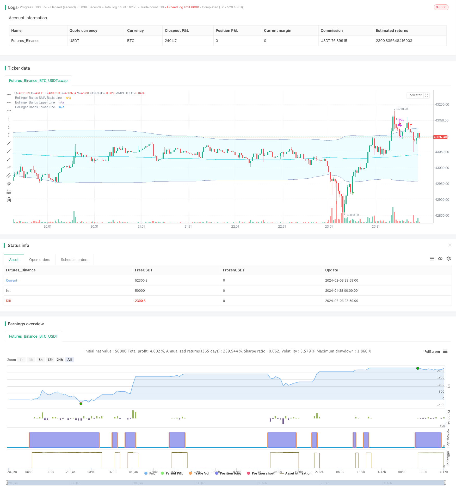

> Name

A-Bollinger-Band-and-Trend-Tracking-Strategy-Based-on-RSI
> Author

ChaoZhang

> Strategy Description


[trans]

This strategy comprehensively uses Bollinger Bands and RSI indicators to identify key points in trend direction changes, establish positions when the trend turns, and then use the power of the trend to make a profit.
## Overview
This strategy first determines the scope and direction of price shocks through the Bollinger Bands and upper rails, combines the RSI indicator to determine the key points of long and short positions, and establishes reverse positions when the shock range intensifies. For example, a bullish position is established when the RSI returns from the overbought/oversold area and a golden cross appears near the lower band, or a bearish position is established when the RSI returns from the oversold area and a golden cross appears near the upper band. Then use the two dynamic stop loss levels of the upper and lower rails of the Bollinger Bands to track the stop loss and take profit.

## Strategy Principle
This strategy mainly uses a combination of the Bollinger Bands indicator and the RSI indicator to identify key turning points in the price trend.
Bollinger Bands is a technical indicator that calculates the upper and lower tracks based on the fluctuation range of stock prices. Bollinger Bands calculate the standard deviation of the stock price to obtain the range of stock price fluctuations, and draw the upper and lower limits of the stock price accordingly. The upper track is the upper limit of stock price fluctuations, and the lower track is the lower limit of stock price fluctuations. When the stock price is close to the upper track, it means that the stock price is fluctuating and rising in the bull market. At this time, we should be alert to the possible decline of the stock price; when the stock price is close to the lower track, it means that the decline of the stock price is accelerating, and we should be alert to rebound opportunities.
The RSI indicator is a technical indicator that determines stock price trends and overbought and oversold conditions by calculating the strength of stock price increases and decreases over a period of time. The RSI measures momentum, whether rising or falling, in a stock price by comparing its average closing gain to its average closing decline over a period of time. When the RSI is greater than 70, it is overbought, and when it is less than 30, it is oversold. Stock prices may reverse.
The trading decision of this strategy is based on the signals of the upper and lower Bollinger Bands and the RSI indicator. When the RSI falls from the overbought zone into the neutral zone and the stock price breaks below the lower Bollinger Band, it indicates that the upward trend of the stock price has been broken, and a bearish opportunity appears. We can enter a bearish position. On the contrary, when the RSI rises from the oversold zone into the neutral zone and the stock price breaks above the Bollinger Band, it indicates that the downward trend of the stock price has been broken, and a bullish opportunity appears. We can open a bullish position.
After establishing a position, we will use the upper and lower bands of the Bollinger Bands as stop loss and take profit levels. When the stock price reverses and breaks through these two key levels again, we will stop the loss or take the profit in time.
## Strategic Advantages
The biggest advantage of this strategy is to use the two indicators Bollinger Bands and RSI to verify each other and identify key turning points in the stock price. Using the Bollinger Bands indicator alone can easily produce false signals. However, combined with the overbought and oversold area judgment of the RSI indicator, erroneous operations can be effectively avoided. Another advantage is to use the upper and lower rails of the Bollinger Bands as dynamic take-profit and stop-loss levels, which is more flexible and reasonable than setting fixed take-profit and stop-loss levels in advance.
## Strategy Risk
The risks of this strategy are mainly reflected in two aspects:
1. Improper Bollinger Band parameter settings. If the Bollinger Band parameters are set too large or too small, the effect of identifying intensified oscillations will be greatly reduced.
2. The indicator sends false signals. This strategy mainly relies on the Bollinger Bands indicator combined with the RSI indicator to identify key points, but in some cases the signal sent by the indicator may be wrong. At this time, if you follow the order blindly, you may cause losses.
In view of the above risks, we can optimize from the following aspects:
1. Test the optimal values ​​of Bollinger Band parameters under different market and different cycle parameters, and set reasonable parameters.
2. Add other indicators as verification signals to avoid errors in judgment of a single indicator. For example, you can add KD indicators, etc.
3. Add artificial experience rules to choose whether to enter the market based on specific market conditions.
## Strategy optimization direction
This strategy can also be optimized from the following aspects:
1. Test and optimize the Bollinger Band parameters to find the optimal parameters that are more suitable for this variety.
2. Add stop loss and take profit strategies, you can set trailing stop loss or trailing take profit to lock in greater profits.
3. Combine more indicators and patterns as entry signal verification, such as volume and price indicators, fundamental factors, etc., to improve the accuracy of operations.
4. According to the characteristics of different varieties and markets, set parameter sets to optimize combinations to form a strategic warehouse with multiple parameter combinations.
## Summarize
This strategy comprehensively uses the Bollinger Bands indicator and the RSI indicator to identify key points where prices may reverse based on mutual verification of the two indicators. It is more reliable in judging the key points of the market, and it is also more reasonable to dynamically track the upper and lower rails of Bollinger Bands to stop profits and losses. However, this strategy also has certain risks, and other auxiliary tools need to be added to optimize and verify the operation strategy, and adjustments need to be made based on manual experience in real trading. Generally speaking, this strategy is a typical quantitative trading strategy.
||

This strategy combines Bollinger Band and RSI indicators to identify key turning points in price trends. It establishes positions when trends reverse and then exits profitably by following the trend momentum.

## Overview

This strategy first uses the upper and lower bands of Bollinger Bands to determine the price oscillation range and direction. It then uses the RSI indicator to identify long and short opportunities. For example, when the RSI exits the overbought/oversold area and a golden cross appears near the lower band, it will establish a long position. Or when the RSI exits the overbought area and a death cross appears near the upper band, it will establish a short position. It then uses the dynamic stops of the Bollinger Bands for tracking stops and profit targets.

## Strategy Logic

This strategy mainly utilizes the combination of Bollinger Band and RSI indicators to identify key reversals in price trends. 

The Bollinger Band is a technical indicator that calculates the upper and lower bands based on the volatility range of prices. By calculating the standard deviation of prices, it determines the amplitude of price fluctuations and plots the upper and lower limits accordingly. The upper band represents the upper limit of price swings while the lower band represents the lower limit. When prices approach the upper band, it indicates that prices are oscillating upwards in a bull market, so a potential drop should be cautious about. When prices approach the lower band, it indicates accelerated drops, so potential bounces should be cautious about.

The RSI is a technical indicator that judges price trends and overbought/oversold conditions by calculating the strength of price rises and falls over a period of time. By comparing the average closing gains and average closing losses over a period of time, RSI measures the momentum of the ongoing price rises or drops. Above 70 RSI indicates overbought conditions while below 30 indicates oversold conditions, which implies potential price reversals.  

The trading signals of this strategy come from the combination of Bollinger Bands and RSI signals. When the RSI drops from the overbought zone to the neutral zone while prices break below the lower band of Bollinger Bands, it indicates the upside price trend is breaking down and shorting opportunities emerge. We can establish short positions. On the contrary, when the RSI rises from the oversold zone to the neutral zone while prices break above the upper band, it indicates the downside price trend is breaking up and long opportunities emerge. We can establish long positions.

After establishing positions, the upper and lower bands of Bollinger Bands will be used as dynamic stops for managing risks and profit targets. When prices reverse and break through those key levels again, we close positions in a timely manner.

## Advantages

The biggest advantage of this strategy is using Bollinger Bands and RSI indicators to verify each other when identifying key turning points of prices. Using Bollinger Bands alone can easily generate false signals. But by combining the overbought/oversold zones of RSI, false operations can be effectively avoided. Another advantage is using the dynamic upper and lower bands of Bollinger Bands as profit and loss stops, which is more flexible and reasonable than presetting fixed profit and loss stops.

## Risks

The main risks of this strategy are reflected in two aspects:


1. Improper parameter settings of Bollinger Bands. If the parameters of Bollinger Bands are set too large or too small, the effect of identifying increased oscillations will be greatly reduced.


2. False signals from indicators. This strategy mainly relies on Bollinger Bands combined with RSI indicators to identify key points. In some individual cases, the signals emitted may still be wrong. Blindly following them at that time can lead to losses.


To address the above risks, optimization can be done in the following aspects:


1. Test the optimal values of Bollinger Band parameters under different markets and cycle periods to set reasonable parameters.


2. Add other indicators to verify signals and avoid false judgments from single indicators. Indicators like KD can be added.


3. Add manual empirical rules to determine whether to participate based on specific market conditions.

## Optimization

The strategy can be further optimized in the following aspects:

1. Test and optimize Bollinger Band parameters to find the optimal parameters suitable for the underlying.  

2. Add stop loss and take profit strategies. Trailing stops or moving profit targets can be used to lock in bigger profits.

3. Combine more indicators and patterns for verifying entry signals to improve accuracy. Examples include volume price indicators, fundamental factors etc.  

4. Set up parameter optimization combinations according to the characteristics of different products and markets to build a strategy pool with multiple parameter combinations.

## Conclusion  

This strategy combines Bollinger Band and RSI indicators to identify key potential reversal points when the two indicators verify each other. It is relatively reliable in capturing key market points. The dynamic bands for stop loss and take profit are also reasonable. But there are still risks in this strategy, so other tools are needed to optimize and verify the operational strategy. Manual interference based on trading experience is also needed during live trading. In general, this is a typical quantitative trading strategy.

[/trans]

> Strategy Arguments


|Argument|Default|Description|
|----|----|----|
|v_input_1|6|RSI Period Length|
|v_input_int_1|200|Bollinger Period Length|


> Source (PineScript)

``` pinescript
/*backtest
start: 2024-01-28 00:00:00
end: 2024-02-04 00:00:00
period: 1m
basePeriod: 1m
exchanges: [{"eid":"Futures_Binance","currency":"BTC_USDT"}]
*/

//@version=5
strategy("TradeOptix 2.0", shorttitle="TradeOptix 2.0", overlay=true)


///////////// RSI
RSIlength = input(6, title='RSI Period Length')
RSIoverSold = 50
RSIoverBought = 50
price = close
vrsi = ta.rsi(price, RSIlength)


///////////// Bollinger Bands
BBlength = input.int(200, minval=1, title='Bollinger Period Length')
BBmult = 2  // input(2.0, minval=0.001, maxval=50,title="Bollinger Bands Standard Deviation")
BBbasis = ta.sma(price, BBlength)
BBdev = BBmult * ta.stdev(price, BBlength)
BBupper = BBbasis + BBdev
BBlower = BBbasis - BBdev
source = close
buyEntry = ta.crossover(source, BBlower)
sellEntry = ta.crossunder(source, BBupper)
plot(BBbasis, color=color.new(color.aqua, 0), title='Bollinger Bands SMA Basis Line')
p1 = plot(BBupper, color=color.new(#7787b9, 0), title='Bollinger Bands Upper Line')
p2 = plot(BBlower, color=color.new(#7787b9, 0), title='Bollinger Bands Lower Line')
fill(p1, p2, color = color.rgb(40, 226, 255, 90))


///////////// RSI + Bollinger Bands Strategy
long = ta.crossover(vrsi, RSIoverSold) and ta.crossover(source, BBlower)
close_long = ta.crossunder(vrsi, RSIoverBought) and ta.crossunder(source, BBupper)

if not na(vrsi)

    if long
        strategy.entry('Long', strategy.long, stop=BBlower, alert_message = "Exit")
        alert("Enter Calls")
    else
        strategy.cancel(id='Long')
        alert("Exit Calls")

    if close_long
        strategy.close('Long',alert_message = "Exit")
        alert("Exit Calls")


plotshape(long, title='UpTrend Begins', location=location.belowbar, style=shape.flag, size=size.tiny, color=color.new(color.green, 0))
plotshape(close_long, title='DownTrend Begins', location=location.abovebar, style=shape.flag, size=size.tiny, color=color.new(color.red, 0))


```

> Detail

https://www.fmz.com/strategy/441056

> Last Modified

2024-02-05 11:02:51
