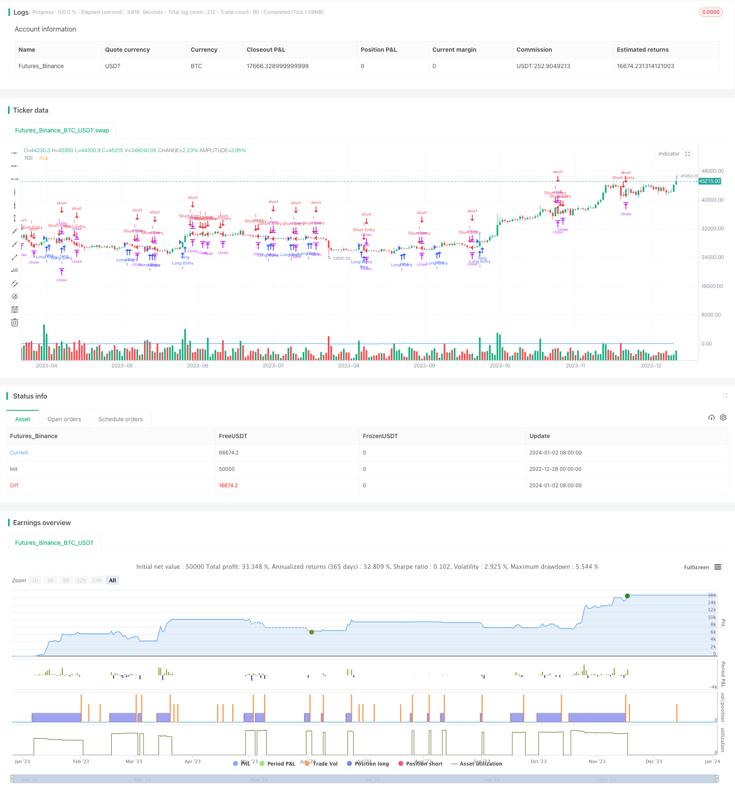

> Name

Advanced strategy for trading based on RSI and AI custom conditionsImproved-RSI-Scalping-Strategy-based-on-Relative-Strength-Index
> Author

ChaoZhang

> Strategy Description


[trans]

## Overview
The core idea of ​​this strategy is to combine the RSI indicator and customized AI conditions to discover trading opportunities. It opens a long or short position when multiple conditions are met, and uses fixed take-profit and stop-loss levels.
## Strategy Principle
This strategy is implemented through the following steps:
1. Calculate the 14-period RSI value
2. Define two custom AI conditions (long and short)
3. Combine AI conditions with RSI overbought and oversold zones to form entry signals
4. Calculate position size based on risk percentage and stop loss points
5. Calculate take profit and stop loss prices
6. Open a position when an entry signal is met
7. Close the position when the take-profit or stop-loss conditions are met
At the same time, the strategy will also sound an alert when a trading signal is formed and draw an RSI curve on the chart.
## Strategic advantage analysis
This strategy has the following advantages:
1. Combining RSI and AI conditions can more accurately discover trading opportunities
2. Use a combination of multiple conditions to effectively filter out false signals
3. Calculate the position size based on risk management principles to control the risk of each transaction
4. Adopt fixed stop-profit and stop-loss methods, and the risks and rewards of each transaction are clear
5. You can freely customize the strategy through parameter adjustment
## Strategy risk analysis
There are also some risks with this strategy:
1. Improper setting of RSI parameters may lead to inaccurate trading signals
2. Improper design of custom AI conditions may also produce error signals
3. Setting the stop loss point too small may cause the stop loss to be triggered frequently.
4. When the market fluctuates violently, the fixed stop-profit and stop-loss methods may cause more profits to be lost or losses to increase.
These risks can be reduced by adjusting RSI parameters, optimizing AI conditions, appropriately relaxing the stop loss distance, etc.
## Strategy optimization direction
This strategy can also be optimized through the following aspects:
1. Add more custom AI conditions and combine more factors to determine trends
2. Optimize RSI parameters and find the best parameter combination
3. Test different take-profit and stop-loss mechanisms, such as trailing stop-loss and trailing take-profit
4. Add additional filtering conditions, such as sudden increase in transaction volume, to discover high-quality trading opportunities
5. Combined with machine learning algorithms to automatically generate optimal parameters
## Summarize
Overall, this is an advanced strategy with a lot of room for customization and optimization based on RSI indicators and AI custom conditions for trading. It determines the trend direction by combining multiple signal sources, and uses risk management and stop-profit and stop-loss mechanisms for trading. This strategy can provide users with better trading results and also has strong scalability and room for optimization.
|| 

## Overview

The core idea of this strategy is to combine the RSI indicator and custom AI conditions to discover trading opportunities. It will establish long or short positions when multiple conditions are met, and use fixed take profit and stop loss levels. 

## Trading Logic

The strategy is implemented through the following steps:

1. Calculate 14-period RSI values
2. Define two custom AI conditions (long and short) 
3. Combine AI conditions with RSI overbought/oversold zones to generate entry signals
4. Calculate position size based on risk percentage and stop loss pips
5. Compute take profit and stop loss price  
6. Enter positions when entry signals are triggered
7. Exit positions when take profit or stop loss is hit  

Additionally, the strategy will generate alerts on signal creation and plot RSI values on the chart.

## Advantage Analysis  

The strategy has several key advantages:

1. Combining RSI and AI conditions lead to more accurate trade signals  
2. Using multiple condition combinations effectively filters out false signals
3. Position sizing based on risk management principles controls per trade risk  
4. Fixed take profit/stop loss provides clarity on risk and reward  
5. Highly customizable through parameter tuning

## Risk Analysis

There are also some risks to consider:

1. Incorrect RSI parameters may lead to inaccurate signals
2. Poorly designed custom AI logic can generate false signals 
3. A stop loss level too tight may result in excessive stopping out 
4. Fixed take profit/stop loss may lose more profits or create more losses in volatile markets  

These can be mitigated by tuning RSI parameters, optimizing AI logic, relaxing stop loss distances, etc.

## Enhancement Opportunities

Some ways the strategy can be further improved:

1. Incorporate more custom AI conditions to determine trend based on multiple factors  
2. Optimize RSI parameters to find best combinations
3. Test different take profit/stop loss mechanisms like trailing stops or moving take profit  
4. Add additional filters like volume spikes to detect quality trading opportunities  
5. Employ machine learning to automatically generate optimal parameters  

## Summary

In summary, this is a highly configurable and optimizable advanced strategy for trading based on RSI and custom AI logic. It determines trend direction through a combination of multiple signal sources, executes trades with risk management and take profit/stop loss procedures. The strategy can provide good trading performance for users, with abundant expansion and optimization capabilities.

[/trans]

> Strategy Arguments


|Argument|Default|Description|
|----|----|----|
|v_input_int_1|14|RSI Length|
|v_input_int_2|70|RSI Overbought Threshold|
|v_input_int_3|30|RSI Oversold Threshold|
|v_input_int_4|10|Take Profit (Pips)|
|v_input_int_5|5|Stop Loss (Pips)|
|v_input_float_1|true|Risk Percentage|


> Source (PineScript)

``` pinescript
/*backtest
start: 2022-12-28 00:00:00
end: 2024-01-03 00:00:00
period: 1d
basePeriod: 1h
exchanges: [{"eid":"Futures_Binance","currency":"BTC_USDT"}]
*/

//@version=5
strategy("Improved RSI Scalping Strategy", overlay=true)

// Parameters
rsiLength = input.int(14, title="RSI Length")
rsiOverbought = input.int(70, title="RSI Overbought Threshold")
rsiOversold = input.int(30, title="RSI Oversold Threshold")
takeProfitPips = input.int(10, title="Take Profit (Pips)")
stopLossPips = input.int(5, title="Stop Loss (Pips)")
riskPercentage = input.float(1, title="Risk Percentage", minval=0, maxval=100, step=0.1)

// Calculate RSI
rsiValue = ta.rsi(close, rsiLength)

// Custom AI Conditions
aiCondition1Long = ta.crossover(rsiValue, 50)
aiCondition1Short = ta.crossunder(rsiValue, 50)

// Add more AI conditions here
var aiCondition2Long = ta.crossover(rsiValue, 30)
var aiCondition2Short = ta.crossunder(rsiValue, 70)

// Combine AI conditions with RSI
longCondition = aiCondition1Long or aiCondition2Long or ta.crossover(rsiValue, rsiOversold)
shortCondition = aiCondition1Short or aiCondition2Short or ta.crossunder(rsiValue, rsiOverbought)

// Calculate position size based on risk percentage
equity = strategy.equity
riskAmount = (equity * riskPercentage) / 100
positionSize = riskAmount / (stopLossPips * syminfo.mintick)

// Calculate Take Profit and Stop Loss levels
takeProfitLevel = close + takeProfitPips * syminfo.mintick
stopLossLevel = close - stopLossPips * syminfo.mintick

// Long entry
strategy.entry("Long Entry", strategy.long, when=longCondition[1] and not longCondition, qty=1)
strategy.exit("Take Profit/Stop Loss", from_entry="Long Entry", limit=takeProfitLevel, stop=stopLossLevel)

// Short entry
strategy.entry("Short Entry", strategy.short, when=shortCondition[1] and not shortCondition, qty=1)
strategy.exit("Take Profit/Stop Loss", from_entry="Short Entry", limit=takeProfitLevel, stop=stopLossLevel)

// Alerts
alertcondition(longCondition, title="Long Entry Signal", message="Long Entry Signal")
alertcondition(shortCondition, title="Short Entry Signal", message="Short Entry Signal")

// Plot RSI on the chart
plot(rsiValue, title="RSI", color=color.blue)

```

> Detail

https://www.fmz.com/strategy/437674

> Last Modified

2024-01-04 17:20:57
