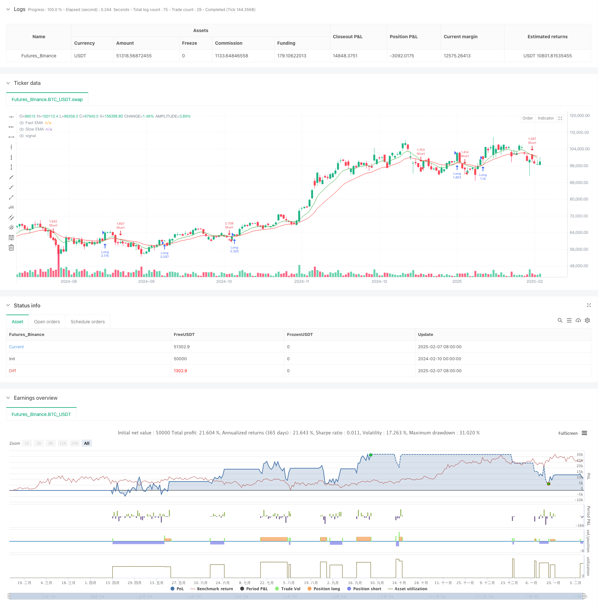

> Name

Cross-Period-Momentum-EMA-Strategy-with-RSI-and-Dynamic-ATR-Stop-Loss
> Author

ChaoZhang

> Strategy Description



[trans]
#### Overview
This strategy is an intraday trading system that combines multiple technical indicators. It is mainly based on the cross signal of the fast and slow exponential moving average (EMA) as the main entry basis. It is also combined with the relative strength index (RSI) for momentum filtering, and uses the true range indicator (ATR) to dynamically set the stop loss position to build a complete trading system. This strategy achieves control over short-term market fluctuations through strict risk control and dynamic stop-profit and stop-loss settings.
#### Strategy Principle
The core logic of the strategy includes the following aspects:
1. Trend judgment: Determine the market trend direction through the 9-period and 21-period EMA crossover
2. Momentum filtering: Use the 14-period RSI indicator to determine overbought and oversold to prevent entry against the trend in excessive areas.
3. Risk control: dynamically set the stop loss position based on the 14-period ATR, and the stop loss multiple is 1.5 times ATR
4. Profit target: Set to 2 times ATR of the entry point as the dynamic take-profit point
The specific trading rules are as follows:
- Long conditions: Fast EMA crosses slow EMA upward, and RSI is below 70
- Short selling conditions: Fast EMA crosses slow EMA downwards, and RSI is higher than 30
- Stop loss setting: The long stop loss is set at 1.5 times ATR below the entry price, and the short stop loss is set at 1.5 times ATR above the entry price.
- Take profit setting: Set a dynamic take profit position of 2 times ATR based on the entry price
#### Strategic Advantages
1. Multiple indicator confirmation: Combine trend and momentum indicators to improve the reliability of trading signals
2. Dynamic risk management: dynamically adjust the stop loss position through ATR to adapt to changes in market volatility
3. Systematic trading: clear entry and exit conditions, reducing subjective judgment
4. Reasonable risk-benefit ratio: The stop-profit and stop-loss ratios are set reasonably, which is conducive to long-term stable operation.
5. Strong adaptability: parameters can be adjusted according to different market characteristics
#### Strategy Risk
1. Risk of rapid market oscillation: The market may produce frequent false breakthrough signals during range oscillations.
2. Impact of slippage: Intraday trading requires higher execution efficiency and may be affected by slippage.
3. Parameter sensitivity: The optimal parameters may change under different market environments.
4. Transaction costs: More frequent transactions may bring higher transaction costs
Risk control suggestions:
- It is recommended to conduct sufficient historical data backtesting
- Consider adding transaction filters
- Properly control the size of a single transaction
- Regularly evaluate parameter effectiveness
#### Strategy optimization direction
1. Add market environment filtering:
- Add volatility indicator to determine current market characteristics
- Dynamically adjust parameters according to different market environments
2. Improve trading rules:
- Consider adding time filtering
- Added transaction volume confirmation mechanism
- Optimize the take profit and stop loss ratio
3. Enhance risk control:
- Implement dynamic position management
-Add maximum retracement control
- Design money management plan
#### Summary
This strategy builds a relatively complete trading system by combining EMA trend tracking, RSI momentum filtering and ATR dynamic risk control. The main feature of the strategy is to utilize the synergistic effects of multiple technical indicators while focusing on risk management. Although there is some room for optimization, the overall design concept is in line with the systematic thinking of quantitative trading. It is recommended that traders conduct sufficient parameter optimization and backtest verification before applying the real offer, and make appropriate adjustments based on their own risk tolerance and capital management requirements. ||
#### Overview
This strategy is a comprehensive intraday trading system that combines multiple technical indicators. It primarily uses the crossover signals of fast and slow Exponential Moving Averages (EMA) as the main entry criteria, incorporates the Relative Strength Index (RSI) for momentum filtering, and utilizes the Average True Range (ATR) for dynamic stop-loss placement, forming a complete trading system. Through strict risk control and dynamic profit/loss settings, the strategy aims to capture short-term market fluctuations.

#### Strategy Principles
The core logic includes the following aspects:
1. Trend Determination: Using 9-period and 21-period EMA crossovers to identify market trend direction
2. Momentum Filtering: Employing 14-period RSI for overbought/oversold judgments to prevent counter-trend entries
3. Risk Control: Setting dynamic stop-loss levels based on 14-period ATR with a multiplier of 1.5
4. Profit Targets: Setting dynamic take-profit levels at 2 times ATR from entry point

Specific trading rules:
- Long Entry: Fast EMA crosses above Slow EMA with RSI below 70
- Short Entry: Fast EMA crosses below Slow EMA with RSI above 30
- Stop-Loss: Long positions set at 1.5 times ATR below entry, short positions at 1.5 times ATR above entry
- Take-Profit: Dynamic levels set at 2 times ATR from entry price

#### Strategy Advantages
1. Multiple Indicator Confirmation: Combines trend and momentum indicators for improved signal reliability
2. Dynamic Risk Management: Adapts stop-loss levels to market volatility using ATR
3. Systematic Trading: Clear entry and exit conditions reduce subjective judgment
4. Reasonable Risk-Reward Ratio: Balanced profit and loss settings for long-term stability
5. High Adaptability: Parameters can be adjusted for different market characteristics

#### Strategy Risks
1. Rapid Oscillation Risk: May generate frequent false breakout signals in ranging markets
2. Slippage Impact: Intraday trading requires high execution efficiency
3. Parameter Sensitivity: Optimal parameters may vary across different market environments
4. Transaction Costs: Frequent trading may incur higher costs

Risk Control Suggestions:
- Conduct thorough historical data backtesting
- Consider adding trading filters
- Control position sizing appropriately
- Regular parameter effectiveness evaluation

#### Strategy Optimization Directions
1. Enhanced Market Environment Filtering:
- Add volatility indicators to judge market characteristics
- Dynamically adjust parameters based on market conditions

2. Refined Trading Rules:
- Consider adding time filters
- Implement volume confirmation mechanisms
- Optimize profit/loss ratios

3. Strengthened Risk Control:
- Implement dynamic position sizing
- Add maximum drawdown controls
- Design comprehensive money management plans

#### Summary
This strategy constructs a relatively complete trading system by combining EMA trend following, RSI momentum filtering, and ATR dynamic risk control. Its main feature is the synergistic effect of multiple technical indicators while emphasizing risk management. While there is room for optimization, the overall design philosophy aligns with systematic quantitative trading principles. Traders are advised to conduct thorough parameter optimization and backtesting before live implementation, while making appropriate adjustments based on their risk tolerance and money management requirements.[/trans]


> Source (PineScript)

``` pinescript
/*backtest
start: 2024-02-10 00:00:00
end: 2025-02-08 08:00:00
period: 1d
basePeriod: 1d
exchanges: [{"eid":"Futures_Binance","currency":"BTC_USDT"}]
*/

//@version=5
strategy("Day Trading EMA/RSI Strategy", overlay=true, default_qty_type=strategy.percent_of_equity, default_qty_value=200)

// Ulazni parametri
fastEmaPeriod   = input.int(9, "Fast EMA Period", minval=1)
slowEmaPeriod   = input.int(21, "Slow EMA Period", minval=1)
rsiPeriod       = input.int(14, "RSI Period", minval=1)
rsiOversold     = input.int(30, "RSI Oversold Level")
rsiOverbought   = input.int(70, "RSI Overbought Level")
atrPeriod       = input.int(14, "ATR Period", minval=1)
atrMultiplier   = input.float(1.5, "ATR Multiplier za Stop Loss", step=0.1)
takeProfitFactor= input.float(2.0, "Take Profit Factor", step=0.1)

// Izračun indikatora
fastEMA = ta.ema(close, fastEmaPeriod)
slowEMA = ta.ema(close, slowEmaPeriod)
rsiValue = ta.rsi(close, rsiPeriod)
atrValue = ta.atr(atrPeriod)

// Definicija trenda: ako je fastEMA iznad slowEMA, smatramo da je trend uzlazan, inače silazni.
trendUp   = fastEMA > slowEMA
trendDown = fastEMA < slowEMA

// Uvjeti za ulaz:
// Ulaz u long poziciju: crossover fastEMA i slowEMA, uz filtriranje da RSI nije prekupovan (manje od rsiOverbought)
longCondition  = ta.crossover(fastEMA, slowEMA) and (rsiValue < rsiOverbought)
// Ulaz u short poziciju: crossunder fastEMA i slowEMA, uz filtriranje da RSI nije preprodavan (više od rsiOversold)
shortCondition = ta.crossunder(fastEMA, slowEMA) and (rsiValue > rsiOversold)

// Definicija dinamičnih stop-loss razina (ATR-based)
stopLossLong  = close - (atrMultiplier * atrValue)
stopLossShort = close + (atrMultiplier * atrValue)

// Izvršenje naloga
if (longCondition)
    strategy.entry("Long", strategy.long)
    strategy.exit("Exit Long", "Long", stop=stopLossLong, limit=close + (takeProfitFactor * atrValue))

if (shortCondition)
    strategy.entry("Short", strategy.short)
    strategy.exit("Exit Short", "Short", stop=stopLossShort, limit=close - (takeProfitFactor * atrValue))

// Plotanje indikatora za preglednost
plot(fastEMA, title="Fast EMA", color=color.green)
plot(slowEMA, title="Slow EMA", color=color.red)

```

> Detail

https://www.fmz.com/strategy/481349

> Last Modified

2025-02-10 14:34:58
