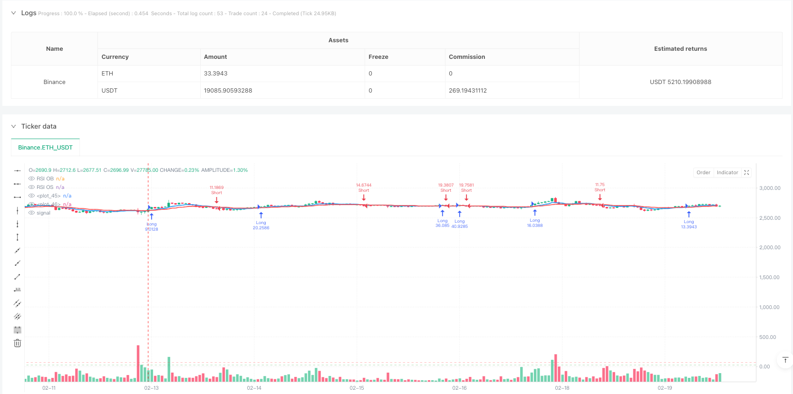
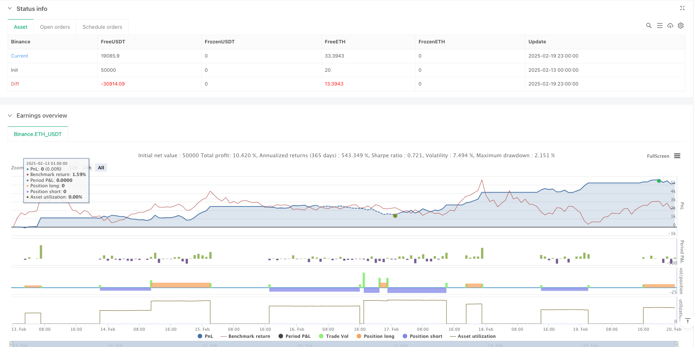

> Name

Dynamic-EMA-Crossover-with-RSI-Momentum-and-ATR-Volatility-Multi-Level-Confirmation-Trading-Strategy
> Author

ianzeng123

> Strategy Description





[trans]
#### Overview
This strategy is a multi-level confirmation trading system that combines moving average crossovers, the RSI momentum indicator, and the ATR volatility indicator. The strategy uses the 9-period and 21-period exponential moving averages (EMA) as the main trend judgment basis, and combines the RSI indicator to confirm momentum, and uses the ATR indicator to dynamically adjust the position size and stop-profit and stop-loss positions. This strategy effectively filters out false signals and improves the reliability of transactions through the coordination of multiple technical indicators.
#### Strategy Principle
The core logic of the strategy is based on the following levels:
1. Trend judgment layer: Use the intersection of fast EMA (9 periods) and slow EMA (21 periods) to determine the market trend direction. When the fast line crosses the slow line, a long signal is generated, and when the fast line crosses below the slow line, a short signal is generated.
2. Momentum confirmation layer: Use the 14-period RSI indicator to filter trend signals. Only execute long positions when the RSI is below 70 and short positions when above 30 to avoid opening positions in overbought or oversold areas.
3. Risk management: Use the 14-period ATR indicator to dynamically set stop loss and take profit positions. The stop loss is set to 1.5 times ATR and the take profit is set to 3 times ATR to ensure a good risk-benefit ratio. At the same time, ATR is also used to calculate the appropriate position size based on the 1% risk of the account equity.
#### Strategic Advantages
1. Multi-level confirmation mechanism: By combining moving average, momentum and volatility indicators, a complete transaction confirmation system is formed, significantly reducing false signals.
2. Dynamic risk management: Use ATR to dynamically adjust stop loss and take profit positions so that the strategy can better adapt to changes in market volatility.
3. Intelligent position management: Automatically adjust position size based on current market volatility and account equity to effectively control risks.
4. Systematic operation: The strategy is completely systematic, eliminating the emotional impact of subjective judgment.
#### Strategy Risk
1. Shock market risk: In a range-bound market, moving average crossovers may produce frequent false signals, leading to continuous stop losses.
2. Slippage risk: When the market fluctuates violently, the actual transaction price may deviate greatly from the signal price.
3. Trend reversal risk: When the market suddenly reverses, a fixed multiple of ATR stop loss may not be enough to protect funds in time.
#### Strategy optimization direction
1. Add market environment filtering: you can add trend strength indicators such as ADX and execute transactions only in strong trending markets.
2. Optimization parameter adaptation: The cycle parameters of EMA and RSI can be dynamically adjusted according to different market fluctuation cycles.
3. Improve the stop loss mechanism: Consider adding a trailing stop loss to protect more profits in trending markets.
4. Added trading time filtering: trading time window restrictions can be added to avoid periods of severe volatility.
#### Summary
This strategy builds a robust trading system by combining the three dimensions of moving average crossover, RSI momentum and ATR volatility. The advantage of the strategy lies in its complete multi-level confirmation mechanism and dynamic risk management system, but it may face higher risks in volatile markets. By adding improvements such as market environment filtering and optimization parameter adaptation, there is still room for improvement in the performance of the strategy. Overall, this is a trading strategy with clear logic and strong practicality.
||

#### Overview
This strategy is a multi-level confirmation trading system that combines EMA crossover, RSI momentum indicator, and ATR volatility indicator. The strategy uses 9-period and 21-period exponential moving averages (EMA) as the primary trend determination basis, combined with RSI for momentum confirmation and ATR for dynamic position sizing and stop-loss/take-profit placement. Through the coordination of multiple technical indicators, the strategy effectively filters false signals and improves trading reliability.

#### Strategy Principle
The core logic of the strategy is based on the following levels:
1. Trend Determination Layer: Uses the crossover of fast EMA (9-period) and slow EMA (21-period) to determine market trend direction. Long signals are generated when the fast line crosses above the slow line, and short signals when the fast line crosses below.
2. Momentum Confirmation Layer: Uses 14-period RSI to filter trend signals. Executes longs only when RSI is below 70 and shorts only when RSI is above 30, avoiding positions in overbought or oversold areas.
3. Risk Management Layer: Uses 14-period ATR for dynamic stop-loss and take-profit placement. Stop-loss is set at 1.5x ATR and take-profit at 3x ATR, ensuring a good risk-reward ratio. ATR is also used to calculate appropriate position size based on 1% account equity risk.

#### Strategy Advantages
1. Multi-level Confirmation Mechanism: Forms a complete trading confirmation system by combining moving averages, momentum, and volatility indicators, significantly reducing false signals.
2. Dynamic Risk Management: Uses ATR to dynamically adjust stop-loss and take-profit levels, allowing better adaptation to market volatility changes.
3. Intelligent Position Management: Automatically adjusts position size based on current market volatility and account equity, effectively controlling risk.
4. Systematic Operation: Strategy is fully systematic, eliminating emotional influences from subjective judgment.

#### Strategy Risks
1. Ranging Market Risk: In range-bound markets, EMA crossovers may generate frequent false signals leading to consecutive stops.
2. Slippage Risk: During intense market volatility, actual execution prices may significantly deviate from signal prices.
3. Trend Reversal Risk: Fixed ATR multiplier stops may not adequately protect capital during sudden market reversals.

#### Strategy Optimization Directions
1. Add Market Environment Filter: Can add trend strength indicators like ADX, executing trades only in strong trend markets.
2. Optimize Parameter Adaptation: Can dynamically adjust EMA and RSI period parameters based on different market volatility cycles.
3. Improve Stop-Loss Mechanism: Can consider adding trailing stops to protect more profits in trending markets.
4. Add Trading Time Filter: Can incorporate trading time windows to avoid highly volatile periods.

#### Summary
The strategy builds a robust trading system through the coordination of EMA crossover, RSI momentum, and ATR volatility in three dimensions. Its strengths lie in its complete multi-level confirmation mechanism and dynamic risk management system, though it may face higher risks in ranging markets. Performance can be improved through additions like market environment filtering and parameter adaptation optimization. Overall, this is a logically clear and practical trading strategy.[/trans]


> Source (PineScript)

``` pinescript
/*backtest
start: 2025-02-13 00:00:00
end: 2025-02-20 00:00:00
period: 1h
basePeriod: 1h
exchanges: [{"eid":"Binance","currency":"ETH_USDT"}]
*/

//@version=5
strategy("BTC Scalping Strategy", overlay=true, margin_long=100, margin_short=100, pyramiding=1)

// Inputs
emaFastLength = input.int(9, "Fast EMA Length")
emaSlowLength = input.int(21, "Slow EMA Length")
rsiLength = input.int(14, "RSI Length")
rsiOverbought = input.int(70, "RSI Overbought")
rsiOversold = input.int(30, "RSI Oversold")
atrLength = input.int(14, "ATR Length")
riskPercent = input.float(1, "Risk Percentage", step=0.5)

// Calculate Indicators
emaFast = ta.ema(close, emaFastLength)
emaSlow = ta.ema(close, emaSlowLength)
rsi = ta.rsi(close, rsiLength)
atr = ta.atr(atrLength)

// Entry Conditions
longCondition = ta.crossover(emaFast, emaSlow) and rsi < rsiOverbought
shortCondition = ta.crossunder(emaFast, emaSlow) and rsi > rsiOversold

// Exit Conditions
takeProfitLevelLong = close + (atr * 3)
stopLossLevelLong = close - (atr * 1.5)
takeProfitLevelShort = close - (atr * 3)
stopLossLevelShort = close + (atr * 1.5)

// Position Sizing
equity = strategy.equity
riskAmount = equity * (riskPercent / 100)
positionSizeLong = riskAmount / (close - stopLossLevelLong)
positionSizeShort = riskAmount / (stopLossLevelShort - close)

// Strategy Execution
if (longCondition)
    strategy.entry("Long", strategy.long, qty=positionSizeLong)
    strategy.exit("Exit Long", "Long", limit=takeProfitLevelLong, stop=stopLossLevelLong)

if (shortCondition)
    strategy.entry("Short", strategy.short, qty=positionSizeShort)
    strategy.exit("Exit Short", "Short", limit=takeProfitLevelShort, stop=stopLossLevelShort)

// Plotting
plot(emaFast, color=color.new(color.blue, 0), linewidth=2)
plot(emaSlow, color=color.new(color.red, 0), linewidth=2)
hline(rsiOverbought, "RSI OB", color=color.new(color.red, 50))
hline(rsiOversold, "RSI OS", color=color.new(color.green, 50))

// Alerts
alertcondition(longCondition, "Long Signal", "Potential Long Entry")
alertcondition(shortCondition, "Short Signal", "Potential Short Entry")
```

> Detail

https://www.fmz.com/strategy/483130

> Last Modified

2025-02-21 14:53:32
