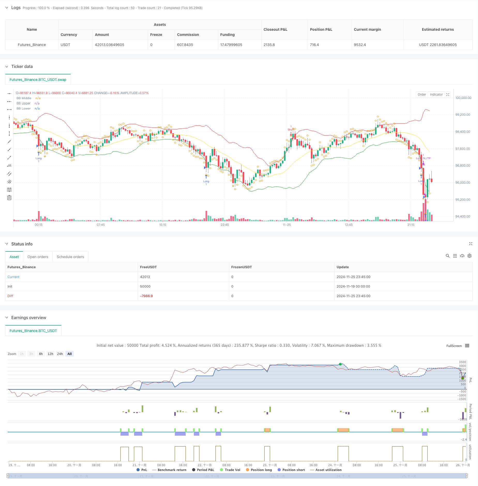

> Name

Mean-Reversion-Strategy-with-Bollinger-Bands-RSI-and-ATR-Based-Dynamic-Stop-Loss-System
> Author

ChaoZhang

> Strategy Description



[trans]
#### Overview
This strategy is a quantitative trading system based on the mean reversion theory, which combines Bollinger Bands, RSI indicators and ATR dynamic stop loss mechanisms. The strategy trades by identifying extreme situations where the price deviates from the mean. It goes long when the price touches the lower Bollinger Band and the RSI is in the oversold area. It goes short when the price touches the upper Bollinger Band and the RSI is in the overbought area. Stop-loss and stop-profit positions are dynamically set through ATR to achieve effective management of risk and return.
#### Strategy Principle
The strategy uses 20-period Bollinger Bands as the main trend judgment indicator, and the standard deviation multiple is set to 2.0, which is used to determine the upper and lower boundaries of price fluctuations. At the same time, the 14-period RSI is introduced as an auxiliary indicator. An RSI below 30 is considered oversold, and an RSI above 70 is considered overbought. When the price falls below the lower Bollinger Band and the RSI is below 30, it indicates that the market may be oversold, and the system sends a long signal; when the price breaks through the upper Bollinger Band and the RSI is above 70, it indicates that the market may be overbought, and the system sends a short signal. The strategy uses the middle rail of the Bollinger Bands as the profit-taking point, and combines RSI reverse breakthroughs for position management. In addition, the strategy also introduces a dynamic stop-loss and take-profit mechanism based on 14-period ATR. The stop-loss is set to 2 times ATR and the take-profit is set to 3 times ATR to achieve more precise risk control.
#### Strategic Advantages
1. Combined with multi-indicator cross-validation: Through the collaborative cooperation of Bollinger Bands and RSI, false signals are effectively filtered and trading accuracy is improved.
2. Dynamic stop loss mechanism: ATR is used to dynamically adjust the stop loss and profit positions to make risk management more adaptable to market fluctuations.
3. Complete closed-loop trading: including clear entry and exit conditions and risk management mechanisms, with complete and clear logic.
4. Strong adaptability: strategy parameters can be optimized and adjusted according to different market characteristics.
#### Strategy Risk
1. Trending market risk: Mean reversion strategies may frequently stop losses in strong trending markets.
2. Parameter sensitivity: The settings of parameters such as Bollinger Band cycle and RSI threshold have a greater impact on strategy performance.
3. Seize the opportunity to close positions: Closing positions in the middle track may lead to early exit from favorable market conditions.
4. Stop loss width: A fixed multiple of ATR stop loss may be too large when fluctuations are severe.
#### Strategy optimization direction
1. Add a trend filter: Consider adding a longer period moving average to avoid counter-trend trades in strong trending markets.
2. Introduce trading volume indicators: use trading volume as a confirmation indicator for trading signals to improve trading quality.
3. Optimize the profit-taking mechanism: Consider using trailing stop or batch-based profit-taking methods to improve profitability.
4. Dynamically adjust parameters: Adaptively adjust the parameter settings of Bollinger Bands and RSI based on market volatility.
#### Summary
This strategy builds a complete mean reversion trading system through the combined application of Bollinger Bands and RSI. The introduction of ATR dynamic stop loss effectively controls risks and gives the strategy good risk-return characteristics. Although there is some room for optimization, the overall design concept is clear and practical. It is recommended that traders adjust parameters according to specific market characteristics and continue to monitor strategy performance when applying it in real markets.
||

#### Overview
This strategy is a quantitative trading system based on mean reversion theory, combining Bollinger Bands, RSI indicators, and ATR-based dynamic stop-loss mechanism. The strategy trades by identifying extreme price deviations from the mean, going long when price touches the lower Bollinger Band and RSI is in oversold territory, and going short when price touches the upper Bollinger Band and RSI is in overbought territory, while using ATR to dynamically set stop-loss and take-profit levels for effective risk-reward management.

#### Strategy Principles
The strategy employs 20-period Bollinger Bands as the primary trend indicator, with a standard deviation multiplier of 2.0 to determine price movement boundaries. A 14-period RSI is incorporated as a supplementary indicator, with readings below 30 considered oversold and above 70 considered overbought. Long positions are initiated when price breaks below the lower band and RSI is below 30, indicating potential oversold conditions, while short positions are taken when price breaks above the upper band and RSI is above 70, indicating potential overbought conditions. The middle band serves as the profit-taking level, combined with RSI reversal signals for position management. Additionally, a 14-period ATR-based dynamic stop-loss mechanism is implemented, with stops set at 2x ATR and profit targets at 3x ATR for precise risk control.

#### Strategy Advantages
1. Multi-indicator cross-validation: The combination of Bollinger Bands and RSI effectively filters false signals and improves trading accuracy.
2. Dynamic stop-loss mechanism: ATR-based adjustment of stop-loss and take-profit levels adapts to market volatility.
3. Complete trading loop: Includes clear entry, exit conditions, and risk management mechanisms with coherent logic.
4. High adaptability: Strategy parameters can be optimized for different market characteristics.

#### Strategy Risks
1. Trend market risk: Mean reversion strategies may experience frequent stops in strong trend markets.
2. Parameter sensitivity: Settings for Bollinger Bands period and RSI thresholds significantly impact strategy performance.
3. Exit timing: Middle band exits may result in premature position closure during favorable conditions.
4. Stop-loss magnitude: Fixed ATR multiplier stops may be excessive during high volatility periods.

#### Optimization Directions
1. Add trend filters: Consider incorporating longer-period moving averages to avoid counter-trend trades in strong trends.
2. Integrate volume indicators: Use volume as a trade signal confirmation indicator to improve trade quality.
3. Optimize profit-taking: Consider implementing trailing stops or scaled exit methods to enhance profitability.
4. Dynamic parameter adjustment: Implement adaptive adjustment of Bollinger Bands and RSI parameters based on market volatility.

#### Summary
The strategy constructs a comprehensive mean reversion trading system through the combined application of Bollinger Bands and RSI. The introduction of ATR-based dynamic stops effectively controls risk, providing favorable risk-reward characteristics. While there is room for optimization, the overall design concept is clear and practical. Traders are advised to adjust parameters according to specific market characteristics and continuously monitor strategy performance when implementing in live trading.[/trans]


> Source (PineScript)

``` pinescript
/*backtest
start: 2024-11-19 00:00:00
end: 2024-11-26 00:00:00
period: 15m
basePeriod: 15m
exchanges: [{"eid":"Futures_Binance","currency":"BTC_USDT"}]
*/

//@version=5
strategy("SOL/USDT Mean Reversion Strategy", overlay=true)

// Input parameters
length = input(20, "Bollinger Band Length")
std_dev = input(2.0, "Standard Deviation")
rsi_length = input(14, "RSI Length")
rsi_oversold = input(30, "RSI Oversold")
rsi_overbought = input(70, "RSI Overbought")

// Calculate indicators
[middle, upper, lower] = ta.bb(close, length, std_dev)
rsi = ta.rsi(close, rsi_length)

// Entry conditions
long_entry = close < lower and rsi < rsi_oversold
short_entry = close > upper and rsi > rsi_overbought

// Exit conditions
long_exit = close > middle or rsi > rsi_overbought
short_exit = close < middle or rsi < rsi_oversold

// Strategy execution
if (long_entry)
    strategy.entry("Long", strategy.long)

if (short_entry)
    strategy.entry("Short", strategy.short)

if (long_exit)
    strategy.close("Long")

if (short_exit)
    strategy.close("Short")

// Stop loss and take profit
atr = ta.atr(14)
strategy.exit("Long SL/TP", "Long", stop=strategy.position_avg_price - 2*atr, limit=strategy.position_avg_price + 3*atr)
strategy.exit("Short SL/TP", "Short", stop=strategy.position_avg_price + 2*atr, limit=strategy.position_avg_price - 3*atr)

// Plot indicators
plot(middle, color=color.yellow, title="BB Middle")
plot(upper, color=color.red, title="BB Upper")
plot(lower, color=color.green, title="BB Lower")

// Plot entry and exit points
plotshape(long_entry, title="Long Entry", location=location.belowbar, color=color.green, style=shape.triangleup, size=size.small)
plotshape(short_entry, title="Short Entry", location=location.abovebar, color=color.red, style=shape.triangledown, size=size.small)
plotshape(long_exit, title="Long Exit", location=location.abovebar, color=color.orange, style=shape.circle, size=size.small)
plotshape(short_exit, title="Short Exit", location=location.belowbar, color=color.orange, style=shape.circle, size=size.small)


```

> Detail

https://www.fmz.com/strategy/473125

> Last Modified

2024-11-27 14:28:17
