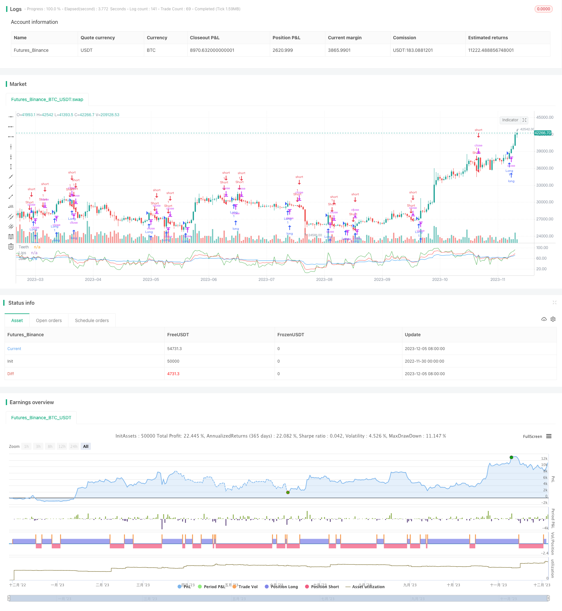

> Name

RSI Alligator Trading Strategy Alligator-RSI-Trading-Strategy
> Author

ChaoZhang

> Strategy Description


[trans]

## Overview
The RSI Alligator trading strategy is a quantitative trading strategy that uses multiple moving average combinations of the Relative Strength Index (RSI) to determine market trends and issue trading signals. This strategy draws on the alligator's predatory principle and starts trading when the short-term RSI line crosses the long-term RSI line.
## Strategy Principle
The RSI Alligator trading strategy simultaneously utilizes the three RSI moving averages on the 5th, 13th, and 34th. Among them, the 5-day RSI line is called the "teeth" line, the 13-day line is called the "lips" line, and the 34-day line is called the "chin" line. When the "teeth" line or the "lips" line crosses the "chin" line, a long signal is sent; when the "teeth" line or the "lips" line crosses below the "chin" line, a short signal is sent.
The key to the trading strategy is to capture the intersection of the short-term RSI line and the long-term RSI line to determine the relationship between the short-term and long-term trends of the market and look for reversal opportunities. When the short-term RSI line crosses the long-term RSI line, it means that the short-term price has reversed. At this time, taking a position in the opposite direction can profit from the impending long-term trend reversal.
## Strategic advantage analysis
The RSI Alligator trading strategy has the following advantages:
1. Capture market reversals, profit from trend reversals
2. Use multiple RSI moving averages to confirm signals, avoid false signals
3. Simple and easy to understand transaction logic, easy to understand and implement
4. Adjustable parameters
5. Works on various markets and timeframes
## Risk Analysis
The RSI Alligator trading strategy also carries the following risks:
1. Prone to false signals, prone to false signals
2. Unable to filter out volatile markets, struggles during range-bound markets
3. Potentially large drawdowns
4. Time-consuming parameter tuning is required.
5. Frequent trading, potentially overtrading
These risks can be mitigated by combining other indicators, optimizing parameters, and appropriately adjusting the position size.
## Strategy optimization direction
The RSI Alligator trading strategy can be optimized from the following aspects:
1. Combine other technical indicators, such as Bollinger Bands, K-line patterns, etc., to filter out wrong signals
2. Optimize RSI parameters and find the best moving average parameter combination
3. Adjust position size and stop loss position according to market conditions
4. Test the parameter effects of different trading varieties and time periods
5. Add machine learning algorithm and optimize parameters in real time
## Summarize
The RSI Alligator trading strategy utilizes multiple RSI moving average crossovers to capture market reversal opportunities. It is simple and practical, suitable for automated trading, but it also has certain flaws. This strategy can be strengthened through parameter optimization and indicator combination, making it a stable and profitable algorithmic trading strategy.
|| 

## Overview

The Alligator RSI trading strategy is a quantitative trading strategy that uses a combination of multiple Relative Strength Index (RSI) moving averages to determine market trends and generate trading signals. The strategy draws inspiration from how alligators hunt, opening trades when short-term RSI lines cross long-term RSI lines.  

## Strategy Logic

The Alligator RSI trading strategy utilizes three RSI lines - 5-period, 13-period and 34-period. The 5-period RSI line is called the "Teeth" line, the 13-period line the “Lips” line and the 34-period line the “Jaw” line. When the "Teeth" or “Lips” line crosses above the “Jaw” line, a long signal is generated. When the "Teeth" or “Lips” line crosses below the “Jaw” line, a short signal is triggered.

The key lies in capturing crosses between short-term and long-term RSI lines to gauge the relationship between short-term and long-term trends, and identify reversal opportunities. When short-term RSI crosses long-term RSI, it signals a reversal in short-term price action, allowing profits from the impending long-term trend reversal by taking a position in the opposite direction.  

## Advantage Analysis

The Alligator RSI trading strategy has the following advantages:

1. Captures market reversals, profit from trend reversals  
2. Multiple RSI MAs confirm signals, avoid false signals
3. Simple and easy-to-understand logic, easy to understand and implement
4. Adjustable parameters, adjustable parameters
5. Applicable across markets and timeframes, works on various markets and timeframes

## Risk Analysis  

The Alligator RSI trading strategy also has the following risks:

1. Prone to false signals, prone to false signals
2. Struggles during range-bound markets, struggles during range-bound markets   
3. Potentially large drawdowns, potentially large drawdowns
4. Time-consuming parameter tuning, time-consuming parameter tuning  
5. Potential overtrading, potentially overtrading

These risks can be mitigated by combining additional indicators, optimizing parameters and adjusting position sizing appropriately.  

## Optimization Directions  

The Alligator RSI trading strategy can be optimized in the following ways:  

1. Combine other technical indicators like Bollinger Bands, candlestick patterns to filter false signals
2. Optimize RSI parameters to find best MA parameter combination  
3. Adjust position sizing and stop loss based on market conditions  
4. Test parameter effectiveness across different products and timeframes
5. Incorporate machine learning to dynamically optimize parameters  

## Conclusion

The Alligator RSI trading strategy uses RSI MA crosses to capture market reversal opportunities. It is simple, usable for algo-trading but has some flaws. Parameter optimization and indicator combinations can enhance this strategy to make it a steady profitable algorithmic trading strategy.

[/trans]

> Strategy Arguments


|Argument|Default|Description|
|----|----|----|
|v_input_1|10|Stop Loss %|
|v_input_2|90|Take Profit %|


> Source (PineScript)

``` pinescript
/*backtest
start: 2022-11-30 00:00:00
end: 2023-12-06 00:00:00
period: 1d
basePeriod: 1h
exchanges: [{"eid":"Futures_Binance","currency":"BTC_USDT"}]
*/

//@version=3
strategy("RSI Alligator", overlay=false)

jaws = rsi(close, 34)
teeth = rsi(close, 5)
lips = rsi(close, 13)
plot(jaws, color=blue, title="Jaw")
plot(teeth, color=green, title="Teeth")
plot(lips, color=red, title="Lips")


longCondition = crossover(rsi(close, 13), rsi(close, 34)) and (rsi(close, 5) > rsi(close, 34))
longCondition1 = crossover(rsi(close, 5), rsi(close, 34)) and (rsi(close, 13) > rsi(close, 34))
if (longCondition)
    strategy.entry("Long", strategy.long)
if (longCondition1)
    strategy.entry("Long", strategy.long)

shortCondition = crossunder(rsi(close, 13), rsi(close, 34)) and (rsi(close, 5) < rsi(close, 34))
shortCondition1 = crossunder(rsi(close, 5), rsi(close, 34)) and (rsi(close, 13) < rsi(close, 34))
if (shortCondition)
    strategy.entry("Short", strategy.short)
if (shortCondition1)
    strategy.entry("Short", strategy.short)
    
    // === BACKTESTING: EXIT strategy ===
sl_inp = input(10, title='Stop Loss %', type=float)/100
tp_inp = input(90, title='Take Profit %', type=float)/100

stop_level = strategy.position_avg_price * (1 - sl_inp)
take_level = strategy.position_avg_price * (1 + tp_inp)

strategy.exit("Stop Loss/Profit", "Long", stop=stop_level, limit=take_level)
```

> Detail

https://www.fmz.com/strategy/434562

> Last Modified

2023-12-07 15:46:57
