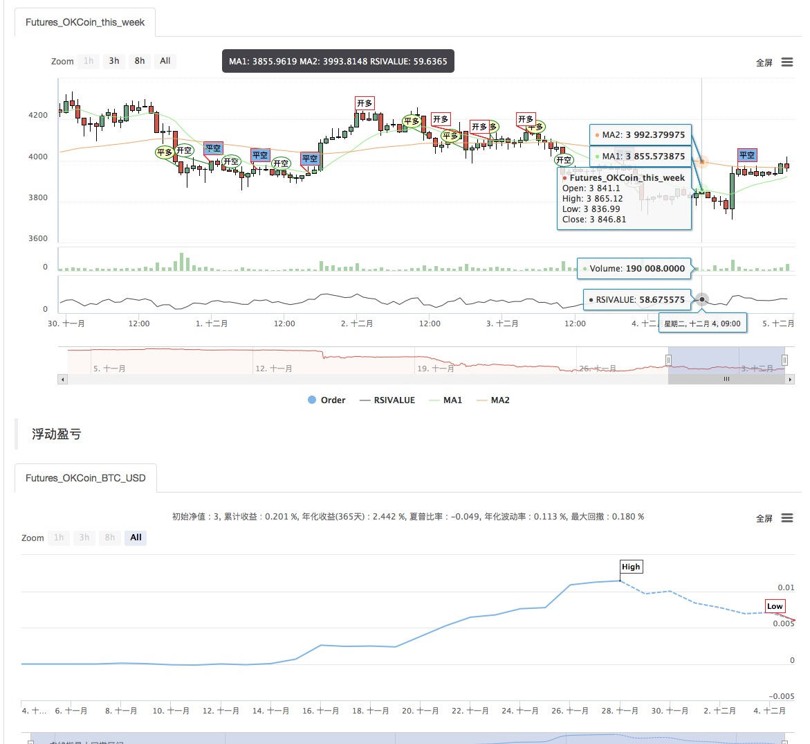
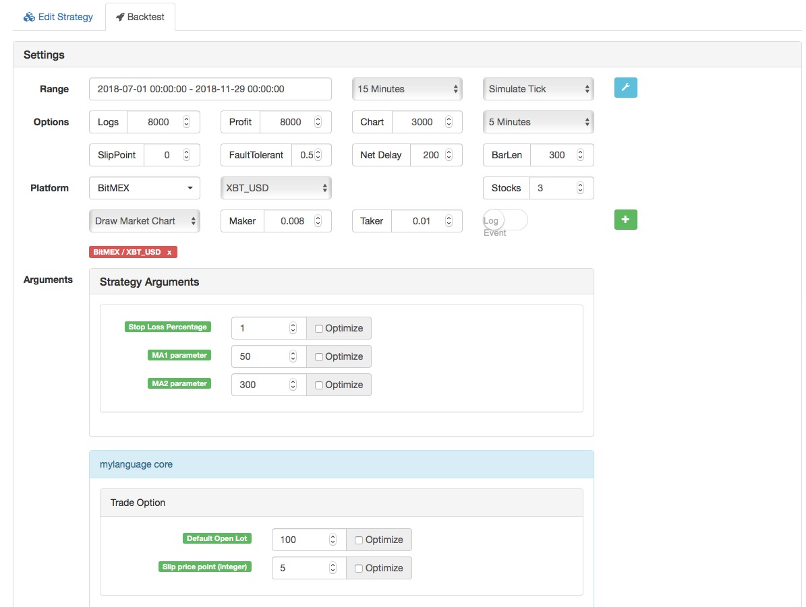
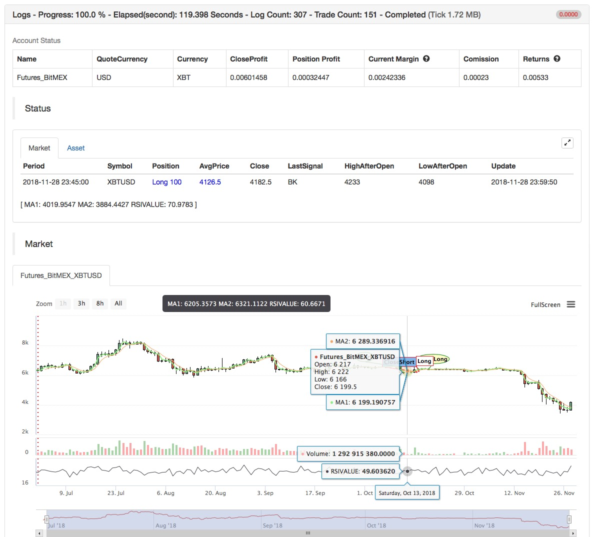

> Name

Combination-of-Double-MA-and-RSI
> Author

Archimedes' bathtub
> Strategy Description

[trans]

- Strategy name: Double moving average strategy and relative strength RSI indicator combination
- Data cycle: 15M, 30M, etc.
-Support: commodity futures, digital currency
- Official website: www.quantinfo.com
 

- Main picture:
  Moving average 1, formula: MA1^^EMA(C,N1);
  Moving average 2, formula: MA2^^EMA(C,N2);
- Sub-picture:
  RSI, formula: RSIVALUE:SMA(MAX(CLOSE-REF(CLOSE,1),0),LENGTH,1)/SMA(ABS(CLOSE-REF(CLOSE,1)),LENGTH,1)*100;
||

- Strategy Name: Combination of Double MA and RSI
- Data Cycle: 15M, 30M, etc.
- Support: Commodity Futures

    
   

- Main chart:
  MA 1, formula: MA1 ^^ EMA (C, N1);
  MA 2, formula: MA2 ^^ EMA (C, N2);

- Secondary chart:
  RSI, formula:
  RSIVALUE:SMA(MAX(CLOSE-REF(CLOSE,1),0),LENGTH,1)/SMA(ABS(CLOSE-REF(CLOSE,1)),LENGTH,1)*100;


[/trans]

> Strategy Arguments


|Argument|Default|Description|
|----|----|----|
|SLOSS|true|Stop Loss Percentage|
|N1|50|MA1 parameter|MA1 parameter|
|N2|300|MA2 parameter|MA2 parameter|

> Source (MyLanguage)

``` pascal
(*backtest
start: 2018-11-05 00:00:00
end: 2018-12-05 00:00:00
period: 15m
exchanges: [{"eid":"Futures_OKCoin","currency":"BTC_USD"}]
args: [["ContractType","this_week",126961]]
*)

MA1^^EMA(C,N1);
MA2^^EMA(C,N2);

LENGTH:=9;
OVERBOUGHT:=70;
OVERSOLD:=100-OVERBOUGHT;
RSIVALUE:SMA(MAX(CLOSE-REF(CLOSE,1),0),LENGTH,1)/SMA(ABS(CLOSE-REF(CLOSE,1)),LENGTH,1)*100;
BUYK:=BKVOL=0 AND BARPOS>N2 AND MA1>MA2 AND C>MAX(MA1,MA2) AND CROSSUP(RSIVALUE,OVERBOUGHT);
SELLK:=SKVOL=0 AND BARPOS>N2 AND MA1<MA2 AND C<MIN(MA1,MA2) AND CROSSDOWN(RSIVALUE,OVERSOLD);
SELLY:=MA1<MA2 AND C>BKPRICE*(1+SLOSS*0.01);
BUYY:=MA1>MA2 AND C<SKPRICE*(1-SLOSS*0.01);
SELLS:=C<BKPRICE*(1-SLOSS*0.01);
BUYS:=C>SKPRICE*(1+SLOSS*0.01);

BUYK,BK;
SELLK,SK;
SELLY,SP(BKVOL);
BUYY,BP(SKVOL);
SELLS,SP(BKVOL);
BUYS,BP(SKVOL);
```

> Detail

https://www.fmz.com/strategy/128250

> Last Modified

2019-08-20 10:29:50
