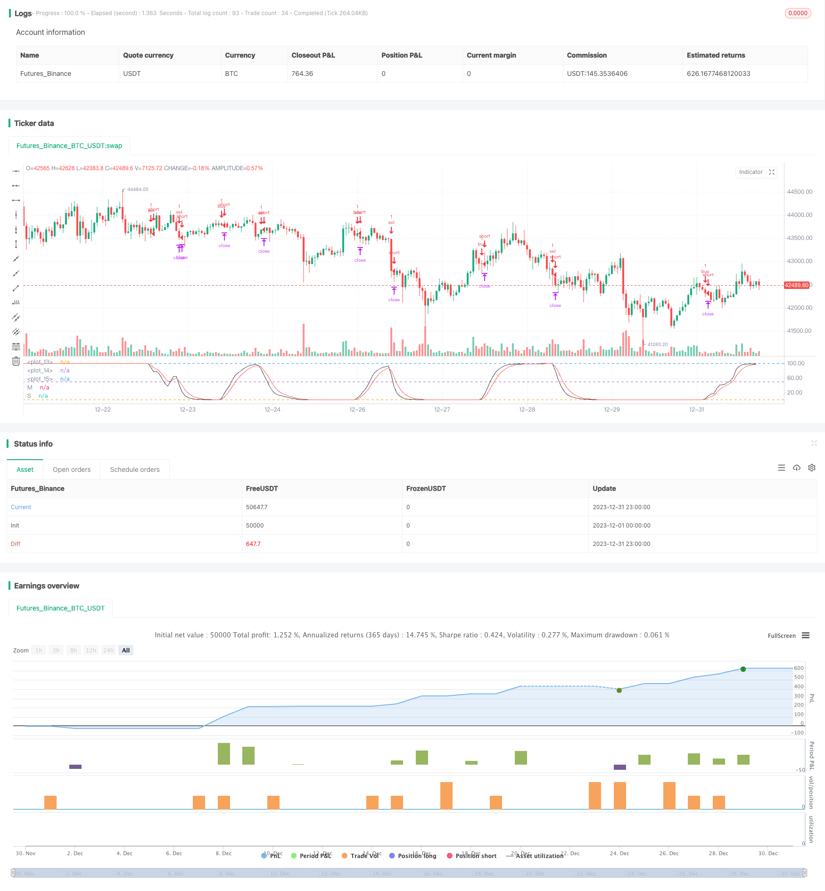

> Name

Double-Exponential-Moving-Average-RSI-Trading-Strategy Double-Exponential-Moving-Average-RSI-Trading-Strategy
> Author

ChaoZhang

> Strategy Description


 [trans]
## Overview
The name of this strategy is "Double Exponential Moving Average RSI Trading Strategy". This strategy uses the Double Exponential Moving Average (Double EMA) and the Relative Strength Index (RSI) as the main trading indicators to achieve mechanized trading.
## Strategy Principle
This strategy first calculates the double exponential moving average (MA) of the price, then calculates the RSI based on the MA, and then calculates the exponential moving average (Smooth) of the RSI. A buy signal is generated when the RSI crosses above its moving average; a sell signal is generated when the RSI crosses below its moving average. Optionally, this strategy also sets parameters such as the maximum number of daily transactions, trading capital share, trading time period, stop-loss and stop-profit points, and trailing stop-loss points for risk control.
## Strategic Advantages
1. Using the double exponential moving average can respond to price changes faster and filter out some noise.
2. Calculate RSI based on the moving average to make it more stable and avoid mistaken transactions.  
3. The moving average of RSI helps confirm trading signals and filter out false breakthroughs.
4. Set the maximum number of transactions to help control daily risks.
5. Set the trading capital share to avoid excessive losses in a single transaction. 
6. Set trading time periods, avoid key time nodes, and control liquidity risks.
7. Set stop loss and stop profit points to help limit single profit and loss.
8. Trailing stop loss points help lock in floating profits and reduce retracement.
## Strategy Risk
1. The double exponential moving average responds slowly to market emergencies and may miss short-term trading opportunities.
2. RSI can easily form misleading signals of dead cross and golden cross. It is necessary to trade with caution in combination with other indicators. 
3. The fixed trading capital ratio cannot correspond to the range of market fluctuations, and there is a risk of insufficient capital utilization.
4. Fixed stop-loss and take-profit are difficult to adapt to different varieties and market conditions, and there is a risk of premature stop-loss or take-profit.
5. Trailing stop loss may be triggered too frequently in volatile markets.
Countermeasures:
1. Appropriately shorten the moving average period and improve sensitivity.
2. Combine with other indicators such as trading volume to filter signals.   
3. Dynamically adjust the trading capital ratio.  
4. Adjust the stop-loss and stop-profit ranges according to market volatility and changes.
5. Appropriately relax the trailing stop loss points.
## Strategy optimization direction
1. Test double exponential moving average combinations of different lengths and short periods to find the optimal parameters.
2. Test the calculation period parameters of RSI to improve the reliability of golden/dead cross signals.
3. Add trading volume, Bollinger Bands and other indicators to filter signal noise.  
4. Dynamically adjust the trading capital ratio and stop loss and profit range based on the day's closing price, volatility, etc.  
5. Optimize the trailing stop loss mechanism according to the characteristics of different varieties and market environment.
## Summarize
The overall mechanic rules of this strategy are clear, the reliability is high, and it is suitable for medium and long-term trend varieties. After optimization, it can become a basic trend-following mechanical trading strategy with controllable risks and is worthy of further evaluation of the actual effect.
||

## Overview

The strategy is named "Double Exponential Moving Average RSI Trading Strategy". It uses Double EMA and Relative Strength Index (RSI) as the main trading indicators to implement automated trading.  

## Strategy Principle   

The strategy first calculates the Double Exponential Moving Average (MA) of the price, then calculates the RSI based on MA, and further calculates the Exponential Moving Average of RSI (Smooth). It generates buy signals when RSI crosses above its moving average and sell signals when RSI crosses below its moving average. Optionally, the strategy also sets parameters for maximum number of trades per day, trade size as percentage of equity, trading time session, take profit and stop loss in points, and trailing stop in points for risk control.

## Strategy Strengths

1. Double EMA responds faster to price changes and filters out some noise. 
2. Calculating RSI based on MA makes it more stable and avoids false trades.
3. The moving average of RSI helps confirming trading signals and avoiding false breakouts.  
4. Setting maximum number of trades per day helps controlling daily risk.
5. Setting trade size as percentage of equity avoids oversized single trade loss.
6. Setting trading time session avoids key time nodes and controls liquidity risk.  
7. Take profit and stop loss in points help limiting single trade P&L.
8. Trailing stop in points helps locking in floating profits and reducing drawdowns.

## Strategy Risks  

1. Double EMA responds slower to market events, missing short-term trading opportunities.  
2. RSI is prone to forming false death/golden cross signals. Needs confirming with other indicators for prudent trading.
3. Fixed percentage of equity cannot adapt to varying market volatility, risks insufficient fund utilization.  
4. Fixed stop loss/profit targets fail to adapt to different products and market conditions, risks premature exit. 
5. Trailing stop tends to trigger too often in choppy markets.

Counter measures:
1. Shorten MA periods to improve sensitivity.  
2. Add other indicators like volume to filter signals.
3. Dynamically adjust trade size.   
4. Adapt stop loss/profit targets based on market volatility. 
5. Relax trailing stop loss points appropriately.

## Optimization Directions   

1. Test different short/long period Double EMA combinations to find optimum parameters.  
2. Test RSI calculation period parameters to improve death/golden cross signal reliability.  
3. Add indicators like volume, Bollinger Bands to filter signal noise.
4. Dynamically adjust trade size and stop loss/profit targets based on daily close price, volatility etc.
5. Optimize trailing stop mechanisms for different products and market environments.  

## Summary

The strategy has clear mechanical rules and high reliability overall, suitable for medium-to-long-term trending products. When optimized, it can become a basic trend following mechanical strategy with controllable risks, worth further evaluation on live performance.

[/trans]

> Strategy Arguments


|Argument|Default|Description|
|----|----|----|
|v_input_1_close|0|src: close|high|low|open|hl2|hlc3|hlcc4|ohlc4|
|v_input_2|21|ma_length|
|v_input_3|4|rsi_length|
|v_input_4|4|rsi_smooth|
|v_input_5|6|max_order_per_day|
|v_input_6|false|trade_size_as_equity_factor|
|v_input_7|10000|trade_size|
|v_input_8|100000|take_profit_in_points|
|v_input_9|100000|stop_loss_in_points|
|v_input_10|150|trail_in_points|
|v_input_11|true|USE_SESSION|
|v_input_12|0400-1500|Trade Session:|


> Source (PineScript)

``` pinescript
/*backtest
start: 2023-12-01 00:00:00
end: 2023-12-31 23:59:59
period: 1h
basePeriod: 15m
exchanges: [{"eid":"Futures_Binance","currency":"BTC_USDT"}]
*/

//@version=2
strategy(title='[STRATEGY][RS]DemaRSI V0', shorttitle='D', overlay=false, initial_capital=100000, currency=currency.USD)
src = input(close)
ma_length = input(21)
rsi_length = input(4)
rsi_smooth = input(4)

ma = ema(ema(src, ma_length), ma_length)
marsi = rsi(ma, rsi_length)
smooth = ema(marsi, rsi_smooth)
plot(title='M', series=marsi, color=black)
plot(title='S', series=smooth, color=red)
hline(0)
hline(50)
hline(100)

max_order_per_day = input(6)
// strategy.risk.max_intraday_filled_orders(max_order_per_day)
trade_size_as_equity_factor = input(false)
trade_size = input(type=float, defval=10000.00) * (trade_size_as_equity_factor ? strategy.equity : 1)
take_profit_in_points = input(100000)
stop_loss_in_points = input(100000)
trail_in_points = input(150)

USE_SESSION = input(true)
trade_session = input(title='Trade Session:', defval='0400-1500', confirm=false)
istradingsession = not USE_SESSION ? true : not na(time('1', trade_session))

buy_entry = istradingsession and crossover(marsi, smooth)
sel_entry = istradingsession and crossunder(marsi, smooth)

strategy.entry('buy', long=true, qty=1, when=buy_entry)
strategy.entry('sel', long=false, qty=1, when=sel_entry)

strategy.exit('buy.Exit', from_entry='buy', profit=take_profit_in_points, loss=stop_loss_in_points, trail_points=trail_in_points, trail_offset=trail_in_points)
strategy.exit('sel.Exit', from_entry='sel', profit=take_profit_in_points, loss=stop_loss_in_points, trail_points=trail_in_points, trail_offset=trail_in_points)
strategy.close_all(when=not istradingsession)
```

> Detail

https://www.fmz.com/strategy/440437

> Last Modified

2024-01-30 15:44:11
