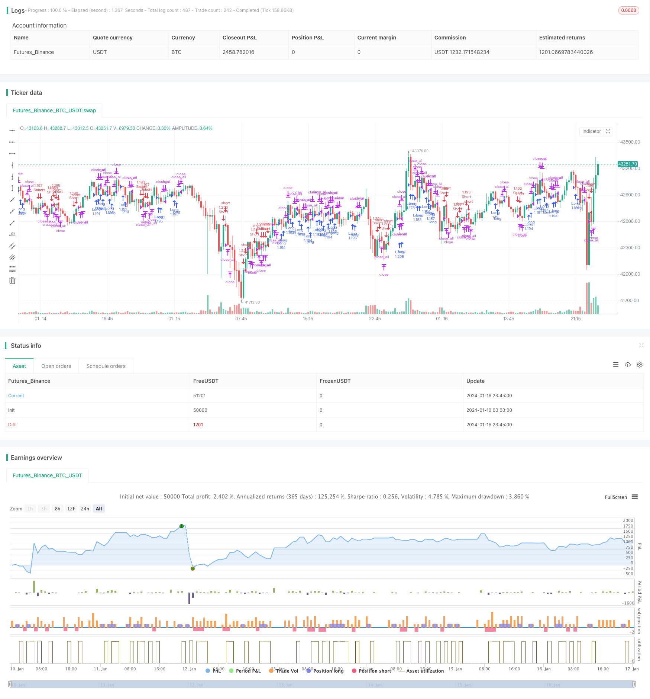

> Name

Dual-RSI-Breakthrough-Strategy Dual-RSI-Breakthrough-Strategy
> Author

ChaoZhang

> Strategy Description


 [trans]
## Overview
The double RSI breakout strategy is a quantitative trading strategy that uses both fast RSI and slow RSI indicators to generate trading signals. This strategy forms a trading signal through the breakthrough between the fast and slow RSI indicators to achieve the effect of tracking the market trend.
## Strategy Principle
This strategy uses two RSI indicators at the same time, a fast RSI indicator with a period of 2 and a slow RSI indicator with a period of 14. The strategy's trading signals come from a breakout between the two RSI indicators.
When the slow RSI is greater than 50 and the fast RSI is less than 50, a long signal is generated; when the slow RSI is less than 50 and the fast RSI is greater than 50, a short signal is generated. After going long or short, if a stop loss signal appears (a red K-line bar appears when a long order loses, a green K-line bar appears when a short order loses), the position will be closed with a stop loss.
## Advantage Analysis
- Use the overbought and oversold characteristics of the RSI indicator to form trading signals to avoid chasing highs and selling lows;
- Used in combination with fast and slow RSI, it can track changes in market trends and achieve timely entries and exits;
- Track mid- to long-term trends and avoid being disturbed by short-term market noise;
- Risk control is in place and there is a stop-loss mechanism.
## Risks and Solutions
- Risk of false breakouts. The solution is to reasonably set the parameters of fast and slow RSI to ensure a real breakthrough.
- Risks arising from improperly set stop loss points. The solution is to set a reasonable stop loss distance based on market volatility.
- Risk of spiral losses. The solution is not to chase the rise or fall, but to make entries and exits according to the strategy rules.
## Optimization direction
This strategy can also be optimized from the following aspects:
1. The parameters of fast and slow RSI can be optimized to find the best parameter combination;
2. Other indicators can be introduced for combination to form more reliable trading signals;
3. You can set a dynamic stop loss and adjust the stop loss point in real time according to market fluctuations.
## Summarize
The double RSI breakthrough strategy uses fast and slow RSI indicators to track market trend changes and form trading signals in overbought and oversold areas, which can effectively avoid chasing highs and selling lows. At the same time, a stop-loss mechanism is set up to control risks. This strategy is simple to operate, easy to implement, and suitable for quantitative trading. Through parameter optimization, combination of indicators, etc., the strategy profit factor can be further improved.
|| 

## Overview  

The Dual RSI Breakthrough Strategy is a quantitative trading strategy that generates trading signals by using both fast and slow RSI indicators. The strategy forms trading signals through the breakthrough between the fast and slow RSI indicators to track market trends.

## Strategy Principle

The strategy uses two RSI indicators simultaneously, a fast RSI indicator with a period of 2 and a slow RSI indicator with a period of 14. The trading signals of the strategy come from the breakthrough between the two RSI indicators.  

When the slow RSI is greater than 50 and the fast RSI is less than 50, a long signal is generated. When the slow RSI is less than 50 and the fast RSI is greater than 50, a short signal is generated. After going long or short, if a stop loss signal occurs (a red K-line column appears when the long position loses money, and a green K-line column appears when the short position loses money), the position will be closed.

## Advantage Analysis

- Form trading signals by using the overbought and oversold features of RSI indicators to avoid chasing peaks and killing bottoms.
- The combination of fast and slow RSI can track trend changes to realize timely entries and exits.
- Track medium and long term trends and avoid being disturbed by short term market noise.
- Good risk control with stop loss mechanism.

## Risks and Solutions

- Risk of false breakthrough. The solution is to reasonably set the parameters of fast and slow RSI to ensure true breakthrough.
- Risk from improper stop loss point setting. The solution is to reasonably set the stop loss distance based on market volatility. 
- Risk of spiral losses. The solution is not to chase rises and beat declines, and make entries and exits according to the strategy rules.

## Optimization Directions  

The strategy can also be optimized in the following aspects:

1. Optimize the parameters of fast and slow RSI to find the best parameter combination;
2. Introduce other indicators to form more reliable trading signals;
3. Set dynamic stop loss and adjust the stop loss point in real time according to market volatility.

## Conclusion  

The dual RSI breakthrough strategy uses fast and slow RSI indicators to track market trend changes and forms trading signals in overbought and oversold areas, which can effectively avoid chasing peaks and killing bottoms. At the same time, a stop loss mechanism is set up to control risks. The strategy is simple to operate and easy to implement, suitable for quantitative trading. The profit factor can be further improved through parameter optimization, combination indicators, etc.

[/trans]

> Strategy Arguments


|Argument|Default|Description|
|----|----|----|
|v_input_1|true|Long|
|v_input_2|true|Short|
|v_input_3|true|leverage|
|v_input_4|2|Fast RSI Period|
|v_input_5|14|Slow RSI Period|
|v_input_6|2018|From Year|
|v_input_7|2100|To Year|
|v_input_8|true|From Month|
|v_input_9|12|To Month|
|v_input_10|true|From day|
|v_input_11|31|To day|


> Source (PineScript)

``` pinescript
/*backtest
start: 2024-01-10 00:00:00
end: 2024-01-17 00:00:00
period: 15m
basePeriod: 5m
exchanges: [{"eid":"Futures_Binance","currency":"BTC_USDT"}]
*/

//Noro
//2018

//@version=2
strategy(title = "Noro's Double RSI Strategy 1.0", shorttitle = "2RSI str 1.0", overlay=true )

//Settings
needlong = input(true, defval = true, title = "Long")
needshort = input(true, defval = true, title = "Short")
leverage = input(1, defval = 1, minval = 1, maxval = 100, title = "leverage")
fast = input(2, defval = 2, minval = 2, maxval = 100, title = "Fast RSI Period")
slow = input(14, defval = 14, minval = 2, maxval = 100, title = "Slow RSI Period")
fromyear = input(2018, defval = 2018, minval = 1900, maxval = 2100, title = "From Year")
toyear = input(2100, defval = 2100, minval = 1900, maxval = 2100, title = "To Year")
frommonth = input(01, defval = 01, minval = 01, maxval = 12, title = "From Month")
tomonth = input(12, defval = 12, minval = 01, maxval = 12, title = "To Month")
fromday = input(01, defval = 01, minval = 01, maxval = 31, title = "From day")
today = input(31, defval = 31, minval = 01, maxval = 31, title = "To day")

//Fast RSI
fastup = rma(max(change(close), 0), fast)
fastdown = rma(-min(change(close), 0), fast)
fastrsi = fastdown == 0 ? 100 : fastup == 0 ? 0 : 100 - (100 / (1 + fastup / fastdown))

//Slow RSI
slowup = rma(max(change(close), 0), slow)
slowdown = rma(-min(change(close), 0), slow)
slowrsi = slowdown == 0 ? 100 : slowup == 0 ? 0 : 100 - (100 / (1 + slowup / slowdown))

//Signals
up = slowrsi > 50 and fastrsi < 50
dn = slowrsi < 50 and fastrsi > 50
exit = (strategy.position_size > 0 and close > open) or (strategy.position_size < 0 and close < open)
lot = strategy.position_size == 0 ? strategy.equity / close * leverage : lot[1]

//Trading
if up
    if strategy.position_size < 0
        strategy.close_all()
        
    strategy.entry("Long", strategy.long, needlong == false ? 0 : lot )

if dn
    if strategy.position_size > 0
        strategy.close_all()
        
    strategy.entry("Short", strategy.short, needshort == false ? 0 : lot )
    
if exit
    strategy.close_all()
```

> Detail

https://www.fmz.com/strategy/439231

> Last Modified

2024-01-18 15:25:11
