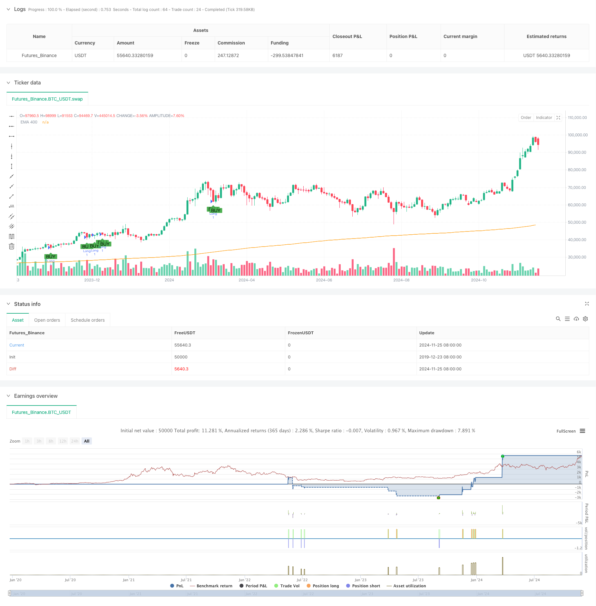

> Name

Dynamic-Multi-Period-Quantitative-Trading-Strategy-Combining-RSI-and-EMA
> Author

ChaoZhang

> Strategy Description



[trans]
#### Overview
This strategy is a quantitative trading system based on the RSI indicator and the EMA moving average. It trades by combining the overbought and oversold signals of the Relative Strength Index (RSI) with the trend confirmation of the Moving Average (EMA). The strategy includes a risk management module, which controls risk by setting Stop-Loss and Take-Profit. According to the backtest data, when multiple trading varieties were tested within a 15-minute time period, about 70% of the trading varieties achieved profitability.
#### Strategy Principle
The core logic of the strategy is based on the following key elements:
1. RSI cross signal: When RSI crosses downward from the overbought area, a short signal is triggered, and when RSI crosses upward from the oversold area, a long signal is triggered.
2. EMA trend confirmation: Use the 400-period EMA as a trend filter. Only long positions are allowed when the price is above the EMA, and short positions are allowed only when the price is below the EMA.
3. Risk control: Set a 1% stop loss and take profit point for each transaction to achieve precise control of risks.
4. Signal visualization: clearly display buy and sell signals on the chart through shape markers
#### Strategic Advantages
1. Multiple signal confirmation: Combining two indicators, RSI and EMA, to effectively reduce false signals
2. Flexible parameter settings: Users can adjust the RSI cycle, overbought and oversold thresholds and EMA cycle according to different market conditions
3. Perfect risk management: protect the safety of funds through stop-loss and stop-profit mechanisms
4. Visual trading signals: Intuitive graphical interface facilitates strategy monitoring and verification
5. High adaptability: showing good profitability on multiple trading varieties
#### Strategy Risk
1. Volatile market risk: Frequent false signals may occur in a volatile market.
2. Slippage risk: In a market with insufficient liquidity, the actual transaction price may deviate from the signal price
3. Trend reversal risk: When a strong trend reverses, a fixed stop loss level may not be enough to avoid large price fluctuations.
4. Parameter sensitivity: Different parameter combinations may lead to large differences in strategy performance
#### Strategy optimization direction
1. Dynamic stop loss: You can consider dynamically adjusting the stop loss position according to market volatility
2. Multi-time period analysis: Add signal confirmation mechanism for multiple time periods
3. Volatility filtering: Introduce the ATR indicator to filter trading signals in low volatility environments
4. Position management: Add a risk-based position management system
5. Market environment identification: Add a market environment judgment module and use different parameter settings under different market conditions.
#### Summary
This is a quantitative trading strategy with a complete structure and clear logic. Through the combined use of RSI and EMA, a more reliable trading signal is generated. The strategy's risk management mechanism and parameter flexibility make it highly practical. Although there are some potential risks, the stability and profitability of the strategy can be further improved through the suggested optimization directions. It is suitable as the basic framework of a medium- and long-term quantitative trading system. Better trading results can be achieved through continuous optimization and adjustment. ||
#### Overview
This strategy is a quantitative trading system based on RSI indicator and EMA line, combining Relative Strength Index (RSI) overbought/oversold signals with trend confirmation from Exponential Moving Average (EMA). The strategy includes a risk management module that controls risk through Stop-Loss and Take-Profit settings. According to backtest data, about 70% of trading instruments achieved profitability when tested on 15-minute timeframes.

#### Strategy Principles
The core logic of the strategy is based on the following key elements:
1. RSI crossing signals: Short signals are triggered when RSI crosses down from overbought zone, while long signals are triggered when crossing up from oversold zone
2. EMA trend confirmation: Using 400-period EMA as trend filter, only allowing long positions above EMA and short positions below EMA
3. Risk control: Setting 1% stop-loss and take-profit levels for each trade for precise risk control
4. Signal visualization: Clearly displaying buy/sell signals through shape markers on the chart

#### Strategy Advantages
1. Multiple signal confirmation: Combining RSI and EMA indicators effectively reduces false signals
2. Flexible parameter settings: Users can adjust RSI period, overbought/oversold thresholds, and EMA period based on different market conditions
3. Complete risk management: Protects capital safety through stop-loss and take-profit mechanisms
4. Visualized trading signals: Intuitive graphical interface aids strategy monitoring and verification
5. High adaptability: Shows good profitability across multiple trading instruments

#### Strategy Risks
1. Sideways market risk: May generate frequent false signals in ranging markets
2. Slippage risk: Actual execution prices may deviate from signal prices in markets with insufficient liquidity
3. Trend reversal risk: Fixed stop-loss levels may not be sufficient to avoid large price swings during strong trend reversals
4. Parameter sensitivity: Different parameter combinations may lead to significant variations in strategy performance

#### Strategy Optimization Directions
1. Dynamic stop-loss: Consider adjusting stop-loss positions dynamically based on market volatility
2. Multi-timeframe analysis: Add signal confirmation mechanisms across multiple timeframes
3. Volatility filtering: Introduce ATR indicator to filter trading signals in low volatility environments
4. Position management: Add risk-based position management system
5. Market environment recognition: Add market condition judgment module to use different parameter settings under different market conditions

#### Summary
This is a well-structured quantitative trading strategy with clear logic, achieving reliable trading signal generation through the combination of RSI and EMA. The strategy's risk management mechanism and parameter flexibility make it highly practical. Although there are some potential risks, the suggested optimization directions can further enhance the strategy's stability and profitability. It is suitable as a foundation framework for medium to long-term quantitative trading systems, and better trading results can be achieved through continuous optimization and adjustment.[/trans]


> Source (PineScript)

``` pinescript
/*backtest
start: 2019-12-23 08:00:00
end: 2024-11-27 08:00:00
period: 2d
basePeriod: 2d
exchanges: [{"eid":"Futures_Binance","currency":"BTC_USDT"}]
*/

//@version=5
strategy("RSI BUY/SELL + EMA + SLTP by rcpislr", overlay=true)

// Kullanıcı Parametreleri
rsi_period = input(14, title="RSI Periyodu")
rsi_overbought = input(70, title="RSI Aşırı Alım Seviyesi")
rsi_oversold = input(30, title="RSI Aşırı Satım Seviyesi")
ema_period = input(400, title="EMA Periyodu")
use_ema = input(true, title="EMA Şartını Kullan")
sl_pct = input(1, title="Stop-Loss (%)") / 100
tp_pct = input(1, title="Take-Profit (%)") / 100

// Belirtilen Zaman Diliminde RSI ve EMA Hesaplamaları
rsi = ta.rsi(close, rsi_period)
ema = ta.ema(close, ema_period)

// Long ve Short Sinyalleri
long_signal = rsi[2] > rsi_overbought and rsi < rsi_overbought  and (close > ema or not use_ema)
short_signal = rsi[2] < rsi_oversold and rsi > rsi_oversold and (close < ema or not use_ema)

// Alım/Satım İşlemleri
if long_signal
    strategy.entry("Long", strategy.long)

if short_signal
    strategy.entry("Short", strategy.short)

// Stop-Loss ve Take-Profit Uygulaması
if strategy.position_size > 0
    long_stop_loss = close * (1 - sl_pct)
    long_take_profit = close * (1 + tp_pct)
    strategy.exit("Long Exit", from_entry="Long", stop=long_stop_loss, limit=long_take_profit)

if strategy.position_size < 0
    short_stop_loss = close * (1 + sl_pct)
    short_take_profit = close * (1 - tp_pct)
    strategy.exit("Short Exit", from_entry="Short", stop=short_stop_loss, limit=short_take_profit)

// Sinyalleri Grafikte Göster
plotshape(series=long_signal, title="Long Sinyali", location=location.belowbar, color=color.green, style=shape.labelup, text="BUY")
plotshape(series=short_signal, title="Short Sinyali", location=location.abovebar, color=color.red, style=shape.labeldown, text="SELL")
plot(ema, title="EMA 400", color=color.orange)

```

> Detail

https://www.fmz.com/strategy/473367

> Last Modified

2024-11-29 15:35:11
