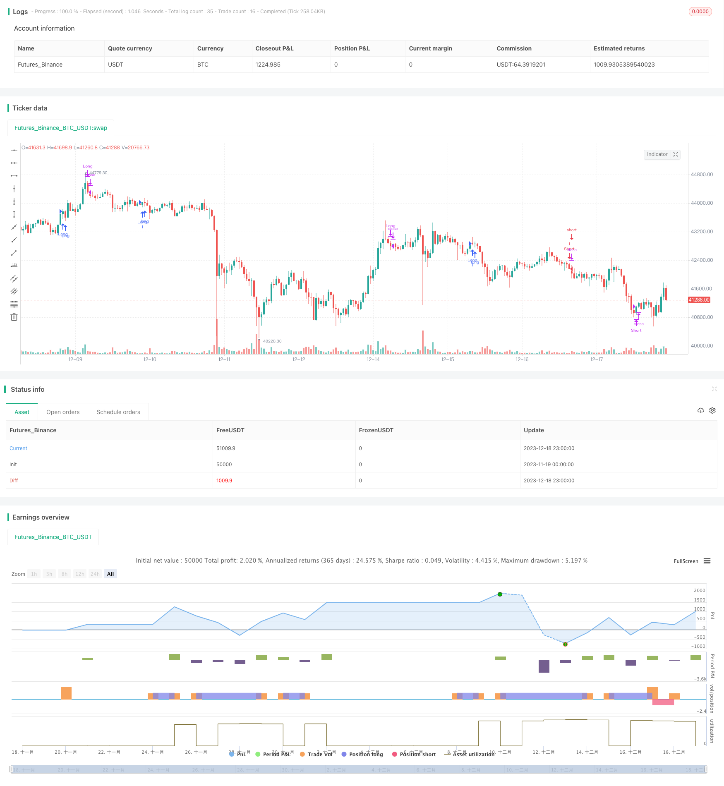

> Name

Trend breakout strategy based on RSI and EMA RSI-EMA-Trend-Breakout-Strategy
> Author

ChaoZhang

> Strategy Description


 [trans]

## Overview
This strategy is a trend following and trend breakout trading strategy based on the RSI and EMA indicators. The strategy is called "RSI-EMA Trend Breakout Strategy". It combines trend tracking and oscillators, aiming to capture the direction of medium and long-term trends and enter the market at trend breakthrough points.
## Strategy Principle
The strategy uses the 5-day EMA, 20-day EMA and 50-day EMA to build a long-short trend framework. When the 5-day EMA crosses above the 20-day EMA, and both EMAs are above the 50-day EMA, it is determined that there has been a recent bullish trend breakthrough, and go long; when the 5-day EMA crosses below the 20-day EMA, and both EMAs are below the 50-day EMA, it is determined that there has been a recent bearish trend breakthrough, so go short.
At the same time, the strategy also combines the RSI indicator to determine whether there is excessive overbought or oversold territory. RSI can effectively identify overbought and oversold conditions and avoid generating false signals when the trend tops or consolidates. When the RSI indicator appears from the overbought zone to the neutral zone, long orders take profit; when the RSI indicator appears from the oversold zone to the neutral zone, short orders take profit.
## Strategic advantage analysis
This strategy combines EMA and RSI indicators, which can not only capture the mid- to long-term trend, but also avoid risks at the end of the trend, and has a very good risk-return ratio. Its main advantages are:
1. Use EMA to judge the trend. EMA smoothes prices and helps identify the direction of the trend.
2. The RSI indicator can avoid buying in the overbought area, selling in the oversold area, and avoiding risks.
3. The strategic operation frequency is low, suitable for medium and long-term holdings, reducing transaction costs and slippage costs.
## Risk Analysis
This strategy also has some risks, mainly reflected in:
1. In a volatile market, EMA and RSI will generate more false signals, which will lead to too many invalid transactions.
2. Failure to break through is a common situation, and stop loss needs to be set to control losses.
3. In some trend markets, RSI will not enter the overbought or oversold area. At this time, using RSI to judge entry and take profit will miss some opportunities.
In order to reduce these risks, we can set trading stops, adjust RSI parameters, or combine them with other indicators for confirmation.
## Optimization direction
There is room for further optimization of this strategy:
1. You can test different parameters, such as combinations of EMA cycle parameters, RSI parameters, etc., and select the best parameters.
2. You can add other indicators, such as MACD, Bollinger Bands, etc., to confirm trading signals and reduce error rates. 
3. Parameter settings can be dynamically optimized through machine learning and other methods.
4. A trend judgment system can be established to dynamically adjust strategy parameters in different market environments.
## Summarize
This RSI-EMA trend breakout strategy comprehensively considers trend tracking and entry timing judgment, and obtains trend returns on the basis of controlling risks. It is a very practical medium and long-term strategy. We can further improve the stability and profitability of the strategy through parameter optimization and adding other indicators.
||


## Overview

This is a trend following and trend breakout trading strategy based on RSI and EMA indicators. The strategy name is “RSI-EMA Trend Breakout Strategy”. It incorporates trend tracking and oscillating indicators to capture the medium-to-long term trend direction and enter at trend breakout points.  

## Strategy Logic  

The strategy uses 5-day EMA, 20-day EMA and 50-day EMA to construct the long and short trend framework. When 5-day EMA crosses over 20-day EMA, and both EMAs are above 50-day EMA, it determines a recent bullish trend breakout for long entry. When 5-day EMA crosses below 20-day EMA, and both EMAs are below 50-day EMA, it determines a recent bearish trend breakout for short entry.  

Meanwhile, the strategy also incorporates the RSI indicator to judge if it reaches overbought or oversold zones. RSI can effectively identify overbought and oversold conditions to avoid wrong signals when trend topping or consolidating. When RSI indicator moves from overbought to neutral zone, long position exits. When RSI indicator moves from oversold to neutral zone, short position exits. 

## Advantage Analysis 

This strategy combines EMA and RSI indicators, which can capture medium-to-long term trends and avoid risks at trend ending, with very good risk-reward ratio characteristics. The main advantages are:  

1. EMA judges trend direction smoothly based on prices  
2. RSI avoids buying overbought zones and selling oversold zones to mitigate risks
3. The strategy has relatively low trading frequency, suitable for medium-to-long term holding, reducing trading and slippage costs  

## Risk Analysis   

There are also some risks in this strategy:  

1. In ranging markets, EMA and RSI will produce more wrong signals, leading to excessive invalid trades  
2. Breakout failures happen a lot, so stop loss should be set to control losses
3. In some trending markets, RSI does not enter overbought or oversold zones. Using RSI for entry and take profit will miss some opportunities  

To reduce these risks, we can set stop loss, adjust RSI parameters, or incorporate other indicators for confirmation.  

## Optimization Directions   

There is room for further optimization of this strategy:  

1. Test different parameter combinations like EMA periods, RSI parameters to find the optimal  
2. Incorporate other indicators like MACD, Bollinger Bands to confirm trading signals and reduce errors  
3. Use machine learning etc. methods to dynamically optimize parameter settings  
4. Build trend judging system to dynamically adjust strategy parameters in different market environments  

## Conclusion  

This RSI-EMA trend breakout strategy comprehensively considers trend tracking and entry timing judgment to capture trend profits on the basis of risk control. It is a very practical medium-to-long term strategy. We can further improve the stability and profitability through parameter optimization, adding other indicators etc.

[/trans]


> Source (PineScript)

``` pinescript
/*backtest
start: 2023-11-19 00:00:00
end: 2023-12-19 00:00:00
period: 1h
basePeriod: 15m
exchanges: [{"eid":"Futures_Binance","currency":"BTC_USDT"}]
*/

// This source code is subject to the terms of the Mozilla Public License 2.0 at https://mozilla.org/MPL/2.0/
// © BrendanW98

//@version=4
strategy("My Strategy", overlay=true)

ema5 = ema(close, 9)
ema20 = ema(close, 21)
ema50 = ema(close, 55)

//RSI Signals
// Get user input
rsiSource = close
rsiLength = 14
rsiOverbought = 70
rsiOversold = 30
rsiMid = 50
// Get RSI value
rsiValue = rsi(rsiSource, rsiLength)

//See if RSI crosses 50
doBuy = crossover(rsiValue, rsiOversold) and rsiValue < 50
doSell = crossunder(rsiValue, rsiOverbought) and rsiValue > 50

emacrossover = crossover(ema5, ema20) and ema5 > ema50 and ema20 > ema50 and close > ema50
emacrossunder = crossunder(ema5, ema20) and ema5 < ema50 and ema20 < ema50 and close < ema50

//Entry and Exit
longCondition = emacrossover
closelongCondition = doSell

strategy.entry("Long", strategy.long, 1, when=longCondition)
strategy.close("Long", when=closelongCondition)


shortCondition = emacrossunder
closeshortCondition = doBuy

strategy.entry("Short", strategy.short, 1, when=shortCondition)
strategy.close("Short", when=closeshortCondition)
```

> Detail

https://www.fmz.com/strategy/435952

> Last Modified

2023-12-20 13:47:28
