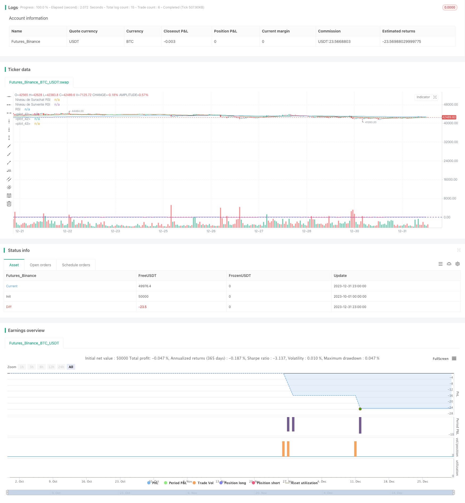

> Name

Trend following strategy based on RSI and EMA RSI-and-EMA-Based-Trend-Following-Strategy
> Author

ChaoZhang

> Strategy Description


 [trans]

## Overview
This strategy implements a quantitative trading strategy based on trend following by combining two technical indicators, the relative strength index (RSI) and the exponential moving average (EMA). This strategy is mainly suitable for trending markets. By entering the market when the price may reverse, you can follow the trend to make profits.
## Strategy Principle
### Indicator selection
- EMA is used to determine the current trend direction. The strategy uses three EMAs: the 20-day line, the 50-day line, and the 200-day line. When the price is above these three EMAs, we judge that we are in a bullish trend.
- RSI is used to determine whether it is overbought or oversold. The standard parameter RSI is 14, the overbought line is 70, and the oversold line is 30.
### Admission rules
Bullish entry signals:
- The RSI is below the 30 threshold, indicating that it is oversold and the price may rebound and rise.
- The price is higher than any one of the 20-day line, the 50-day line, and the 200-day line, indicating that the trend is currently upward.
When the above two conditions are met at the same time, we enter the market long.
### Risk Control
For each transaction, we limit the maximum possible loss to 3% of the account equity. The specific location of the Stop Loss point needs to be combined with the characteristics of the market.
Calculate the position size when entering: Maximum loss/(Entry price - Stop Loss price) = Position size
This can effectively control the risk of a single transaction.
### Rules of appearance
The closing signals mainly include the following situations:
- The RSI exceeds the 70 threshold, indicating that the stock price may fall due to overbought
- Price breaks below any of the 20-day, 50-day or 200-day lines, indicating a trend reversal
When the above conditions are met, we close the position and leave the market.
## Advantage Analysis
This strategy combines the advantages of trend following and reversal trading. Use EMA to determine the direction of the general trend, and then enter the market when the oversold zone reverses. This can both track the trend and have the opportunity for reversal, and enhance the stability of the strategy. At the same time, the parameters of the RSI indicator are adjustable, can be optimized for different markets, and are highly adaptable.
In terms of risk control, each transaction limits the maximum loss, which can effectively control the risk of a single transaction and protect account funds.
## Risk Analysis
This strategy is mainly suitable for markets with obvious trends. If you encounter a complex and changeable market, the effect of using EMA to judge the trend may be compromised. In addition, the RSI indicator has a certain lag and needs to be analyzed in conjunction with the actual price trend.
The setting of stop loss points is critical to the profit and loss of the strategy and needs to be set based on careful testing in different markets. If the stop loss point is set too large, a single loss may be expanded; if the stop loss point is too small, the loss may be stopped by market noise. This aspect requires actual observation to continuously optimize.
## Optimization direction
You can try to optimize the parameters of RSI to adapt to more market environments. You can test different position size ratios to find the optimal settings. You can test the addition of other technical indicators to build a more robust entry and exit system. These are all optimization directions that can be tried.
## Summarize
This strategy integrates the advantages of trend following and reversal trading, while judging the general trend and entering the market at possible reversal points. The optimization of indicator parameters such as RSI can be used to adapt to more market environments. The risk of each transaction is controllable and suitable for medium and long-term stable operations. At the same time, the strategy can be further optimized and tested according to different markets and styles.
||

## Overview

This strategy combines the Relative Strength Index (RSI) and Exponential Moving Average (EMA) technical indicators to implement a quantitative trading strategy based on trend following. It is mainly suitable for trending markets, entering when price reversals are identified to profit from the trend.

## Strategy Logic

### Indicator Selection
- EMA to determine current trend direction. The strategy uses 20-day, 50-day and 200-day EMA. When price is above these EMAs, an uptrend is identified.  
- RSI to identify overbought/oversold levels. A standard 14-period RSI, with overbought threshold at 70 and oversold threshold at 30.

### Entry Rules 

Long entry signal:
- RSI below 30 level, indicating oversold conditions where price may rebound  
- Price above either 20-day, 50-day or 200-day EMA, showing an upward trending market

When both criteria are met, a long position is entered.

### Risk Management

Maximum loss for each trade is limited to 3% of total account value. Stop loss placement needs to consider market characteristics. 

Position sizing at entry: Max Loss / (Entry Price - Stop Loss Price) = Position Size

This effectively controls per trade risk.

### Exit Rules

Main exit signals:

- RSI rises above 70 level, price may fall due to overbought conditions
- Price drops below either 20-day, 50-day or 200-day EMA, trend reversal  

When either signal occurs, the position is closed.

## Advantage Analysis

The strategy combines the advantages of trend following and mean reversion. The EMA determines overall trend, then entry signals happen at potential reversal zones, benefiting from both trend and reversals for stability. RSI parameters can also be optimized for different markets, making the strategy robust.

The fixed max loss per trade protects capital by directly controlling trade risk level. 

## Risk Analysis

The strategy works well in obvious trending markets. In complex and volatile environments, using EMA for trend may have limitations. Also RSI has some lagging effect, needing confirmation from actual price action.  

Stop loss placement is critical to PnL, needing careful testing for different markets. If too wide, single loss can expand; if too tight, noise may trigger unwanted stops. Live testing is required for ongoing optimization.

## Optimization Directions

Testing different RSI parameters to fit more markets. Finding optimal trade size ratios. Adding other technical indicators to build more robust entry/exit systems. These are all options worth exploring.

## Conclusion

The strategy integrates the strengths of trend following and mean reversion strategies. Entry happens on potential reversal while identifying the bigger trend. RSI optimization adapts it to more market regimes. The fixed trade risk level keeps operation stable over the medium to long term. Further improvements are possible through adjustments and robustness testing using different markets and styles.

[/trans]

> Strategy Arguments


|Argument|Default|Description|
|----|----|----|
|v_input_1|14|Longueur du RSI|
|v_input_2|70|Niveau de Surachat RSI|
|v_input_3|30|Niveau de Survente RSI|
|v_input_4|0.03|Risque par Trade (3%)|
|v_input_5|true|Distance du Stop-Loss en pips|


> Source (PineScript)

``` pinescript
/*backtest
start: 2023-10-01 00:00:00
end: 2023-12-31 23:59:59
period: 1h
basePeriod: 15m
exchanges: [{"eid":"Futures_Binance","currency":"BTC_USDT"}]
*/

//@version=4
strategy("Stratégie RSI et EMA avec Gestion du Risque", overlay=true)

// Paramètres de la stratégie
rsiLength = input(14, "Longueur du RSI")
rsiOverbought = input(70, "Niveau de Surachat RSI")
rsiOversold = input(30, "Niveau de Survente RSI")

// Calcul du RSI
rsiValue = rsi(close, rsiLength)

// Paramètres des EMA
ema20 = ema(close, 20)
ema50 = ema(close, 50)
ema200 = ema(close, 200)

// Paramètre du risque par trade
riskPerTrade = input(0.03, "Risque par Trade (3%)")

// Distance du stop-loss en pips (à ajuster selon votre stratégie)
stopLossPips = input(1, "Distance du Stop-Loss en pips")

// Calcul de la taille de position et du stop-loss
calculatePositionSize(entryPrice, stopLossPips) =>
    stopLossPrice = entryPrice - stopLossPips * syminfo.mintick
    riskPerTradeValue = strategy.equity * riskPerTrade
    positionSize = riskPerTradeValue / (entryPrice - stopLossPrice)
    positionSize

// Conditions d'entrée
longCondition = (rsiValue < rsiOversold) and (close > ema20 or close > ema50 or close > ema200)
if longCondition
    strategy.entry("Long", strategy.long, qty=1)

// Conditions de sortie
exitCondition = (rsiValue > rsiOverbought) or (close < ema20 or close < ema50 or close < ema200)
if exitCondition
    strategy.close("Long")

// Affichage des EMA et RSI sur le graphique
plot(ema20, color=color.red)
plot(ema50, color=color.green)
plot(ema200, color=color.blue)
hline(rsiOverbought, "Niveau de Surachat RSI", color=color.red)
hline(rsiOversold, "Niveau de Survente RSI", color=color.blue)
plot(rsiValue, "RSI", color=color.purple)
```

> Detail

https://www.fmz.com/strategy/439957

> Last Modified

2024-01-25 12:19:32
