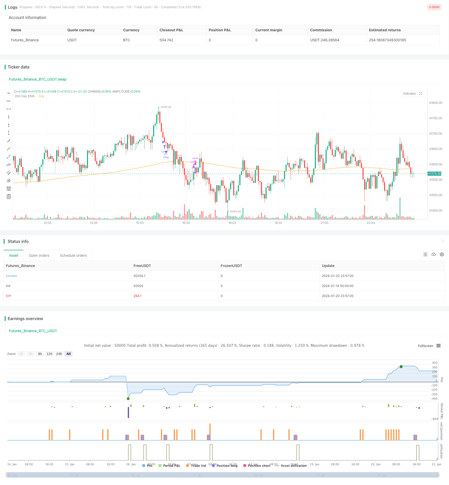

> Name

Reversal-RSI-Trend-Tracking-ETF-Trading-Strategy Reversal-RSI-Trend-Tracking-ETF-Trading-Strategy
> Author

ChaoZhang

> Strategy Description


 [trans]

### Overview
This strategy is a reversal trend following ETF trading strategy based on the Relative Strength Index (RSI). It uses the RSI indicator to determine short-term overbought and oversold phenomena and perform reversal entries and exits. At the same time, combine the 200-day moving average to determine the overall trend direction.
### Strategy Principles
The core logic of this strategy is based on the reversal principle of the RSI indicator. The RSI indicator determines whether the trading instrument is overbought or oversold by calculating the average rise and fall over a period of time. When the RSI is above 70, it means overbought, and when the RSI is below 30, it means oversold. At this time, a reversal may occur.
This strategy uses this principle and sets the day when the RSI is lower than the adjustable parameter `TodaysMinRSI`, and when the RSI is lower than the adjustable parameter `Day3RSIMax` 3 days ago, you can buy. This indicates that the price may be in a short-term oversold zone and may rebound. At the same time, it is required that the RSI shows a downward trend within 3 days, that is, the RSI continues to decline before buying to avoid false rebounds.
The exit mechanism of the strategy is that when the RSI indicator exceeds the threshold of the adjustable parameter `Exit RSI` again, the rebound is considered to be over, and the position is closed and exited at this time.
This strategy also introduces the 200-day moving average as an overall trend judge. Only when the price is higher than the 200-day line, the buying operation can be carried out. This helps ensure that you only buy during the uptrend and avoid the risks associated with trading against the trend.
### Analysis of strategic advantages
- Use the RSI indicator to determine the overbought and oversold areas, and a bellion is likely.
- Combined with the 200-day line to determine the direction of the general trend, it helps to avoid counter-trend trading.  
- The RSI reversal trading principle is classic and reliable, with a high success rate.
- Adjustable parameters provide flexibility and can be optimized for different varieties.
### Risks and Solutions
- The RSI indicator has the possibility of false breakthrough, and loss orders cannot be completely avoided. Stop loss can be set to control single losses.
- Failure to reverse may result in larger losses. It can shorten the holding time and stop the loss in time.    
- Improper parameter settings may lead to being too aggressive, or may be too conservative and miss trading opportunities. Parameter optimization testing must be carried out for the variety.
### Optimization direction
- Add other indicators in combination, such as KDJ, Bollinger Bands, etc., to form an indicator combination and improve the accuracy of signals.
- Add a trailing stop loss strategy to make the stop loss level variable and reduce losses.
- Add trading volume or money management modules to control the risk exposure of each transaction.
- Optimize and backtest the parameters of different varieties, and formulate a parameter combination suitable for the variety.
### Summarize
This strategy uses the classic buying and selling point principle of the RSI indicator to conduct reversal entries and exits by judging overbought and oversold areas. Taking into account the general trend judgment and parameter optimization space at the same time, it is a highly reliable short-term reversal ETF strategy. Through further optimization, it can become a quantitative strategy with practical effects.
||

### Overview

This strategy is a reversal trend tracking ETF trading strategy based on the Relative Strength Index (RSI). It judges the short-term overbought and oversold conditions through the RSI indicator to make reversal entries and exits. Meanwhile, it uses the 200-day moving average to determine the overall trend direction.

### Strategy Principle  

The core logic of this strategy is based on the reversal principle of the RSI indicator. The RSI indicator calculates the average amplitude of rises and falls over a period of time to judge whether the trading variety is in an overbought or oversold state. An RSI above 70 represents overbought conditions, while an RSI below 30 represents oversold conditions. At this point, a reversal trend may occur.

This strategy utilizes this principle by setting the buy trigger when today's RSI is below the adjustable parameter `TodaysMinRSI`, and the RSI 3 days ago is below the adjustable parameter `Day3RSIMax`. This indicates the price may be in a short-term oversold region and a bounce is likely. It also requires a downward RSI trend in the last 3 days, i.e. continuous RSI decline before buying to avoid false breakouts.  

The exit mechanism of the strategy is when the RSI indicator once again exceeds the threshold value of the adjustable parameter `Exit RSI`, it is considered that the rebound has ended and positions should be closed there.

The strategy also introduces the 200-day moving average to judge the overall trend direction. Only when the price is above the 200-day line, long entry orders can be made. This helps ensure only buying in uptrend phases and avoids the risks of countertrend trading.

### Advantage Analysis

- Utilize RSI indicator to determine overbought and oversold zones where rebounds are likely.
- Incorporate 200-day line to determine major trend direction, which helps avoid countertrend trading.
- The RSI reversal trading principle is classic and reliable with high success rate. 
- Adjustable parameters provide flexibility that can be optimized for different varieties.

### Risks and Solutions

- RSI indicator has the possibility of false breakouts, unable to completely avoid losing trades. Stop loss can be set to control single trade loss.
- Failed reversals may lead to enlarged losses. Holding period can be shortened with timely stop loss.
- Improper parameter settings may lead to over-aggressiveness or over-conservativeness, missing trade opportunities. Parameters must be optimized for each variety through backtesting.  

### Optimization Directions  

- Incorporate other indicators like KDJ, Bollinger Bands etc to form indicator combinations, improving signal accuracy.
- Add moving stop loss strategies to make the stop loss level dynamic, reducing losses.
- Add position sizing or money management modules to control risk exposure per trade.
- Optimize parameters and backtest for different varieties to come up with parameter sets fitting each variety.  

### Summary  

This strategy utilizes the classic RSI entry and exit points by judging overbought and oversold zones for reversal trades. Meanwhile, considering major trend and parameter optimization, it is a highly reliable short-term reversal ETF strategy. With further optimizations, it can become a quant strategy with practical effects.

[/trans]

> Strategy Arguments


|Argument|Default|Description|
|----|----|----|
|v_input_1|timestamp(01 Jan 2012 05:00 +0000)|Start Time|
|v_input_2|timestamp(01 Jan 2099 00:00 +0000)|End Time|
|v_input_int_1|2|RSI Length|
|v_input_int_2|10|Today's Min RSI for Entry|
|v_input_int_3|60|Max RSI 3 Days Ago for Entry|
|v_input_int_4|70|Exit RSI|


> Source (PineScript)

``` pinescript
/*backtest
start: 2024-01-14 00:00:00
end: 2024-01-21 00:00:00
period: 3m
basePeriod: 1m
exchanges: [{"eid":"Futures_Binance","currency":"BTC_USDT"}]
*/

// This source code is subject to the terms of the Mozilla Public License 2.0 at https://mozilla.org/MPL/2.0/
// @version = 5
// Author = TradeAutomation


strategy(title="R3 ETF Strategy", shorttitle="R3 ETF Strategy", overlay=true)


// Backtest Date Range Inputs // 
StartTime = input(defval=timestamp('01 Jan 2012 05:00 +0000'), title='Start Time')
EndTime = input(defval=timestamp('01 Jan 2099 00:00 +0000'), title='End Time')
InDateRange = true

// Calculations and Inputs //
RSILen = input.int(2, "RSI Length")
RSI = ta.rsi(close, RSILen)
TodaysMinRSI = input.int(10, "Today's Min RSI for Entry", tooltip = "The RSI must be below this number today to qualify for trade entry")
Day3RSIMax = input.int(60, "Max RSI 3 Days Ago for Entry", tooltip = "The RSI must be below this number 3 days ago to qualify for trade entry")
EMA = ta.ema(close, 200)

// Strategy Rules //
Rule1 = close>ta.ema(close, 200)
Rule2 = RSI[3]<Day3RSIMax and RSI<TodaysMinRSI
Rule3 = RSI<RSI[1] and RSI[1]<RSI[2] and RSI[2]<RSI[3] 
Exit = ta.crossover(RSI, input.int(70, "Exit RSI", tooltip = "The strategy will sell when the RSI crosses over this number"))

// Plot //
plot(EMA, "200 Day EMA")

// Entry & Exit Functions //
if (InDateRange)
    strategy.entry("Long", strategy.long, when = Rule1 and Rule2 and Rule3)
//    strategy.close("Long", when = ta.crossunder(close, ATRTrailingStop))
    strategy.close("Long", when = Exit)
if (not InDateRange)
    strategy.close_all()
    
```

> Detail

https://www.fmz.com/strategy/439643

> Last Modified

2024-01-22 17:15:18
