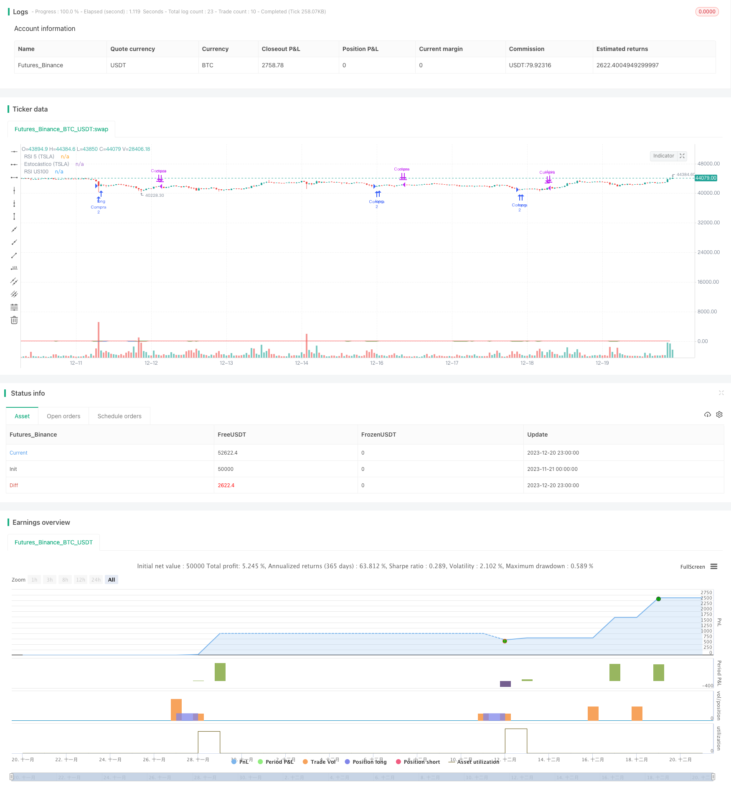

> Name

TSLA Trading Strategy Based on RSI and Estocastic IndicatorsTSLA-Quantitative-Trading-System-Across-Multiple-Timeframes
> Author

ChaoZhang

> Strategy Description


[trans]

This strategy comprehensively uses two different types of technical indicators, RSI and Estocastic, to design trading rules under the dual time frames of TSLA 5 minutes and S&P 100 1 minute to implement an automated TSLA stock trading system.
## Strategy Overview
The main idea of ​​this strategy is to simultaneously monitor TSLA's own price technical indicators and the technical indicators of the U.S. stock market, and issue trading signals when both reach overbought and oversold conditions at the same time. The strategy uses a combination of two time period indicators, 5 minutes and 1 minute, which can effectively filter out some noise trading signals.
## Strategy Principle
First, the strategy calculates the 5-day RSI indicator on the 5-minute candlestick line of TSLA and the 14-day RSI indicator on the 1-minute candlestick line of the S&P 100 Index. When the 5-day RSI of TSLA is below 30 and the 14-day RSI of the S&P 100 is also below 30, TSLA stock price is considered to be oversold, and a buy signal is issued at this time.
After buying, the strategy continues to monitor the 14-day Estogic indicator on the TSLA 1-minute K-line. When the Estocastic indicator exceeds 78, it is considered that TSLA stock price rebounds upward from the Bollinger Bands, and a sell signal is issued at this time.
In addition, the strategy also sets a 3% stop loss level. When the price falls below the stop loss level, it will also actively stop the loss and leave the market.
## Strategic Advantages
1. Multi-time frame design can effectively filter noise signals
2. RSI and Estocastic indicators verify each other to improve signal quality
3. Stop loss mechanism controls single loss
4. The backtest data is minute data of TSLA and S&P 100, which is highly representative of the market.
5. The strategy logic is simple and clear, easy to understand and optimize
## Strategy Risk
1. Multiple time frames and dual indicator combinations will miss some opportunities
2. Setting the stop loss position too aggressively may cause unnecessary slippage losses.
3. As an auxiliary tool for trading signals, the S&P 100 itself also brings certain systemic risks.
4. Backtest data quality. Changes in the market environment will also have an impact on the results.
## Strategy optimization direction
1. You can test more parameter combinations to find the best indicator configuration
2. Add adaptive stop loss algorithm
3. Add a position management module to lock in more gains
4. Increase the weight of machine learning algorithm training indicators
5. Look for trading turning points on longer time frames
## Summarize
This strategy is generally a typical overbought and oversold reversal strategy. It also adds multi-time frame verification and stop-loss modules to make the strategy more robust. The advantage of this strategy is that it is simple to understand and easy to implement. The next research direction is how to obtain more alpha while controlling risks, which requires customized optimization of indicators and models. Overall, this strategy lays a solid foundation for building a quantitative trading system.
||

 
This strategy utilizes two different types of technical indicators, RSI and Estocastic, across the 5-minute chart of TSLA and 1-minute chart of S&P 100 index to design trading rules and build an automated trading system for TSLA stocks.
 
## Strategy Overview
 
The core idea of this strategy is to monitor both the price technical indicators of TSLA itself and the technical indicators of the US stock market index. It sends out trading signals when both sides reach the extremely overbought or oversold status at the same time. The strategy adopts technical indicators across two timeframes, the 5-minute and 1-minute, which can help filter out some noisy trading signals effectively.
  
## Strategy Logic
 
Firstly, the strategy calculates the 5-day RSI on the 5-minute chart of TSLA, and the 14-day RSI on the 1-minute chart of the S&P 100 index. When the 5-day RSI of TSLA is below 30 and the 14-day RSI of the S&P 100 index is below 30 at the same time, it is considered that TSLA price reaches an extremely oversold level and a buy signal is triggered.
 
After buying in, the strategy keeps monitoring the 14-day Estocastic indicator on the 1-minute chart of TSLA. When the Estocastic indicator surpasses 78, it is viewed as TSLA price bounces back to the upper band and a sell signal is triggered.
 
In addition, a 3% stop loss is set in the strategy. When the price drops below the stop loss level, the position will be closed with a stop loss. 
 
## Advantages of the Strategy
 
1. Adopting multiple timeframes can help filter out noisy signals effectively
2. RSI and Estocastic indicators verify each other and improve signal quality
3. Stop loss mechanism limits the loss per trade  
4. Backtesting data includes the minute bars of TSLA and S&P 100 index which is representative
5. The strategy logic is simple and easy to understand as well as optimize

## Risks of the Strategy

1. Combining multiple timeframes and indicators may miss some opportunities 
2. Overly aggressive stop loss setting may lead to unnecessary slippage loss
3. S&P 100 index as a auxiliary tool also introduces some systemic risk 
4. The quality of backtesting data and changing market environments may influence the results

## Directions for Strategy Optimization

1. Test more parameter combinations to find the optimal indicator configuration
2. Add adaptive stop loss algorithms 
3. Add position sizing module to lock in more profits
4. Add machine learning algorithms to train indicator weights
5. Search for trading turns in longer timeframes 

## Conclusion

To conclude, this is a typical mean-reversion strategy based on overbought and oversold signals, with additional features like multiple timeframe validation and stop loss to make it more robust. The advantage lies in its simplicity to understand and implement. The next step is to acquire more alpha while controlling risks, which requires custom optimization work around the indicators and models. Overall, this strategy establishes a solid foundation for building quantitative trading systems.

[/trans]


> Source (PineScript)

``` pinescript
/*backtest
start: 2023-11-21 00:00:00
end: 2023-12-21 00:00:00
period: 1h
basePeriod: 15m
exchanges: [{"eid":"Futures_Binance","currency":"BTC_USDT"}]
*/

//@version=5
strategy("Estrategia de Trading TSLA", overlay=true)

// Condiciones de entrada
rsi5 = ta.rsi(close, 5) // RSI en el gráfico de TSLA de 5 minutos
rsiUS100 = ta.rsi(request.security(syminfo.tickerid, "1", close), 14) // RSI en el gráfico de US100 de 1 minuto

// Condiciones de entrada
condicion_entrada = rsi5 < 30 and rsiUS100 < 30

// Cantidad de acciones a comprar
cantidad_compra = 2

// Condiciones de salida
estocastico = ta.stoch(close, high, low, 14) // Estocástico en el gráfico de TSLA de 1 minuto
condicion_salida = estocastico > 78

// Stop loss
stop_loss = strategy.position_avg_price * 0.03

// Ejecutar la estrategia
if condicion_entrada
    strategy.entry("Compra", strategy.long, qty = cantidad_compra)

if condicion_salida or ta.highest(high, 10) <= stop_loss
    strategy.close("Compra")

// Mostrar indicadores en el gráfico
plot(rsi5, "RSI 5 (TSLA)", color=color.blue)
plot(rsiUS100, "RSI US100", color=color.red)
plot(estocastico, "Estocástico (TSLA)", color=color.green)


```

> Detail

https://www.fmz.com/strategy/436222

> Last Modified

2023-12-22 12:50:55
