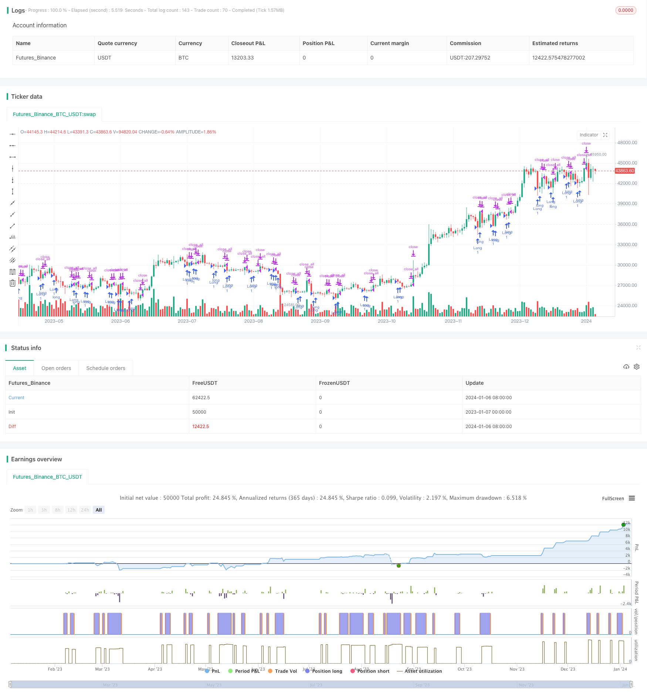

> Name

Fast-Oscillating-RSI-Trading-Strategy Fast-Oscillating-RSI-Trading-Strategy
> Author

ChaoZhang

> Strategy Description



[trans]
### Overview
This strategy is a trading strategy that uses the RSI indicator to identify oscillating market conditions and capture trend reversal opportunities during the oscillating process. The strategy uses the fast RSI indicator to determine whether the price has entered the shock zone, and combines the long and short signals of the K-line entity and the fast RSI to determine the entry opportunity.
### Strategy Principles
This strategy mainly works based on the following principles:
1. Use rapid RSI to determine whether the price has entered the set overbought and oversold range as a basis for shock identification.
2. Combine the K-line entity breakthrough and rapid RSI long and short signals to determine the specific entry opportunity.
3. Avoid false signals of non-shock market through double filtering mechanism
Specifically, the strategy uses the bi-period RSI to determine whether the price has entered the set 30-70 range. At the same time, the K-line entity is required to break through 1/4 or 1/2 of the moving average to generate a trading signal. In this way, through double conditional judgment, false signals of volatile market conditions can be effectively filtered out, ensuring that the market is entered only when the market is truly volatile.
### Advantage Analysis
This strategy has the following significant advantages:
1. The fast RSI indicator is sensitive and can quickly determine when the price enters and leaves the shock range.
2. Dual time frame analysis to avoid being disturbed by noise
3. Entity filtering mechanism to ensure entry when the real trend reverses
4. Moderate operating frequency to avoid excessive trading
### Risk Analysis
There are also some risks to this strategy that you need to be aware of:
1. Trend reversal opportunities may be missed, resulting in insufficient profits.
2. False signals of shock breakthroughs may cause losses
3. Improper parameter settings will affect strategy performance
In order to control risks, it is recommended to appropriately adjust the parameter combination, verify the real offer, and set up a stop-loss mechanism.
### Optimization direction
There is room for further optimization of this strategy:
1. Integrate other indicator signals to build a Likelihood model
2. Add adaptive parameter adjustment module
3. Add algorithmic trading module to achieve faster trading
Through multi-index integration, adaptive parameter adjustment and algorithmic trading, it is expected to further improve the stability and profitability of the strategy.
### Summarize
This rapid shock RSI trading strategy uses the rapid RSI indicator to capture price shocks and the double filtering mechanism to determine the entry timing. It is an effective strategy worthy of in-depth study and application. In practice, it is necessary to pay attention to risks and make optimization and adjustments in multiple dimensions to further improve the strategic effect.
||

### Overview  

This is a trading strategy that identifies oscillating markets using the RSI indicator and captures trend reversal opportunities during market oscillations. The strategy judges if prices have entered the oscillation zone by the fast RSI indicator and determines entry timing in combination with candlestick bodies and fast RSI signals.   

### Strategy Logic   

The strategy mainly operates on the following principles:  

1. Identify oscillating price action by fast RSI judging if prices have entered the overbought/oversold zone   
2. Determine specific entry timing with candlestick body breakout and fast RSI signals  
3. Avoid false signals in non-oscillating trends through dual filter mechanisms   

Specifically, the strategy employs dual-period RSI to judge if prices have entered the 30-70 pre-set oscillation range. It also requires the candle body to break through 1/4 or 1/2 of the MA before generating trading signals. By such dual conditional checks, false signals can be effectively filtered out to ensure entering the market only when real oscillation happens.  

### Advantage Analysis   

The strategy demonstrates significant advantages as follows:  

1. Fast RSI indicator is sensitive to swiftly identify prices entering/leaving the oscillation zone   
2. Dual timeframe analysis prevents interference from market noise  
3. Candle filter ensures entering on real trend reversals   
4. Medium trade frequency prevents over-trading  

### Risk Analysis  

There are also some risks to be aware of:   

1. Possible missing trend reversal opportunities leading to insufficient profit  
2. Whipsw signals may cause losses  
3. Improper parameter settings impact strategy performance   

To control risks, adjusting parameter combinations, live trading verification and stop loss mechanisms are recommended.  

### Optimization Directions   

There is room for further optimization:  

1. Integrate other indicator signals to build Likelihood model
2. Add adaptive parameter tuning module  
3. Increase algo trading module for faster trade execution   

By techniques like multi-indicator integration, adaptive parameter tuning and algo trading, strategy stability and profitability can be lifted to the next level.  

### Conclusion   

The fast oscillating RSI trading strategy identifies price oscillations and determines entry timing via fast RSI and dual filter mechanisms. It is an effective strategy worth in-depth research and application. In practice, risks should be monitored and multi-dimensional optimizations are needed to further lift the strategy efficacy.

[/trans]

> Strategy Arguments


|Argument|Default|Description|
|----|----|----|
|v_input_1|2|RSI UP Period|
|v_input_2|9|RSI DN Period|
|v_input_3|30|RSI limit|
|v_input_4_close|0|RSI Price: close|high|low|open|hl2|hlc3|hlcc4|ohlc4|
|v_input_5|true|RSI Bars|
|v_input_6|2018|From Year|
|v_input_7|2018|To Year|
|v_input_8|true|From Month|
|v_input_9|12|To Month|
|v_input_10|true|From day|
|v_input_11|31|To day|


> Source (PineScript)

``` pinescript
/*backtest
start: 2023-01-07 00:00:00
end: 2024-01-07 00:00:00
period: 1d
basePeriod: 1h
exchanges: [{"eid":"Futures_Binance","currency":"BTC_USDT"}]
*/

//@version=3
strategy(title = "Noro's FRSI Strategy v1.22", shorttitle = "FRSI str 1.22", overlay = true )

//Settings
uprsiperiod = input(2, defval = 2, minval = 2, maxval = 50, title = "RSI UP Period")
dnrsiperiod = input(9, defval = 9, minval = 2, maxval = 50, title = "RSI DN Period")
limit = input(30, defval = 30, minval = 1, maxval = 100, title = "RSI limit")
rsisrc = input(close, defval = close, title = "RSI Price")
rb = input(1, defval = 1, minval = 1, maxval = 5, title = "RSI Bars")
sps = 0
fromyear = input(2018, defval = 2018, minval = 1900, maxval = 2100, title = "From Year")
toyear = input(2018, defval = 2018, minval = 1900, maxval = 2100, title = "To Year")
frommonth = input(01, defval = 01, minval = 01, maxval = 12, title = "From Month")
tomonth = input(12, defval = 12, minval = 01, maxval = 12, title = "To Month")
fromday = input(01, defval = 01, minval = 01, maxval = 31, title = "From day")
today = input(31, defval = 31, minval = 01, maxval = 31, title = "To day")

//Fast RSI
fastup = rma(max(change(rsisrc), 0), uprsiperiod)
fastdown = rma(-min(change(rsisrc), 0), dnrsiperiod)
fastrsi = fastdown == 0 ? 100 : fastup == 0 ? 0 : 100 - (100 / (1 + fastup / fastdown))

//Limits
bar = close > open ? 1 : close < open ? -1 : 0
uplimit = 100 - limit
dnlimit = limit

//RSI Bars
ur = fastrsi > uplimit
dr = fastrsi < dnlimit
uprsi = rb == 1 and ur ? 1 : rb == 2 and ur and ur[1] ? 1 : rb == 3 and ur and ur[1] and ur[2] ? 1 : rb == 4 and ur and ur[1] and ur[2] and ur[3] ? 1 : rb == 5 and ur and ur[1] and ur[2] and ur[3] and ur[4] ? 1 : 0
dnrsi = rb == 1 and dr ? 1 : rb == 2 and dr and dr[1] ? 1 : rb == 3 and dr and dr[1] and dr[2] ? 1 : rb == 4 and dr and dr[1] and dr[2] and dr[3] ? 1 : rb == 5 and dr and dr[1] and dr[2] and dr[3] and dr[4] ? 1 : 0

//Body
body = abs(close - open)
emabody = ema(body, 30)

//Signals
up = bar == -1 and sps == 0 and dnrsi and body > emabody / 4
dn = bar == 1 and sps == 0 and uprsi and body > emabody / 4
exit = bar == 1 and fastrsi > dnlimit and body > emabody / 2

//Trading
if up
    strategy.entry("Long", strategy.long)
    sps := 1

if exit
    strategy.close_all()
    sps := 0
    
```

> Detail

https://www.fmz.com/strategy/438024

> Last Modified

2024-01-08 11:50:38
