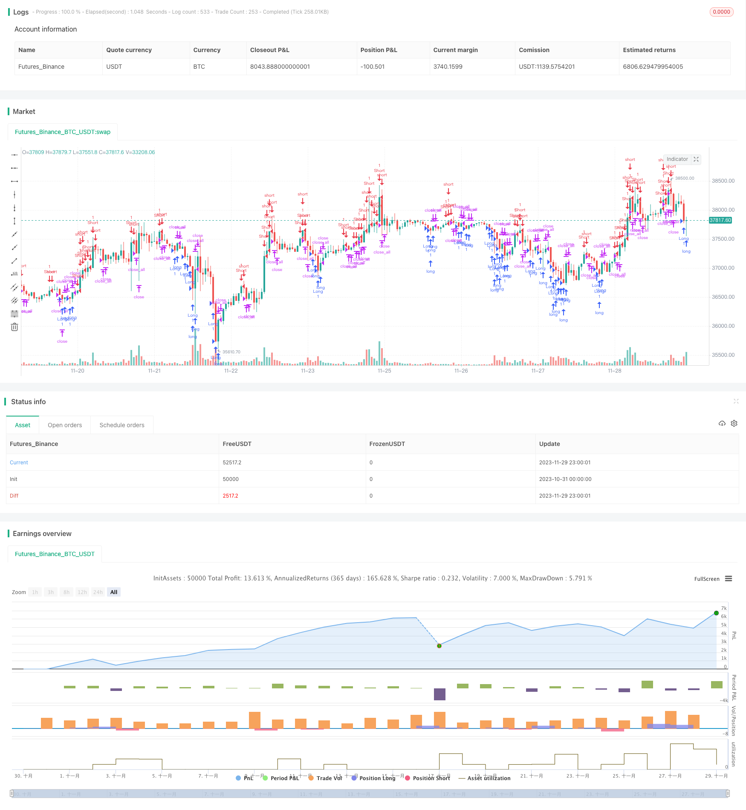

> Name

Fast-RSI-Reversal-Strategy
> Author

ChaoZhang

> Strategy Description


Here is an SEO article I wrote based on the code and requirements you provided, including the strategy name, overview, strategy principles, advantage analysis, risk analysis, optimization direction and summary:
[trans]

## Overview
This strategy is a fast RSI reversal trading strategy. The main idea is to determine short-term reversal opportunities when the RSI indicator is overbought and oversold. It uses the 3-day RSI as an indicator to judge overbought and oversold, and combines it with the 30-day moving average to judge breakthrough signals, and opens positions when overbought and oversold reverse.
## Strategy Principle
This strategy uses two indicators:
1. The 3-day RSI indicator determines overbought and oversold.
2. The 30-day moving average determines the strength of the reversal signal. When the reversal K-line entity is greater than half of the 30-day moving average, it is used as an entry signal.
Specific trading rules:
Bull signal: The RSI indicator is less than the low (default 25), and the current K-line entity is greater than half of the 30-day moving average, go long.
Short signal: The RSI indicator is greater than the high (default 75), and the current K-line entity is greater than half of the 30-day moving average, go short.
Stop loss signal: When holding a long position, the RSI indicator crosses the high level, or when holding a short position, the RSI indicator crosses the low level. At the same time, the K-line entity is greater than half of the 30-day moving average, close the position.
## Advantage Analysis
This strategy has the following advantages:
1. Use short-period RSI to determine overbought and oversold, which can quickly capture short-term reversal opportunities.
2. Combined with moving average filtering to increase the reliability of signals and avoid being trapped in volatile market conditions.
3. The retracement is controllable and the maximum retracement will not be too large.
4. The position control rules are clear and positions will not be opened frequently.
## Risk Analysis
This strategy also has the following risks:
1. Risk of reversal failure. Overbought and oversold do not necessarily lead to a reversal.
2. Risk of loss in counter-trend operations in trending markets.
3. Entity filtering conditions are too strict and it is easy to miss entry opportunities.
4. The parameter sensitivity is high, and the RSI cycle and entity cycle need to be adjusted.
## Optimization direction
This strategy can be optimized from the following aspects:
1. Optimize RSI parameters and find the best period.
2. Optimize the moving average parameters and find the best entity filtering period.
3. Add stop loss strategies, such as trailing stop loss, curve stop loss, etc., to control single losses.
4. Add trend judgment rules to avoid counter-trend operations.
## Summarize
Overall, this strategy is an RSI strategy that focuses on short-term reversals. It uses fast RSI to determine overbought and oversold to capture reversals, and uses moving average entities to filter and confirm. It has the advantages of controllable retracement and clear position control, and is suitable for short-term operations. However, it is necessary to pay attention to the risks of reversal failure and counter-trend operations. It can be improved from aspects such as optimizing parameters, stop loss, and trend judgment.
||


## Overview  

This strategy is a fast RSI reversal trading strategy that mainly captures reversal opportunities when RSI is overbought or oversold. It uses 3-day RSI to judge overbought and oversold levels, and combines 30-day MA to determine breakthrough signals, opening positions when reversals occur after overbought or oversold status.

## Strategy Logic  

The strategy uses two indicators:  

1. 3-day RSI to judge overbought and oversold levels.

2. 30-day MA to determine the strength of reversal signals. When the reversal bar body is greater than half of the 30-day MA, it is used as the entry signal.

Specific trading rules:

Long signal: When RSI is below the lower limit (default 25) and the current bar body is greater than half of the 30-day MA, go long. 

Short signal: When RSI is above the upper limit (default 75) and the current bar body is greater than half of the 30-day MA, go short.  

Exit signal: When holding long positions, if RSI crosses above the upper limit, or when holding short positions, if RSI crosses below the lower limit, meanwhile the bar body is greater than half of the 30-day MA, close positions.

## Advantage Analysis   

The advantages of this strategy include:

1. Using short-period RSI to capture short-term reversal opportunities quickly.  

2. Increasing signal reliability by combining with MA filter, avoiding whipsaws in range-bound markets.

3. Controllable drawdowns, maximum drawdown won't be too large.  

4. Clear position control rules, avoids over-trading.

## Risk Analysis   

The risks of this strategy include:  

1. Failed reversal risk. Overbought and oversold does not necessarily lead to reversals.  

2. Loss risk by trading against the trend in trending markets.  

3. Missing opportunities due to too strict bar filter rules.

4. High parameter sensitivity, RSI and MA periods need adjustment.

## Optimization Directions  

The strategy can be optimized from the following aspects:

1. Optimize RSI parameters to find the optimal period.  

2. Optimize MA parameters to determine the best bar filter period.

3. Add stop loss strategies like trailing stop loss, to control single trade loss.  

4. Add trend determination rules to avoid trading against trends.  

## Conclusion  

In conclusion, this is a short-term reversal-focused RSI strategy. It captures reversals by identifying quick RSI overbought and oversold levels, and uses MA bar filter to confirm entries. The advantages are controllable drawdowns and clear position controls. It is suitable for short-term trading but should watch out risks of failed reversals and trading against trends. It can be improved by parameter optimization, adding stop loss, and judging trends.

[/trans]

> Strategy Arguments


|Argument|Default|Description|
|----|----|----|
|v_input_1|true|Long|
|v_input_2|true|Short|
|v_input_3|25|RSI limit|
|v_input_4|1900|From Year|
|v_input_5|2100|To Year|
|v_input_6|true|From Month|
|v_input_7|12|To Month|
|v_input_8|true|From day|
|v_input_9|31|To day|


> Source (PineScript)

``` pinescript
/*backtest
start: 2023-10-31 00:00:00
end: 2023-11-30 00:00:00
period: 1h
basePeriod: 15m
exchanges: [{"eid":"Futures_Binance","currency":"BTC_USDT"}]
*/

//@version=3
strategy(title = "Noro's Fast RSI Strategy v1.0", shorttitle = "Fast RSI str 1.0", overlay = true, default_qty_type = strategy.percent_of_equity, default_qty_value = 100, pyramiding = 5)

//Settings
needlong = input(true, defval = true, title = "Long")
needshort = input(true, defval = true, title = "Short")
limit = input(25, defval = 25, minval = 1, maxval = 100, title = "RSI limit")
fromyear = input(1900, defval = 1900, minval = 1900, maxval = 2100, title = "From Year")
toyear = input(2100, defval = 2100, minval = 1900, maxval = 2100, title = "To Year")
frommonth = input(01, defval = 01, minval = 01, maxval = 12, title = "From Month")
tomonth = input(12, defval = 12, minval = 01, maxval = 12, title = "To Month")
fromday = input(01, defval = 01, minval = 01, maxval = 31, title = "From day")
today = input(31, defval = 31, minval = 01, maxval = 31, title = "To day")

//Fast RSI
src = close
fastup = rma(max(change(src), 0), 3)
fastdown = rma(-min(change(src), 0), 3)
fastrsi = fastdown == 0 ? 100 : fastup == 0 ? 0 : 100 - (100 / (1 + fastup / fastdown))
uplimit = 100 - limit
dnlimit = limit

//Body
body = abs(close - open)
emabody = ema(body, 30) / 2

//Signals
bar = close > open ? 1 : close < open ? -1 : 0
up = bar == -1 and fastrsi < dnlimit and body > emabody
dn = bar == 1 and fastrsi > uplimit and body > emabody
exit = ((strategy.position_size > 0 and fastrsi > dnlimit) or (strategy.position_size < 0 and fastrsi < uplimit)) and body > emabody

//Trading
if up
    strategy.entry("Long", strategy.long, needlong == false ? 0 : na, when=(time > timestamp(fromyear, frommonth, fromday, 00, 00) and time < timestamp(toyear, tomonth, today, 00, 00)))

if dn
    strategy.entry("Short", strategy.short, needshort == false ? 0 : na, when=(time > timestamp(fromyear, frommonth, fromday, 00, 00) and time < timestamp(toyear, tomonth, today, 00, 00)))
    
if time > timestamp(toyear, tomonth, today, 00, 00) or exit
    strategy.close_all()
```

> Detail

https://www.fmz.com/strategy/433901

> Last Modified

2023-12-01 13:37:20
