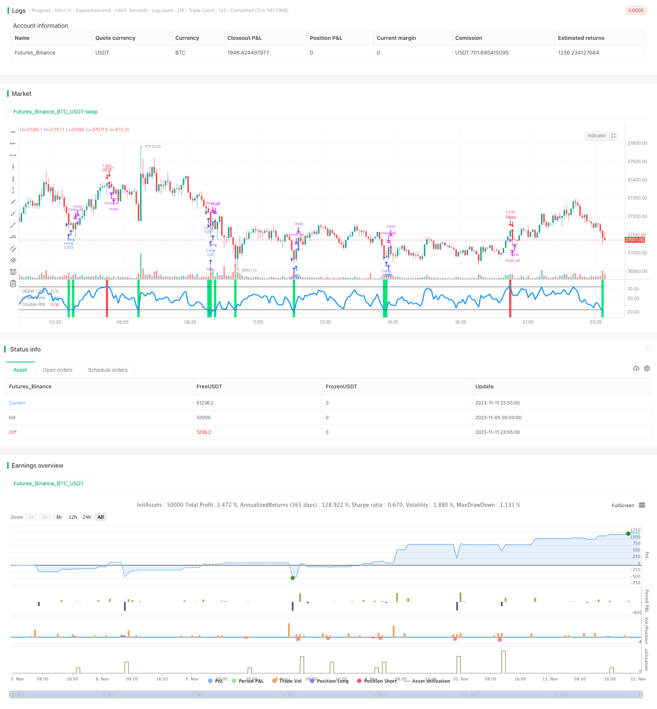

> Name

Fast-RSI-Risk-Control-Compound-Futures-Trading-Strategy based on fast RSI
> Author

ChaoZhang

> Strategy Description



[trans]


## Overview
This strategy is designed for the spot trading platform BitMEX. It analyzes the fast RSI indicator and combines multiple technical indicators to screen signals to achieve efficient trend following transactions. The strategy also sets up fund management and stop-loss mechanisms, which can effectively control transaction risks.
## Strategy Principle
1. Calculate the fast RSI, and set the parameters to the 7-day line, the overbought line of 25, and the oversold line of 75. When the RSI goes above the overbought line, it is an overbought signal; when the RSI goes below the oversold line, it is an oversold signal.
2. Set filters for K-line entities. It is required that the opening is a negative line, and the real body length is not less than 20% of yesterday's average real body.
3. Set filter for K line color. It is required to go short when the last four K's are negative lines, and to go long when the last four K's are positive lines.
4. Set stop loss logic. When the price moves in an unfavorable direction, close the position and stop the loss.
5. Set up an anti-bounce mechanism. When the price moves in a favorable direction and reaches the stop-loss line, a position is opened only when a signal is sent again.
6. Set up money management. A fixed percentage of capital is used to build a position, and the position is doubled for every loss.
## Advantage Analysis
1. The fast RSI parameter settings are reasonable and can quickly capture trends. Combined with K-line entity and color judgment, false breakthroughs can be effectively filtered.
2. Multi-layer signal filtering can reduce the number of transactions and increase the winning rate.
3. The strategy has a built-in stop loss mechanism, which can effectively control single losses.
4. Use dynamic position adjustment to achieve moderately aggressive fund management.
5. The trading time period can be customized to avoid shocks caused by major events.
## Risk and Optimization
1. Trading opportunities may be missed if the speed is too fast. Parameters can be relaxed appropriately to increase flexibility.
2. Unable to effectively judge the end of the trend. Consider combining other indicators to determine potential reversals.
3. If the position adjustment method is too radical, lock-in method can be introduced.
4. Parameters can be adjusted according to different markets to achieve a better parameter combination.
## Summarize
This strategy is relatively stable overall. By judging the trend direction quickly through RSI, and then combining multiple technical indicators to filter signals, you can get better returns in the trend. At the same time, the strategy has a certain room for optimization. By adjusting the parameter combination, it can adapt to different market environments and has strong practicality.
||


## Overview

This strategy is designed for the spot trading platform BitMEX. By analyzing the fast RSI indicator and combining multiple technical indicators to screen signals, it realizes efficient trend tracking trading. The strategy also sets risk management and stop loss mechanisms to effectively control trading risks.

## Strategy Logic

1. Calculate fast RSI with parameters of 7 days and overbought line 25, oversold line 75. When RSI crosses over overbought line, it is an overbought signal. When RSI crosses below oversold line, it is an oversold signal.

2. Set filter on candlestick body. Require opening as bearish candle with body length no less than 20% of yesterday's average body length. 

3. Set filter on candlestick color. Require last 4 candles as bearish when going short, and last 4 candles as bullish when going long.

4. Set stop loss logic. Close position when price moves in unfavorable direction.

5. Set anti-whipsaw mechanism. Only take signal when price recovers to stop loss level after initial move.

6. Set position sizing. Use fixed percentage of capital for each trade, and double position size after each loss.

## Advantage Analysis 

1. Fast RSI parameters set reasonably can quickly capture trends. Combining with candlestick body and color filters can avoid false breakouts effectively.

2. Multi-layer filter enhances win rate by reducing number of trades.

3. Built-in stop loss mechanism limits per trade loss. 

4. Dynamic position sizing realizes moderately aggressive capital management.

5. Customizable trading time frame avoids noise from major events.

## Risks and Optimizations

1. High speed may miss some trading opportunities. Can relax parameters for more flexibility.

2. Hard to determine trend ending. Consider combining with other indicators to detect potential reversals.

3. Position sizing method too aggressive, can introduce locking position way.

4. Can optimize parameters for different markets to find better parameter combinations.

## Conclusion

Overall this strategy is quite robust. By judging trend direction with fast RSI and filtering signals with multiple indicators, it can get good returns during trends. Also the strategy has room for optimization. By adjusting parameter combinations it can adapt to different market environments, thus having good practicality.

[/trans]

> Strategy Arguments


|Argument|Default|Description|
|----|----|----|
|v_input_1|true|Long|
|v_input_2|true|Short|
|v_input_3|true|Use Martingale|
|v_input_4|100|Capital, %|
|v_input_5|7|RSI Period|
|v_input_6|25|RSI limit|
|v_input_7|true|RSI Bars|
|v_input_8|true|Use Open Color Filter|
|v_input_9|true|Use Close Color Filter|
|v_input_10|4|Open Color Bars|
|v_input_11|true|Close Color Bars|
|v_input_12|true|Use Open Body Filter|
|v_input_13|true|Use Close Body Filter|
|v_input_14|20|Open Body Minimum, %|
|v_input_15|50|Close Body Minimum, %|
|v_input_16|true|Use Close Norma Filter|
|v_input_17|1900|From Year|
|v_input_18|2100|To Year|
|v_input_19|true|From Month|
|v_input_20|12|To Month|
|v_input_21|true|From Day|
|v_input_22|31|To Day|


> Source (PineScript)

``` pinescript
/*backtest
start: 2023-11-05 00:00:00
end: 2023-11-12 00:00:00
period: 5m
basePeriod: 1m
exchanges: [{"eid":"Futures_Binance","currency":"BTC_USDT"}]
*/

//Noro
//2018

//@version=2
strategy(title = "Robot BitMEX Fast RSI v1.0", shorttitle = "Robot BitMEX Fast RSI v1.0", overlay = false, default_qty_type = strategy.percent_of_equity, default_qty_value = 100, pyramiding = 10)

//Settings
needlong = input(true, defval = true, title = "Long")
needshort = input(true, defval = true, title = "Short")
usemar = input(true, defval = true, title = "Use Martingale")
capital = input(100, defval = 100, minval = 1, maxval = 10000, title = "Capital, %")
rsiperiod = input(7, defval = 7, minval = 2, maxval = 100, title = "RSI Period")
rsilimit = input(25, defval = 25, minval = 1, maxval = 30, title = "RSI limit")
rsibars = input(1, defval = 1, minval = 1, maxval = 20, title = "RSI Bars")
useocf = input(true, defval = true, title = "Use Open Color Filter")
useccf = input(true, defval = true, title = "Use Close Color Filter")
openbars = input(4, defval = 4, minval = 1, maxval = 20, title = "Open Color Bars")
closebars = input(1, defval = 1, minval = 1, maxval = 20, title = "Close Color Bars")
useobf = input(true, defval = true, title = "Use Open Body Filter")
usecbf = input(true, defval = true, title = "Use Close Body Filter")
openbody = input(20, defval = 20, minval = 0, maxval = 1000, title = "Open Body Minimum, %")
closebody = input(50, defval = 50, minval = 0, maxval = 1000, title = "Close Body Minimum, %")
usecnf = input(true, defval = true, title = "Use Close Norma Filter")
fromyear = input(1900, defval = 1900, minval = 1900, maxval = 2100, title = "From Year")
toyear = input(2100, defval = 2100, minval = 1900, maxval = 2100, title = "To Year")
frommonth = input(01, defval = 01, minval = 01, maxval = 12, title = "From Month")
tomonth = input(12, defval = 12, minval = 01, maxval = 12, title = "To Month")
fromday = input(01, defval = 01, minval = 01, maxval = 31, title = "From Day")
today = input(31, defval = 31, minval = 01, maxval = 31, title = "To Day")

//RSI
uprsi = rma(max(change(close), 0), rsiperiod)
dnrsi = rma(-min(change(close), 0), rsiperiod)
rsi = dnrsi == 0 ? 100 : uprsi == 0 ? 0 : 100 - (100 / (1 + uprsi / dnrsi))
uplimit = 100 - rsilimit
dnlimit = rsilimit
rsidn = rsi < dnlimit ? 1 : 0
rsiup = rsi > uplimit ? 1 : 0
rsidnok = sma(rsidn, rsibars) == 1
rsiupok = sma(rsiup, rsibars) == 1

//Body Filter
body = abs(close - open)
abody = sma(body, 10)
openbodyok = body >= abody / 100 * openbody or useobf == false
closebodyok = body >= abody / 100 * closebody or usecbf == false

//Color Filter
bar = close > open ? 1 : close < open ? -1 : 0
gbar = bar == 1 ? 1 : 0
rbar = bar == -1 ? 1 : 0
opengbarok = sma(gbar, openbars) == 1 or useocf == false
openrbarok = sma(rbar, openbars) == 1 or useocf == false
closebarok = (strategy.position_size > 0 and bar == 1) or (strategy.position_size < 0 and bar == -1) or useccf == false

//Norma Filter
norma = (rsi > dnlimit and rsi < uplimit) or usecnf == false

//Signals
up = openrbarok and rsidnok and openbodyok and (strategy.position_size == 0 or close < strategy.position_avg_price)
dn = opengbarok and rsiupok and openbodyok and (strategy.position_size == 0 or close > strategy.position_avg_price)
exit = ((strategy.position_size > 0 and closebarok and norma) or (strategy.position_size < 0 and closebarok and norma)) and closebodyok

//Indicator
plot(rsi, color = blue, linewidth = 3, title = "Double RSI")
plot(uplimit, color = black, title = "Upper Line")
plot(dnlimit, color = black, title = "Lower Line")
colbg = rsi > uplimit ? red : rsi < dnlimit ? lime : na
bgcolor(colbg, transp = 20)

//Trading
profit = exit ? ((strategy.position_size > 0 and close > strategy.position_avg_price) or (strategy.position_size < 0 and close < strategy.position_avg_price)) ? 1 : -1 : profit[1]
mult = usemar ? exit ? profit == -1 ? mult[1] * 2 : 1 : mult[1] : 1
lot = strategy.position_size == 0 ? strategy.equity / close * capital / 100 * mult : lot[1]

if up
    if strategy.position_size < 0
        strategy.close_all()
        
    strategy.entry("Long", strategy.long, needlong == false ? 0 : lot, when=(time > timestamp(fromyear, frommonth, fromday, 00, 00) and time < timestamp(toyear, tomonth, today, 23, 59)))

if dn
    if strategy.position_size > 0
        strategy.close_all()
        
    strategy.entry("Short", strategy.short, needshort == false ? 0 : lot, when=(time > timestamp(fromyear, frommonth, fromday, 00, 00) and time < timestamp(toyear, tomonth, today, 23, 59)))
    
if time > timestamp(toyear, tomonth, today, 23, 59) or exit
    strategy.close_all()
```

> Detail

https://www.fmz.com/strategy/431924

> Last Modified

2023-11-13 11:36:34
