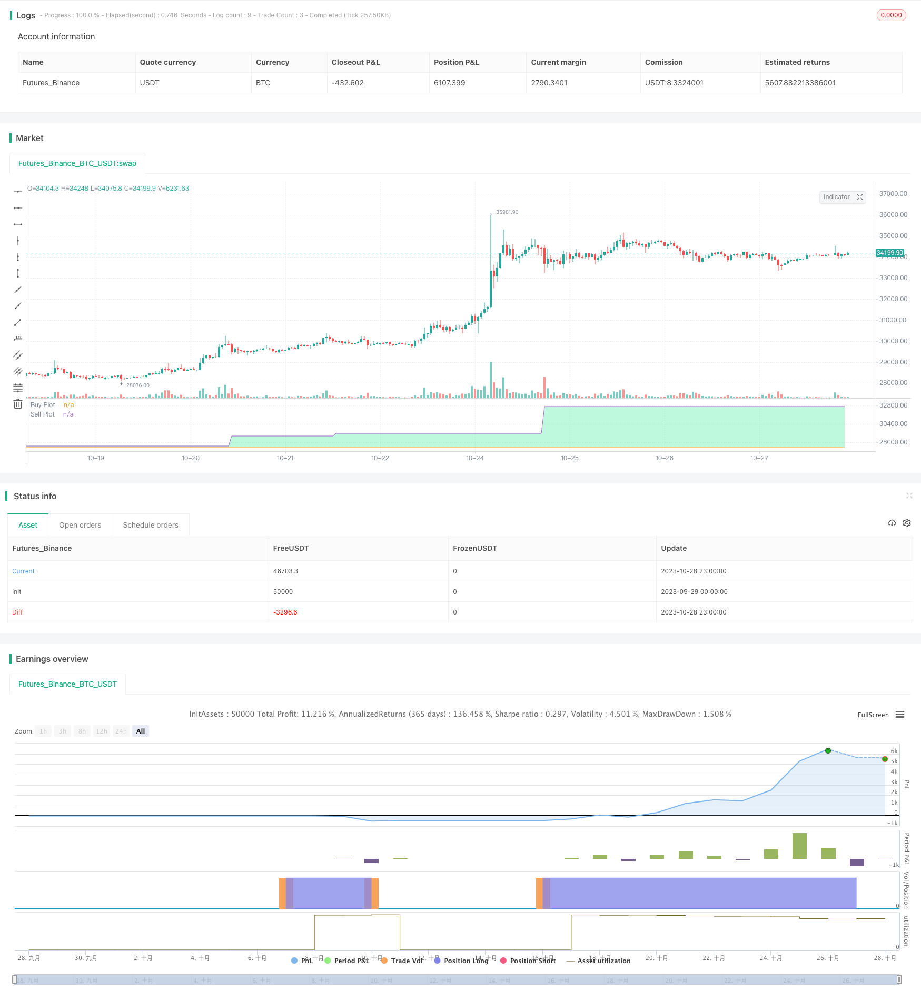

> Name

Dynamic RSI Rectangular Grid Strategy RSI-Box-Grid-Strategy
> Author

ChaoZhang

> Strategy Description



[trans]

## Overview
This strategy is a strategy similar to Grid Bot and is mainly used for algorithmic trading. It uses a dynamic, non-equally spaced Grid based on trading volume calculations, and only updates the grid when RSI meets certain conditions. It also has the characteristics of breakout trading, unlike the ordinary Grid Bot (the typical Grid Bot sells when it reaches the higher grid line, while this strategy sells when it falls below the lower grid line under certain conditions). This strategy also closes all pyramid orders at the close.
In a nutshell, this strategy updates the grid to the volume-based high/low for your given data source ("src" in settings) every time the RSI crosses the buy/sell signal line. It will generate 5 equally spaced lines based on this interval, and use the current data source to determine which line is the closest data source. If the data source breaks the line directly above the current line, a buy signal is issued; if the data source breaks below the line directly below the current line, a sell signal is issued.
You can configure whether to go short, data source, RSI cycle length, and overbought and oversold lines in the settings.
## Strategy Principle
The core logic of this strategy is:
1. Use the RSI indicator to determine the trend reversal point, and use the RSI line to cross the set overbought zone or oversold zone as a confirmation signal.
2. When the RSI confirmation signal appears, record the highest price and lowest price within a certain period, and set them as the upper and lower limits of the grid.
3. Divide the price into 5 grid lines according to the upper and lower limits, and determine which grid line the price is close to in real time.
4. When the price breaks through the upper line of the grid line, enter the long position; when the price falls below the lower line of the grid line, close the position and enter the short position.
5. Use the grid breakthrough method instead of the ordinary Grid Bot method of touching the grid to better capture trend breakthroughs.
6. At the close of the trading day, close all pyramid orders to prevent overnight risks.
The strategy mainly consists of the following parts:
1. Input parameter settings: including data source, RSI parameters, long and short options, etc.
2. RSI indicator calculation: Calculate the RSI indicator and determine whether it has a crossing signal.
3. Dynamic Grid Settings: Record price ranges and calculate grid lines when RSI signals occur.
4. Signal judgment: detect whether the price breaks through the upper and lower lines of the grid, and determine the long and short signals.
5. Order management: Send long and short signals and close pyramid orders before the market closes.
6. Drawing interface: display grid lines, long and short areas, etc.
By dynamically updating the grid and combining the trend judgment and breakthrough signals of the RSI indicator, this strategy can effectively track the trend and adjust the direction in time when it reverses. Closing positions before closing can effectively control overnight risks.
## Advantage Analysis
This strategy has the following main advantages:
1. The dynamic grid can be adaptively adjusted according to trends, rather than a fixed grid, which is more flexible.
2. Only adjust the grid when RSI confirms a trend reversal, which can filter out some noise signals.
3. Use breakout signals instead of just touch signals to capture trend turning points more accurately.
4. Close all positions before the market closes to avoid the risk of large overnight fluctuations and protect profits.
5. The RSI indicator can better judge overbought and oversold conditions, and it works well when combined with dynamic grids.
6. By using the breakthrough mode instead of the callback mode, you can get better entry opportunities at the early stage of the trend.
7. Adjusting the grid spacing and trading volume ratio can flexibly adjust the risk-return characteristics of the strategy.
8. The graphical interface intuitively displays the grid distribution and long and short areas.
9. You can choose whether to enable short selling to meet the needs of different traders.
10. The rules are simple and clear, easy to understand and implement, and are suitable for algorithmic trading.
The above advantages enable this strategy to automatically track trends while controlling risks, making it suitable for real-time quantitative trading applications.
## Risk Analysis
There are also some potential risks to be aware of with this strategy:
1. In a sharply volatile trend, there may be a risk of stop loss. The stop loss range can be appropriately relaxed, or the strategy can be suspended during the shock period.
2. A large gap may occur overnight, resulting in a larger opening position. Consider reducing the position ratio to avoid this risk.
3. Improper parameter settings may lead to frequent transactions or signal errors. Optimization parameters should be tested with caution.
4. When transaction fees are high, grid trading profits may be eaten up repeatedly. The number of transactions should be appropriately adjusted or an exchange with lower fees should be selected.
5. The breakthrough signal may appear slightly later than the trend reversal point, and the breakthrough range needs to be set appropriately.
6. This strategy may perform poorly during a steady rise in the stock market. Consider using it in combination with other indicators.
7. Sufficient funds are needed to support larger positions and pyramid positions, otherwise the effect will be poor. Positions should be adjusted based on the amount of funds.
Countermeasures:
1. Optimize parameters, reduce transaction frequency, and prevent excessive trading.
2. Combine trend indicators to avoid trading during shock periods.
3. Adjust positions, reduce the proportion of single transactions, and control risks.
4. Test different breakthrough amplitude parameters to balance timeliness and stability.
5. You can consider combining it with other indicators to make use of more market information.
6. Increase the amount of funds, expand the size of positions, and increase profit margins.
Through parameter optimization, risk management, combination with other strategies and other methods, the risk of the strategy can be reduced to a certain extent, allowing it to operate stably.
## Optimization direction
This strategy can be further optimized in the following areas:
1. Optimize RSI parameters, test different RSI cycle lengths, and find the best parameter combination.
2. Test different grid spacing settings to find the grid with the best benefit-risk ratio.
3. Try to combine other indicators to filter signals, such as MACD, KD, etc., to improve accuracy.
4. Develop an adaptive stop-loss strategy to dynamically adjust the stop-loss range according to the degree of market fluctuations.
5. Increase the conditions for opening a position and only open a position when the trend is clear enough to avoid being trapped.
6. Carry out backtest optimization, test data over a longer period of time, and evaluate parameter stability.
7. Try dynamic parameter optimization based on machine learning to adapt the strategy to each market environment.
8. Explore strategies that combine Options and use Options to hedge position risks.
9. According to the recent market characteristics, adjust the parameter optimization strategy to maintain the effectiveness of the strategy.
10. Develop a graphical strategy optimization platform to assist in rapid optimization testing.
Through automated parameter optimization, strategy combination, and the introduction of more market information, this strategy can achieve better stability and profitability, becoming a truly reliable quantitative trading strategy.
## Summarize
Overall, the RSI rectangular grid strategy uses the RSI indicator to determine the trend reversal confirmation signal, sets a dynamic grid for the price range, trades when the grid line is broken, and completely closes the position within the day, forming a flexible trend following algorithmic trading strategy. Compared with the fixed grid strategy, it can better adapt to market changes.
This strategy has certain advantages, including combining RSI indicators to determine trends, dynamic grid adaptation, breakout mode trading, and complete intraday closing. This makes it possible to effectively track trends while controlling risk. However, this strategy also has some potential risks that need to be paid attention to, such as stop loss risk under a volatile trend, overnight gap risk, etc. These risks can be reduced through parameter optimization, combination with other signals, and risk management techniques.
This strategy also has many optimization directions. By introducing more indicators, machine learning optimization parameters, and graphical backtesting platforms, it can be optimized into a more stable and profitable algorithmic trading strategy. Overall, this strategy provides a reliable, easy-to-operate trend following algorithm framework for quantitative trading.
||

## Overview

This strategy is a pseudo-grid bot intended primarily for algorithmic trading. It uses a dynamic, volume-weighted grid that updates only when the RSI meets certain conditions. It's also a breakout strategy, whereas normal grid bots are not (typical grid bots sell when a higher grid is reached, whereas this strategy sells when a lower grid is breached under specific conditions). This strategy also closes all pyramiding orders on close.

In short, the strategy updates its grid to the volume-weighted highest/lowest values of your given source ("src" in settings) each time the RSI crosses under/over the overbought/oversold levels. From this range it generates an evenly spaced grid of five lines, and uses the current source to determine which grid line is closest. Then, if the source crosses over the line directly above, it enters a long. If the source crosses under the line directly below, it enters a short.

You can configure shorts, source, RSI length, and overbought/oversold levels in settings.

## Strategy Logic

The core logic of the strategy is:

1. Use RSI indicator to determine trend reversal points, using RSI line crossovers of overbought/oversold levels as confirmation signals.

2. When RSI signal occurs, record the highest/lowest prices over a period as upper/lower limits of the grid. 

3. Divide the range into 5 evenly spaced grid lines. Check realtime which line the price is closest to.

4. When price breaks over the line above, go long. When price breaks under the line below, flatten longs and go short.

5. By using breakout instead of touch, it can better catch trend reversals. 

6. Close all pyramiding orders before close to avoid overnight risks.

The strategy consists of:

1. Input settings: source, RSI parameters, long/short etc.

2. RSI calculation: compute RSI and check for crossover signals.

3. Dynamic grid: record price range on RSI signals and calculate grid lines.  

4. Signal check: detect price breaking grid lines for long/short signals.

5. Order management: send orders and flatten before close.

6. Charting: plot grid lines, long/short zones etc.

By dynamically updating the grid and using RSI for trend context plus breakout signals, this strategy can effectively track trends and reverse when trend changes. Flattening before close manages overnight risks.

## Advantage Analysis

The main advantages of this strategy are:

1. Dynamic grid adapts to trend, unlike fixed grids.

2. Only adjusts grid on RSI confirmation, reducing noise.

3. Breakout signals catch reversals better than touch.

4. Flattens before close to avoid overnight gap risks.

5. RSI is effective for overbought/sold detection.

6. Breakout mode provides early trend entry compared to reversion.

7. Adjusting grid spacing & size allows risk tuning.

8. Visual grid & long/short zones.

9. Optional shorts to suit different traders.

10. Simple clear logic suitable for algo trading.

These make the strategy capable of auto trend tracking with risk controls for live trading.

## Risk Analysis

There are also some potential risks to note:

1. Whipsaw markets can cause stop losses. Can widen stops or pause trading.

2. Overnight gaps can leave large open gaps. Can reduce position sizes.

3. Bad parameter tuning can increase trades or signal errors. Requires cautious optimization. 

4. High fees may erode profits from grid trades. Should reduce trade sizes or use lower fee exchanges.

5. Breakout signals may lag reversals slightly. Need reasonable breakout thresholds.

6. May underperform in steady uptrends. Consider combining with other indicators.

7. Needs sufficient capital for larger position sizes and pyramiding, otherwise results will be poor. Adjust sizes based on capital.

Mitigations:

1. Optimize parameters to reduce trade frequency and overtrading.

2. Combine with trend indicators, avoid trading whipsaw periods.

3. Reduce trade size % and risk per trade.

4. Test different breakout thresholds for best balance of timeliness vs stability.

5. Add more entry conditions, only enter clear trends to avoid being trapped.

6. Backtest over longer periods to evaluate parameter stability.

7. Explore machine learning based dynamic parameter optimization for market adaptability.

8. Consider combining with options strategies to hedge position risks.

9. Adjust parameters based on recent market conditions to keep strategy effective.

10. Build visual optimization platforms to assist rapid testing.

With parameter optimization, combing signals, and more market info, the risks can be reduced to make a truly reliable algo strategy.

## Enhancement Opportunities 

The strategy can be further enhanced by:

1. Optimizing RSI parameters, testing RSI periods for best combos.

2. Testing different grid spacing for optimal risk-reward.

3. Adding other indicators to filter signals, e.g. MACD, KD etc to improve accuracy.

4. Developing adaptive stops based on market volatility.

5. Increasing entry conditions, only enter obvious trends to avoid traps. 

6. Backtesting over longer periods to evaluate parameter stability.

7. Exploring machine learning based dynamic optimization for adaptability.

8. Incorporating options strategies to hedge risks.

9. Adjusting parameters based on recent market conditions to maintain effectiveness.

10. Building visual optimization platforms for rapid testing.

With automated optimization, strategy combos, more market info etc, it can achieve better stability and returns as a real trading strategy.

## Summary

In summary, the RSI Box Grid strategy uses RSI to identify trend reversal confirmation, sets dynamic price range grids, trades breakouts, and flattens intraday - forming a flexible trend following algo trading strategy. Compared to fixed grids, it adapts better to market changes.

The strategy has advantages including RSI for trend context, dynamic grids, breakout trading, and full flattening intraday. This allows it to effectively track trends with risk controls. However, risks like whipsaw stop losses, overnight gaps exist, requiring optimization, combing signals, and risk management.

There are many enhancement opportunities, by incorporating more indicators, ML optimization, visual backtesting etc, it can become a more robust high-return algo trading strategy. Overall it provides a reliable, easy-to-implement trend tracking algorithmic framework for quant trading.

[/trans]


> Strategy Arguments


|Argument|Default|Description|
|----|----|----|
|v_input_source_1_close|0|Source: close|high|low|open|hl2|hlc3|hlcc4|ohlc4|
|v_input_int_1|14|RSI Length|
|v_input_int_2|70|Overbought Level|
|v_input_int_3|30|Oversold Level|
|v_input_bool_1|false|Use Shorts|
|v_input_bool_2|false|Show Grid|


> Source (PineScript)

``` pinescript
/*backtest
start: 2023-09-29 00:00:00
end: 2023-10-29 00:00:00
period: 1h
basePeriod: 15m
exchanges: [{"eid":"Futures_Binance","currency":"BTC_USDT"}]
*/

// This source code is subject to the terms of the Mozilla Public License 2.0 at https://mozilla.org/MPL/2.0/
// © wbburgin

//@version=5
// strategy("RSI Box Strategy (pseudo-Grid Bot)", overlay=true, initial_capital = 10000, 
//  default_qty_type = strategy.percent_of_equity, default_qty_value = 1, pyramiding = 33, commission_value=0.10)

src = input.source(close,"Source")
rsiLength = input.int(14,"RSI Length")
oblvl = input.int(70,"Overbought Level")
oslvl = input.int(30,"Oversold Level")
useShorts = input.bool(false,"Use Shorts",inline="B")
showGrid = input.bool(false,"Show Grid",inline="B")

rsi = ta.rsi(src,rsiLength)

rsi_crossdn = ta.crossunder(rsi,oblvl)
rsi_crossup = ta.crossover(rsi,oslvl)

highest = ta.vwma(ta.highest(src,rsiLength),rsiLength)
lowest = ta.vwma(ta.lowest(src,rsiLength), rsiLength)

gridTop = ta.valuewhen(rsi_crossdn,highest,0)
gridBottom = ta.valuewhen(rsi_crossup,lowest,0)
gridMiddle = math.avg(gridTop,gridBottom)
gridMidTop = math.avg(gridMiddle,gridTop)
gridMidBottom = math.avg(gridMiddle,gridBottom)

diff1 = math.abs(src - gridTop)
diff2 = math.abs(src - gridBottom)
diff3 = math.abs(src - gridMiddle)
diff4 = math.abs(src - gridMidTop)
diff5 = math.abs(src - gridMidBottom)

minDiff = math.min(diff1, diff2, diff3, diff4, diff5)

// Determine which line is the closest
float closestLine = na
if minDiff == diff1
    closestLine := gridTop
else if minDiff == diff2
    closestLine := gridBottom
else if minDiff == diff3
    closestLine := gridMiddle
else if minDiff == diff4
    closestLine := gridMidTop
else if minDiff == diff5
    closestLine := gridMidBottom

buyCrosses = ta.crossover(src,gridTop) or ta.crossover(src,gridBottom) or ta.crossover(src,gridMiddle) or ta.crossover(src,gridMidTop) or ta.crossover(src,gridMidBottom)
sellCrosses= ta.crossunder(src,gridTop) or ta.crossunder(src,gridBottom) or ta.crossunder(src,gridMiddle) or ta.crossunder(src,gridMidTop) or ta.crossunder(src,gridMidBottom)

condition_bull = buyCrosses
condition_bear = sellCrosses

var float bull_status_line = na
var float bear_status_line = na
var float bull_buy_line = na
var float bear_sell_line = na

if condition_bull
    bull_status_line := closestLine
if condition_bear
    bear_status_line := closestLine

if bull_status_line == gridBottom
    bull_buy_line := gridMidBottom
if bull_status_line == gridMidBottom
    bull_buy_line := gridMiddle
if bull_status_line == gridMiddle
    bull_buy_line := gridMidTop
if bull_status_line == gridMidTop
    bull_buy_line := gridTop

if bear_status_line == gridTop
    bear_sell_line := gridMidTop
if bear_status_line == gridMidTop
    bear_sell_line := gridMiddle
if bear_status_line == gridMiddle
    bear_sell_line := gridMidBottom
if bear_status_line == gridMidBottom
    bear_sell_line := gridBottom

l = ta.crossover(src,bull_buy_line)
s = ta.crossunder(src,bear_sell_line)

if l
    strategy.entry("Long",strategy.long)
if s
    strategy.close("Long")
    if useShorts
        strategy.entry("Short",strategy.short)

// Plotting
in_buy = ta.barssince(l) < ta.barssince(s)
u=plot(bull_buy_line,color=na,title="Buy Plot")
d=plot(bear_sell_line,color=na,title="Sell Plot")

plot(not showGrid?na:gridBottom,color=color.new(color.white,75),title="Grid Line -2")
plot(not showGrid?na:gridMidBottom,color=color.new(color.white,75),title="Grid Line -1")
plot(not showGrid?na:gridMiddle,color=color.new(color.white,75),title="Grid Line 0")
plot(not showGrid?na:gridMidTop,color=color.new(color.white,75),title="Grid Line 1")
plot(not showGrid?na:gridTop,color=color.new(color.white,75),title="Grid Line 2")


fill(u,d,color=in_buy ? color.new(color.lime,75) : color.new(color.red,75))
```

> Detail

https://www.fmz.com/strategy/430551

> Last Modified

2023-10-30 11:29:30
