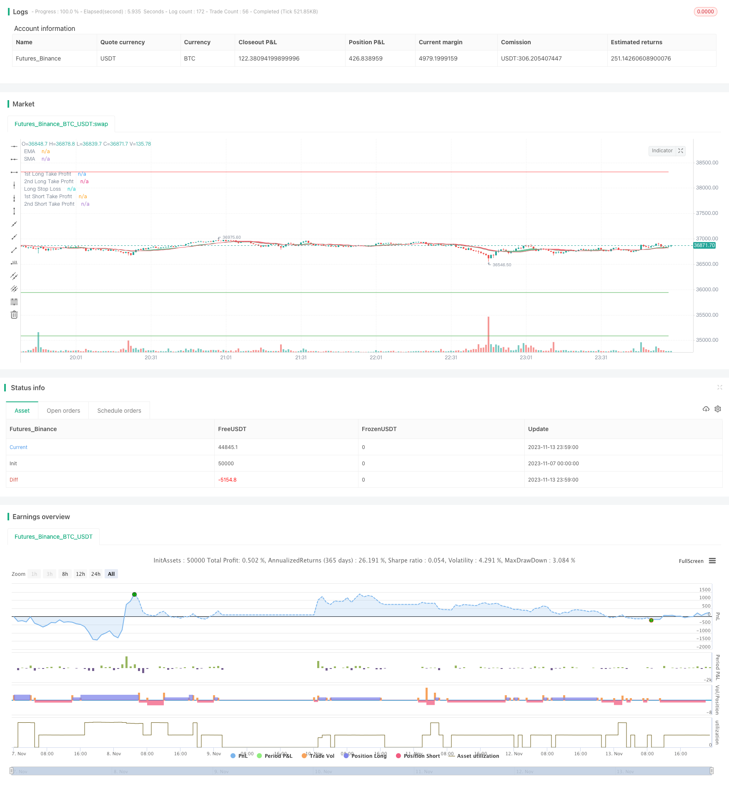

> Name

Double RSI quantitative trading strategy Growth-Producer-Dual-RSI-Trend-Following-Strategy
> Author

ChaoZhang

> Strategy Description


[trans]
## Overview
This strategy uses the dual RSI indicator for long and short two-way trading, and combines the moving average system to determine the trend direction. It is a dual RSI quantitative strategy. The strategy first uses the RSI indicator to determine the long and short signals, and then combines the moving average to determine the trend direction to decide on long and short positions. It is a typical trend following strategy.
## Principle analysis
The dual RSI quantitative strategy mainly uses the dual time period RSI indicator to judge trading signals. The strategy first sets two RSI parameters, a longer period as the main trading judgment, and a shorter period as the auxiliary filtering. When the longer-period RSI line breaks below the sell line, a long signal is generated, and when the short-period RSI line breaks above the buy line, a short signal is generated, forming a long and short cross trading opportunity for the double RSI indicator.
In order to filter out false signals, the strategy also introduces SMA and EMA average lines for trend judgment. Only when the short-term SMA line crosses the long-term EMA line will the RSI long signal be considered, and only when the short-term SMA line crosses the long-term EMA line will the RSI short signal be considered. Ensure that the double RSI signals are consistent with the trend direction and avoid counter-trend transactions.
In addition, the strategy also sets stop-loss and take-profit logic. After opening a position, two take-profit orders of different quantities will be placed at the same time, and the stop-loss level will be set.
## Advantage Analysis
The double RSI quantitative strategy has the following advantages:
1. The dual time period RSI indicator can more accurately judge long and short signals. The cross combination of long and short period RSI can filter out some false signals and improve signal quality.
2. The moving average system assists in judging the direction of the general trend and avoids counter-trend transactions. It can filter out most noise transactions and improve the winning rate.
3. Flexible stop-profit and stop-loss mechanisms, you can obtain higher returns through different stop-profit settings, and you can also stop losses to control risks.
4. The strategic trading logic is simple and clear, easy to understand and optimize, and is suitable for quantitative traders to learn.
## Risk Analysis
Although the double RSI quantitative strategy has certain advantages, it also has the following risks:
1. The RSI indicator itself has no effect on the judgment of volatile market conditions and trend reversals, and the trading effect of the strategy may not be good in these markets.
2. Although the moving average system can filter small-scale noise, it is not effective in judging trend changes in intermediate periods and may miss trend turning points.
3. Improper setting of take profit and stop loss may lead to too wide stop loss or too small take profit, reducing the effectiveness of the strategy.
4. Large-scale short selling and long selling may lead to expanded losses, so position size needs to be controlled.
To address the above risks, risks can be reduced by adjusting RSI parameters, introducing more advanced trend and reversal indicators, optimizing stop-profit and stop-loss logic, and controlling positions.
## Optimization direction
The double RSI quantification strategy can be further optimized from the following directions:
1. Try different parameter combinations, optimize RSI cycle parameters, and find the best long and short cycle RSI indicator combination.
2. Test different moving average indicators, and introduce indicators such as MACD to determine trends and reversal opportunities.
3. Optimize the stop-profit and stop-loss strategy and set up trailing stop-loss or trailing stop-loss to make the stop-profit and stop-loss more flexible.
4. Add a position control module to control long and short positions at different stages of the general cycle trend.
5. Add machine learning models to improve the accuracy of entries and exits.
6. Carry out backtest optimization to find the best trading variety and time period.
## Summarize
Overall, the double RSI quantitative strategy is a typical trend following strategy. It combines the double RSI indicator to judge trading signals and the moving average system to filter out noise. The strategic idea is very classic and practical. Although there is some room for improvement in the strategy, the overall operation logic is clear and easy to understand and optimize. This is a strategy that is very suitable for quantitative trading beginners to learn and practice. Through the principle of Practice makes perfect and continuous optimization and iteration of the strategy, stable trading results can be obtained.
|| 

## Overview

This is a dual RSI trend following strategy that utilizes two RSI indicators for long and short trading signals, combined with a moving average system to determine trend direction. It belongs to the category of dual RSI algorithmic strategies. The strategy first uses RSI indicators to determine bullish and bearish signals, then uses moving averages to confirm the trend direction for long or short trades. It is a typical trend following strategy.

## Principle Analysis

The dual RSI strategy mainly uses two RSI indicators with different timeframes for trading signals. It first sets up two RSI parameters, one longer period RSI as the main indicator, and one shorter period RSI as the auxiliary filter. When the longer period RSI breaks below the oversold line, a long signal is generated. When the shorter period RSI breaks above the overbought line, a short signal is generated. This forms the dual RSI crossover system for trading opportunities.

To filter false signals, the strategy also incorporates SMA and EMA moving averages for trend detection. Only when the short period SMA crosses above the long period EMA, the long RSI signal is considered. And only when the short SMA crosses below the long EMA, the short RSI signal is considered. This ensures RSI signals are aligned with the trend direction and avoids trading against the trend.

In addition, the strategy also sets up stop loss and take profit logic. After opening positions, two take profit orders of different sizes are placed, together with a stop loss level.

## Advantage Analysis

The dual RSI algorithmic strategy has the following advantages:

1. The dual timeframe RSI indicators can more accurately determine bullish and bearish signals. The combination of long and short period RSIs can filter some false signals and improve signal quality.

2. The moving average system helps determine the major trend direction, avoids trading against the trend, and can filter out most noise trades, improving win rate.

3. The flexible stop loss and take profit mechanism allows higher returns through different take profit settings, and manages risk through stop loss. 

4. The trading logic is simple and clear, easy to understand and optimize. It is suitable for algorithmic traders to learn.

## Risk Analysis

Despite the advantages, the dual RSI strategy also has the following risks:

1. RSI itself has limited effectiveness in ranging markets and trend reversals. The strategy may underperform in these market conditions.

2. Although moving averages filter small noise, they are less effective in detecting intermediate cycle trend changes, and may miss trend turning points.

3. Improper stop loss and take profit settings may result in stops being too wide or profits too small, deteriorating strategy performance. 

4. Large long/short positions can lead to magnified losses. Position sizing needs to be controlled.

To address these risks, parameters can be adjusted, more advanced trend and reversal indicators can be introduced, stop and profit logic optimized, and position sizing controlled to minimize risks.

## Optimization Directions

The dual RSI strategy can be further optimized in the following aspects:

1. Test different parameter combinations to find the optimal long and short RSI periods.

2. Introduce other indicators like MACD for better trend and reversal analysis.

3. Optimize stop loss and take profit strategies, use trailing stops or moving take profits for more flexibility.

4. Add position sizing control module to adjust long/short positions in different trend cycle stages. 

5. Incorporate machine learning models to improve entry and exit accuracy.

6. Backtest on different products and timeframes for optimization.

## Conclusion

In summary, the dual RSI strategy is a typical trend following strategy. Its idea of combining dual RSI signals and moving average noise filtering is very classical and practical. Although there are areas for improvement, the overall logic is clear and easy to understand and optimize. This is a great strategy for algorithmic trading beginners to learn and practice. Through continuous optimization and iterations based on the "practice makes perfect" principle, stable trading results can be achieved.

[/trans]

> Strategy Arguments


|Argument|Default|Description|
|----|----|----|
|v_input_1|19|Period|
|v_input_2|120|RVI period|
|v_input_3|35|RVI benchmark|
|v_input_4|19|MFI Length|
|v_input_5|15|MFI Lower level|
|v_input_6|90|MFI Higher level|
|v_input_7|true|RSI VOLUME WEIGHTED AVERAGE PRICE LONG|
|v_input_8|16|RSI-VWAP LENGTH LONG|
|v_input_9|13|RSI-VWAP OVERSOLD LONG|
|v_input_10|68|RSI-VWAP OVERBOUGHT LONG|
|v_input_11|true|RSI VOLUME WEIGHTED AVERAGE PRICE SHORT|
|v_input_12|14|RSI-VWAP LENGTH SHORT|
|v_input_13|7|RSI-VWAP OVERSOLD SHORT|
|v_input_14|68|RSI-VWAP OVERBOUGHT SHORT|
|v_input_15|3.3|Long Take Profit 1 %|
|v_input_16|15|Long Take Profit 1 Qty|
|v_input_17|12|Long Take Profit 2%|
|v_input_18|100|Long Take Profit 2 Qty|
|v_input_19|3.3|Long Stop Loss %|
|v_input_20|3.2|Short Take Profit 1 %|
|v_input_21|20|Short Take Profit 1 Qty|
|v_input_22|5.5|Short Take Profit 2%|
|v_input_23|100|Short Take Profit 2 Qty|
|v_input_24|3.2|Short Stop Loss %|
|v_input_25|2019|Backtest Start Year|
|v_input_26|true|Backtest Start Month|
|v_input_27|true|Backtest Start Day|
|v_input_28|2020|Backtest Stop Year|
|v_input_29|12|Backtest Stop Month|
|v_input_30|31|Backtest Stop Day|


> Source (PineScript)

``` pinescript
/*backtest
start: 2023-11-07 00:00:00
end: 2023-11-14 00:00:00
period: 1m
basePeriod: 1m
exchanges: [{"eid":"Futures_Binance","currency":"BTC_USDT"}]
*/

//@version=4
strategy("Growth Producer", overlay=true, initial_capital = 1000, currency = "USD", pyramiding = 2, commission_type=strategy.commission.percent, commission_value=0.07, default_qty_type = strategy.percent_of_equity, default_qty_value = 100)

//Functions
Atr(p) =>
    atr = 0.
    Tr = max(high - low, max(abs(high - close[1]), abs(low - close[1])))
    atr := nz(atr[1] + (Tr - atr[1])/p,Tr)

/// TREND
ribbon_period = input(19, "Period", step=1)

leadLine1 = ema(close, ribbon_period)
leadLine2 = sma(close, ribbon_period)

p1 = plot(leadLine1, color= #53b987, title="EMA", transp = 50, linewidth = 1)
p2 = plot(leadLine2, color= #eb4d5c, title="SMA", transp = 50, linewidth = 1)
fill(p1, p2, transp = 60, color = leadLine1 > leadLine2 ? #53b987 : #eb4d5c)

// Relative volatility index
length = input(120,"RVI period", minval=1), src = close
len = 14
stddev = stdev(src, length)
upper = ema(change(src) <= 0 ? 0 : stddev, len)
lower = ema(change(src) > 0 ? 0 : stddev, len)
rvi = upper / (upper + lower) * 100
benchmark = input(35, "RVI benchmark", minval=10, maxval=100, step=0.1)

// Plot RVI
// h0 = hline(80, "Upper Band", color=#C0C0C0)
// h1 = hline(20, "Lower Band", color=#C0C0C0)
// fill(h0, h1, color=#996A15, title="Background")
// offset = input(0, "Offset", type = input.integer, minval = -500, maxval = 500)
// plot(rvi, title="RVI", color=#008000, offset = offset)


/// MFI input
mfi_source = hlc3
mfi_length = input(19, "MFI Length", minval=1)
mfi_lower = input(15, "MFI Lower level", minval=0, maxval=50)
mfi_upper = input(90, "MFI Higher level", minval=50, maxval=100)


// MFI
upper_s = sum(volume * (change(mfi_source) <= 0 ? 0 : mfi_source), mfi_length)
lower_s = sum(volume * (change(mfi_source) >= 0 ? 0 : mfi_source), mfi_length)
mf = rsi(upper_s, lower_s)
// mfp = plot(mf, color=color.new(color.gray,0), linewidth=1)
// top = hline(mfi_upper, color=color.new(color.gray, 100), linewidth=1, editable=false)
// bottom = hline(mfi_lower, color=color.new(color.gray,100), linewidth=1, editable=false)
// hline(0, color=color.new(color.black,100), editable=false)
// hline(100, color=color.new(color.black,100), editable=false)

// Breaches
// b_color = (mf > mfi_upper) ? color.new(color.red,70) : (mf < mfi_lower) ? color.new(color.green,60) : na
// bgcolor(HighlightBreaches ? b_color : na)

// fill(top, bottom, color=color.gray, transp=75)

// Initial inputs
Act_RSI_VWAP_long = input(true, "RSI VOLUME WEIGHTED AVERAGE PRICE LONG")
RSI_VWAP_length_long = input(16, "RSI-VWAP LENGTH LONG")
RSI_VWAP_overSold_long = input(13, "RSI-VWAP OVERSOLD LONG", type=input.float)
RSI_VWAP_overBought_long = input(68, "RSI-VWAP OVERBOUGHT LONG", type=input.float)

Act_RSI_VWAP_short = input(true, "RSI VOLUME WEIGHTED AVERAGE PRICE SHORT")
RSI_VWAP_length_short = input(14, "RSI-VWAP LENGTH SHORT")
RSI_VWAP_overSold_short = input(7, "RSI-VWAP OVERSOLD SHORT", type=input.float)
RSI_VWAP_overBought_short = input(68, "RSI-VWAP OVERBOUGHT SHORT", type=input.float)

// RSI with VWAP as source
RSI_VWAP_long = rsi(vwap(close), RSI_VWAP_length_long)
RSI_VWAP_short = rsi(vwap(close), RSI_VWAP_length_short)

// Plot Them Separately.
// Plotting LONG, Put overlay=false
// r=plot(RSI_VWAP_long, color = RSI_VWAP_long > RSI_VWAP_overBought_long ? color.red : RSI_VWAP_lnog < RSI_VWAP_overSold_long ? color.lime : color.blue, title="rsi", linewidth=2, style=plot.style_line)
// h1=plot(RSI_VWAP_overBought_long, color = color.gray, style=plot.style_stepline)
// h2=plot(RSI_VWAP_overSold_long, color = color.gray, style=plot.style_stepline)
// fill(r,h1, color = RSI_VWAP_long > RSI_VWAP_overBought_long ? color.red : na, transp = 60)
// fill(r,h2, color = RSI_VWAP_long < RSI_VWAP_overSold_long ? color.lime : na, transp = 60)

// Plotting SHORT, Put overlay=false
// r=plot(RSI_VWAP_short, color = RSI_VWAP_short > RSI_VWAP_overBought_short ? color.red : RSI_VWAP_short < RSI_VWAP_overSold_short ? color.lime : color.blue, title="rsi", linewidth=2, style=plot.style_line)
// h1=plot(RSI_VWAP_overBought_short, color = color.gray, style=plot.style_stepline)
// h2=plot(RSI_VWAP_overSold_short, color = color.gray, style=plot.style_stepline)
// fill(r,h1, color = RSI_VWAP_short > RSI_VWAP_overBought_short ? color.red : na, transp = 60)
// fill(r,h2, color = RSI_VWAP_short < RSI_VWAP_overSold_short ? color.lime : na, transp = 60)


///////  STRATEGY Take Profit / Stop Loss ////////
////// LONG //////

long_tp1_inp = input(3.3, title='Long Take Profit 1 %', step=0.1)/100
long_tp1_qty = input(15, title="Long Take Profit 1 Qty", step=1)

long_tp2_inp = input(12, title='Long Take Profit 2%', step=0.1)/100
long_tp2_qty = input(100, title="Long Take Profit 2 Qty", step=1)

long_sl_inp = input(3.3, title='Long Stop Loss %', step=0.1)/100

long_take_level_1 = strategy.position_avg_price * (1 + long_tp1_inp)
long_take_level_2 = strategy.position_avg_price * (1 + long_tp2_inp)
long_stop_level = strategy.position_avg_price * (1 - long_sl_inp)

////// SHORT //////
short_tp1_inp = input(3.2, title='Short Take Profit 1 %', step=0.1)/100
short_tp1_qty = input(20, title="Short Take Profit 1 Qty", step=1)

short_tp2_inp = input(5.5, title='Short Take Profit 2%', step=0.1)/100
short_tp2_qty = input(100, title="Short Take Profit 2 Qty", step=1)

short_sl_inp = input(3.2, title='Short Stop Loss %', step=0.1)/100

short_take_level_1 = strategy.position_avg_price * (1 - short_tp1_inp)
short_take_level_2 = strategy.position_avg_price * (1 - short_tp2_inp)
short_stop_level = strategy.position_avg_price * (1 + short_sl_inp)


///Strategy_Conditions
/// LONG ///
entry_long =(crossover(RSI_VWAP_long, RSI_VWAP_overSold_long) and leadLine2<leadLine1) or (crossunder(mf,mfi_lower) and leadLine2<leadLine1)
entry_price_long=valuewhen(entry_long,close,0)
exit_long =crossunder(RSI_VWAP_long, RSI_VWAP_overBought_long)

/// SHORT ///

entry_short =crossunder(RSI_VWAP_short, RSI_VWAP_overBought_short) and leadLine2>leadLine1 or (crossover(mf,mfi_upper) and leadLine2>leadLine1)
entry_price_short=valuewhen(entry_short,close,0)
exit_short =crossover(RSI_VWAP_short, RSI_VWAP_overSold_short)

////// BACKTEST PERIOD ///////
testStartYear = input(2019, "Backtest Start Year")
testStartMonth = input(1, "Backtest Start Month")
testStartDay = input(1, "Backtest Start Day")
testPeriodStart = timestamp(testStartYear,testStartMonth,testStartDay,0,0)

testStopYear = input(2020, "Backtest Stop Year")
testStopMonth = input(12, "Backtest Stop Month")
testStopDay = input(31, "Backtest Stop Day")
testPeriodStop = timestamp(testStopYear,testStopMonth,testStopDay,0,0)

testPeriod() => true

if testPeriod()

    if strategy.position_size == 0 or strategy.position_size > 0 and rvi>benchmark
        strategy.entry("long", true, when = entry_long, comment="Insert Enter Long Comment")
    strategy.exit("TP1","long", qty_percent=long_tp1_qty, limit=long_take_level_1, stop=long_stop_level)
    strategy.exit("TP2","long", qty_percent=long_tp2_qty, limit=long_take_level_2, stop=long_stop_level)
    strategy.close("long", when=exit_long, comment = "Insert Exit Long Comment")

    if strategy.position_size == 0 or strategy.position_size < 0 and rvi>benchmark
        strategy.entry("short", false, when = entry_short, comment="Insert Enter Short Comment")
    strategy.exit("TP1","short", qty_percent=short_tp1_qty, limit=short_take_level_1, stop=short_stop_level)
    strategy.exit("TP2","short", qty_percent=short_tp2_qty, limit=short_take_level_2, stop=short_stop_level)
    strategy.close("short", when=exit_short, comment = "Insert Exit Short Comment")


// LONG POSITION
plot(strategy.position_size > 0 ? long_take_level_1 : na, style=plot.style_linebr, color=color.green, linewidth=1, title="1st Long Take Profit")
plot(strategy.position_size > 0 ? long_take_level_2 : na, style=plot.style_linebr, color=color.green, linewidth=1, title="2nd Long Take Profit")
plot(strategy.position_size > 0 ? long_stop_level : na, style=plot.style_linebr, color=color.red, linewidth=1, title="Long Stop Loss")


// SHORT POSITION
plot(strategy.position_size < 0 ? short_take_level_1 : na, style=plot.style_linebr, color=color.green, linewidth=1, title="1st Short Take Profit")
plot(strategy.position_size < 0 ? short_take_level_2 : na, style=plot.style_linebr, color=color.green, linewidth=1, title="2nd Short Take Profit")
plot(strategy.position_size < 0 ? short_stop_level : na, style=plot.style_linebr, color=color.red, linewidth=1, title="Long Stop Loss")
```

> Detail

https://www.fmz.com/strategy/432233

> Last Modified

2023-11-15 17:31:24
