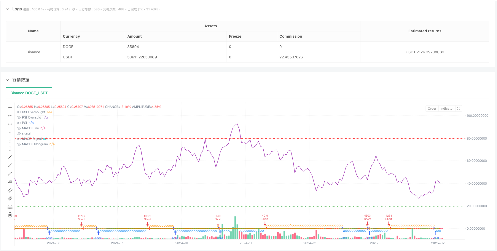
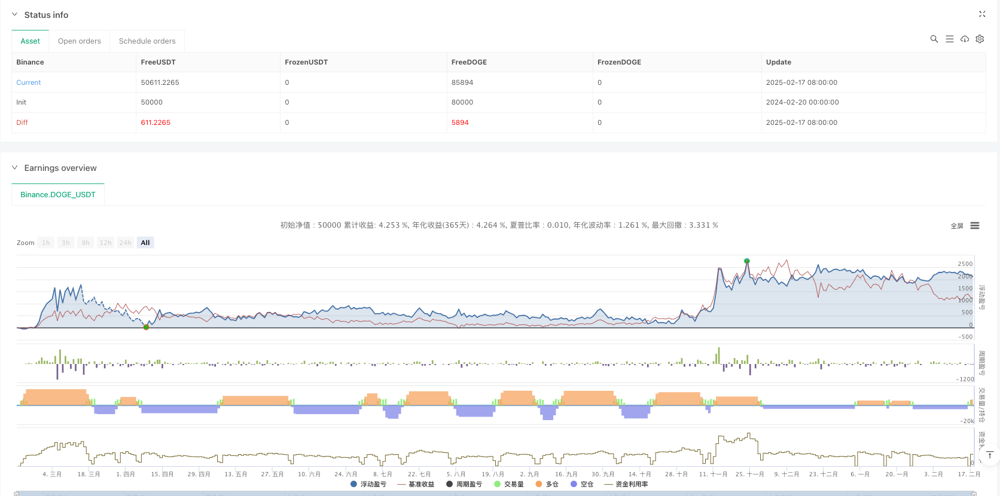

> Name

Dual-Indicator-Dynamic-Trend-Trading-Strategy-Multi-dimensional-Technical-Analysis-System-Based-on-RSI-and-MACD
> Author

ianzeng123

> Strategy Description





[trans]
#### Overview
This is an automated trading strategy based on the dual technical indicators of RSI and MACD. This strategy identifies potential trading opportunities by combining overbought and oversold signals with trend confirmation to achieve precise market control. The strategy adopts percentage position management and has a built-in anti-slip point mechanism, which is highly practical and adaptable.
#### Strategy Principle
The core logic of the strategy is based on the following key elements:
1. Use the Relative Strength Index (RSI) to determine overbought and oversold. The parameters are set to 14 periods, the overbought value is 80, and the oversold value is 20.
2. Use MACD(12,26,9) to confirm the trend, and identify trend changes through the intersection of MACD line and signal line
3. The generation of trading signals must meet the conditions of both RSI and MACD:
   - Long conditions: RSI has not reached overbought + MACD line is above the signal line
   - Short selling conditions: RSI is not oversold + MACD line is below the signal line
4. Use 3% of the account equity as the position size for each transaction, and limit repeated opening of positions in the same direction.
#### Strategic Advantages
1. The combined use of dual technical indicators greatly reduces the risk of false signals and improves the reliability of transactions.
2. The percentage position management method helps to dynamically adjust funds and better control risks.
3. The built-in anti-slip point mechanism (3 points) enhances the adaptability of the strategy in real trading
4. The strategy supports long and short two-way transactions, allowing you to fully seize market opportunities.
5. The trading time period can be customized to facilitate adjustment according to different market characteristics.
#### Strategy Risk
1. Both RSI and MACD are lagging indicators and may not respond promptly enough in rapidly fluctuating markets.
2. The fixed overbought and oversold thresholds may need to be adjusted in different market environments.
3. The 3% fixed position may be too large or too small under certain circumstances.
4. Failure to set stop-loss and stop-profit conditions may lead to profit taking or loss expansion.
5. The strict conditions of dual indicators may miss some potential trading opportunities
#### Strategy optimization direction
1. Introduce an adaptive RSI threshold and dynamically adjust the overbought and oversold judgment criteria based on market volatility.
2. Add a stop-loss and take-profit mechanism. It is recommended to set a dynamic stop-loss level based on ATR or volatility.
3. Optimize the position management system and consider dynamically adjusting the position size based on market volatility and changes in account net value.
4. Add market environment filters to adjust strategy parameters or suspend trading under different market conditions
5. Consider introducing trading volume indicators as auxiliary confirmation to improve the reliability of signals
#### Summary
This strategy builds a relatively robust trading system through the synergy of RSI and MACD. Although there is a certain degree of hysteresis risk, through reasonable risk control and parameter optimization, the strategy still has good practical value. It is recommended to conduct sufficient backtesting before real-time application, and carry out targeted optimization according to specific market characteristics. ||


#### Overview
This is an automated trading strategy based on dual technical indicators: RSI and MACD. The strategy identifies potential trading opportunities by combining overbought/oversold signals with trend confirmation, enabling precise market timing. It employs percentage-based position management and includes built-in slippage protection, offering strong practicality and adaptability.

#### Strategy Principles
The core logic of the strategy is based on the following key elements:
1. Uses Relative Strength Index (RSI) for overbought/oversold determination, with parameters set to 14 periods, overbought at 80, and oversold at 20
2. Employs MACD(12,26,9) for trend confirmation, identifying trend changes through MACD and signal line crossovers
3. Trade signals require simultaneous satisfaction of RSI and MACD conditions:
   - Long conditions: RSI not overbought + MACD line above signal line
   - Short conditions: RSI not oversold + MACD line below signal line
4. Uses 3% of account equity as position size for each trade, with limitations on pyramiding same-direction trades

#### Strategy Advantages
1. The combination of dual technical indicators significantly reduces false signals and improves trading reliability
2. Percentage-based position management facilitates dynamic capital adjustment and better risk control
3. Built-in slippage protection (3 points) enhances strategy adaptability in live trading
4. Strategy supports both long and short trading, maximizing market opportunities
5. Customizable trading timeframes allow adjustment according to different market characteristics

#### Strategy Risks
1. Both RSI and MACD are lagging indicators, potentially responding slowly in rapidly fluctuating markets
2. Fixed overbought/oversold thresholds may need adjustment in different market environments
3. The 3% fixed position size might be too large or small in certain situations
4. Lack of stop-loss and take-profit conditions may lead to profit erosion or expanded losses
5. Strict dual indicator conditions might miss some potential trading opportunities

#### Optimization Directions
1. Implement adaptive RSI thresholds that dynamically adjust overbought/oversold criteria based on market volatility
2. Add stop-loss and take-profit mechanisms, preferably using ATR or volatility-based dynamic stops
3. Optimize position management system, considering dynamic position sizing based on market volatility and equity changes
4. Add market environment filters to adjust strategy parameters or pause trading under different market conditions
5. Consider incorporating volume indicators for signal confirmation to improve reliability

#### Summary
The strategy constructs a relatively robust trading system through the synergy of RSI and MACD. While there are some latency risks, the strategy maintains practical value through proper risk control and parameter optimization. It is recommended to conduct thorough backtesting before live implementation and optimize according to specific market characteristics.
[/trans]


> Source (PineScript)

``` pinescript
//@version=6
strategy("Debugging Demo GPT", 
         overlay=true, 
         initial_capital=100, 
         default_qty_type=strategy.percent_of_equity, 
         default_qty_value=3, 
         pyramiding=1, 
         calc_on_order_fills=true, 
         calc_on_every_tick=true, 
         slippage=3)

// -----------------------------------------------------------------------
//   (1) Inputs: Start and End Date
// -----------------------------------------------------------------------


// -----------------------------------------------------------------------
//   (2) Indicators (RSI, MACD)
// -----------------------------------------------------------------------

// === RSI ===
rsiLen = input.int(14, "RSI Length")
rsiOB  = input.int(80, "RSI Overbought")
rsiOS  = input.int(20, "RSI Oversold")
rsiVal = ta.rsi(close, rsiLen)

// === MACD ===
fastLen  = input.int(12, "MACD Fast Length")
slowLen  = input.int(26, "MACD Slow Length")
sigLen   = input.int(9,  "MACD Signal Length")
[macdLine, sigLine, histLine] = ta.macd(close, fastLen, slowLen, sigLen)

// -----------------------------------------------------------------------
//   (3) Trading Logic: LONG/SHORT Filters
// -----------------------------------------------------------------------

bool rsiLongOk   = (rsiVal < rsiOB)
bool rsiShortOk  = (rsiVal > rsiOS)
bool macdLongOk  = (macdLine > sigLine)
bool macdShortOk = (macdLine < sigLine)

bool longCondition  = rsiLongOk and macdLongOk
bool shortCondition = rsiShortOk and macdShortOk

// -----------------------------------------------------------------------
//   (4) Entry Conditions
// -----------------------------------------------------------------------

// Debugging: Visualizing the conditions
plotshape(series=longCondition, location=location.belowbar, color=color.blue, style=shape.circle, title="LongCondition", size=size.tiny)
plotshape(series=shortCondition, location=location.abovebar, color=color.orange, style=shape.circle, title="ShortCondition", size=size.tiny)

// Entries only when all conditions are met
if longCondition 
    strategy.entry("Long", strategy.long)
if shortCondition 
    strategy.entry("Short", strategy.short)

// -----------------------------------------------------------------------
//   (5) Plotting for Visualization
// -----------------------------------------------------------------------

// RSI Plots
hline(rsiOB, "RSI Overbought", color=color.red, linestyle=hline.style_dotted)
hline(rsiOS, "RSI Oversold", color=color.green, linestyle=hline.style_dotted)
plot(rsiVal, title="RSI", color=color.purple)

// MACD Plots
plot(macdLine, color=color.teal, title="MACD Line")
plot(sigLine, color=color.orange, title="MACD Signal")
plot(histLine, style=plot.style_histogram, color=(histLine >= 0 ? color.lime : color.red), title="MACD Histogram")

```

> Detail

https://www.fmz.com/strategy/482683

> Last Modified

2025-02-27 17:53:45
