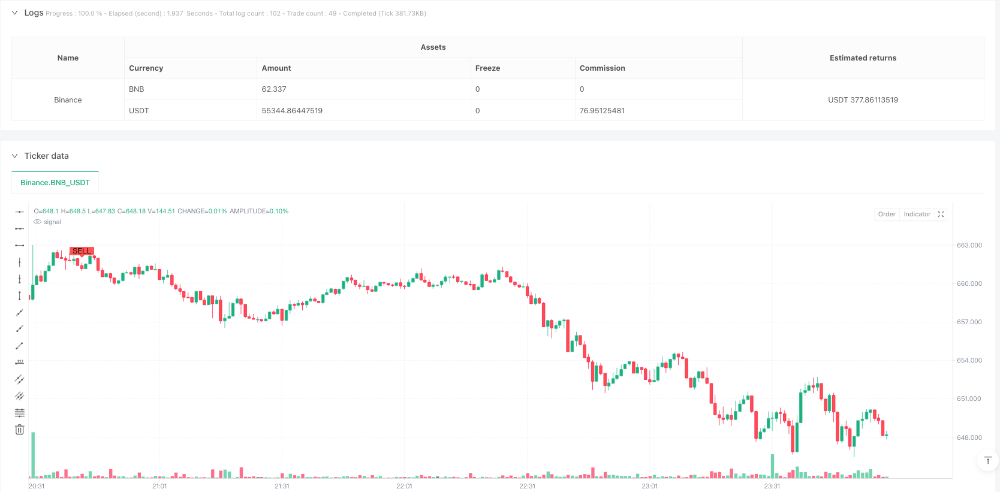
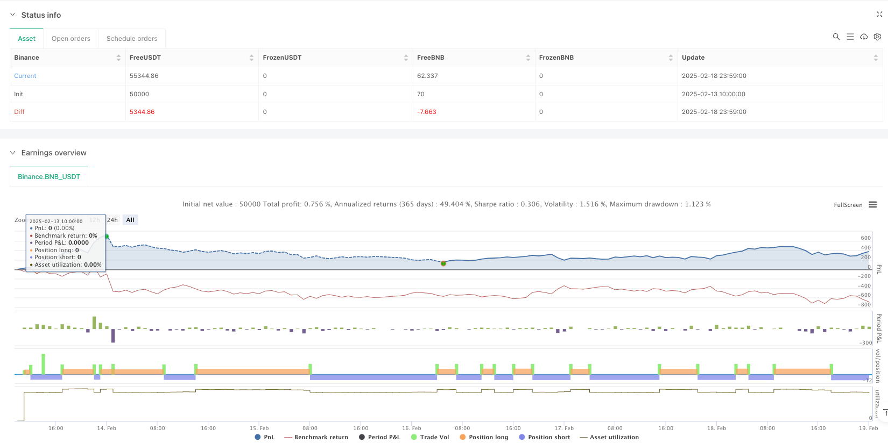

> Name

Dynamic-Stop-Loss-Trend-Following-Strategy-with-RSI-and-MACD-Dual-Filtering
> Author

ianzeng123

> Strategy Description





[trans]
#### Overview
This strategy is a trend tracking system based on dual indicator filtering of MACD and RSI, and integrates a dynamic stop loss mechanism. This strategy mainly generates trading opportunities through MACD cross signals, uses RSI as secondary confirmation, and introduces a percentage stop loss to control risk. The core of the strategy is to improve the reliability of trading signals through the use of technical indicators, and to protect profits through dynamic stop loss.
#### Strategy Principle
The strategy uses MACD(12,26,9) and RSI(14) as the main indicators. The entry signal needs to meet two conditions at the same time: go long when MACD crosses and RSI is in the oversold area (default is below 40), and go short when MACD crosses and RSI is in the overbought area (default is above 59). The system also sets a 3% dynamic stop loss. When the price moves in an unfavorable direction by more than the set percentage, the position will be automatically closed to control risks. Additionally, the strategy includes time filters that allow users to set specific trading time frames.
#### Strategic Advantages
1. Dual indicator filtering improves the reliability of trading signals and reduces false signals.
2. The dynamic stop loss mechanism effectively controls the risk of each transaction.
3. Strategy parameters can be flexibly adjusted according to different market conditions.
4. Time filtering feature allows transactions to be executed within a specific time period.
5. Using the percentage of funds to hold positions is conducive to fund management.
#### Strategy Risk
1. Frequent trading signals may occur in volatile markets, increasing transaction costs.
2. Fixed percentage stops can lead to premature closing of positions in high-volatility markets.
3. MACD as a lagging indicator may miss important price movements in fast markets.
4. The setting of RSI threshold needs to be optimized for different markets.
5. Transaction costs and slippage may affect the actual performance of the strategy.
#### Strategy optimization direction
1. Introduce the volatility indicator to dynamically adjust the stop loss percentage.
2. Add trend strength filter to avoid overtrading in volatile markets.
3. Consider adding a trailing stop to protect profits.
4. Optimize the parameter settings of RSI and MACD to make them more suitable for different market cycles.
5. Increase transaction volume analysis and improve signal reliability.
#### Summary
This is a trend following strategy with complete structure and clear logic. Through the combined use of MACD and RSI, the quality of trading signals is effectively improved. The design of dynamic stop loss helps control risks and makes the strategy have good risk management characteristics. This strategy is suitable for use in markets with clear trends, but parameter settings need to be adjusted according to specific market characteristics. Through the suggested optimization direction, the stability and reliability of the strategy can be further improved. ||
#### Overview
This strategy is a trend following system based on dual filtering with MACD and RSI indicators, integrated with a dynamic stop-loss mechanism. The strategy primarily generates trading opportunities through MACD crossover signals, uses RSI as secondary confirmation, and incorporates percentage-based stop-losses for risk control. The core strength lies in combining technical indicators to enhance signal reliability while protecting profits through dynamic stop-losses.

#### Strategy Principles
The strategy employs MACD(12,26,9) and RSI(14) as primary indicators. Entry signals require two conditions to be met simultaneously: MACD golden cross with RSI in oversold territory (default below 40) for long positions, and MACD death cross with RSI in overbought territory (default above 59) for short positions. The system includes a 3% dynamic stop-loss, automatically closing positions when price moves adversely beyond the set percentage. Additionally, the strategy incorporates a time filter allowing users to set specific trading time ranges.

#### Strategy Advantages
1. Dual indicator filtering enhances trade signal reliability and reduces false signals.
2. Dynamic stop-loss mechanism effectively controls risk for each trade.
3. Strategy parameters can be flexibly adjusted for different market conditions.
4. Time filtering functionality allows execution within specific time periods.
5. Percentage-based position sizing supports effective money management.

#### Strategy Risks
1. May generate frequent trading signals in ranging markets, increasing transaction costs.
2. Fixed percentage stop-loss might trigger premature exits in highly volatile markets.
3. MACD as a lagging indicator may miss significant price movements in fast markets.
4. RSI threshold settings require optimization for different markets.
5. Trading costs and slippage can impact actual strategy performance.

#### Optimization Directions
1. Introduce volatility indicators to dynamically adjust stop-loss percentages.
2. Add trend strength filters to avoid overtrading in ranging markets.
3. Consider implementing trailing stops to protect profits.
4. Optimize RSI and MACD parameters to better adapt to different market cycles.
5. Include volume analysis to enhance signal reliability.

#### Summary
This is a well-structured trend following strategy with clear logic. The combination of MACD and RSI effectively improves trade signal quality. The dynamic stop-loss design helps control risk, providing good risk management characteristics. The strategy is suitable for markets with clear trends but requires parameter adjustment based on specific market characteristics. Through the suggested optimization directions, the strategy's stability and reliability can be further enhanced.
[/trans]


> Source (PineScript)

``` pinescript
/*backtest
start: 2025-02-13 10:00:00
end: 2025-02-19 00:00:00
period: 1m
basePeriod: 1m
exchanges: [{"eid":"Binance","currency":"BNB_USDT"}]
*/

// This Pine Script™ code is subject to the terms of the Mozilla Public License 2.0 at https://mozilla.org/MPL/2.0/
// © eagle916
//@version=5
strategy("EAG MACD + RSI Strategy",overlay=true, initial_capital = 300, default_qty_value = 10, default_qty_type = "percent_of_equity", commission_type=strategy.commission.percent, commission_value=0.1)


// Input para el RSI
rsi_length = input.int(14, title="RSI Length", minval=1)
rsi_overbought = input.int(59, title="RSI Overbought Level", minval=1, maxval=100)
rsi_oversold = input.int(40, title="RSI Oversold Level", minval=1, maxval=100)

// Input para el MACD
macd_length = input.int(12, title="MACD Length", minval=1)
macd_overbought = input.int(26, title="MACD Overbought Level", minval=1, maxval=100)
macd_signal = input.int(9, title="MACD Signal Level", minval=1, maxval=100)

// Input para el porcentaje de pérdida (stop loss)
stop_loss_percent = input.float(3.0, title="Porcentaje de Stop Loss (%)", minval=0.1, step=0.1)

// Calcular RSI
rsi_value = ta.rsi(close, rsi_length)

// Calcular MACD
[macdLine, signalLine, _] = ta.macd(close, macd_length, macd_overbought, macd_signal)
macd_crossup = ta.crossover(macdLine, signalLine)   // Cruce al alza del MACD
macd_crossdown = ta.crossunder(macdLine, signalLine) // Cruce a la baja del MACD

// Condiciones de compra y venta
buy_condition = macd_crossup and rsi_value <= rsi_oversold
sell_condition = macd_crossdown and rsi_value >= rsi_overbought


// Registrar precio de entrada
var float entry_price = na
if strategy.position_size == 0
    entry_price := na

// Mostrar señales de compra y venta en la gráfica principal
plotshape(series=buy_condition, title="Señal de Compra", location=location.belowbar, color=color.green, style=shape.labelup, text="BUY") // Compra debajo de la vela
plotshape(series=sell_condition, title="Señal de Venta", location=location.abovebar, color=color.red, style=shape.labeldown, text="SELL") // Venta encima de la vela

// Órdenes de estrategia
if buy_condition 
    strategy.entry("Compra", strategy.long)
    entry_price := close
if sell_condition 
    strategy.entry("Venta", strategy.short)
    entry_price := close

// Calcular el precio de stop loss
long_stop_loss = entry_price * (1 - stop_loss_percent / 100)
short_stop_loss = entry_price * (1 + stop_loss_percent / 100)

// Cerrar posición si el precio va en contra el porcentaje definido por el usuario
if strategy.position_size > 0 and close < long_stop_loss
    strategy.close("Compra", comment="Stop Loss Compra")

if strategy.position_size < 0 and close > short_stop_loss
    strategy.close("Venta", comment="Stop Loss Venta")


```

> Detail

https://www.fmz.com/strategy/482891

> Last Modified

2025-02-20 16:50:43
