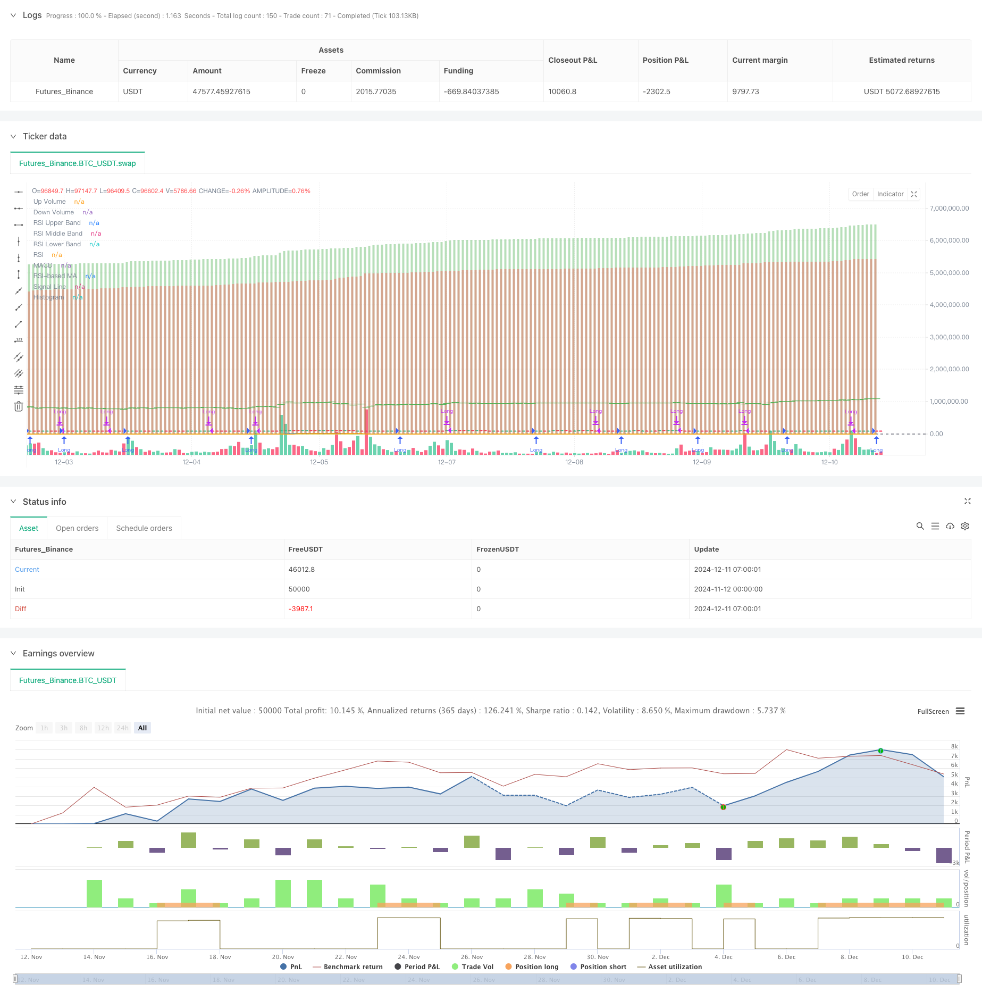

> Name

Multi-Indicator-Adaptive-Trading-Strategy-Based-on-RSI-MACD-and-Volume
> Author

ChaoZhang

> Strategy Description



[trans]
#### Overview
This strategy is a comprehensive trading system that combines relative strength indicator (RSI), moving average convergence divergence indicator (MACD), Bollinger Bands (BB) and volume (Volume) analysis. Through the coordination of multi-dimensional technical indicators, the strategy conducts comprehensive analysis on market trends, volatility and trading volume to find the best trading opportunities.
#### Strategy Principle
The core logic of the strategy is based on the following aspects:
1. Use RSI (14) to determine the overbought and oversold status of the market. RSI below 30 is considered oversold.
2. Use MACD (12, 26, 9) to determine the trend direction, and use the MACD golden cross as a long signal.
3. Confirm the validity of the price trend by calculating the difference between rising trading volume and falling trading volume (Delta Volume)
4. Combine with Bollinger Bands to evaluate price volatility and use it to optimize entry timing
5. When RSI is oversold, MACD is golden cross and Delta Volume is positive, the system will issue the best buy signal
6. When MACD crosses or RSI exceeds 60, the system will automatically close the position to control risks
#### Strategic Advantages
1. Multi-indicator cross-validation improves the reliability of trading signals
2. Confirm the validity of price trends through volume analysis
3. Contains adaptive moving average type selection, which enhances the flexibility of the strategy
4. Have a complete risk control mechanism, including stop loss and take profit settings
5. Strategy parameters can be optimized and adjusted according to different market conditions
#### Strategy Risk
1. Multiple indicator combinations may cause signal lag
2. False signals may be generated in sideways markets
3. Excessive parameter optimization may lead to overfitting
4. High-frequency trading may bring higher transaction costs
5. Severe market fluctuations may cause large retracement
#### Strategy optimization direction
1. Introduce an adaptive parameter mechanism to dynamically adjust indicator parameters according to market conditions
2. Add trend strength filter to reduce false signals in sideways markets
3. Optimize the stop-loss and stop-profit mechanism to improve capital utilization efficiency
4. Add a volatility filtering mechanism to adjust positions in high volatility environments
5. Develop an intelligent fund management system to achieve dynamic position control
#### Summary
This is a compound trading strategy that integrates multiple technical indicators and captures market opportunities through multi-dimensional analysis such as RSI, MACD, and trading volume. The strategy has strong adaptability and scalability, and also has a complete risk control mechanism. Through continuous optimization and improvement, this strategy is expected to maintain stable performance in different market environments. ||
#### Overview
This strategy is a comprehensive trading system that combines the Relative Strength Index (RSI), Moving Average Convergence Divergence (MACD), Bollinger Bands (BB), and Volume analysis. Through the coordination of multi-dimensional technical indicators, the strategy conducts a comprehensive analysis of market trends, volatility, and volume to identify optimal trading opportunities.

#### Strategy Principle
The core logic of the strategy is based on the following aspects:
1. Uses RSI(14) to judge market overbought/oversold conditions, with RSI below 30 considered oversold
2. Utilizes MACD(12,26,9) to determine trend direction, with MACD golden cross as a long signal
3. Confirms price trend validity through calculating the difference between up and down volume (Delta Volume)
4. Incorporates Bollinger Bands to evaluate price volatility for optimizing entry timing
5. System generates best buy signals when RSI is oversold, MACD shows golden cross, and Delta Volume is positive
6. Automatically closes positions when MACD shows death cross or RSI exceeds 60 for risk control

#### Strategy Advantages
1. Multiple indicator cross-validation improves trading signal reliability
2. Volume analysis confirms price trend validity
3. Includes adaptive moving average type selection, enhancing strategy flexibility
4. Contains comprehensive risk control mechanisms, including stop-loss and take-profit settings
5. Strategy parameters can be optimized for different market conditions

#### Strategy Risks
1. Multiple indicator combination may lead to signal lag
2. False signals may occur in ranging markets
3. Parameter optimization may result in overfitting
4. High-frequency trading may incur significant transaction costs
5. Market volatility may cause substantial drawdowns

#### Strategy Optimization Directions
1. Introduce adaptive parameter mechanisms to dynamically adjust indicator parameters based on market conditions
2. Add trend strength filters to reduce false signals in ranging markets
3. Optimize stop-loss and take-profit mechanisms to improve capital efficiency
4. Incorporate volatility filters to adjust positions in high-volatility environments
5. Develop intelligent fund management systems for dynamic position control

#### Summary
This is a composite trading strategy integrating multiple technical indicators, capturing market opportunities through multi-dimensional analysis including RSI, MACD, and volume. The strategy demonstrates strong adaptability and scalability, along with comprehensive risk control mechanisms. Through continuous optimization and improvement, this strategy has the potential to maintain stable performance across different market environments.[/trans]


> Source (PineScript)

``` pinescript
/*backtest
start: 2024-11-12 00:00:00
end: 2024-12-11 08:00:00
period: 1h
basePeriod: 1h
exchanges: [{"eid":"Futures_Binance","currency":"BTC_USDT"}]
*/

//@version=5
strategy("Liraz sh Strategy - RSI MACD Strategy with Bullish Engulfing and Net Volume", overlay=true, currency=currency.NONE, initial_capital=100000, commission_type=strategy.commission.percent, commission_value=0.1, slippage=3)

// Input parameters
rsiLengthInput = input.int(14, minval=1, title="RSI Length", group="RSI Settings")
rsiSourceInput = input.source(close, "RSI Source", group="RSI Settings")
maTypeInput = input.string("SMA", title="MA Type", options=["SMA", "Bollinger Bands", "EMA", "SMMA (RMA)", "WMA", "VWMA"], group="MA Settings")
maLengthInput = input.int(14, title="MA Length", group="MA Settings")
bbMultInput = input.float(2.0, minval=0.001, maxval=50, title="BB StdDev", group="MA Settings")

fastLength = input.int(12, minval=1, title="MACD Fast Length")
slowLength = input.int(26, minval=1, title="MACD Slow Length")
signalLength = input.int(9, minval=1, title="MACD Signal Length")

startDate = input(timestamp("2018-01-01"), title="Start Date")
endDate = input(timestamp("2069-12-31"), title="End Date")

// Custom Up and Down Volume Calculation
var float upVolume = 0.0
var float downVolume = 0.0

if close > open
    upVolume += volume
else if close < open
    downVolume += volume

delta = upVolume - downVolume

plot(upVolume, "Up Volume", style=plot.style_columns, color=color.new(color.green, 60))
plot(downVolume, "Down Volume", style=plot.style_columns, color=color.new(color.red, 60))
plotchar(delta, "Delta", "—", location.absolute, color=delta > 0 ? color.green : color.red)

// MA function
ma(source, length, type) =>
    switch type
        "SMA" => ta.sma(source, length)
        "Bollinger Bands" => ta.sma(source, length)
        "EMA" => ta.ema(source, length)
        "SMMA (RMA)" => ta.rma(source, length)
        "WMA" => ta.wma(source, length)
        "VWMA" => ta.vwma(source, length)

// RSI calculation
up = ta.rma(math.max(ta.change(rsiSourceInput), 0), rsiLengthInput)
down = ta.rma(-math.min(ta.change(rsiSourceInput), 0), rsiLengthInput)
rsi = down == 0 ? 100 : up == 0 ? 0 : 100 - (100 / (1 + up / down))
rsiMA = ma(rsi, maLengthInput, maTypeInput)
isBB = maTypeInput == "Bollinger Bands"

// MACD calculation
fastMA = ta.ema(close, fastLength)
slowMA = ta.ema(close, slowLength)
macd = fastMA - slowMA
signalLine = ta.sma(macd, signalLength)
hist = macd - signalLine

// Bullish Engulfing Pattern Detection
bullishEngulfingSignal = open[1] > close[1] and close > open and close >= open[1] and close[1] >= open and (close - open) > (open[1] - close[1])
barcolor(bullishEngulfingSignal ? color.yellow : na)

// Plotting RSI and MACD
plot(rsi, "RSI", color=#7E57C2)
plot(rsiMA, "RSI-based MA", color=color.yellow)
hline(70, "RSI Upper Band", color=#787B86)
hline(50, "RSI Middle Band", color=color.new(#787B86, 50))
hline(30, "RSI Lower Band", color=#787B86)

bbUpperBand = plot(isBB ? rsiMA + ta.stdev(rsi, maLengthInput) * bbMultInput : na, title="Upper Bollinger Band", color=color.green)
bbLowerBand = plot(isBB ? rsiMA - ta.stdev(rsi, maLengthInput) * bbMultInput : na, title="Lower Bollinger Band", color=color.green)

plot(macd, title="MACD", color=color.blue)
plot(signalLine, title="Signal Line", color=color.orange)
plot(hist, title="Histogram", style=plot.style_histogram, color=color.gray)

// Best time to buy condition
bestBuyCondition = rsi < 30 and ta.crossover(macd, signalLine) and delta > 0

// Plotting the best buy signal line
var line bestBuyLine = na
if (bestBuyCondition )
    bestBuyLine := line.new(bar_index[1], close[1], bar_index[0], close[0], color=color.white)

// Strategy logic
longCondition = (ta.crossover(macd, signalLine) or bullishEngulfingSignal) and rsi < 70 and delta > 0
if (longCondition )
    strategy.entry("Long", strategy.long)

// Reflexive exit condition: Exit if MACD crosses below its signal line or if RSI rises above 60
exitCondition = ta.crossunder(macd, signalLine) or (rsi > 60 and strategy.position_size > 0)
if (exitCondition )
    strategy.close("Long")
```

> Detail

https://www.fmz.com/strategy/474952

> Last Modified

2024-12-13 10:19:34
