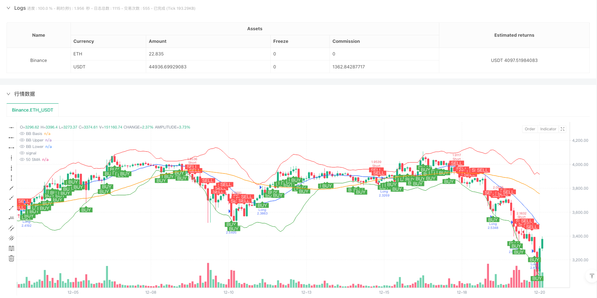
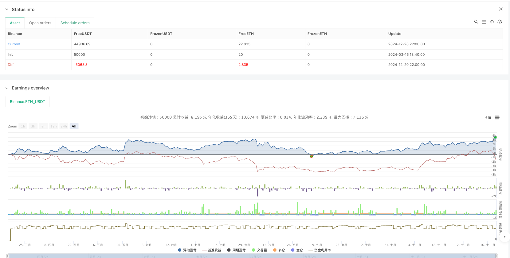

> Name

Multi-Indicator-Composite-Multi-Dimensional-Decision-Trading-System-A-Quantitative-Strategy-Based-on-RSI-MACD-Bollinger-Bands-Volume-and-Trend
> Author

ianzeng123

> Strategy Description




[trans]

#### Overview
The multi-indicator synthetic multi-dimensional decision-making trading system is a quantitative strategy that combines a variety of technical indicators. The strategy generates trading signals by comprehensively analyzing 5 key indicators (RSI, MACD, Bollinger Bands, trading volume and price trend). The strategy will issue a buy order when at least 3 indicators show bullish signals and a sell order when at least 3 indicators show bearish signals. This multi-dimensional analysis method can filter out false signals that may be generated by a single indicator and improve the reliability of trading decisions. The strategy is also equipped with an intuitive status table that displays the current status of each indicator in real time, allowing traders to clearly understand the multi-dimensional status of the market.
#### Strategy Principle
The core principle of this strategy is based on the idea of ​​multi-indicator resonance and operates through the following steps:
1. **Indicator Calculation**: The strategy first calculates 5 key indicators:
   - RSI (Relative Strength Index): Uses the 18-period setting to assess price momentum
   - MACD (Moving Average Convergence Divergence): Use the 12/26/9 period combination to identify trend changes
   - Bollinger Bands: Use 20 periods, 2.5 times standard deviation settings to evaluate price volatility
   - Trading volume: Compare with the 20-period moving average to evaluate trading activity
   - Price trend: Determine the medium-term trend direction through the 50-period moving average
2. **Signal condition definition**: Set specific bullish and bearish conditions for each indicator:
   - RSI: Below 30 is bullish, above 70 is bearish
   - MACD: If the MACD line is higher than the signal line, it is bullish, if it is lower than the signal line, it is bearish.
   - Bollinger Bands: When the price is within the Bollinger Bands, it is bullish; when the price is below the lower band, it is bearish.
   - Volume: Volume above the 20-day average is bullish, volume below is bearish
   - Price trend: Above the 50-day moving average is bullish, below it is bearish
3. **Multi-Indicator Synthesis**: The code calculates the number of bullish and bearish signals, and forms a multi-dimensional buy signal when at least 3 indicators show bullishness, and forms a multi-dimensional sell signal when at least 3 indicators show bearishness.
4. **Execute Transaction**: Enter a long position when the buying conditions are met, and enter a short position when the selling conditions are met.
The advantage of this strategy is that it does not rely on a single indicator, but requires multiple indicators to be confirmed at the same time. This "majority voting" mechanism greatly reduces the possibility of misjudgment.
#### Strategic Advantages
An in-depth analysis of the code of this multi-indicator synthesis strategy can summarize the following significant advantages:
1. **Multi-dimensional filtering mechanism**: By requiring at least 3 of 5 indicators to produce consistent signals, it effectively reduces the misleading signals that a single indicator may produce and significantly improves trading accuracy.
2. **Strong adaptability**: It combines momentum indicators (RSI), trend indicators (MACD, moving average) and volatility indicators (Bollinger Bands) to enable the strategy to adapt to different market environments, including trending and oscillating markets.
3. **Risk Control Built-in**: The Bollinger Bands component can identify extreme price behavior, and the RSI can detect overbought and oversold conditions. These built-in filters help avoid entering the market during adverse market conditions.
4. **High information transparency**: The status table function allows traders to see the current status of each indicator at a glance, improving the interpretability of the strategy and user trust.
5. **Parameters can be customized**: All key indicator parameters in the code are set through the input function, allowing traders to adjust strategies according to different markets and time frames, enhancing the flexibility of the strategy.
6. **Excellent visualization effect**: The strategy not only displays the indicator status through a table, but also draws the Bollinger Bands and 50-day moving average, and uses obvious markers to mark the buying and selling signal points, so that traders can intuitively understand the market status and trading logic.
7. **Fund Management Integration**: The strategy defaults to using 15% of the account's funds for each transaction, and takes into account 0.075% of the transaction cost, reflecting the complete trading system design idea.
#### Strategy Risk
Although this strategy incorporates multiple indicators to increase robustness, the following potential risks still exist:
1. **Parameter sensitivity**: The parameter settings of each indicator (such as RSI length, Bollinger Band multiplier, etc.) have a significant impact on strategy performance. Inappropriate parameters can lead to overtrading or missing important signals. The solution is to perform backtest optimization to find the best combination of parameters for a specific market.
2. **Inter-Indicator Correlation**: There may be a high degree of correlation between certain indicators (such as MACD and price trends), which may lead to repeated calculations of signals and reduce the effectiveness of multi-dimensional analysis. The solution is to introduce less relevant alternative indicators, such as the relative volatility index or funds flow indicator.
3. **Market environment dependence**: This strategy performs better in markets with clear trends, but may produce frequent false signals in markets that are moving sideways or turning quickly. The solution is to add a market environment judgment component, adjust strategy parameters or suspend transactions under different market conditions.
4. **Fixed threshold limitations**: The strategy uses fixed thresholds (such as 30/70 of RSI) to judge signals, which may not be flexible enough in different market environments. The solution is to use adaptive thresholds, such as dynamically adjusting indicator thresholds based on historical volatility or market conditions.
5. **Lack of stop loss mechanism**: There is no clear stop loss strategy in the code, which may lead to continued losses after wrong signals. The solution is to add a stop loss mechanism based on ATR or a fixed percentage to protect the safety of funds.
6. **Data lag problem**: Most technical indicators are lagging indicators, which may lead to unsatisfactory entry points. The solution is to add some leading indicators or price action analysis to capture market turning points in advance.
#### Strategy optimization direction
After analyzing the code structure and logic of this strategy, we can propose the following optimization directions worthy of in-depth exploration:
1. **Adaptive indicator parameters**: The current strategy uses fixed parameters, which can be optimized to automatically adjust parameters based on market volatility. For example, increasing the Bollinger Band multiplier or extending the RSI cycle in highly volatile markets will allow the strategy to better adapt to different market environments and improve stability.
2. **Weighted signal system**: The current strategy gives the same weight to all indicators, which can be optimized to give different weights to each indicator based on its performance in the current market environment. For example, increasing the weight of MACD and price trend in trending markets, and increasing the weight of RSI and Bollinger Bands in oscillating markets will improve the accuracy of signals.
3. **Time Frame Coordination**: Introducing multi-time frame analysis, requiring signals from short-term and long-term time frames to be consistent before executing transactions. This optimization can filter out more noisy signals and capture more reliable trend changes.
4. **Dynamic take-profit and stop-loss**: Add a dynamic take-profit and stop-loss mechanism based on ATR or Bollinger Band width, and automatically adjust risk control parameters under different volatility environments, which will greatly improve the risk-reward ratio of the strategy.
5. **Market Environment Classification**: Add a market environment identification module and use different trading logic or parameter settings in different types of markets (trends, shocks, violence), which will reduce the risk of trading in unsuitable market environments.
6. **Machine Learning Integration**: Use machine learning algorithms to optimize the weights and thresholds of each indicator, and automatically find the best combination based on historical data. This method can overcome the limitations of artificial parameter settings and unearth more complex market models.
7. **Add auxiliary filtering conditions**: Introduce auxiliary tools such as transaction volume balance indicators and market fluctuation cycle analysis to further improve signal quality. In particular, add filtering for large economic data releases or important events to avoid trading during high-risk periods.
#### Summarize
The multi-indicator synthetic multi-dimensional decision-making trading system is a comprehensive quantitative strategy that integrates a variety of technical analysis tools. By requiring resonance confirmation from most indicators, this strategy effectively filters out market noise and improves the reliability of trading signals. Its core advantage lies in its multi-dimensional analysis framework and information transparency, which enables traders to make more objective decisions based on multi-dimensional data.
However, this strategy also faces challenges such as parameter sensitivity, indicator correlation and market adaptability. By introducing optimization measures such as adaptive parameters, weighted signal systems, multi-time frame coordination and dynamic risk management, the performance of the strategy is expected to be significantly improved.
Ultimately, the value of this strategy is that it provides a solid quantitative trading framework upon which traders can personalize adjustments based on personal risk appetite and market understanding. For investors seeking a systematic and rule-based trading approach, this is a strategy template worth studying and practicing. ||
#### Overview

The Multi-Indicator Composite Multi-Dimensional Decision Trading System is a quantitative strategy that combines multiple technical indicators to generate trading signals. This system analyzes five key indicators (RSI, MACD, Bollinger Bands, volume, and price trend) to make trading decisions. When at least three indicators show bullish signals, the strategy issues a buy command; when at least three indicators show bearish signals, it issues a sell command. This multi-dimensional analysis approach filters out false signals that might be produced by individual indicators, thereby increasing the reliability of trading decisions. The strategy also features an intuitive status table that displays the current state of each indicator in real-time, allowing traders to clearly understand the multi-dimensional state of the market.

#### Strategy Principle

The core principle of this strategy is based on the concept of multi-indicator resonance, operating through the following steps:

1. **Indicator Calculation**: The strategy first calculates five key indicators:
   - RSI (Relative Strength Index): Using an 18-period setting to evaluate price momentum
   - MACD (Moving Average Convergence Divergence): Using 12/26/9 period combination to identify trend changes
   - Bollinger Bands: Using 20-period, 2.5 standard deviation settings to assess price volatility
   - Volume: Compared with the 20-period moving average to evaluate trading activity
   - Price Trend: Using a 50-period moving average to determine the medium-term trend direction

2. **Signal Condition Definition**: Specific bullish and bearish conditions are set for each indicator:
   - RSI: Below 30 is bullish, above 70 is bearish
   - MACD: MACD line above signal line is bullish, vice versa is bearish
   - Bollinger Bands: Price within the bands is bullish, price below the lower band is bearish
   - Volume: Higher than 20-day average volume is bullish, lower is bearish
   - Price Trend: Above 50-day moving average is bullish, below is bearish

3. **Multi-Indicator Composition**: The code calculates the number of bullish and bearish signals, forming a multi-dimensional buy signal when at least three indicators show bullish conditions, and a multi-dimensional sell signal when at least three indicators show bearish conditions.

4. **Trade Execution**: Enter a long position when buy conditions are met, enter a short position when sell conditions are met.

The advantage of this strategy lies in its non-reliance on a single indicator, instead requiring multiple indicators to confirm simultaneously. This "majority voting" mechanism greatly reduces the possibility of misjudgment.

#### Strategy Advantages

Deep analysis of this multi-indicator composite strategy code reveals the following significant advantages:

1. **Multi-dimensional Filtering Mechanism**: By requiring at least three out of five indicators to produce consistent signals, it effectively reduces misleading signals that might be generated by a single indicator, significantly improving trading precision.

2. **Strong Adaptability**: Combining momentum indicators (RSI), trend indicators (MACD, moving averages), and volatility indicators (Bollinger Bands) allows the strategy to adapt to different market environments, including trending and oscillating markets.

3. **Built-in Risk Control**: The Bollinger Bands component can identify extreme price behaviors, and RSI can detect overbought and oversold conditions. These built-in filters help avoid entering the market under unfavorable conditions.

4. **High Information Transparency**: The status table function allows traders to clearly see the current state of each indicator at a glance, improving the strategy's explainability and user trust.

5. **Customizable Parameters**: All key indicator parameters in the code are set via the input function, allowing traders to adjust the strategy according to different markets and time frames, enhancing the strategy's flexibility.

6. **Excellent Visualization**: The strategy not only displays indicator status through tables but also plots Bollinger Bands and the 50-day moving average, marking buy and sell signal points with obvious markers, allowing traders to intuitively understand market conditions and trading logic.

7. **Integrated Fund Management**: The strategy defaults to using 15% of the account's funds for each trade and considers a 0.075% trading cost, reflecting a complete trading system design philosophy.

#### Strategy Risks

Despite integrating multiple indicators to improve robustness, the following potential risks still exist:

1. **Parameter Sensitivity**: The parameter settings of various indicators (such as RSI length, Bollinger Band multiplier, etc.) significantly impact strategy performance. Inappropriate parameters may lead to overtrading or missing important signals. The solution is to conduct backtesting optimization to find the best parameter combination for specific markets.

2. **Correlation Between Indicators**: Some indicators may be highly correlated (such as MACD and price trend), which may lead to signal duplication, reducing the effectiveness of multi-dimensional analysis. The solution is to introduce alternative indicators with lower correlation, such as relative volatility index or money flow indicators.

3. **Market Environment Dependency**: This strategy performs better in markets with clear trends but may produce frequent false signals in sideways consolidation or rapidly reversing markets. The solution is to add a market environment judgment component to adjust strategy parameters or pause trading in different market states.

4. **Fixed Threshold Limitations**: The strategy uses fixed thresholds (such as RSI's 30/70) to judge signals, which may not be flexible enough in different market environments. The solution is to adopt adaptive thresholds, such as dynamically adjusting indicator thresholds based on historical volatility or market conditions.

5. **Lack of Stop-Loss Mechanism**: There is no explicit stop-loss strategy in the code, which may lead to continuous losses after incorrect signals. The solution is to add a stop-loss mechanism based on ATR or a fixed percentage to protect capital safety.

6. **Data Lag Issue**: Most technical indicators are lagging indicators, which may lead to suboptimal entry points. The solution is to add some leading indicators or price action analysis to capture market turning points in advance.

#### Strategy Optimization Directions

Analyzing the code structure and logic of this strategy, the following optimization directions worth exploring can be proposed:

1. **Adaptive Indicator Parameters**: The current strategy uses fixed parameters, which can be optimized to automatically adjust parameters based on market volatility. For example, increasing the Bollinger Band multiplier or extending the RSI period in highly volatile markets will make the strategy better adapt to different market environments and improve stability.

2. **Weighted Signal System**: The current strategy assigns equal weight to all indicators, which can be optimized to assign different weights based on the performance of each indicator in the current market environment. For example, increasing the weight of MACD and price trend in trending markets, and increasing the weight of RSI and Bollinger Bands in oscillating markets, will improve signal accuracy.

3. **Timeframe Coordination**: Introducing multi-timeframe analysis, requiring consistent signals from both short-term and long-term timeframes before executing trades. This optimization can filter out more noise signals and capture more reliable trend changes.

4. **Dynamic Take-Profit and Stop-Loss**: Adding a dynamic take-profit and stop-loss mechanism based on ATR or Bollinger Band width, automatically adjusting risk control parameters in different volatility environments, will greatly improve the strategy's risk-reward ratio.

5. **Market Environment Classification**: Adding a market environment recognition module to use different trading logic or parameter settings in different types of markets (trending, oscillating, violent), will reduce the risk of trading in unsuitable market environments.

6. **Machine Learning Integration**: Using machine learning algorithms to optimize the weights and thresholds of various indicators, automatically finding the best combination based on historical data. This method can overcome the limitations of manual parameter settings and uncover more complex market patterns.

7. **Additional Auxiliary Filtering Conditions**: Introducing auxiliary tools such as volume balance indicators and market volatility cycle analysis to further improve signal quality. Particularly adding filters for major economic data releases or important events to avoid trading during high-risk periods.

#### Conclusion

The Multi-Indicator Composite Multi-Dimensional Decision Trading System is a comprehensive quantitative strategy that integrates multiple technical analysis tools. By requiring confirmation from multiple indicators, this strategy effectively filters market noise and improves the reliability of trading signals. Its core advantages lie in its multi-dimensional analysis framework and information transparency, allowing traders to make more objective decisions based on multifaceted data.

However, the strategy also faces challenges such as parameter sensitivity, indicator correlation, and market adaptability. Through introducing adaptive parameters, weighted signal systems, multi-timeframe coordination, and dynamic risk management, the performance of the strategy can be significantly improved.

Ultimately, the value of this strategy lies in providing a solid quantitative trading framework that traders can customize based on personal risk preferences and market understanding. For investors seeking systematic, rule-based trading methods, this is a strategy template worth studying and implementing.[/trans]


> Source (PineScript)

``` pinescript
/*backtest
start: 2024-03-15 18:40:00
end: 2024-12-21 00:00:00
period: 2h
basePeriod: 2h
exchanges: [{"eid":"Binance","currency":"ETH_USDT"}]
*/

//@version=6
strategy("3/5 Indicator Strategy with Table", overlay=true, default_qty_type=strategy.percent_of_equity, default_qty_value=15, commission_type=strategy.commission.percent, commission_value=0.075)

// —————— Input Parameters —————— //
rsiLength = input.int(18, "RSI Length", minval=1)
macdFast = input.int(12, "MACD Fast", minval=1)
macdSlow = input.int(26, "MACD Slow", minval=1)
macdSignal = input.int(9, "MACD Signal", minval=1)
bbLength = input.int(20, "BB Length", minval=1)
bbMult = input.float(2.5, "BB Multiplier", minval=0.1)

// —————— Indicator Calculations ——————
// Bollinger Bands
bbBasis = ta.sma(close, bbLength)
dev = bbMult * ta.stdev(close, bbLength)
upperBB = bbBasis + dev
lowerBB = bbBasis - dev

// MACD
[macdLine, signalLine, histLine] = ta.macd(close, macdFast, macdSlow, macdSignal)

// RSI
rsi = ta.rsi(close, rsiLength)

// —————— Indicator Conditions ——————
rsiBullish = rsi < 30
rsiBearish = rsi > 70

macdBullish = macdLine > signalLine
macdBearish = macdLine < signalLine

bbBullish = close > lowerBB and close < upperBB
bbBearish = close < lowerBB

volumeBullish = volume > ta.sma(volume, 20)
volumeBearish = volume < ta.sma(volume, 20)

priceTrendBullish = close > ta.sma(close, 50)
priceTrendBearish = close < ta.sma(close, 50)

// —————— Signal Logic ——————
bullishSignals = ( (rsiBullish ? 1 : 0) + (macdBullish ? 1 : 0) + (bbBullish ? 1 : 0) + (volumeBullish ? 1 : 0) + (priceTrendBullish ? 1 : 0))

bearishSignals = ( (rsiBearish ? 1 : 0) + (macdBearish ? 1 : 0) + (bbBearish ? 1 : 0) + (volumeBearish ? 1 : 0) + (priceTrendBearish ? 1 : 0))

longCondition = bullishSignals >= 3
shortCondition = bearishSignals >= 3

// —————— Status Table ——————
var table statusTable = table.new(position.top_right, 2, 6, border_width=1)
if barstate.islastconfirmedhistory
    // Clear previous data
    table.cell(statusTable, 0, 0, "Indicator", text_size=size.small, bgcolor=color.gray)
    table.cell(statusTable, 1, 0, "Status", text_size=size.small, bgcolor=color.gray)
    
    // RSI Status
    table.cell(statusTable, 0, 1, "RSI", text_size=size.small)
    table.cell(statusTable, 1, 1, rsiBullish ? "Bullish" : "Bearish", 
              text_color=rsiBullish ? color.green : color.red, text_size=size.small)
    
    // MACD Status
    table.cell(statusTable, 0, 2, "MACD", text_size=size.small)
    table.cell(statusTable, 1, 2, macdBullish ? "Bullish" : "Bearish", 
              text_color=macdBullish ? color.green : color.red, text_size=size.small)
    
    // Bollinger Bands Status
    table.cell(statusTable, 0, 3, "BBands", text_size=size.small)
    table.cell(statusTable, 1, 3, bbBullish ? "Bullish" : "Bearish", 
              text_color=bbBullish ? color.green : color.red, text_size=size.small)
    
    // Volume Status
    table.cell(statusTable, 0, 4, "Volume", text_size=size.small)
    table.cell(statusTable, 1, 4, volumeBullish ? "Bullish" : "Bearish", 
              text_color=volumeBullish ? color.green : color.red, text_size=size.small)
    
    // Trend Status
    table.cell(statusTable, 0, 5, "Trend", text_size=size.small)
    table.cell(statusTable, 1, 5, priceTrendBullish ? "Bullish" : "Bearish", 
              text_color=priceTrendBullish ? color.green : color.red, text_size=size.small)

// —————— Strategy Execution ——————
if longCondition
    strategy.entry("Long", strategy.long)

if shortCondition
    strategy.entry("Short", strategy.short)

// —————— Simplified Plots ——————
plot(bbBasis, "BB Basis", #2962FF)
plot(upperBB, "BB Upper", color.red)
plot(lowerBB, "BB Lower", color.green)
plot(ta.sma(close, 50), "50 SMA", color.orange)

// —————— Signal Markers ——————
plotshape(longCondition, "Buy", shape.labelup, location.belowbar, color=color.new(color.green, 0), text="BUY", textcolor=color.white)
plotshape(shortCondition, "Sell", shape.labeldown, location.abovebar, color=color.new(color.red, 0), text="SELL", textcolor=color.white)
```

> Detail

https://www.fmz.com/strategy/483935

> Last Modified

2025-02-27 09:41:04
