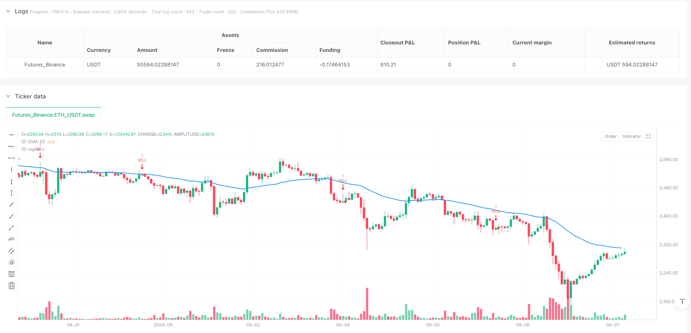
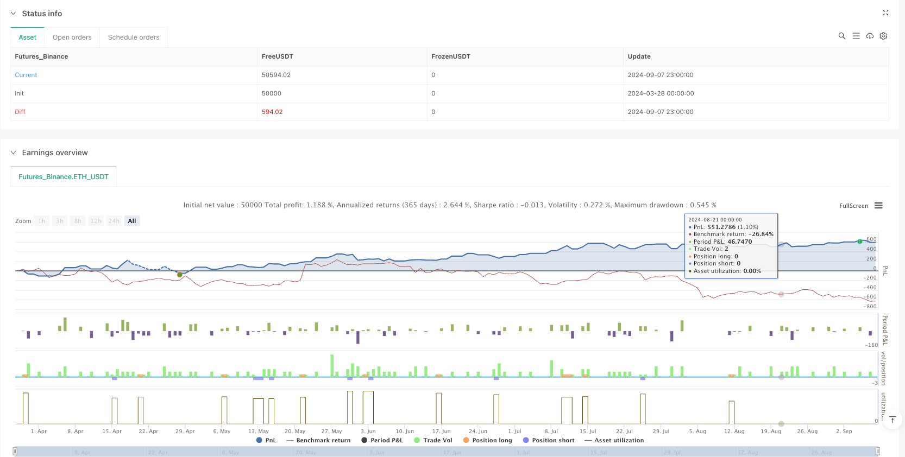

> Name

Multi-Confirmation-Dynamic-TP-SL-Trading-Strategy-RSI-and-MACD-Combined-with-EMA-Trend-and-Candlestick-Pattern-Recognition
> Author

ianzeng123

> Strategy Description





[trans]
#### Overview
The multiple confirmation dynamic stop-profit and stop-loss trading strategy is a comprehensive quantitative trading system that identifies high-probability trading opportunities through multiple technical indicators and market structure analysis. This strategy combines trend filtering (50-period EMA), candle pattern recognition (engulfing and needle patterns), momentum confirmation (RSI and MACD), and an ATR-based dynamic risk management system to form a comprehensive trading decision-making framework. This multi-level confirmation mechanism helps filter out low-quality signals while optimizing the risk-reward ratio through dynamically adjusted take-profit and stop-loss levels, allowing the strategy to maintain stable performance under different market conditions.
#### Strategy Principle
The core principle of this strategy is based on the multi-confirmation mechanism, which triggers a trading signal only when all conditions are met. The specific execution logic is as follows:
1. **Trend Confirmation**: Use the 50-period EMA as a trend filter. A buy signal is considered only when the price is above the EMA; a sell signal is considered when the price is below the EMA.
2. **Candlestick Pattern Recognition**:
   - **Bullish Engulfing Pattern**: The previous candle is a negative candle, the current candle is a positive candle, and the current candle completely "engulfs" the previous candle (the opening price is lower than the closing price of the previous candle, and the closing price is higher than the opening price of the previous candle). At the same time, the size of the candle body is at least 1.5 times that of the previous candle and greater than the 5-period average real body.
   - **Bearish Engulfing Pattern**: The previous candle is a positive candle, the current candle is a negative candle, and the current candle completely "engulfs" the previous candle while meeting the same size conditions.
   - **Bullish Needle Pattern**: The lower shadow accounts for at least 66% of the total length of the candle, the upper shadow is less than 33% of the total length, and the length of the lower shadow is at least 2.5 times the length of the real body.
   - **Bearish Pin Pattern**: The upper shadow accounts for at least 66% of the total length of the candle, the lower shadow is less than 33% of the total length, and the length of the upper shadow is at least 2.5 times the length of the real body.
3. **Momentum Confirmation**:
   - **RSI Filter**: A buy signal requires an RSI value below 70 (avoiding the overbought area); a sell signal requires an RSI value above 30 (avoiding the oversold area).
   - **MACD Confirmation**: A buy signal requires the MACD line to be above the signal line; a sell signal requires the MACD line to be below the signal line.
4. **Risk Management**:
   - Dynamically set take-profit and stop-loss levels based on the 14-period ATR value.
   - The take-profit and stop-loss distances are both set to 1.5 times the ATR value, ensuring a risk-reward ratio of 1:1.
The strategy will only generate signals when the trend direction is correct, the candle pattern is valid, the RSI is not in an extreme area, and the MACD direction is consistent. This strict multiple confirmation mechanism can effectively reduce false signals.
#### Strategic Advantages
1. **Multiple confirmation mechanism**: By combining multiple technical indicators and market structure analysis, the quality and reliability of trading signals are significantly improved. Each component addresses a specific market analysis need: EMA determines trend direction, candlestick patterns identify price action transition points, and RSI and MACD confirm momentum alignment.
2. **Strong adaptability**: The dynamic stop-profit and stop-loss mechanism in the strategy is based on ATR calculation and can automatically adjust according to market volatility, allowing it to adapt to changes in market conditions in both high-volatility and low-volatility environments.
3. **Perfect risk management**: The built-in stop-profit and stop-loss mechanism ensures that each transaction has a predefined exit point, which helps control the maximum loss of a single transaction and lock in profits.
4. **Visualization and Reminder Function**: The strategy includes EMA trend line display and trading signal reminder function, which facilitates traders to monitor the market and execute trading decisions in real time.
5. **Flexible to adapt to multiple time periods**: According to the backtest results, this strategy performs well in 4-hour, 1-hour and 15-minute time periods, making it suitable for different trading styles (swing trading, day trading and short-term trading).
6. **Clear definition of candle patterns**: The strategy has a strict mathematical definition of candle patterns, which reduces subjective judgment and enhances the consistency and repeatability of the strategy.
#### Strategy Risk
1. **Excessive filtering risk**: Although the multiple confirmation mechanism improves signal quality, it may also lead to missing some profitable trading opportunities. In fast-moving markets, waiting for all conditions to be met simultaneously can cause traders to miss important entry points.
2. **Parameter Sensitivity**: This strategy uses multiple parameters (EMA length, RSI threshold, MACD parameters, ATR multiplier, etc.), and small changes in these parameters may have a significant impact on the strategy performance. On different markets or time frames, these parameters may need to be re-optimized.
3. **Trend Reversal Delay**: EMA-based trend filters are lagging indicators that can result in missed trading opportunities or holding positions at the wrong time in the early stages of a trend reversal.
4. **Retracement Risk**: Despite setting a stop loss, under extreme market conditions (such as a gap or flash crash), the actual loss may exceed the expected ATR multiple.
5. **Poor Performance in Sideways Markets**: When the market moves sideways within a narrow range, the strategy may not perform well as it is primarily designed to capture trending moves.
6. **False Breakout Risk**: Especially in short time periods, false candlestick pattern signals may appear, leading to unnecessary transactions.
To mitigate these risks, traders can consider: (1) adjusting parameters in different market environments; (2) incorporating more filters such as volatility thresholds or trend strength indicators; (3) only using this strategy in strong trending markets; (4) considering adding partial stop loss positions to reduce maximum drawdowns.
#### Strategy optimization direction
1. **Add Volatility Filter**: Existing strategies already use ATR for risk management, but volatility indicators such as Bollinger Band Width or ATR Percent can be further leveraged to avoid trading in markets that are too volatile, or to adjust position sizing during periods of high volatility.
2. **Integrated trading volume analysis**: The current strategy is completely based on price data, and the introduction of trading volume confirmation can improve signal quality. For example, ask for a candle pattern to appear with an increase in trading volume, or use OBV (cumulative volume balance) to confirm a price trend.
3. **Dynamic adjustment of take-profit and stop-loss ratio**: The current strategy uses a fixed 1.5 times ATR as the take-profit and stop-loss distance. Consider dynamically adjusting this multiplier based on market conditions, such as increasing your stop-loss distance in high-volatility environments and setting further take-profit targets in strong trends.
4. **Add time filter**: Certain markets perform better during specific time periods (such as opening hours or periods of high liquidity). Time filters can be added to generate signals only during the most favorable trading periods.
5. **Implement partial take-profit strategy**: The current strategy uses a fixed full-position take-profit point. Staged take-profits can be implemented, allowing some positions to take profits at closer targets while allowing the remaining positions to track larger trend moves.
6. **Trend Strength Filter**: In addition to simple EMA trend direction, adding a trend strength indicator (such as ADX or candle continuity within the trend) can help distinguish strong trends from weak trends and adjust trading decisions accordingly.
7. **Add market status classification**: Develop a classification system to identify whether the market is in a trend or consolidation period, and use different trading logic or parameter sets for different market states.
8. **Machine Learning Optimization**: Use machine learning algorithms to automatically optimize various parameter combinations, or train models through historical data to predict under which conditions the strategy is most likely to succeed.
#### Summary
The Multiple Confirmation Dynamic Take Profit and Stop Loss trading strategy is a comprehensive and systematic trading system that identifies high probability trading opportunities through multi-level technical analysis. By combining EMA trend filtering, precisely defined candle patterns, RSI and MACD momentum confirmation, and ATR-based risk management, this strategy provides a structured approach to executing trading decisions while controlling risk.
While this strategy performs well in trending markets, it can face challenges in sideways and high-volatility environments. To further improve performance, consider adding volume analysis, volatility filters, and trend strength indicators, or implement more complex partial take-profit and dynamic risk management strategies.
The main advantages of this strategy are its strict multi-confirmation mechanism and adaptive risk management system, which allow it to adapt to various market conditions while maintaining a stable risk-reward ratio. This is a powerful starting point for traders who want to adopt a systematic, rules-based approach to trading that can be further customized to suit individual trading style and risk appetite.
|| 

#### Overview
The Multi-Confirmation Dynamic TP/SL Trading Strategy is a comprehensive quantitative trading system that identifies high-probability trading opportunities through multiple technical indicators and market structure analysis. This strategy combines trend filtering (50-period EMA), candlestick pattern recognition (Engulfing and Pin Bar patterns), momentum confirmation (RSI and MACD), and an ATR-based dynamic risk management system to form a comprehensive trading decision framework. This multi-layered confirmation mechanism helps filter out low-quality signals while optimizing risk-reward ratios through dynamically adjusted take-profit and stop-loss levels, allowing the strategy to maintain consistent performance across different market conditions.

#### Strategy Principles
The core principle of this strategy is based on a multi-confirmation mechanism, triggering trade signals only when all conditions are satisfied. The specific execution logic is as follows:

1. **Trend Confirmation**: Uses a 50-period EMA as a trend filter. Buy signals are considered only when price is above the EMA; sell signals are considered only when price is below the EMA.

2. **Candlestick Pattern Recognition**:
   - **Bullish Engulfing Pattern**: Previous candle is bearish, current candle is bullish and completely "engulfs" the previous candle (open price lower than previous candle's close, close price higher than previous candle's open), with the candle body size at least 1.5 times larger than the previous candle and greater than the 5-period average body.
   - **Bearish Engulfing Pattern**: Previous candle is bullish, current candle is bearish and completely "engulfs" the previous candle, meeting the same size requirements.
   - **Bullish Pin Bar**: Lower shadow constitutes at least 66% of the total candle length, upper shadow less than 33% of total length, and the lower shadow length is at least 2.5 times the body.
   - **Bearish Pin Bar**: Upper shadow constitutes at least 66% of the total candle length, lower shadow less than 33% of total length, and the upper shadow length is at least 2.5 times the body.

3. **Momentum Confirmation**:
   - **RSI Filter**: Buy signals require RSI values below 70 (avoiding overbought regions); sell signals require RSI values above 30 (avoiding oversold regions).
   - **MACD Confirmation**: Buy signals require the MACD line to be above the signal line; sell signals require the MACD line to be below the signal line.

4. **Risk Management**:
   - Dynamically sets take-profit and stop-loss levels based on the 14-period ATR value.
   - Both take-profit and stop-loss distances are set at 1.5 times the ATR value, ensuring a 1:1 risk-reward ratio.

The strategy generates signals only when the trend direction is correct, the candlestick pattern is valid, RSI is not in extreme regions, and MACD direction is consistent. This strict multi-confirmation mechanism effectively reduces false signals.

#### Strategy Advantages
1. **Multi-Confirmation Mechanism**: By combining multiple technical indicators and market structure analysis, the quality and reliability of trading signals are significantly improved. Each component addresses a specific market analysis need: EMA determines trend direction, candlestick patterns identify price action turning points, RSI and MACD confirm momentum consistency.

2. **Strong Adaptability**: The dynamic take-profit and stop-loss mechanism based on ATR calculation automatically adjusts according to market volatility, making it adaptable to market condition changes in both high and low volatility environments.

3. **Comprehensive Risk Management**: The built-in take-profit and stop-loss mechanism ensures each trade has predefined exit points, helping to control the maximum loss per trade and lock in profits.

4. **Visualization and Alert Functions**: The strategy includes EMA trend line display and trade signal alerts, facilitating real-time market monitoring and trade decision execution.

5. **Flexibility Across Multiple Timeframes**: According to backtesting results, the strategy performs well on 4-hour, 1-hour, and 15-minute timeframes, making it suitable for different trading styles (swing trading, day trading, and scalping).

6. **Clear Candlestick Pattern Definitions**: The strategy has strict mathematical definitions for candlestick patterns, reducing subjective judgment and enhancing strategy consistency and reproducibility.

#### Strategy Risks
1. **Over-Filtering Risk**: While the multi-confirmation mechanism improves signal quality, it may also cause traders to miss some profitable opportunities. In rapidly changing markets, waiting for all conditions to be simultaneously met may cause traders to miss important entry points.

2. **Parameter Sensitivity**: The strategy uses multiple parameters (EMA length, RSI thresholds, MACD parameters, ATR multiplier, etc.), and small changes to these parameters may significantly impact strategy performance. These parameters may need to be re-optimized for different markets or timeframes.

3. **Trend Reversal Delay**: The EMA-based trend filter is a lagging indicator, which may cause traders to miss opportunities during early trend reversals or maintain positions at incorrect times.

4. **Drawdown Risk**: Despite setting stop-losses, actual losses may exceed expected ATR multiples under extreme market conditions (such as gaps or flash crashes).

5. **Poor Performance in Range-Bound Markets**: The strategy's effectiveness may be reduced when markets consolidate within narrow ranges, as it is primarily designed to capture trending moves.

6. **False Breakout Risk**: Especially in shorter timeframes, false candlestick pattern signals may appear, leading to unnecessary trades.

To mitigate these risks, traders can consider: (1) adjusting parameters for different market environments; (2) incorporating additional filtering conditions such as volatility thresholds or trend strength indicators; (3) using this strategy only in strong trending markets; (4) considering additional stop-loss placements to reduce maximum drawdown.

#### Strategy Optimization Directions
1. **Add Volatility Filters**: The existing strategy already uses ATR for risk management but could further utilize volatility indicators (such as Bollinger Band width or ATR percentage) to avoid trading in low-volatility markets or adjust position sizes during high-volatility periods.

2. **Integrate Volume Analysis**: The current strategy is entirely based on price data; introducing volume confirmation can improve signal quality. For example, requiring candlestick patterns to be accompanied by increased volume, or using OBV (On-Balance Volume) to confirm price trends.

3. **Dynamically Adjust Take-Profit and Stop-Loss Ratios**: The strategy currently uses a fixed 1.5x ATR for take-profit and stop-loss distances. Consider dynamically adjusting this multiplier based on market conditions, such as increasing stop-loss distances in high-volatility environments and setting farther take-profit targets in strong trends.

4. **Add Time Filters**: Some markets perform better during specific time periods (such as opening sessions or high-liquidity periods). Time filters can be added to generate signals only during the most favorable trading sessions.

5. **Implement Partial Take-Profit Strategy**: The current strategy uses a fixed full-position take-profit point. Implementing a staged take-profit approach would allow portions of the position to profit at closer targets while letting the remainder ride larger trend moves.

6. **Trend Strength Filtering**: Beyond simple EMA trend direction, adding trend strength indicators (such as ADX or candle continuity within trends) can help differentiate between strong and weak trends and adjust trading decisions accordingly.

7. **Add Market State Classification**: Develop a classification system to identify whether the market is in a trending or consolidating phase, and use different trading logic or parameter sets for different market states.

8. **Machine Learning Optimization**: Use machine learning algorithms to automatically optimize various parameter combinations, or train models on historical data to predict under which conditions the strategy is most likely to succeed.

#### Summary
The Multi-Confirmation Dynamic TP/SL Trading Strategy is a comprehensive, systematic trading system that identifies high-probability trading opportunities through multi-layered technical analysis. By combining EMA trend filtering, precisely defined candlestick patterns, RSI and MACD momentum confirmation, and ATR-based risk management, the strategy provides a structured approach to executing trading decisions while controlling risk.

While the strategy excels in trending markets, it may face challenges in range-bound and high-volatility environments. To further improve performance, consider adding volume analysis, volatility filters, and trend strength indicators, or implementing more sophisticated partial take-profit and dynamic risk management strategies.

The main advantage of this strategy lies in its strict multi-confirmation mechanism and adaptive risk management system, which allows it to adapt to various market conditions while maintaining a consistent risk-reward ratio. For traders looking to adopt a systematic, rule-driven trading approach, this is a powerful starting point that can be further customized according to individual trading styles and risk preferences.
[/trans]


> Source (PineScript)

``` pinescript
/*backtest
start: 2024-03-28 00:00:00
end: 2024-09-08 00:00:00
period: 1h
basePeriod: 1h
exchanges: [{"eid":"Futures_Binance","currency":"ETH_USDT"}]
*/

//@version=5
strategy("Enhanced Trading Strategy with RSI, MACD, TP/SL", overlay=true)

// === EMA Settings ===
emaLength = 50
emaFilter = ta.ema(close, emaLength)

// === RSI Settings ===
rsiLength = 14
rsi = ta.rsi(close, rsiLength)

// === MACD Settings ===
[macdLine, signalLine, _] = ta.macd(close, 12, 26, 9)

// === Engulfing Detection ===
avgBody = ta.sma(math.abs(close - open), 5)
bodySize = math.abs(close - open)
prevBodySize = math.abs(close[1] - open[1])

bullishEngulfing = close[1] < open[1] and close > open and close > open[1] and open < close[1] and bodySize > prevBodySize * 1.5 and bodySize > avgBody and close > emaFilter
bearishEngulfing = close[1] > open[1] and close < open and close < open[1] and open > close[1] and bodySize > prevBodySize * 1.5 and bodySize > avgBody and close < emaFilter

// === Pin Bar Detection ===
candleSize = high - low
upperShadow = high - math.max(open, close)
lowerShadow = math.min(open, close) - low
shadowRatio = 2.5

bullishPinBar = lowerShadow > (candleSize * 0.66) and upperShadow < (candleSize * 0.33) and lowerShadow > bodySize * shadowRatio and close > emaFilter
bearishPinBar = upperShadow > (candleSize * 0.66) and lowerShadow < (candleSize * 0.33) and upperShadow > bodySize * shadowRatio and close < emaFilter

// === RSI & MACD Filtering ===
rsiFilterBuy = rsi < 70
rsiFilterSell = rsi > 30
macdFilterBuy = macdLine > signalLine
macdFilterSell = macdLine < signalLine

// === Buy/Sell Conditions ===
buySignal = (bullishEngulfing or bullishPinBar) and rsiFilterBuy and macdFilterBuy
sellSignal = (bearishEngulfing or bearishPinBar) and rsiFilterSell and macdFilterSell

// === ATR-based Take Profit & Stop Loss ===
atrMult = 1.5
atrValue = ta.atr(14)
tpLevel = atrValue * atrMult
slLevel = atrValue * atrMult

// === Strategy Execution ===
if buySignal
    strategy.entry("BUY", strategy.long)
    strategy.exit("TP/SL", from_entry="BUY", limit=close + tpLevel, stop=close - slLevel)

if sellSignal
    strategy.entry("SELL", strategy.short)
    strategy.exit("TP/SL", from_entry="SELL", limit=close - tpLevel, stop=close + slLevel)

// === Plot EMA ===
plot(emaFilter, title="EMA 50", color=color.blue, linewidth=2)

// === Plot Buy/Sell Signals ===
// plotshape(series=buySignal, location=location.belowbar, color=color.green, style=shape.labelup, size=size.small, title="BUY Signal", text="BUY")
// plotshape(series=sellSignal, location=location.abovebar, color=color.red, style=shape.labeldown, size=size.small, title="SELL Signal", text="SELL")

// === Alert Conditions ===
alertcondition(buySignal, title="BUY Alert", message="Buy Signal Detected!")
alertcondition(sellSignal, title="SELL Alert", message="Sell Signal Detected!")

```

> Detail

https://www.fmz.com/strategy/488521

> Last Modified

2025-03-28 15:37:01
