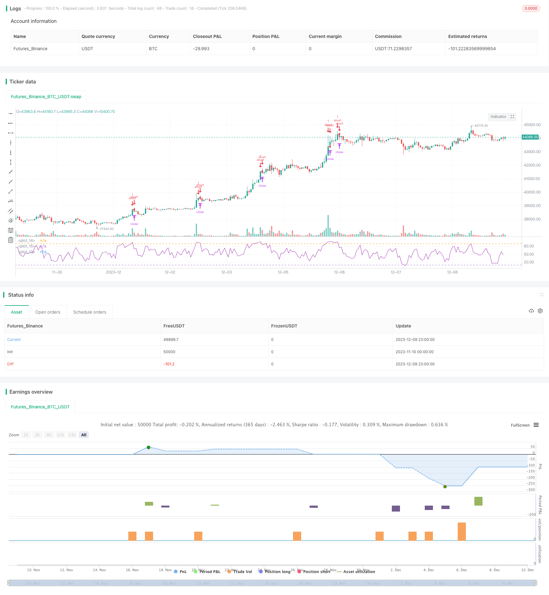

> Name

Trend following strategy RSI-MA-Trend-Following-Strategy based on RSI indicator and MA moving average
> Author

ChaoZhang

> Strategy Description


[trans]

## Overview
This strategy is called "RSI-MA Trend Following Strategy", and its idea is to use both the RSI indicator and the MA moving average to determine price trends and issue trading signals. Trading signals are generated when the RSI indicator exceeds the set upper and lower thresholds, while the MA moving average is used to filter out false signals and will only send out signals when the price continues to rise or fall. This can effectively filter the volatile market while maintaining a certain profit margin.
## Strategy Principle
This strategy primarily uses the RSI indicator and the MA moving average. RSI is used to determine overbought and oversold, and MA is used to determine the trend direction. The specific logic is:
1. Calculate the RSI indicator value and set the upper threshold of 90 and the lower threshold of 10. When the RSI exceeds 90, it is an overbought signal, and when it is less than 10, it is an oversold signal.
2. Calculate the MA moving average of a certain period (such as 4 days). When the price continues to rise, the MA line turns upward; when the price continues to fall, the MA line turns downward.
3. When the RSI exceeds 90 and the MA line turns upward, go short; when the RSI is less than 10 and the MA line turns downward, go long.
4. The stop loss is set to a fixed number of points per lot, and the take profit is a fixed percentage per lot.
## Strategic advantage analysis
This strategy combines the double filtering of RSI indicator and MA moving average, which can effectively filter out false signals in volatile market conditions. At the same time, the setting of RSI prevents signals from coming too late and ensures a certain profit margin. Use MA to determine the trend direction and avoid trading against the trend. In addition, the strategy parameters are relatively simple and easy to understand and optimize.
## Risk Analysis
The main risks of this strategy are:
1. If an unexpected event causes a sudden drop or a sharp rise, RSI and MA will not have time to react, which may result in large losses.
2. In a volatile market, RSI and MA may send out signals frequently, causing too frequent transactions and increasing transaction fees and slippage costs.
3. Improper parameter setting will also affect the strategy performance. If the RSI upper and lower thresholds are set too wide, the signal will be delayed, and if the RSI upper and lower threshold is set too narrow, the signal will be too frequent.
## Optimization direction
Directions in which this strategy can be further optimized include:
1. Test and optimize according to different varieties and cycle parameters, and set the best parameter combination.
2. Add other indicators in combination, such as adding KDJ, BOLL, etc., and set more stringent filtering conditions to reduce the probability of mistaken transactions.
3. Set up an adaptive stop-loss and take-profit mechanism, such as dynamically adjusting the stop-loss price based on volatility and ATR.
4. Add machine learning algorithms to automatically adjust strategy parameters according to market conditions to achieve dynamic optimization of parameters.
## Summarize
This RSI-MA strategy is relatively simple and practical overall. It also combines trend tracking and overbought and oversold judgment, and can obtain better returns in a good market environment. However, there is also a certain probability of mistaken transaction risk, and further optimization is needed to reduce risks and improve stability.
||

## Overview 

This strategy is named "RSI-MA Trend Following Strategy". The idea is to use both the RSI indicator and MA lines to judge price trends and generate trading signals. Trading signals are generated when the RSI indicator exceeds the pre-set upper and lower thresholds, while the MA lines are used to filter out false signals, only issuing signals when prices continue to rise or fall. This allows maintaining decent profit potential while effectively filtering out range-bound price movements.

## Strategy Logic

The core components of this strategy are the RSI indicator and MA lines. The RSI is used to identify overbought and oversold levels, while the MA is used to determine trend directionality. The specific logic is:

1. Calculate the RSI indicator value, and set the upper threshold at 90 and lower threshold at 10. An RSI reading above 90 signifies an overbought signal, while a reading below 10 signifies an oversold signal. 

2. Calculate the MA line of a certain period (e.g. 4 days). When prices are continuously rising, the MA line tilts upwards. When prices are falling continuously, the MA line tilts downwards.

3. When the RSI exceeds 90 and the MA line tilts upwards, go short. When the RSI drops below 10 and the MA line tilts downwards, go long.

4. Set stop loss at a fixed number of points per contract, and take profit at a fixed percentage per contract.

## Advantage Analysis

This strategy combines the dual filters of RSI indicator and MA lines, which can effectively filter out false signals under range-bound price moves. Meanwhile, the RSI settings avoid delayed signals and maintain decent profit potential. Using the MA to determine trend directionality prevents trading against the trend. In addition, the strategy has simple parameters that are easy to comprehend and optimize.   

## Risk Analysis

Main risks of this strategy include:

1. Sudden events that cause sharp price spikes may not be reflected timely in RSI and MA readings, leading to larger losses.

2. Under range-bound markets, RSI and MA may frequently issue signals, resulting in overly frequent trading that increases transaction costs and slippage. 

3. Improper parameter settings can also impact strategy performance. For example, RSI upper/lower thresholds set too wide lead to signal delays, while thresholds set too narrow lead to too frequent signals.

## Optimization Directions 

Areas for further optimization include:

1. Backtest and optimize parameters over different products and timeframes to find the optimal parameter combinations.

2. Incorporate other indicators alongside RSI/MA, such as KDJ, BOLL etc, to set more stringent signal filters and reduce false signals.

3. Build adaptive stop loss/take profit mechanisms based on volatility and ATR to dynamically adjust price levels. 

4. Add machine learning algorithms to auto-adjust parameters based on changing market conditions, realizing dynamic parameter optimization.

## Conclusion

Overall this RSI-MA strategy is fairly simple and practical, combining elements of trend following and overbought/oversold analysis. It can achieve decent profits given favorable market conditions, but also carries risks of false signals that need to be reduced via further optimizations to improve robustness.

[/trans]

> Strategy Arguments


|Argument|Default|Description|
|----|----|----|
|v_input_1|4|Length|
|v_input_2|5|rsin|
|v_input_3|15|TP|
|v_input_4|23|SL|
|v_input_5|false|TS|


> Source (PineScript)

``` pinescript
/*backtest
start: 2023-11-10 00:00:00
end: 2023-12-10 00:00:00
period: 1h
basePeriod: 15m
exchanges: [{"eid":"Futures_Binance","currency":"BTC_USDT"}]
*/

//@version=2
//This strategy is best used with the Chrome Extension AutoView for automating TradingView alerts.
//You can get the AutoView extension for FREE using the following link
//https://chrome.google.com/webstore/detail/autoview/okdhadoplaoehmeldlpakhpekjcpljmb?utm_source=chrome-app-launcher-info-dialog
strategy("4All", shorttitle="Strategy", overlay=false)

src = close
len = input(4, minval=1, title="Length")

up = rma(max(change(src), 0), len)
down = rma(-min(change(src), 0), len)
rsi = down == 0 ? 100 : up == 0 ? 0 : 100 - (100 / (1 + up / down))
plot(rsi, color=purple)
band1 = hline(90)
band0 = hline(10)
fill(band1, band0, color=purple, transp=90)

rsin = input(5)
sn = 100 - rsin
ln = 0 + rsin

short = crossover(rsi, sn)
long = crossunder(rsi, ln)

strategy.entry("long", strategy.long, when=long)
strategy.entry("short", strategy.short, when=short)

TP = input(15) * 10
SL = input(23) * 10
TS = input(0) * 10
CQ = 100

TPP = (TP > 0) ? TP : na
SLP = (SL > 0) ? SL : na
TSP = (TS > 0) ? TS : na

strategy.exit("Close Long", "long", qty_percent=CQ, profit=TPP, loss=SLP, trail_points=TSP)
strategy.exit("Close Short", "short", qty_percent=CQ, profit=TPP, loss=SLP, trail_points=TSP)
```

> Detail

https://www.fmz.com/strategy/435002

> Last Modified

2023-12-11 16:14:07
