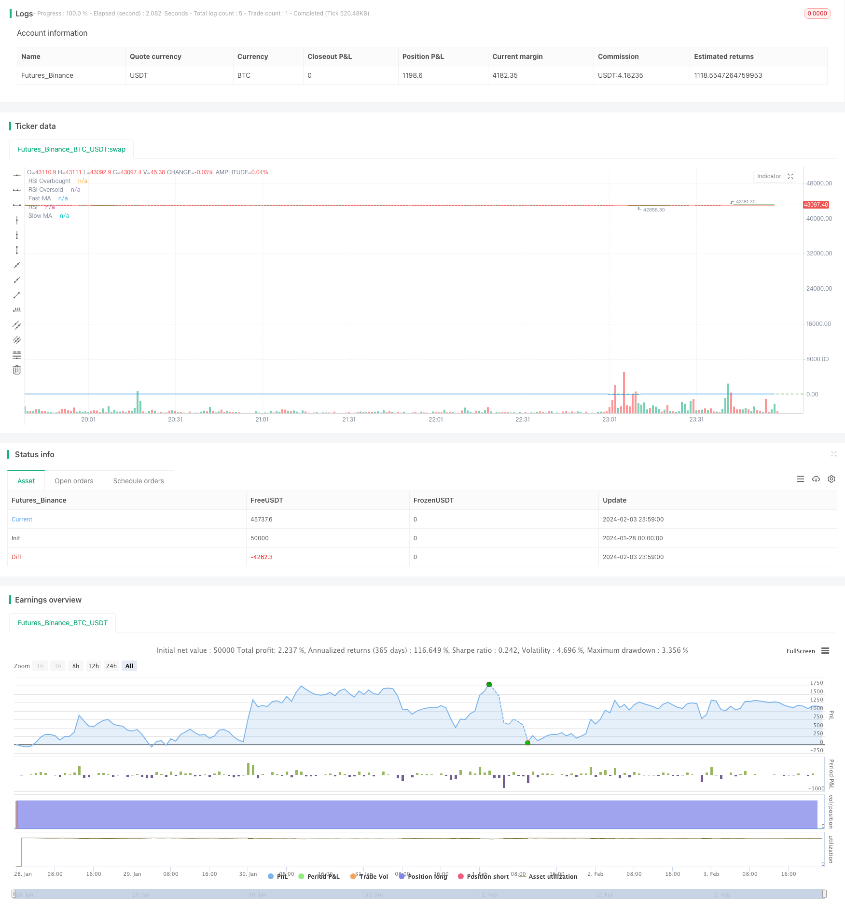

> Name

Moving-Average-and-RSI-Crossover-Strategy Based on Moving-Average-and-RSI-Crossover-Strategy
> Author

ChaoZhang

> Strategy Description


[trans]
## Overview
Moving Average and RSI Crossover Strategy is a quantitative trading strategy that combines moving averages and the relative strength index (RSI). This strategy generates trading signals by calculating the intersection of a fast moving average (such as the 10-day moving average) and a slow moving average (such as the 50-day moving average) as well as overbought and oversold conditions on the RSI indicator. Specifically, when the fast moving average crosses the slow moving average and the RSI is below the oversold line, a buy signal is generated; when the fast moving average crosses the slow moving average and the RSI is above the overbought line, a sell signal is generated.
## Strategy Principle
The core idea of ​​this strategy is to combine trend following and overbought and oversold indicators to capture the market's buying and selling points. Crosses above and below the moving average reflect changes in short-term and long-term trends. The RSI indicator determines whether the market is overbought or oversold. The strategy generates trading signals by calculating the intersection of two moving averages and the value of the RSI.
Specifically, the upper and lower crossings of the fast moving average reflect the change direction of the short-term trend. When the short-term moving average crosses the long-term moving average, it means that the short-term trend has turned upward; when the short-term moving average crosses below the long-term moving average, it means the short-term trend has turned downward. The RSI indicator determines whether the current market is overbought or oversold. RSI above the overbought line indicates that the market may be overbought, and a bearish position is held at this time; RSI below the oversold line indicates that the market may be oversold, and a bullish position is held at this time.
The strategy combines the signals of these two indicators to generate a buy signal when the fast moving average crosses the slow moving average and the RSI is below the oversold line, because at this time both the short-term and long-term trends have turned bullish, and the low level of the RSI also indicates that the market is currently oversold, which is an opportunity to establish a bullish position. On the contrary, when the fast moving average crosses below the slow moving average and the RSI is above the overbought line, a sell signal is generated because both trends have turned bearish, and the high RSI also indicates that the market may be bubble, which is the time to reduce bearish positions.
By combining trend analysis and overbought and oversold judgments, this strategy can generate trading signals near market turning points, thereby obtaining better returns in the short term.
## Advantage Analysis
The biggest advantage of this strategy is that it can combine the two dimensions of trend and overbought and oversold to judge the market status to avoid missing important trading opportunities.
First of all, the golden cross of the moving average can clearly judge the trend relationship between short-term and long-term. Compared with the sole use of long and short-term moving averages, cross combination can more accurately grasp the market turning point, thereby generating more timely trading signals.
Secondly, the overbought and oversold judgment of the RSI indicator can effectively filter out false breakthroughs. In actual operation, prices may experience some short-term increases or decreases, but this does not represent a real trend change. The RSI indicator can determine whether these short-term market fluctuations are normal or abnormal. Therefore, combining RSI can filter out some misleading trading signals.
Finally, this strategy only generates signals near trend turning points, and there is no problem of invalid trading. Generally speaking, quantitative strategies are prone to repeated openings and losses during regional consolidation. However, this strategy only enters the market at clear buying and selling points, which can reduce the number of unnecessary transactions.
In general, the moving average and RSI crossover strategy combines the two dimensions of trend tracking and overbought and oversold judgment. The trading signals are relatively accurate and reliable, and it is a quantitative strategy suitable for short-term operations.
## Risk Analysis
Although moving average and RSI crossover strategies have many advantages, there are also certain risks that require close attention.
The first is whipsaw risk, that is, there is a high probability that stop loss will be triggered due to violent price fluctuations. This strategy is mainly suitable for short-term trading, and the position time will not be too long. If you encounter an outlier market, Stop loss may be easily hit.
Secondly, if a small period moving average is used, the trading frequency will be very high. This puts both transaction costs and psychological control to a greater test. Trading too frequently not only results in heavy handling fees, but is also prone to losses due to operational errors.
Finally, the strategy parameter settings need to be fully optimized and verified. If the parameters are set improperly, such as unreasonable overbought and oversold thresholds, it will also lead to misjudgment of trading signals. This requires adequate backtesting and simulation verification.
These risks can be controlled and avoided by adjusting cycle parameters, optimizing stop loss strategies, and strictly abiding by psychological control principles. At the same time, the strategy also needs to be fully verified to ensure its stability and profitability.
## Optimization direction
This strategy also has room for further optimization, which can mainly start from the following aspects:
First, adaptive moving averages or triple exponential moving averages can be introduced to make the moving average system more sensitive to the latest price changes and generate more timely trading signals. This can improve the timeliness of the strategy.
Second, volatility indicators such as ATR can be combined to dynamically adjust the stop loss position, thereby reducing the probability of whipsaw being stopped. This controls the risk of the strategy.
Third, the optimal parameters of RSI in different market stages (breakthroughs, pullbacks, etc.) can be studied to make overbought and oversold judgments more consistent with the current market environment. This can improve the adaptability of the strategy.
Fourth, machine learning and other technologies can be combined to filter strategy signals to remove some false signals and make the strategy more intelligent. This can improve the accuracy of the strategy.
Through the above optimization points, the income and return of this strategy can be higher, while potential risks can also be controlled. This is an important research direction in the future.
## Summarize
The moving average and RSI crossover strategy is a typical short-term strategy that combines trend and indicator judgment. It grasps the turning point of the market at key points and can capture better short-term trading opportunities. At the same time, the RSI indicator can also effectively filter out false signals. This strategy is easy-to-use and has clear logic, making it a good choice for getting started with quantification.
However, this strategy also has a certain probability of being trapped and the risk of increased costs due to high transaction frequency. This needs to be avoided through parameter adjustment, stop loss optimization, mentality control and other methods. If optimization can continue and mechanisms such as adaptive moving averages, risk indicator control, and intelligent filtering are introduced, the performance of this strategy can be further improved.
Generally speaking, the moving average and RSI crossover strategy combines the idea of ​​​​paying equal attention to trends and indicators, which is easy to use and has good scalability. It is a recommended entry-level quantitative strategy.
||

## Overview  

The Moving Average and RSI Crossover Strategy is a quantitative trading strategy that combines moving averages and the Relative Strength Index (RSI) indicator. The strategy generates trading signals based on the crossover of a fast moving average (e.g. 10-day MA) and a slow moving average (e.g. 50-day MA), as well as overbought/oversold levels in the RSI indicator. Specifically, when the fast MA crosses above the slow MA, while the RSI is below the oversold level, a buy signal is generated. When the fast MA crosses below the slow MA, while the RSI is above the overbought level, a sell signal is triggered.

## Strategy Logic  

The core idea behind this strategy is to combine trend following and overbought/oversold analysis to identify market entry and exit points. The moving average crossover reflects changes in the short-term and long-term trends. The RSI indicator determines if the market is in overbought or oversold territory. The strategy generates trade signals by analyzing the crossover between the two moving averages and value of the RSI.

Specifically, the crossing of the fast MA above and below the slow MA indicates the change in direction of the short-term trend. When the fast MA crosses above the slow MA, it signals an upside breakout in the short-term trend. When it crosses below, it signals a downside breakdown. The RSI indicator determines whether the market is currently overbought or oversold. An RSI level above the overbought threshold signals the market may be overbought, favoring bearish positions. An RSI level below the oversold threshold signals the market may be oversold, favoring bullish positions.  

The strategy combines these indicators and generates a buy signal when the fast MA crosses above the slow MA, while the RSI is below oversold level. This signals both the short and long term trends are turning favorable, while the RSI low indicates the market is oversold presenting an opportunity to go long. A sell signal is triggered when the fast MA crosses below the slow MA, while the RSI is above the overbought level. Both trends now signal a downside, while the high RSI signals elevated risk suggesting to close out long exposure.

By combining trend analysis and overbought/oversold analysis, this strategy is able to identify turning points and generate profitable trade signals over the short-term.

## Advantage Analysis

The biggest advantage of this strategy is it incorporates both dimensions of trend and overbought/oversold analysis to gauge market conditions, avoiding missed trade opportunities.

Firstly, the golden/dead cross of moving averages offers a clear way to determine relationships between the short and long term trends. Combining crossovers provides more timely signals compared to just using individual short and long term averages.  

Secondly, the overbought/oversold analysis from RSI helps filter out false breakouts. In actual trading, prices may make short-term fluctuations that do not necessarily represent real trend changes. The RSI helps judge whether this short-term price action is just normal oscillations or abnormal ones needing attention. Therefore, incorporating RSI eliminates some misleading trade signals.

Lastly, this strategy only triggers around trend turning points, avoiding ineffective trades. Quantitative strategies often face repeated losses opening positions during range-bound periods. But this strategy has clear rules on when to enter based on the buy/sell signals, reducing unnecessary trade frequencies.

In summary, the Moving Average and RSI Crossover Strategy combines both trend following and overbought/oversold analysis, offering reliable trade signals ideal for short-term trading.  

## Risk Analysis

While the strategy has multiple strengths, there are still risks to closely monitor:

Firstly whipsaw risk, as sharp volatile moves may frequently hit stop losses prematurely exiting trades. The strategy is designed for short-term trades, so will not hold positions extensively. But outlier moves can easily knock out stops.  

Secondly, overly short moving average periods translate into very high trade frequencies. This strains trading costs and mental discipline. Trading too often not only accumulates fees, but risks making execution mistakes adding up losses.

Lastly, extensive optimization and robustness checks are imperative for parameter settings, or else trade signals may fail. For example, inappropriate overbought/oversold thresholds lead to inaccurate signal generation. Proper backtesting and out-of-sample testing is critical.

These risks can be addressed via adjustments like longer holding periods, stop loss optimization, and psychological discipline. Extensive verification of the strategy is also necessary to ensure stability and profitability.  

## Enhancement Opportunities

There remains room for improving this strategy, primarily:  

Firstly, incorporating adaptive moving averages or triple exponential moving averages so the system responds faster to the latest prices, improving timeliness of signals.  

Secondly, adding volatility metrics like ATR to dynamically adjust stop loss levels thereby reducing whipsaw stop outs. This helps control risks.

Thirdly, researching optimal RSI parameters across market conditions (breakouts, pullbacks etc) so overbought/oversold analysis fits the current environment better, enhancing adaptability.  

Fourthly, applying machine learning techniques to filter out erroneous signals, making the strategy more intelligent. This boosts accuracy.

Through these optimization avenues, further performance gains are possible while controlling for downside risks. This marks an important direction for future research.

## Conclusion

The Moving Average and RSI Crossover strategy exemplifies a typical approach combining trend following and indicator analysis for short-term trading. It captures market turning points to take advantage of short-term opportunities. RSI filters further improve robustness of signals generated. The easy-to-understand logic with clear rules also makes this strategy ideal for beginners to quantitative trading.

However, risks like whipsaws and high trading costs from frequency of signals need addressing through parameter tuning, stop losses, and psychological discipline. Further performance gains are possible by incorporating adaptive averages, risk metrics, and machine learning filters.  

Overall, by blending trend and momentum factors, this strategy offers simplicity in design but also extensibility through numerous optimization pathways. It warrants consideration as a foundational quantitative trading strategy.
[/trans]

> Strategy Arguments


|Argument|Default|Description|
|----|----|----|
|v_input_1|10|Fast MA Length|
|v_input_2|50|Slow MA Length|
|v_input_3|14|RSI Length|
|v_input_4|70|RSI Overbought Level|
|v_input_5|50|RSI Oversold Level|


> Source (PineScript)

``` pinescript
/*backtest
start: 2024-01-28 00:00:00
end: 2024-02-04 00:00:00
period: 1m
basePeriod: 1m
exchanges: [{"eid":"Futures_Binance","currency":"BTC_USDT"}]
*/

//@version=5
strategy("MA and RSI Crossover Strategy", shorttitle="MA_RSI_Strategy", overlay=true)

// 输入参数
fastLength = input(10, title="Fast MA Length")
slowLength = input(50, title="Slow MA Length")
rsiLength = input(14, title="RSI Length")
rsiOverbought = input(70, title="RSI Overbought Level")
rsiOversold = input(50, title="RSI Oversold Level")

// 计算移动平均线
fastMA = ta.sma(close, fastLength)
slowMA = ta.sma(close, slowLength)

// 计算相对强弱指数
rsiValue = ta.rsi(close, rsiLength)

// 定义买卖信号
buySignal = ta.crossover(fastMA, slowMA) and rsiValue < rsiOversold
sellSignal = ta.crossunder(fastMA, slowMA) and rsiValue > rsiOverbought

// 策略逻辑
strategy.entry("Buy", strategy.long, when=buySignal)
strategy.close("Buy", when=sellSignal)

// 绘制移动平均线
plot(fastMA, color=color.green, title="Fast MA")
plot(slowMA, color=color.red, title="Slow MA")

// 绘制RSI
hline(rsiOverbought, "RSI Overbought", color=color.red)
hline(rsiOversold, "RSI Oversold", color=color.green)
plot(rsiValue, color=color.blue, title="RSI")

// 在买入信号处标记买入点
plotshape(series=buySignal, title="Buy Signal", color=color.green, style=shape.triangleup, location=location.belowbar, size=size.huge)

```

> Detail

https://www.fmz.com/strategy/441062

> Last Modified

2024-02-05 11:52:42
