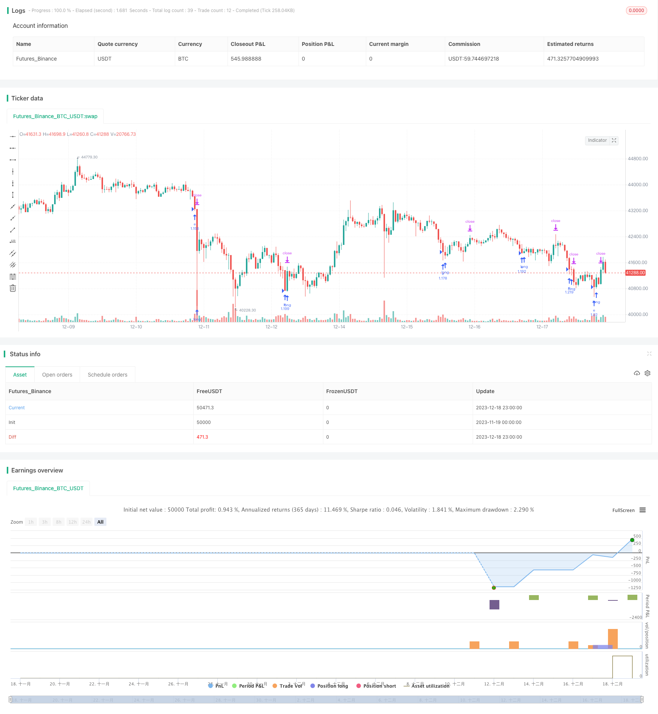

> Name

Probability-Enhanced-RSI-Strategy based on probability enhancement
> Author

ChaoZhang

> Strategy Description



[trans]

## Overview
This strategy is a simple long-only strategy that uses the RSI indicator to determine overbought and oversold. We have enhanced it, added stop loss and take profit, and integrated a probability module for probability enhancement. A position will only be opened when the probability of profitable transactions in the recent period is greater than or equal to 51%. This greatly improves the performance of the strategy.
## Strategy Principle
This strategy uses the RSI indicator to determine if the market is overbought or oversold. Specifically, when the RSI falls below the set lower limit of the oversold range, go long; when the RSI breaks above the set upper limit of the oversold range, close the position. In addition, we set a stop-loss and take-profit ratio.
The key is that we integrate a probability judgment module. This module will calculate the proportion of profit or loss in long transactions in the recent period (set through the lookback parameter). Only when the probability of recent profitable transactions is greater than or equal to 51%, a long position will be opened. This greatly reduces the number of possible losing trades.
## Advantage Analysis
This is a probability-enhanced RSI strategy, which has the following advantages over the ordinary RSI strategy:
1. Add stop-loss and stop-profit settings to limit single losses and lock in profits
2. Integrate probability module to avoid market vrf with low profit probability
3. The probability module parameters are adjustable and can be optimized for different market environments.
4. The long-only mechanism is simple, easy to understand and easy to implement.
## Risk Analysis
This strategy also has certain risks:
1. Only go long and cannot take advantage of falling markets to make profits
2. Improper judgment by the probability module may miss good opportunities.
3. It is impossible to determine the best parameter combination, and performance varies greatly under different market environments.
4. If the stop loss setting is too loose, a single loss may still be large.
Corresponding solutions:
1. You can consider adding a short-selling mechanism
2. Optimize the parameters of the probability module to reduce the probability of misjudgment
3. Use machine learning methods to dynamically optimize parameters
4. Set a more conservative stop loss level to reduce the room for single loss.
## Optimization direction
This strategy can be further optimized from the following aspects:
1. Add short selling module to realize two-way trading
2. Use machine learning methods to dynamically optimize parameter settings
3. Try other indicators to determine overbought or oversold
4. Optimize stop-loss and take-profit strategies to optimize the profit-loss ratio
5. Combine with other factors to filter the signal and increase the probability
## Summarize
This strategy is a simple RSI strategy, enhanced by an integrated probability judgment module. Compared with the ordinary RSI strategy, some losing transactions can be filtered out, and the overall retracement and profit-loss ratio are optimized. Subsequent improvements can be made from aspects such as short selling and dynamic optimization to make the strategy more robust.
||


## Overview

This is a simple long-only strategy using RSI indicator to determine overbought and oversold levels. We enhanced it by adding stop loss and take profit, and integrating a probability module to reinforcement trading only when the recent profitable trade probability is greater than or equal to 51%. This greatly improved the strategy performance by avoiding potential losing trades.  

## Principles

The strategy uses RSI indicator to judge market overbought and oversold conditions. Specifically, it goes long when RSI crosses below the lower limit of oversold zone; and closes position when RSI crosses above the upper limit of overbought zone. In addition, we set stop loss and take profit ratios.

The key is we integrated a probability judgement module. This module calculates the profitable percentage of long trades in recent periods (defined by lookback parameter). It only allows entry if recent profitable trading probability is greater than or equal to 51%. This avoids lots of potential losing trades.

## Advantages

As a probability enhanced RSI strategy, it has below advantages compared to simple RSI strategies:

1. Added stop loss and take profit controls single trade loss and locks profit
2. Integrated probability module avoids low probability markets
3. Probability module is adjustable for different market environments 
4. Long-only mechanism is simple to understand and implement

## Risk Analysis 

There are still some risks within this strategy:

1. Long-only, unable to profit from falling market
2. Improper probability module judgement could miss opportunities  
3. Hard to find best parameter combination, significant performance difference across market environments
4. Loose stop loss setting, still possible large single trade loss

Solutions:

1. Consider adding short mechanism 
2. Optimize probability module to lower misjudgement rate
3. Use machine learning to dynamically optimize parameters
4. Set more conservative stop loss level to limit loss

## Enhancement Directions

The strategy could be further optimized in below aspects:

1. Increase short module for dual direction trading
2. Use machine learning for dynamic parameter optimization
3. Try other indicators for overbought/oversold
4. Optimize stop loss/take profit for profit ratio enhancement 
5. Add other factors to filter signals and improve probability

## Summary

This is a simple RSI strategy enhanced by integrated probability module. Compared to vanilla RSI strategies, it filters out some losing trades and improves overall drawdown and profit ratio. Next step could be improving it by adding short, dynamic optimization etc to make it more robust.

[/trans]

> Strategy Arguments


|Argument|Default|Description|
|----|----|----|
|v_input_int_1|14|RSI lenght: |
|v_input_int_2|35|Oversold: |
|v_input_int_3|75|Overbought: |
|v_input_int_4|30|Lookback period: |
|v_input_float_1|true|Take profit: |
|v_input_float_2|true|Stop loss: |


> Source (PineScript)

``` pinescript
/*backtest
start: 2023-11-19 00:00:00
end: 2023-12-19 00:00:00
period: 1h
basePeriod: 15m
exchanges: [{"eid":"Futures_Binance","currency":"BTC_USDT"}]
*/

// This source code is subject to the terms of the Mozilla Public License 2.0 at https://mozilla.org/MPL/2.0/
// © thequantscience

//@version=5
strategy("Reinforced RSI",
     overlay = true,
     default_qty_type = strategy.percent_of_equity, 
     default_qty_value = 100,
     pyramiding = 1,
     currency = currency.EUR, 
     initial_capital = 1000,
     commission_type = strategy.commission.percent, 
     commission_value = 0.07)

lenght_rsi = input.int(defval = 14, minval = 1, title = "RSI lenght: ")
rsi = ta.rsi(close, length = lenght_rsi)

rsi_value_check_entry = input.int(defval = 35, minval = 1, title = "Oversold: ")
rsi_value_check_exit = input.int(defval = 75, minval = 1, title = "Overbought: ")

trigger = ta.crossunder(rsi, rsi_value_check_entry)
exit = ta.crossover(rsi, rsi_value_check_exit)

entry_condition   = trigger 
TPcondition_exit  = exit

look = input.int(defval = 30, minval = 0, maxval = 500, title = "Lookback period: ")

Probabilities(lookback) =>

    isActiveLong = false
    isActiveLong := nz(isActiveLong[1], false)
    isSellLong = false
    isSellLong := nz(isSellLong[1], false)

    int positive_results = 0
    int negative_results = 0

    float positive_percentage_probabilities = 0 
    float negative_percentage_probabilities = 0 

    LONG = not isActiveLong and entry_condition == true 
    CLOSE_LONG_TP = not isSellLong and TPcondition_exit == true

    p = ta.valuewhen(LONG, close, 0)
    p2 = ta.valuewhen(CLOSE_LONG_TP, close, 0)

    for i = 1 to lookback

	    if (LONG[i])
            isActiveLong := true
		    isSellLong := false

        if (CLOSE_LONG_TP[i])
	        isActiveLong := false
	        isSellLong := true

        if p[i] > p2[i]
            positive_results += 1
        else 
            negative_results -= 1 

	    positive_relative_probabilities = positive_results / lookback
	    negative_relative_probabilities = negative_results / lookback
	    positive_percentage_probabilities := positive_relative_probabilities * 100
	    negative_percentage_probabilities := negative_relative_probabilities * 100

    positive_percentage_probabilities
	
probabilities = Probabilities(look) 

lots = strategy.equity/close

var float e = 0 
var float c = 0 

tp = input.float(defval = 1.00, minval = 0, title = "Take profit: ")
sl = input.float(defval = 1.00, minval = 0, title = "Stop loss: ")

if trigger==true and strategy.opentrades==0 and probabilities >= 51
    e := close
    strategy.entry(id = "e", direction = strategy.long, qty = lots, limit = e) 
takeprofit = e + ((e * tp)/100)
stoploss = e - ((e * sl)/100)
if exit==true
    c := close 
    strategy.exit(id = "c", from_entry = "e", limit = c)
if takeprofit and stoploss 
    strategy.exit(id = "c", from_entry = "e", stop = stoploss, limit = takeprofit)
```

> Detail

https://www.fmz.com/strategy/435973

> Last Modified

2023-12-20 15:05:05
