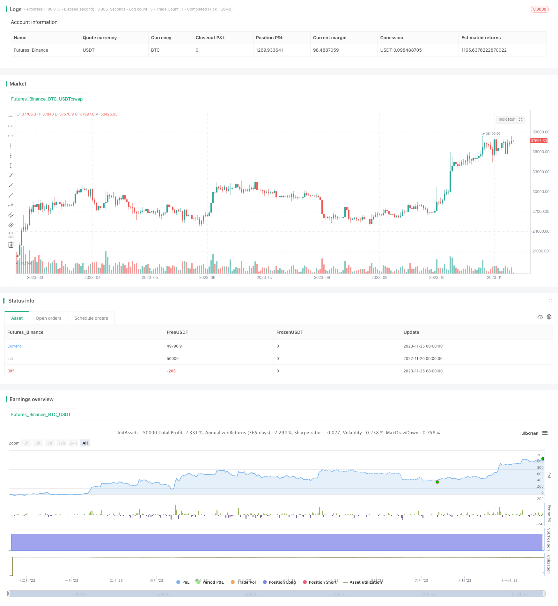

> Name

Quantitative-Trading-Strategy-Based-on-RSI-Indicator
> Author

ChaoZhang

> Strategy Description



[trans]


## Strategy Overview
This strategy is called "PlanB RSI Tracking Strategy". This strategy uses the Relative Strength Index (RSI) as the main technical indicator to set buy and sell signals to achieve automated trading.
## Strategy Principle
This strategy is mainly based on the following principles:
1. If the RSI index exceeds 90% in the past 6 months and falls below 65%, a sell signal is generated.
2. If the RSI index is below 50% at the lowest level in the past 6 months and rebounds from the lowest point by more than 2%, a buy signal will be generated.
Specifically, the selling condition judgment logic is:
```
如果(过去6个月RSI指数最大值>90% 且 当前RSI<65%)
   则卖出
```

The buying condition judgment logic is:
```  
如果(过去6个月RSI指数最小值<50% 且 RSI指数从最低点反弹>2%)
  则买入
```

The above selling and buying rules come from an article by PlanB who is familiar with quantitative strategies. This strategy strives to replicate its research results so that more traders can verify the effectiveness of this trading strategy.
## Strategic Advantages
This trading strategy has the following advantages:
1. Using the relatively simple RSI indicator as the only technical indicator reduces the complexity of the strategy.
2. The buying and selling rules are clear, easy to understand, and convenient for real-time verification.
3. The judgment of buying and selling signals takes full consideration of market ups and downs information. Sell ​​signal judgment combines long-term indicator highs and short-term adjustments; buy signal judgment combines long-term indicator lows and short-term rebounds.
4. The strategy refers to the research results of PlanB, a well-known quantitative expert, and can be used as an independent verification of the conclusions of his article.
5. As a beginner strategy, the relatively simple and easy-to-operate rules are conducive to the cultivation of quantitative trading skills.
## Strategy Risk
There are also some major risks associated with this trading strategy:
1. As a strategy based on a single technical indicator RSI, it cannot cope with more complex market conditions. The RSI indicator itself can also produce misleading signals.
2. Fixed buying and selling parameter settings may miss some trading opportunities, or cause delayed trading signals. Parameters need to be optimized to adapt to different market cycles.
3. The strategy is too simple and follows the conclusion of the PlanB article without considering independent model optimization, which may lead to poor real trading results.
4. The rules for buying and selling are relatively extensive, and there is no combination of stop loss and take profit to ensure profits and control risks. This can easily lead to larger losses in real trading.
Optimizing the strategy in the following ways can reduce risks and improve real market performance:
1. Add secondary indicator judgment to avoid misleading RSI indicators;
2. Optimize parameter settings to adapt to different cycle characteristics;
3. Add a stop-loss and stop-profit mechanism to effectively control risks;
4. Combine independent data to train strategy parameters to ensure parameter robustness.
## Strategy optimization direction
In order to improve the actual performance of the strategy, optimization can be carried out from the following dimensions:
1. **Add secondary indicator judgment**: Relying only on the RSI indicator can easily produce misleading signals. Sub-indicators such as KD and MACD can be introduced for comprehensive judgment to improve signal accuracy.
2. **Dynamic Parameter Optimization**: The current buying and selling parameters are set to fixed values, which is difficult to adapt to long-term and short-term changes in the market. Introducing a dynamic parameter optimization module and adjusting parameters in real time can significantly improve strategy performance.
3. **Stop Loss/Take Profit Mechanism**: The strategy currently has no stop loss and take profit settings. Adding stop-loss mechanisms such as trailing stops, as well as moving take-profit points, can effectively control single losses and lock in profits.
4. **Independent parameter training**: Use the parameters of the PlanB article directly without independent verification. Apply machine learning and other methods to train the optimal parameter combination based on historical data.
5. **Copy combination optimization**: Combining multiple similar simple strategies can improve overall stability and returns and reduce the risk of a single strategy.

## Summarize
This strategy "PlanB RSI tracking strategy" follows PlanB's classic article design ideas and uses the RSI indicator to build a relatively simple quantitative trading strategy. The advantage of the strategy is that the rules are clear and easy to implement, making it suitable for quantitative introductory learning. However, the strategy also has problems such as relying on a single indicator and insufficiently optimized parameters. In the future, strategies can be enhanced by adding secondary indicators, dynamic parameter optimization, stop loss/take profit settings, independent parameter training, etc. to greatly improve the real performance.
||
## Strategy Overview

The strategy is named "PlanB RSI Tracking Strategy". It utilizes the Relative Strength Index (RSI) as the primary technical indicator to set up buy and sell signals for automated trading.  

## Strategy Logic

The strategy is mainly based on the following principles:

1. If the highest RSI index in the past 6 months exceeds 90% and then drops below 65%, a sell signal is generated.  

2. If the lowest RSI index in the past 6 months falls below 50% and then bounces more than 2% from the lowest point, a buy signal is generated.


Specifically, the sell logic is:

```
If (Highest RSI in past 6 months > 90% AND Current RSI < 65%) 
   Then Sell
```

The buy logic is: 

```
If (Lowest RSI in past 6 months < 50% AND RSI bounces >2% from lowest point)
   Then Buy
```

The above sell and buy rules come from the article by PlanB, a well-known quant strategist. The strategy aims to replicate his research results for more traders to validate the effectiveness of this trading strategy.


## Advantages of the Strategy

This trading strategy has the following main advantages:

1. Using RSI as the only technical indicator reduces complexity.

2. Clear buy and sell rules that are easy to understand for live trading verification.
   
3. Buy and sell signals incorporate both long-term peak/bottom and short-term bounce/breakdown market information.

4. The strategy references research from renowned quant PlanB, allowing independent verification of his conclusions.  

5. As a beginner strategy with relatively simple rules, it helps nurture quant trading skills.


## Risks of the Strategy 

There are also some key risks for this trading strategy:

1. Relying solely on RSI, it cannot handle more complex market regimes. RSI itself also gives false signals.

2. Fixed parameter settings may miss trades or give delayed signals. Optimization is needed for adapting across market cycles.
   
3. Following PlanB blindly without independent optimization risks poor live performance. 

4. Raw buy/sell rules without stop loss or take profit may lead to large losses in live trading.


Below optimizations could help reduce risks and improve live performance:

1. Add secondary indicators to avoid RSI false signals.  

2. Optimize parameters for different cycle characteristics. 

3. Add stop loss / take profit mechanisms for risk control.

4. Train strategy parameters independently to ensure robustness.


## Directions for Strategy Optimization

To enhance live performance, optimizations can be made in the following dimensions:

1. **Add secondary indicators**: Relying solely on RSI risks false signals. Incorporate indicators like KD, MACD for composite judgment and improve accuracy.
   
2. **Dynamic parameter optimization**: Current parameter values are fixed, failing to adapt across market cycles. Introduce dynamic optimization modules to adjust parameters in real-time for significantly improved performance.

3. **Stop loss/take profit**: Currently lacking risk management features. Adding trailing stop loss, moving take profit points can effectively control single trade loss and lock in gains.

4. **Independent parameter training**: Directly using PlanB article parameters without verification. Apply machine learning to find optimal parameter combinations based on historical data. 

5. **Portfolio optimization**: Combining multiple simple strategies improves overall stability and risk-adjusted returns.

## Conclusion   

The "PlanB RSI Tracking Strategy" follows the design philosophy in PlanB's classic article, constructing a simple quant trading strategy based on RSI. The advantages lie in its clarity and ease of implementation, making it suitable for quant starter education. However, sole reliance on a single indicator and lack of optimization remain as issues. Future enhancements can be made via adding secondary indicators, dynamic parameter optimization, stop loss/take profit, independent parameter training to significantly improve live performance.

[/trans]

> Strategy Arguments


|Argument|Default|Description|
|----|----|----|
|v_input_1|90|selllevel|
|v_input_2|65|drop|
|v_input_3|50|buylevel|


> Source (PineScript)

``` pinescript
/*backtest
start: 2022-11-20 00:00:00
end: 2023-11-26 00:00:00
period: 1d
basePeriod: 1h
exchanges: [{"eid":"Futures_Binance","currency":"BTC_USDT"}]
*/

// This source code is subject to the terms of the Mozilla Public License 2.0 at https://mozilla.org/MPL/2.0/
// © fillippone

//@version=4

strategy("PlanB Quant Investing 101", shorttitle="PlanB RSI Strategy", overlay=true,calc_on_every_tick=false,pyramiding=0, default_qty_type=strategy.cash,default_qty_value=1000, currency=currency.USD, initial_capital=1000,commission_type=strategy.commission.percent, commission_value=0.0)


r=rsi(close,14)

//SELL CONDITION
//RSI was above 90% last six months AND drops below 65%

//RSI above 90% last six month

selllevel = input(90)
maxrsi = highest(rsi(close,14),6)[1]

rsisell = maxrsi > selllevel 


//RSIdrops below 65%
drop = input(65)

rsidrop= r < drop

//sellsignal
sellsignal = rsisell and rsidrop 


//BUY CONDITION
//IF (RSI was below 50% last six months AND jumps +2% from the low) THEN buy, ELSE hold.

//RSI was below 50% last six months

buylevel = input(50)
minrsi = lowest(rsi(close,14),6)[1]

rsibuy = minrsi < buylevel 

//IF (RSI jumps +2% from the low) THEN buy, ELSE hold.


rsibounce= r > (minrsi + 2)

//buysignal=buyrsi AND rsidrop

//buysignal

buysignal = rsibuy and rsibounce 

//Strategy

strategy.entry("Buy Signal",strategy.long, when = buysignal)
strategy.entry("Sell Signal",strategy.short, when = sellsignal)


```

> Detail

https://www.fmz.com/strategy/433434

> Last Modified

2023-11-27 16:02:14
