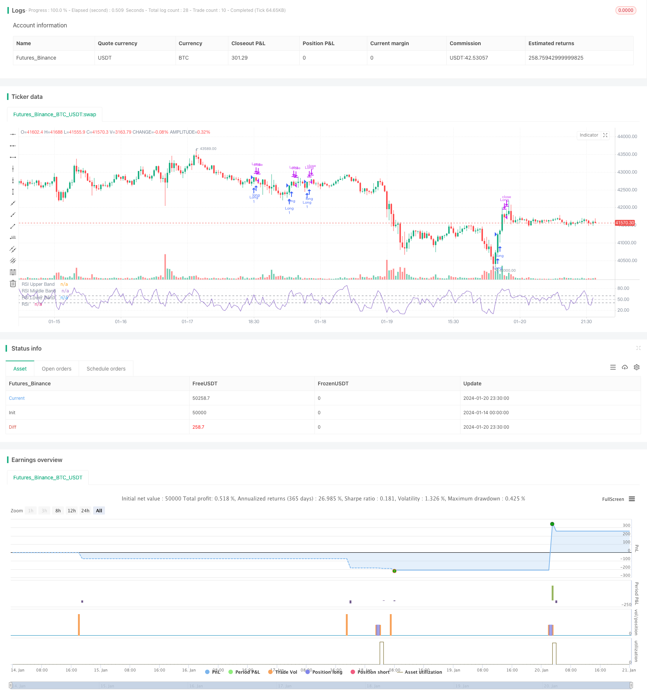

> Name

Short-term trading strategy based on RSI indicator RSI-5-Momentum-Trading-Strategy
> Author

ChaoZhang

> Strategy Description


 [trans]
## Overview
This strategy is a short-term trading strategy based on RSI (relative strength indicator). It uses the RSI indicator to identify the potential strength and weakness of the market to assist trading decisions.
This strategy uses the 5-period RSI indicator to capture short-term price momentum. It determines the timing of entry and stop loss based on the highs and lows of the RSI curve.
## Strategy Principle
The conditions for entering a long position are: the RSI value of the previous K line is lower than 50; the RSI value of the current K line is higher than 60.
The conditions for closing the position are: when the RSI curve reaches a lower low, it means that the trend is weakening, and the long position will be closed at this time.
## Advantage Analysis
- Use the RSI indicator to effectively identify price reversal points in the market. The combination of RSI high and low points has a strong indicative effect.
- The 5-period RSI can capture rapid changes in short-term prices and is suitable for short-term trading.  
- The strategic decision-making rules are clear, simple and easy to implement.
## Risk Analysis
- The RSI indicator is prone to generating false signals, leading to stop loss.
- Short-term operations tend to increase transaction frequency and slippage costs.
- In actual trading, parameters need to be adjusted reasonably, such as RSI period number, high and low point thresholds, etc.
Optimization method:
- Combined with other indicators to filter signals to reduce error rate. Such as MACD, KD, etc. 
- Relax the stop loss line appropriately to avoid being too sensitive.
- Adjust RSI parameters and find the optimal parameter combination.
## Summarize
This strategy takes advantage of the high-low reversal characteristics of the RSI indicator and sets clear long entry and stop-loss rules. A simple and practical trading idea, but there is also a certain degree of instability. Strategy stability can be improved through parameter optimization and indicator combination.
||

## Overview  

This is a short-term trading strategy based on the RSI (Relative Strength Index) indicator. It utilizes RSI to identify potential strength and weakness in the market, thus assisting trading decisions.  

The strategy uses a 5-period RSI to capture short-term price momentum. It determines entry and stop loss levels based on peaks and troughs of the RSI curve.  

## Strategy Logic  

Long entry conditions: previous candle's RSI below 50; current candle's RSI above 60.  

Exit conditions: when the RSI curve makes lower lows, indicating weakening trend, close long positions.

## Advantage Analysis 

- RSI effectively identifies reversal points in prices, as RSI peaks and troughs combinations have strong signaling effects.
- The 5-period RSI captures fast price fluctuations for short-term trading.   
- The strategy rules are clear and simple to implement.  

## Risk Analysis

- RSI may generate false signals, causing unnecessary stop loss.  
- High trading frequency from short-term trading can incur larger slippage costs.
- Parameters like RSI periods, threshold levels require fine tuning for actual trading.  

Optimization:
- Adding filter indicators like MACD and KD to reduce errors.  
- Relaxing stop loss levels to avoid oversensitivity.
- Adjusting RSI parameters to find optimal parameter combinations.

## Summary  

The strategy utilizes the reversal pattern of RSI peaks and troughs to set clear long entry and stop loss rules. The logic is simple and practical but has some instability. Strategy stability can be improved through parameter optimization and indicator combinations.  

[/trans]

> Strategy Arguments


|Argument|Default|Description|
|----|----|----|
|v_input_1|5|RSI Length|


> Source (PineScript)

``` pinescript
/*backtest
start: 2024-01-14 00:00:00
end: 2024-01-21 00:00:00
period: 30m
basePeriod: 15m
exchanges: [{"eid":"Futures_Binance","currency":"BTC_USDT"}]
*/

//@version=5
strategy("*RSI 5 - Long only- Daily charts & above*", overlay = false)

// Define inputs
rsi_length = input(5, "RSI Length")

// Calculate indicators
rsi = ta.rsi(close, rsi_length)

// Entry conditions
long = rsi[1] < 50 and rsi > 60

// Exit conditions
longExit = rsi < rsi[1] 


// Execute trade with adjusted position size
if (long) 
    strategy.entry("Long", strategy.long)
    
    
if  (longExit)
	strategy.close("LongExit")


// Close long position if long exit condition is met
if (longExit)
    strategy.close("Long", comment="Long exit")

rsiPlot = plot(rsi, "RSI", color=#7E57C2)
rsiUpperBand = hline(60, "RSI Upper Band", color=#787B86)
midline = hline(50, "RSI Middle Band", color=color.new(#787B86, 50))
rsiLowerBand = hline(40, "RSI Lower Band", color=#787B86)
fill(rsiUpperBand, rsiLowerBand, color=color.rgb(126, 87, 194, 90), title="RSI Background Fill")


```

> Detail

https://www.fmz.com/strategy/439598

> Last Modified

2024-01-22 09:59:42
