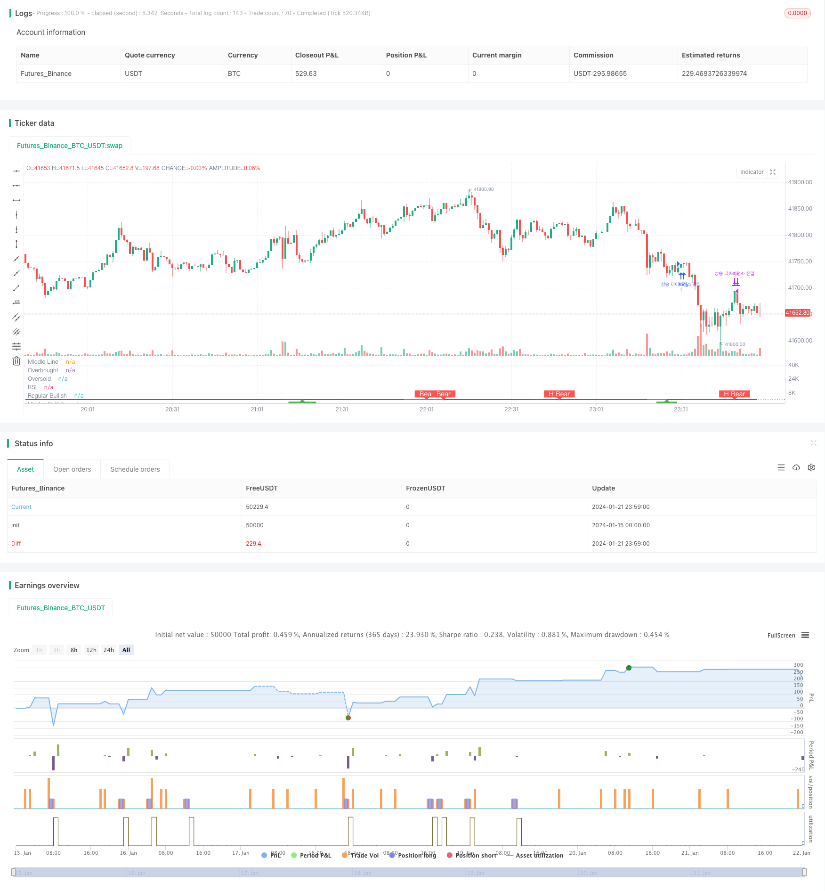

> Name

RSI indicator divergence trading strategy RSI-Divergence-Trading-Strategy
> Author

ChaoZhang

> Strategy Description


[trans]

## Overview
The RSI indicator divergence trading strategy analyzes the divergence between the RSI indicator and price, discovers opportunities for value divergence, and goes long and short when the divergence occurs.
## Strategy Principle
This strategy is based on the value divergence when the RSI indicator diverges from price. The RSI indicator reflects the strength and weakness, and the price reflects the relationship between supply and demand. When there is a divergence between the two, it means that there is a misprice in the market, and you can make a profit by buying short or selling long.
Specifically, a conventional bull divergence is for the RSI to form higher lows and the price to form lower lows. This means that although the market is bearish on the surface, it actually has signs of rebounding. When the RSI deviates from the price and breaks upward above the 50 dividing line, this rebound opportunity can be captured.
A regular bearish divergence is the opposite, with the RSI making lower highs and price making higher highs. This means that the market is bullish on the surface, but actually shows signs of weakness internally. When the RSI deviates from the price and breaks below the 50 dividing line, you can make a short profit.
In addition, there are hidden long divergences and short divergences. At this time, the relationship between RSI and price is opposite to the conventional difference, but the principle is the same and profits can also be made.
## Strategic Advantages
1. Capture value differences and discover market error pricing
2. Combine indicators and price divergence to increase the winning rate
3. Distinguish between multiple divergent situations and cover more opportunities
## Risk Analysis
1. False divergences may also occur under special market conditions and need to be identified
2. The winning rate of breaking through the 50 dividing line is not high and can be optimized appropriately.
3. Wrong choice of long and short direction may lead to large losses
## Optimization direction
1. Optimize RSI parameters and improve indicator prediction accuracy
2. Combine with other indicator signals to judge deviations
3. Evaluate the profit-risk ratio of long and short positions, and control single profit and loss
## Summary
The RSI indicator divergence strategy discovers market error pricing by analyzing the divergence between value and price, which is a typical statistical arbitrage strategy. The advantage of this strategy lies in timely detection of trend reversal opportunities, while the risk lies in the accuracy of divergence identification. Through continuous optimization, stable gains can be achieved in actual combat.
||

## Overview
The RSI divergence trading strategy captures mispricing opportunities by analyzing the divergence between the RSI indicator and price. It goes long or short when the divergence appears.

## Strategy Logic  
The strategy is based on the value-price divergence when RSI diverges from price. RSI reflects the strength while price reflects the supply-demand relationship. When the two diverge, it indicates market mispricing for arbitrage.  

Specifically, a regular bullish divergence happens when RSI forms a higher low while price prints a lower low. This shows that although the market looks weak on the surface, it is actually garnering strength internally for a bounce. When RSI diverges from price and breaks above the 50-line, it presents an opportunity to catch the bounce.  

A regular bearish divergence happens when RSI makes a lower high while price forms a higher high. This suggests that although the market looks strong externally, it is showing weakness signals internally. When RSI diverges from price and breaks below the 50-line, it allows profiting from the short side.

There are also hidden bullish and bearish divergences where the relationship between RSI and price is opposite of regular divergences, but the logic remains the same for taking profits.

## Advantages
1. Captures market mispricing from value-price divergence  
2. Improves win rate combining indicator and price divergence  
3. Covers more opportunities distinguishing all types of divergences
   
## Risk Analysis   
1. Fake divergences can happen under special market conditions  
2. Breaking 50-line has relatively low success rate, can optimize
3. Picking wrong direction could lead to big losses

## Optimization Directions
1. Optimize RSI parameters for higher accuracy
2. Combine signals from other indicators to confirm divergences
3. Assess risk-reward for longs and shorts to control per trade loss

## Summary
The RSI divergence strategy arbitrages market mispricing through analyzing divergence between value and price signals. Its advantage lies in timely catching trend reversal opportunities, while its risk comes from the accuracy of divergence recognition. With continuous optimization, steady gains can be achieved in live trading.
[/trans]

> Strategy Arguments


|Argument|Default|Description|
|----|----|----|
|v_input_int_1|14|RSI Period|
|v_input_1_close|0|RSI Source: close|high|low|open|hl2|hlc3|hlcc4|ohlc4|
|v_input_2|5|Pivot Lookback Right|
|v_input_3|5|Pivot Lookback Left|
|v_input_4|60|Max of Lookback Range|
|v_input_5|5|Min of Lookback Range|
|v_input_6|true|Plot Bullish|
|v_input_7|true|Plot Hidden Bullish|
|v_input_8|true|Plot Bearish|
|v_input_9|true|Plot Hidden Bearish|


> Source (PineScript)

``` pinescript
/*backtest
start: 2024-01-15 00:00:00
end: 2024-01-22 00:00:00
period: 1m
basePeriod: 1m
exchanges: [{"eid":"Futures_Binance","currency":"BTC_USDT"}]
*/

//@version=5
strategy(title="Divergence Indicator")
len = input.int(title="RSI Period", minval=1, defval=14)
src = input(title="RSI Source", defval=close)
lbR = input(title="Pivot Lookback Right", defval=5)
lbL = input(title="Pivot Lookback Left", defval=5)
rangeUpper = input(title="Max of Lookback Range", defval=60)
rangeLower = input(title="Min of Lookback Range", defval=5)
plotBull = input(title="Plot Bullish", defval=true)
plotHiddenBull = input(title="Plot Hidden Bullish", defval=true)
plotBear = input(title="Plot Bearish", defval=true)
plotHiddenBear = input(title="Plot Hidden Bearish", defval=true)
bearColor = color.red
bullColor = color.green
hiddenBullColor = color.new(color.green, 80)
hiddenBearColor = color.new(color.red, 80)
textColor = color.white
noneColor = color.new(color.white, 100)
osc = ta.rsi(src, len)

plot(osc, title="RSI", linewidth=2, color=#2962FF)
hline(50, title="Middle Line", color=#787B86, linestyle=hline.style_dotted)
obLevel = hline(70, title="Overbought", color=#787B86, linestyle=hline.style_dotted)
osLevel = hline(30, title="Oversold", color=#787B86, linestyle=hline.style_dotted)
fill(obLevel, osLevel, title="Background", color=color.rgb(33, 150, 243, 90))

plFound = na(ta.pivotlow(osc, lbL, lbR)) ? false : true
phFound = na(ta.pivothigh(osc, lbL, lbR)) ? false : true
_inRange(cond) =>
	bars = ta.barssince(cond == true)
	rangeLower <= bars and bars <= rangeUpper

//------------------------------------------------------------------------------
// Regular Bullish
// Osc: Higher Low

oscHL = osc[lbR] > ta.valuewhen(plFound, osc[lbR], 1) and _inRange(plFound[1])

// Price: Lower Low

priceLL = low[lbR] < ta.valuewhen(plFound, low[lbR], 1) 
// bull : 상승 Condition : 조건
bullCond = plotBull and priceLL and oscHL and plFound // 상승다이버전스?
strategy.entry("상승 다이버전스 진입", strategy.long, when = bullCond)
strategy.close("상승 다이버전스 진입", when = ta.crossover(osc, 50)) 
plot(
     plFound ? osc[lbR] : na,
     offset=-lbR,
     title="Regular Bullish",
     linewidth=2,
     color=(bullCond ? bullColor : noneColor)
     )

plotshape(
	 bullCond ? osc[lbR] : na,
	 offset=-lbR,
	 title="Regular Bullish Label",
	 text=" Bull ",
	 style=shape.labelup,
	 location=location.absolute,
	 color=bullColor,
	 textcolor=textColor
	 )

//------------------------------------------------------------------------------
// Hidden Bullish
// Osc: Lower Low

oscLL = osc[lbR] < ta.valuewhen(plFound, osc[lbR], 1) and _inRange(plFound[1])

// Price: Higher Low

priceHL = low[lbR] > ta.valuewhen(plFound, low[lbR], 1)
hiddenBullCond = plotHiddenBull and priceHL and oscLL and plFound
// strategy.entry("히든 상승 다이버전스 진입", strategy.long, when = hiddenBullCond)
// strategy.close("히든 상승 다이버전스 진입", when = ta.crossover(osc, 50))
plot(
	 plFound ? osc[lbR] : na,
	 offset=-lbR,
	 title="Hidden Bullish",
	 linewidth=2,
	 color=(hiddenBullCond ? hiddenBullColor : noneColor)
	 )

plotshape(
	 hiddenBullCond ? osc[lbR] : na,
	 offset=-lbR,
	 title="Hidden Bullish Label",
	 text=" H Bull ",
	 style=shape.labelup,
	 location=location.absolute,
	 color=bullColor,
	 textcolor=textColor
	 )

//------------------------------------------------------------------------------
// Regular Bearish
// Osc: Lower High

oscLH = osc[lbR] < ta.valuewhen(phFound, osc[lbR], 1) and _inRange(phFound[1])

// Price: Higher High

priceHH = high[lbR] > ta.valuewhen(phFound, high[lbR], 1)
// bear : 하락 
bearCond = plotBear and priceHH and oscLH and phFound
// strategy.entry("하락 다이버전스 진입", strategy.short, when = bearCond)
// strategy.close("하락 다이버전스 진입", when = ta.crossunder(osc, 50)) 
plot(
	 phFound ? osc[lbR] : na,
	 offset=-lbR,
	 title="Regular Bearish",
	 linewidth=2,
	 color=(bearCond ? bearColor : noneColor)
	 )

plotshape(
	 bearCond ? osc[lbR] : na,
	 offset=-lbR,
	 title="Regular Bearish Label",
	 text=" Bear ",
	 style=shape.labeldown,
	 location=location.absolute,
	 color=bearColor,
	 textcolor=textColor
	 )

//------------------------------------------------------------------------------
// Hidden Bearish
// Osc: Higher High

oscHH = osc[lbR] > ta.valuewhen(phFound, osc[lbR], 1) and _inRange(phFound[1])

// Price: Lower High

priceLH = high[lbR] < ta.valuewhen(phFound, high[lbR], 1)

hiddenBearCond = plotHiddenBear and priceLH and oscHH and phFound
// strategy.entry("히든 하락 다이버전스 진입", strategy.short, when = hiddenBearCond)
// strategy.close("히든 하락 다이버전스 진입", when = ta.crossunder(osc, 50)) 
plot(
	 phFound ? osc[lbR] : na,
	 offset=-lbR,
	 title="Hidden Bearish",
	 linewidth=2,
	 color=(hiddenBearCond ? hiddenBearColor : noneColor)
	 )

plotshape(
	 hiddenBearCond ? osc[lbR] : na,
	 offset=-lbR,
	 title="Hidden Bearish Label",
	 text=" H Bear ",
	 style=shape.labeldown,
	 location=location.absolute,
	 color=bearColor,
	 textcolor=textColor
	 )
```

> Detail

https://www.fmz.com/strategy/439702

> Last Modified

2024-01-23 11:08:48
