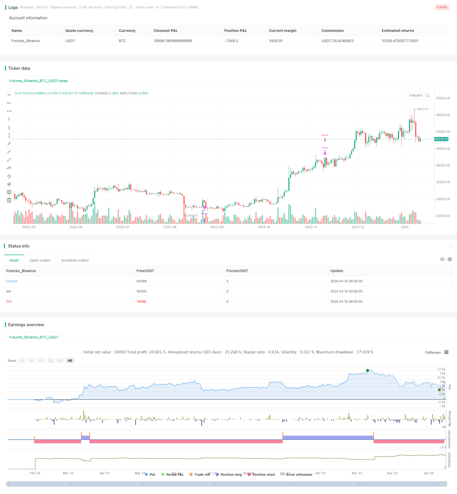

> Name

Trading strategy based on RSI and Fibonacci RSI-Fibonacci-5-Minute-Trading-Strategy
> Author

ChaoZhang

> Strategy Description


 [trans]

## Overview
This strategy uses the Relative Strength Index (RSI) and Fibonacci retracement levels to generate trading signals for the EUR/USD currency pair on the 5-minute time frame. This strategy combines technical indicators and key price levels to capture reversal opportunities in mid-term trends.
## Strategy Principle
This strategy uses the 14-period RSI as the primary trend indicator. When the RSI goes above 30, it is considered an oversold signal and a buy trading signal is generated; when the RSI goes below 70, it is considered an overbought signal and a sell trading signal is generated.
Additionally, the strategy calculates the 61.8% Fibonacci retracement level of the day’s price range. If the closing price is above the Fibonacci level and the RSI crosses above 30, a buy signal is generated; if the closing price is below the Fibonacci level and the RSI falls below 70, a sell signal is generated.
By considering both technical indicators and key price levels, some false signals can be filtered out, making trading signals more reliable.
## Strategic Advantages
The biggest advantage of this strategy is that it combines the RSI indicator and Fibonacci theory to make the trading signals more accurate and reliable. The RSI indicator can determine trend direction and reversal timing, while Fibonacci levels can further verify important support and resistance levels for price fluctuations.
Compared with using RSI alone or relying solely on price patterns, this hybrid strategy can greatly reduce trading errors. At the same time, the 5-minute time frame also allows it to capture short-term adjustment opportunities in the strong trend in the middle period.
## Risk Analysis
The main risk of this strategy is that the RSI indicator may send out wrong signals, or the price may fail to reach the Fibonacci target level and reverse. This will result in trading profit and loss results that are opposite to expected.
In addition, if the market fluctuates violently, the stop order may be breached, causing large losses to the account. It is recommended to use means such as trailing stop loss or fund management to control risks.
## Optimization direction
This strategy can be optimized from the following aspects:
1. Test different parameter combinations, such as RSI period number, overbought and oversold levels, Fibonacci coefficients, etc., to find the optimal parameters;
2. Add filtering conditions, such as trading volume, to further verify the reliability of trading signals;
3. Combined with other indicators, such as moving averages, to make the signal more accurate;
4. Add trend judgment rules to avoid counter-trend trading;
5. Use machine learning algorithms to automatically optimize policy parameters and rules.
## Summarize
This strategy uses the RSI indicator paired with Fibonacci key levels to generate signals for EUR/USD trading on the 5-minute time frame. Compared with a single indicator, this hybrid strategy can increase the accuracy of signals and reduce false trades. Through parameter optimization and adding filters, the strategy effect can be further improved. This strategy is suitable for capturing short-term reversal opportunities in significant trends in the intermediate period.
||

## Overview

This strategy utilizes the Relative Strength Index (RSI) and Fibonacci retracement levels to generate trading signals for the EUR/USD currency pair in the 5-minute timeframe. It combines a technical indicator and key price levels to capture reversal opportunities within intermediate-term trends.

## Strategy Logic

The strategy uses a 14-period RSI as the primary trend indicator. When the RSI crosses above 30, it is viewed as an oversold signal and generates a buy signal; when the RSI crosses below 70, it is viewed as an overbought signal and generates a sell signal. 

Additionally, the strategy calculates the 61.8% Fibonacci retracement level of the daily price range. If the closing price is above that Fibonacci level and the RSI crosses above 30 at the same time, a buy signal is generated; if the closing price is below that Fibonacci level and the RSI crosses below 70, a sell signal is generated.

By considering both technical indicators and key price levels, some false signals can be filtered out and the trading signals become more reliable.  

## Advantages

The biggest advantage of this strategy is the combination of the RSI indicator and Fibonacci theory, making the trading signals more accurate and reliable. The RSI indicator can determine trend direction and reversal points, while the Fibonacci levels can further validate important support and resistance levels of price fluctuations.

Compared with using RSI alone or relying solely on price patterns, this hybrid strategy can greatly reduce trading errors. Meanwhile, the 5-minute timeframe allows it to capture short-term pullback opportunities within intermediate-term strong trends.

## Risk Analysis  

The main risk of this strategy is that the RSI indicator may give false signals or prices may fail to reverse after hitting the Fibonacci target levels. This would result in trading profit/loss consequences that are contrary to expectations.

In addition, if violent price fluctuations occur, stop-loss orders could be taken out, bringing relatively large losses to the account. It is advisable to use techniques like trailing stop or money management to control risks.

## Optimization Directions

This strategy can be optimized from the following aspects:

1. Test different parameter combinations such as RSI periods, overbought/oversold levels, Fibonacci coefficients, etc. to find the optimal parameters;

2. Add filtering conditions like trading volumes to further verify the reliability of trading signals;
 
3. Incorporate other indicators like moving averages to make the signals more accurate;  

4. Add trend determination rules to avoid trading against the trend;

5. Use machine learning algorithms to automatically optimize strategy parameters and rules.

## Conclusion 

This strategy uses the RSI indicator together with Fibonacci key levels to generate trading signals for EUR/USD within a 5-minute timeframe. Compared to single indicators, this hybrid strategy can increase signal accuracy and reduce erroneous trades. Through parameter optimization, adding filters and other means, the strategy's performance can be further improved. It is suitable for capturing short-term reversal opportunities within significant intermediate-term trends.

[/trans]

> Strategy Arguments


|Argument|Default|Description|
|----|----|----|
|v_input_1|14|RSI Length|
|v_input_2|70|Overbought Level|
|v_input_3|30|Oversold Level|
|v_input_4|0.618|Fibonacci Level|


> Source (PineScript)

``` pinescript
/*backtest
start: 2023-01-10 00:00:00
end: 2024-01-16 00:00:00
period: 1d
basePeriod: 1h
exchanges: [{"eid":"Futures_Binance","currency":"BTC_USDT"}]
*/

//@version=5
strategy("RSI & Fibonacci Strategy - EUR/USD 5min", overlay=true)

// Parámetros RSI
rsi_length = input(14, title="RSI Length")
overbought = input(70, title="Overbought Level")
oversold = input(30, title="Oversold Level")

// Parámetros Fibonacci
fib_level = input(0.618, title="Fibonacci Level")

// RSI
rsi = ta.rsi(close, rsi_length)

// Fibonacci retracement
high_price = request.security("FX:EURUSD", "5", high)
low_price = request.security("FX:EURUSD", "5", low)
price_range = high_price - low_price
fibonacci_level = low_price + fib_level * price_range

// Condiciones de compra y venta
longCondition = ta.crossover(rsi, oversold) and close > fibonacci_level
shortCondition = ta.crossunder(rsi, overbought) and close < fibonacci_level

// Ejecutar órdenes de compra y venta
if (longCondition)
    strategy.entry("Buy", strategy.long)
if (shortCondition)
    strategy.entry("Sell", strategy.short)

```

> Detail

https://www.fmz.com/strategy/439097

> Last Modified

2024-01-17 16:57:36
