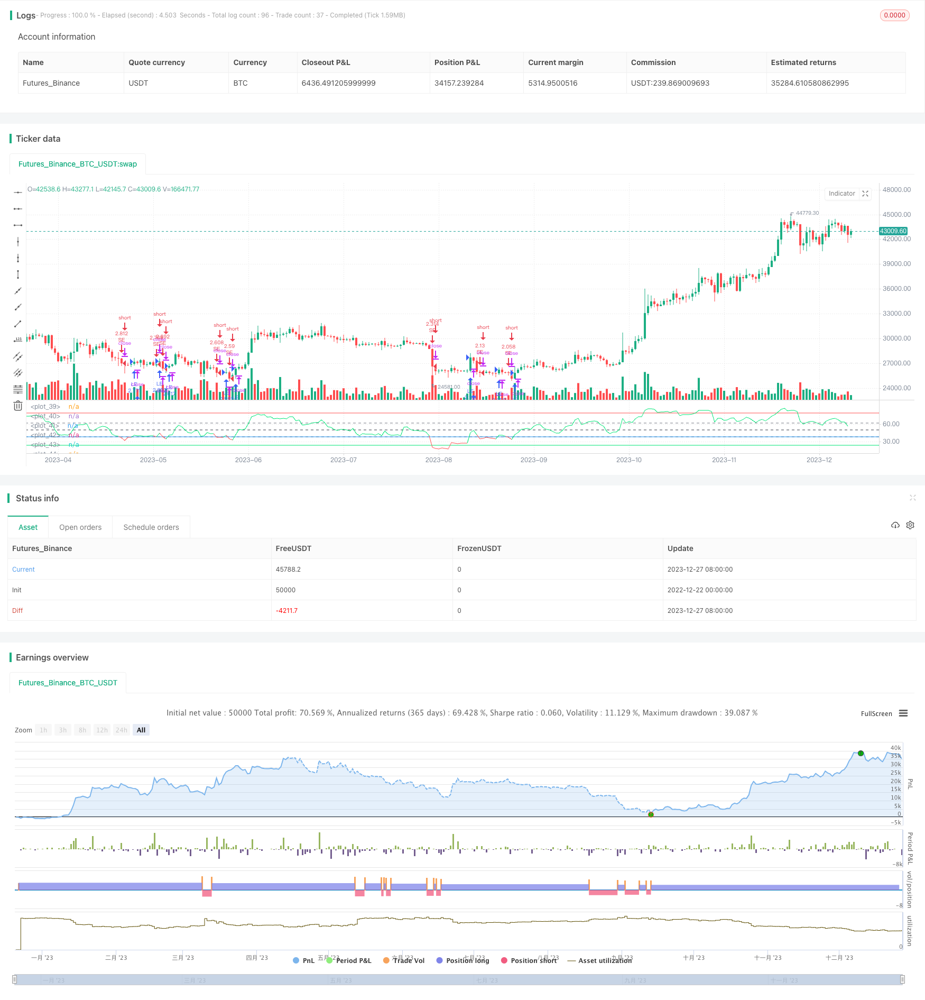

> Name

RSI Fibonacci Retracement Strategy RSI-Fibonacci-Retracement-Strategy
> Author

ChaoZhang

> Strategy Description


[trans]

## Overview
The RSI Fibonacci retracement strategy calculates the intersection of the RSI indicator and the set Fibonacci retracement level as a trading signal, and enters the market when the overbought and oversold area reverses. It is a trend following strategy.
## Principle
This strategy is based on the implementation of the crossover of the RSI indicator and Fibonacci retracement levels. First, calculate the value of the RSI indicator, and then set the Fibonacci retracement levels (38.2%, 50%, 61.8%). When the RSI indicator crosses the Fibonacci level above, a buy signal is generated, and when the RSI indicator crosses below, a sell signal is generated.
The RSI indicator is used to determine whether the market is overbought or oversold. When the RSI is greater than 70, it is an overbought zone, and when it is less than 30, it is an oversold zone. When the RSI falls from the overbought zone to the Fibonacci retracement zone, it is a reversal signal and you go long; when the RSI rises from the oversold zone to the Fibonacci retracement zone, it is a reversal signal and you go short.
The Fibonacci retracement zone is mainly used as a reference in this strategy and forms a trading signal with RSI. In trending markets, continuation after a pullback often touches Fibonacci retracement levels, which are equivalent to support and resistance. Crossing with RSI as a trading signal can capture reversal opportunities.
## Advantages
1. Use RSI to determine overbought and oversold patterns, and cooperate with Fibonacci retracement zones to capture reversal opportunities, which can filter out some noise.
2. Trend following nature, which can capture medium and long-term trends.
3. Fibonacci retracement zones can be adjusted to adapt to different market conditions.
## Risk
1. Long and short positions may be held for a long time and require sufficient financial support.
2. During the callback process, there may be another high or low phenomenon, and a stop loss needs to be set to control the risk.
3. Improper parameter settings may lead to frequent transactions or insufficient reversal opportunities.
## Optimization direction
1. You can consider combining other indicators to filter entry opportunities. For example, MACD, Bollinger Bands and other indicators determine the trend direction.
2. You can optimize RSI parameters and Fibonacci retracement zone settings.
3. You can set dynamic stop loss to lock in profits.
## Summarize
The RSI Fibonacci retracement strategy as a whole is a trend following strategy and has very good stability. Compared with a single RSI strategy, adding Fibonacci retracement zone can effectively filter out some noise transactions. Through parameter optimization, it can adapt to the trading varieties of different markets. Overall, it is a reliable and easy-to-optimize strategy idea.
||

## Overview

The RSI Fibonacci Retracement strategy generates trading signals based on the crossover between the RSI indicator and the set Fibonacci retracement levels, taking positions when reversals occur in overbought and oversold areas. It belongs to the trend following strategies.

## Principle 

This strategy is implemented based on the crossover between the RSI indicator and the Fibonacci retracement levels. First calculate the value of RSI indicator, then set the Fibonacci retracement levels (38.2%, 50%, 61.8%). When the RSI indicator crosses above the Fibonacci level, a buy signal is generated. When it crosses below, a sell signal is generated.

The RSI indicator is used to judge whether the market is overbought or oversold. RSI above 70 indicates an overbought area and below 30 indicates an oversold area. When RSI drops from the overbought area to the Fibonacci retracement zone, it is a reversal signal to go long. When RSI rises from the oversold area to the Fibonacci retracement zone, it is a reversal signal to go short.

The Fibonacci retracement levels in this strategy mainly serve as a reference, forming trading signals with RSI. In trending markets, continued running after retracements often touches Fibonacci retracement levels, which act like supports and resistances. Taking crossover with RSI as trading signals can capture reversal opportunities.  

## Advantages

1. Using RSI to identify overbought and oversold formations, combined with Fibonacci retracement area to capture reversal opportunities, can filter out some noise.

2. Trend following in nature, can capture mid-to-long term trends.  

3. Can adapt to different market situations by adjusting the Fibonacci retracement area.

## Risks

1. Long or short positions may last for a long time, requiring sufficient capital support.  

2. Retracement process may exhibit probing highs and lows again, requiring stop loss to control risks.

3. Improper parameter settings may lead to excessive trading or insufficient capturing of reversal opportunities.

## Optimization Directions 

1. Consider incorporating other indicators to filter entry timing, such as MACD, Bollinger Bands to judge trend direction.

2. Parameters like RSI periods and Fibonacci retracement levels can be optimized. 

3. Set up dynamic stop loss to lock in profits.

## Summary

The RSI Fibonacci Retracement strategy has good stability in general as a trend following strategy. Compared to single RSI strategies, adding the Fibonacci retracement area can effectively filter out some noisy trades. By parameter optimization it can adapt to different trading instruments across various markets. In conclusion this is a reliable and easy-to-optimize strategy idea.

[/trans]

> Strategy Arguments


|Argument|Default|Description|
|----|----|----|
|v_input_1|14|Rsi Periods|
|v_input_2|0|Fibonacci Level: 38.2|50|61.8|
|v_input_3|2010|From Year|
|v_input_4|true|From Month|
|v_input_5|2020|To Year|
|v_input_6|true|To Month|


> Source (PineScript)

``` pinescript
/*backtest
start: 2022-12-22 00:00:00
end: 2023-12-28 00:00:00
period: 1d
basePeriod: 1h
exchanges: [{"eid":"Futures_Binance","currency":"BTC_USDT"}]
*/

// (c) ReduX_o, 2019. All rights reserved.
//
// How to trade:
// The indicator is more reliable in longer time frames
// Choose a fibonacci level as reference 
// Buy when the RSI line turns green
// Sell when the RSI line turns red


//@version=4
strategy("RSI Fibonacci Levels", overlay=false, initial_capital=2000, currency=currency.USD, commission_value=0.1, slippage=0, commission_type=strategy.commission.percent, pyramiding=0, default_qty_type=strategy.percent_of_equity, default_qty_value=100)


len = input(14, minval=1, title="Rsi Periods")
f1 = input(title="Fibonacci Level", defval="38.2", options=["38.2", "50", "61.8"])

// === BACKTEST RANGE ===
FromYear = input(defval=2010, title="From Year", minval=2010)
FromMonth = input(defval=1, title="From Month", minval=1)

ToYear = input(defval=2020, title="To Year", minval=2010)
ToMonth = input(defval=1, title="To Month", minval=1)


src = hl2
fi= (f1 == "38.2") ? 38.2 : (f1 == "50")? 50 : 61.8


up = rma(max(change(src), 0), len)
down = rma(-min(change(src), 0), len)
rsi = down == 0 ? 100 : up == 0 ? 0 : 100 - 100 / (1 + up / down)


//***************************************************
rcolor = rsi >= fi ? color.lime : color.red

plot(rsi, title="RSI", color=rcolor, transp=0)
band1 = hline(78.6, color=color.red, linestyle= hline.style_solid,  editable= false)
band0 = hline(23.6, color=color.lime, linestyle= hline.style_solid, editable= false)
band2 = hline(61.8, color=color.gray, editable= false)
band3 = hline(50, color=color.black, editable= false)
band4 = hline(38.2, color=color.gray, editable= false)
band5 = hline(fi, color=color.blue, linestyle= hline.style_solid, editable= false)

strategy.entry("LE", strategy.long, comment="L", when=rsi >= fi )
strategy.entry("SE", strategy.short, comment="S", when=rsi < fi )


```

> Detail

https://www.fmz.com/strategy/437010

> Last Modified

2023-12-29 14:51:43
